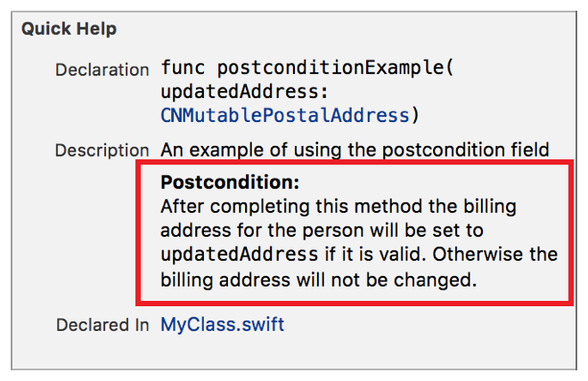

> 导航：[总目录](../../../README.md) · [documentation](../../../_indexes/documentation.md) · [Markup Formatting Reference](index.md)


## Postcondition

Add a `Postcondition` callout to the Quick Help for a symbol using the Postcondition delimiter. Multiple `Postcondition` callouts appear in the description section in the same order as they do in the markup.

Use the callout to document conditions which have guaranteed values upon completion of the execution of the symbol.

Works with:

- Playgrounds
- ✓ Symbol documentation

### Syntax

- ```
  * | + | - Postcondition: description
  ```
- ```
  optional continuation of description
  ```

The description displayed in Quick Help postcondition for the callout is created as described in [Parameters Section](SymbolDocumentation.md#apple-f4xwc4dqnrsv64tfmyxwi33df52wszbpkridimbqge3diojxfvbuqnjrfvjvoni).

### Example

1. `/**`
2. `An example of using the postcondition field`
4. `- Postcondition:`
5. `After completing this method the billing address for`
6. `` the person will be set to `updatedAddress` if it is valid. ``
7. `Otherwise the billing address will not be changed.`
8. `*/`



[Parameters](Parameters.md#apple-f4xwc4dqnrsv64tfmyxwi33df52wszbpkridimbqge3diojxfvbuqmrufvjvomi)

[Precondition](Precondition.md#apple-f4xwc4dqnrsv64tfmyxwi33df52wszbpkridimbqge3diojxfvbuqnbrfvjvomi)
