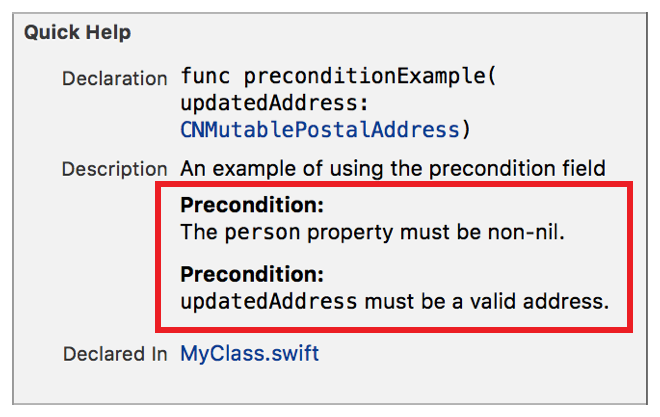

> 导航：[总目录](../../../README.md) · [documentation](../../../_indexes/documentation.md) · [Markup Formatting Reference](index.md)


## Precondition

Adds a `Precondition` callout to the Quick Help for a symbol. Multiple `Precondition` callouts appear in the description section in the same order as they do in the markup.

Use the callout to document any conditions that are held for the documented symbol to work.

Works with:

- Playgrounds
- ✓ Symbol documentation

### Syntax

- ```
  * | + | - Precondition: description
  ```
- ```
  optional continuation of description
  ```

The description displayed in Quick Help for the precondition callout is created as described in [Parameters Section](SymbolDocumentation.md#apple-f4xwc4dqnrsv64tfmyxwi33df52wszbpkridimbqge3diojxfvbuqnjrfvjvoni).

### Example

1. `/**`
2. `An example of using the precondition field`
4. `` - Precondition: The `person` property must be non-nil. ``
5. `` - Precondition: `updatedAddress` must be a valid address. ``
6. `*/`



[Postcondition](Postcondition.md#apple-f4xwc4dqnrsv64tfmyxwi33df52wszbpkridimbqge3diojxfvbuqnbqfvjvomi)

[Remark](Remark.md#apple-f4xwc4dqnrsv64tfmyxwi33df52wszbpkridimbqge3diojxfvbuqnbsfvjvomi)
