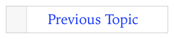

> 导航：[总目录](../../../README.md) · [documentation](../../../_indexes/documentation.md) · [Markup Formatting Reference](index.md)


## Previous Page

Open the previous page in the playground.

The previous page is the playground page in the Xcode project navigator that is above the page containing the link. No page is opened if the link is in the first page.

For example, in the screenshot If `Creating.playground` is the playground page containing the link, then `Designing.playground` is the previous page. `Overview.playground` is the first page and `Adding Files.playground` is the last page.


Works with:

- ✓ Playgrounds
- Symbol documentation

### Syntax

- ```
  [link name](@previous)
  ```

### Example

1. `//: [Previous Topic](@previous)`



[Next Page](NextPage.md#apple-f4xwc4dqnrsv64tfmyxwi33df52wszbpkridimbqge3diojxfvbuqmrqfvjvomi)

[Named Page](AnyPage.md#apple-f4xwc4dqnrsv64tfmyxwi33df52wszbpkridimbqge3diojxfvbuqmrsfvjvomi)
