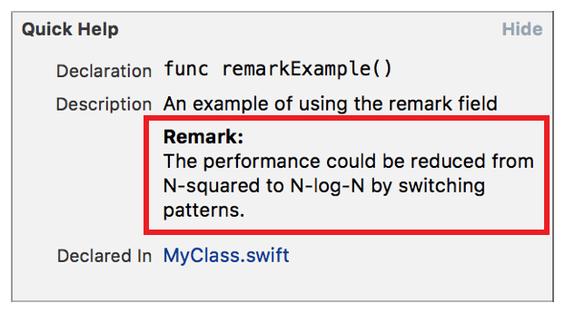

> 导航：[总目录](../../../README.md) · [documentation](../../../_indexes/documentation.md) · [Markup Formatting Reference](index.md)


## Remark

Add a `Remark` callout to the Quick Help for a symbol using the Remark delimiter. Multiple `Remark` callouts appear in the description section in the same order as they do in the markup.

Works with:

- Playgrounds
- ✓ Symbol documentation

### Syntax

- ```
  * | + | - Remark: description
  ```
- ```
  optional continuation of description
  ```

The description displayed in Quick Help for the remark callout is created as described in [Parameters Section](SymbolDocumentation.md#apple-f4xwc4dqnrsv64tfmyxwi33df52wszbpkridimbqge3diojxfvbuqnjrfvjvoni).

### Example

1. `/**`
2. `An example of using the remark field`
4. `- Remark:`
5. `The performance could be reduced from N-squared to`
6. `N-log-N by switching patterns.`
7. `*/`



[Precondition](Precondition.md#apple-f4xwc4dqnrsv64tfmyxwi33df52wszbpkridimbqge3diojxfvbuqnbrfvjvomi)

[Returns](Returns.md#apple-f4xwc4dqnrsv64tfmyxwi33df52wszbpkridimbqge3diojxfvbuqmrvfvjvomi)
