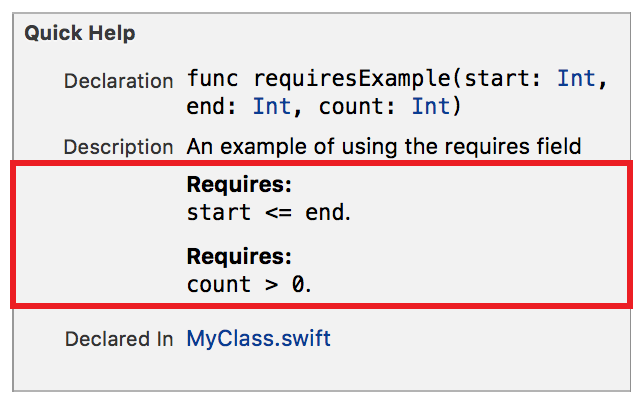

> 导航：[总目录](../../../README.md) · [documentation](../../../_indexes/documentation.md) · [Markup Formatting Reference](index.md)


## Requires

Add a `Requires` callout to the Quick Help for a symbol using the Requires delimiter. See [Precondition](Precondition.md#apple-f4xwc4dqnrsv64tfmyxwi33df52wszbpkridimbqge3diojxfvbuqnbrfvjvomi) for usage.

Works with:

- Playgrounds
- ✓ Symbol documentation

### Syntax

- ```
  * | + | - Requires: description
  ```
- ```
  optional continuation of description
  ```

The description displayed in Quick Help for the requires callout is created as described in [Parameters Section](SymbolDocumentation.md#apple-f4xwc4dqnrsv64tfmyxwi33df52wszbpkridimbqge3diojxfvbuqnjrfvjvoni).

### Example

1. `/**`
2. `An example of using the requires field`
4. `` - Requires: `start <= end`. ``
5. `` - Requires: `count > 0`. ``
6. `*/`



[Returns](Returns.md#apple-f4xwc4dqnrsv64tfmyxwi33df52wszbpkridimbqge3diojxfvbuqmrvfvjvomi)

[See Also](SeeAlso.md#apple-f4xwc4dqnrsv64tfmyxwi33df52wszbpkridimbqge3diojxfvbuqnbvfvjvomi)
