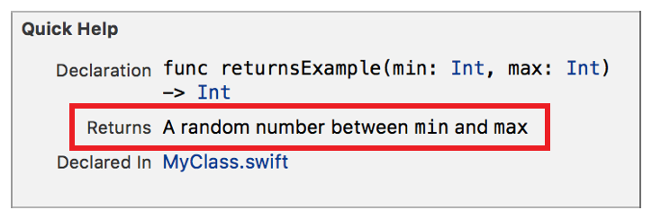

> 导航：[总目录](../../../README.md) · [documentation](../../../_indexes/documentation.md) · [Markup Formatting Reference](index.md)


## Returns

Add the `Returns` section to Quick Help for a symbol using the Returns delimiter. Use the delimiter to document the item returned by a symbol.

> [!IMPORTANT]
> 

Works with:

- Playgrounds
- ✓ Symbol documentation

### Syntax

- ```
  * | + | - Returns: description
  ```
- ```
  optional continuation of description
  ```

The description displayed in Quick Help for the returns section is created as described in [Parameters Section](SymbolDocumentation.md#apple-f4xwc4dqnrsv64tfmyxwi33df52wszbpkridimbqge3diojxfvbuqnjrfvjvoni).

### Example

1. `` /// - Returns: A random number between `min` and `max` ``



[Remark](Remark.md#apple-f4xwc4dqnrsv64tfmyxwi33df52wszbpkridimbqge3diojxfvbuqnbsfvjvomi)

[Requires](Requires.md#apple-f4xwc4dqnrsv64tfmyxwi33df52wszbpkridimbqge3diojxfvbuqnbufvjvomi)
