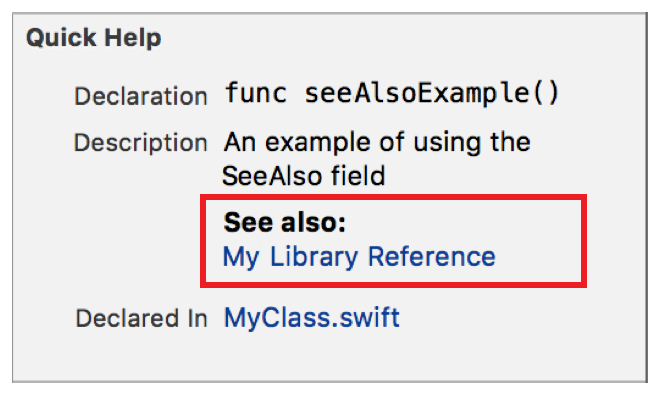

> 导航：[总目录](../../../README.md) · [documentation](../../../_indexes/documentation.md) · [Markup Formatting Reference](index.md)


## See Also

Adds a `See also` callout to the Quick Help for a symbol using the See Also delimiter. Multiple `See also` callouts appear in the description section in the same order as they do in the markup.

Use the callout to add references to other information.

Works with:

- Playgrounds
- ✓ Symbol documentation

### Syntax

- ```
  * | + | - SeeAlso: description
  ```
- ```
  optional continuation of description
  ```

The description displayed in Quick Help for the `SeeAlso` callout is created as described in [Parameters Section](SymbolDocumentation.md#apple-f4xwc4dqnrsv64tfmyxwi33df52wszbpkridimbqge3diojxfvbuqnjrfvjvoni).

### Example

1. `/**`
2. `An example of using the SeeAlso field`
4. `- SeeAlso:`
5. [My Library Reference](https://example.com)
6. `*/`



[Requires](Requires.md#apple-f4xwc4dqnrsv64tfmyxwi33df52wszbpkridimbqge3diojxfvbuqnbufvjvomi)

[Since](Since.md#apple-f4xwc4dqnrsv64tfmyxwi33df52wszbpkridimbqge3diojxfvbuqnbwfvjvomi)
