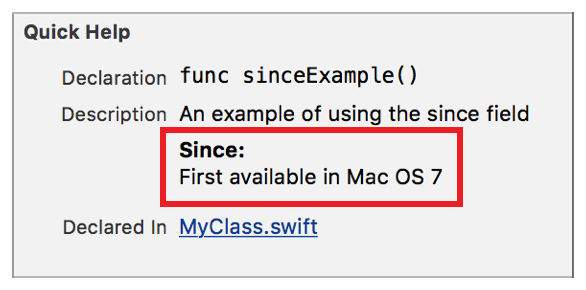

> 导航：[总目录](../../../README.md) · [documentation](../../../_indexes/documentation.md) · [Markup Formatting Reference](index.md)


## Since

Add a `Since` callout to the Quick Help for a symbol using the Since delimiter. Multiple `Since` callouts appear in the description section in the same order as they do in the markup.

Use the callout to add information about when the symbol became available. Some example of the types of information include dates, framework versions, and operating system versions.

Works with:

- Playgrounds
- ✓ Symbol documentation

### Syntax

- ```
  * | + | - Since: description
  ```
- ```
  optional continuation of description
  ```

The description displayed in Quick Help for the since callout is created as described in [Parameters Section](SymbolDocumentation.md#apple-f4xwc4dqnrsv64tfmyxwi33df52wszbpkridimbqge3diojxfvbuqnjrfvjvoni).

### Example

1. `/**`
2. `An example of using the since field`
4. `- Since: First available in Mac OS 7`
5. `*/`



[See Also](SeeAlso.md#apple-f4xwc4dqnrsv64tfmyxwi33df52wszbpkridimbqge3diojxfvbuqnbvfvjvomi)

[Throws](Throws.md#apple-f4xwc4dqnrsv64tfmyxwi33df52wszbpkridimbqge3diojxfvbuqmrwfvjvomi)
