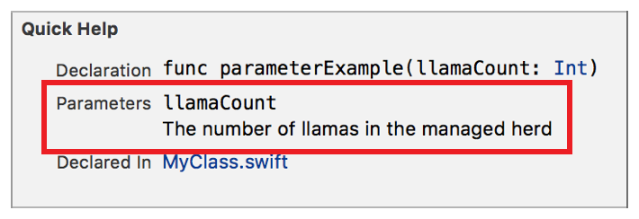

> 导航：[总目录](../../../README.md) · [documentation](../../../_indexes/documentation.md) · [Markup Formatting Reference](index.md)


## Single Line Comment

Add a single line of markup using these special comment markers.

Works with:

- ✓ Playgrounds
- ✓ Symbol documentation

### Playground Syntax

Use two forward slash (`/`) characters followed by a colon (`:`) for a single line of markup for a playground.

- ```
  //: line of markup content
  ```

### Example

The followup line of markup adds a link to the next page of the playground.

1. `//: [Next Topic](@next)`


### Quick Help Syntax

Use three forward slash (`/`) characters for a single line of markup Quick Help.

- ```
  /// line of markup content
  ```

### Example

The following line of markup documents a single parameter called `llama`.

1. `/// - parameter llamaCount: The number of llamas in the managed herd.`



[Formatting Quick Help](SymbolDocumentation.md#apple-f4xwc4dqnrsv64tfmyxwi33df52wszbpkridimbqge3diojxfvbuqnjrfvjvomi)

[Block Comment](ComentBlock.md#apple-f4xwc4dqnrsv64tfmyxwi33df52wszbpkridimbqge3diojxfvbuqmjqgmwvgvzr)
