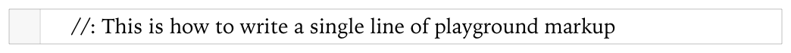
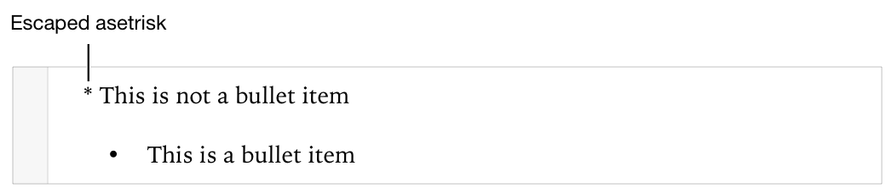
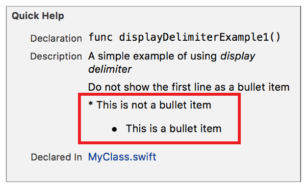
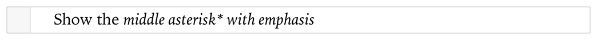
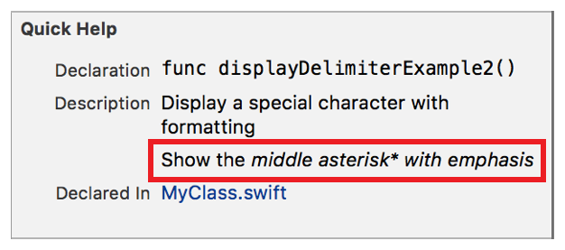
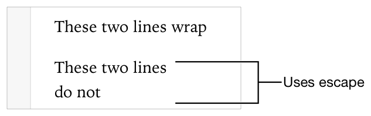

> 导航：[总目录](../../../README.md) · [documentation](../../../_indexes/documentation.md) · [Markup Formatting Reference](index.md)


## Escapes

Treat the following character as a plain charactere instead of a markup delimiter.

Works with:

- ✓ Playgrounds
- ✓ Symbol documentation

### Syntax and Examples

Display a special character by preceding it with a backslash (`\`).

- ```
  \special character
  ```

Use the backslash to display a special character in the following cases.

- The special character is first character of a playground line formatting delimiter.

  For example, to display a single-line delimiter inside of a line delimiter, precede the colon (`:`) with a backslash. The colon is the first special character of the single-line delimiter.

  1. `//: //\: This is how to write a single line of playground markup`

  
- The special character is the first character of a playground multiline formatting delimiter.

  For example, to display an asterisk (`*`) at the start of a line instead of a bullet point, precede the asterisk with a backslash.

  1. `//: \* This is not a bullet item`
  2. `//: * This is a bullet item`

  
- The special character is the first character of a Quick Help delimiter.

  For example, to display an asterisk (`*`) at the start of a line instead of a bullet point, precede the asterisk with a backslash.

  1. `/**`
  2. `A simple example of using *display delimiter*`
  4. `Do not show the first line as a bullet item`
  6. `\* This is not a bullet item`
  8. `* This is a bullet item`
  9. `*/`

  
- The character is an inline delimiter that appears at the start or end of a different character.

  For example, the following markup code displays an asterisk (`*`) with emphasis. Asterisks are normally used as the delimiter for a range of characters displayed with emphasis.

  __Playground Example__

  1. `//: Show the *middle asterisk\* with emphasis*`

  

  __Quick Help Example__

  1. `/**`
  2. `Display a special character with formatting`
  4. `Show the *middle asterisk\* with emphasis*`
  5. `*/`

  
- To override the effects of a newline such as text wrapping or creating paragraphs.

  The following markup shows escaping a the effect of a newline in a playground.

  1. `/*:`
  2. `These two lines`
  3. `wrap`
  5. `These two lines\`
  6. `do not`
  7. `*/`

  

You do not need to use the backslash with special characters inside a code block or backquote delimited code.

[Warning](Warning.md#apple-f4xwc4dqnrsv64tfmyxwi33df52wszbpkridimbqge3diojxfvbuqnbzfvjvomi)
