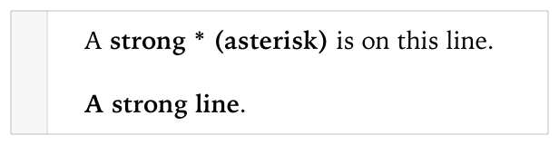
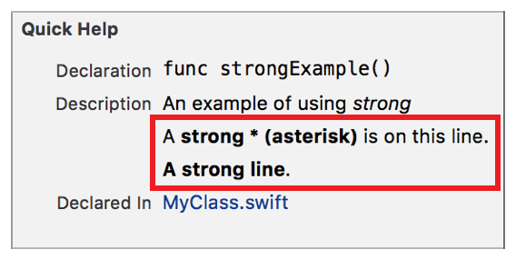

> 导航：[总目录](../../../README.md) · [documentation](../../../_indexes/documentation.md) · [Markup Formatting Reference](index.md)


## Strong (Bold)

Render a span of text using the strong font face.

Works with:

- ✓ Playgrounds
- ✓ Symbol documentation

### Syntax

Add strong formatting with two asterisks (`**`) or two underscores (`__`) before the first character of the span and after the last character of the span. The first and last characters cannot be spaces. Do not mix asterisks and underscores for the same element.

- ```
  **string**
  ```
- ```
  __string__
  ```

### Playground Example

1. `/*:`
2. `A **strong * (asterisk)** is on this line.`
4. `__A strong line__.`
5. `*/`



### Quick Help Example

1. `/**`
2. `An example of using *strong*`
4. `A **strong * (asterisk)** is on this line.`
6. `__A strong line__.`
7. `*/`



[Emphasis (Italics)](Emphasis%28Italics%29.md#apple-f4xwc4dqnrsv64tfmyxwi33df52wszbpkridimbqge3diojxfvbuqmjufvjvomi)

[Links](Links.md#apple-f4xwc4dqnrsv64tfmyxwi33df52wszbpkridimbqge3diojxfvbuqmjyfvjvomi)
