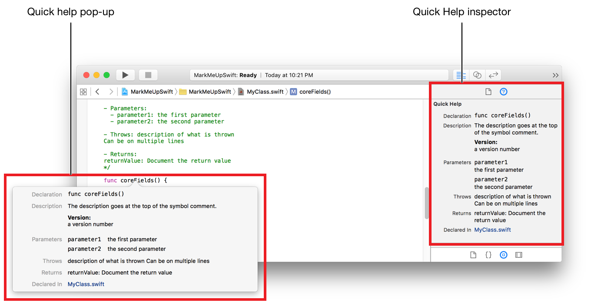
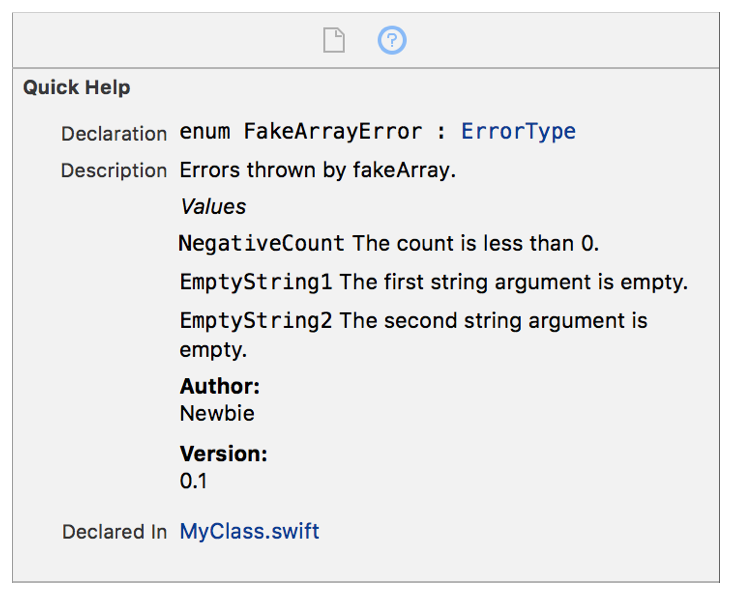
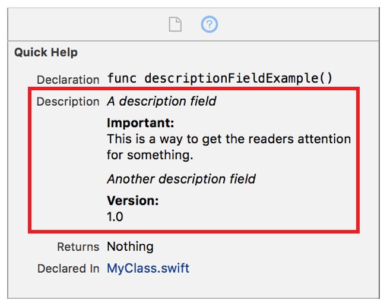

> 导航：[总目录](../../../README.md) · [documentation](../../../_indexes/documentation.md) · [Markup Formatting Reference](index.md)

## Formatting Quick Help

Use markup to create richly formatted Quick Help for any symbol in your Swift code. Symbols include named classes, methods and functions, enumerated types, and other named constructs. For more information on named constructs in Swift, see Declarations in _The Swift Programming Language (Swift 2.2)_.

### Xcode Quick Help

Quick Help for a symbol is shown by Option-clicking a symbol. It is also shown in the Quick Help inspector in the utilities area when the insertion point is in a symbol. Symbol information is categorized into sections such as _Description_ and _Parameters_. The description section can contain information callouts such as the version. The following figure shows the Quick Help pop-up and the Quick Help inspector pane for the `coreFields` function.

### Quick Help Sections

Quick Help content is grouped into named sections of related information such as the parameters of a method. The following descriptions are added using markup delimiters:

- The __Description__section gives a description of the symbol such as the purpose of a method.
- The __Parameters__ section lists the parameters for a method or function.
- The __Throws__ section documents any errors thrown by a method or function.
- The __Returns__ section documents any return value for a method or function.

The parameters, throws, and returns sections are added using specific markup delimiters.

### Description Section

The description section is composed of any lines of markup that are not part of another section delimiter. Parts of the description can occur both before and after section delimiters. The order of the rendered content in the description section is the same as the order it appears in the markup.

For example, the following markup renders the description section shown in shown in Figure 5-1.

1. `/**`
2. `Errors thrown by fakeArray.`
4. `*Values*`
6. `` `NegativeCount` The count is less than 0. ``
8. `` `EmptyString1` The first string argument is empty. ``
10. `` `EmptyString2` The second string argument is empty. ``
12. `- Author:`
13. `Newbie`
14. `- Version:`
15. `0.1`
16. `*/`
18. `enum FakeArrayError: ErrorType {…`

__Figure 5-1__Sections in Quick Help

### Parameters Section

Use the [Parameter](Parameter.md#apple-f4xwc4dqnrsv64tfmyxwi33df52wszbpkridimbqge3diojxfvbuqmryfvjvomi) and [Parameters](Parameters.md#apple-f4xwc4dqnrsv64tfmyxwi33df52wszbpkridimbqge3diojxfvbuqmrufvjvomi) delimiters to add the parameters section to Quick Help. If the markup for a symbol use both delimiters, Quick Help shows all of the Parameters entries followed by all of the Parameter entries. The order for the parameters is the same as the order they appear in the markup.

### Returns Section

Use the [Returns](Returns.md#apple-f4xwc4dqnrsv64tfmyxwi33df52wszbpkridimbqge3diojxfvbuqmrvfvjvomi) delimiter to add the returns section to Quick Help.

### Throws Section

Use the [Throws](Throws.md#apple-f4xwc4dqnrsv64tfmyxwi33df52wszbpkridimbqge3diojxfvbuqmrwfvjvomi) delimiter to add the throws section to Quick Help.

### Adding Callouts

Markup includes many callout delimiters that add useful information about your Swift symbols such as authors, required preconditions, and warnings. The content for the callouts appears in the description section for the symbol in Quick Help.

For example, the markup below adds [Important](Important.md#apple-f4xwc4dqnrsv64tfmyxwi33df52wszbpkridimbqge3diojxfvbuqmzxfvjvomi) and [Version](Version.md#apple-f4xwc4dqnrsv64tfmyxwi33df52wszbpkridimbqge3diojxfvbuqnbyfvjvomi) callouts resulting in the Quick Help shown in Figure 5-2. The `important` callout starts on line 2. The `version` callout is on line 11, after the callout for the `Returns` section.

1. `/**`
2. `*A description field*`
3. `- important: This is`
4. `a way to get the`
5. `readers attention for`
6. `something.`
8. `- returns: Nothing`
10. `*Another description field*`
11. `- version: 1.0`
12. `*/`

__Figure 5-2__Callouts in Quick Help

[Markup Syntax](MarkupSyntax.md#apple-f4xwc4dqnrsv64tfmyxwi33df52wszbpkridimbqge3diojxfvbuqmjqguwvgvzr)

[Single Line Comment](SingleLineComment.md#apple-f4xwc4dqnrsv64tfmyxwi33df52wszbpkridimbqge3diojxfvbuqmjqgiwvgvzr)
