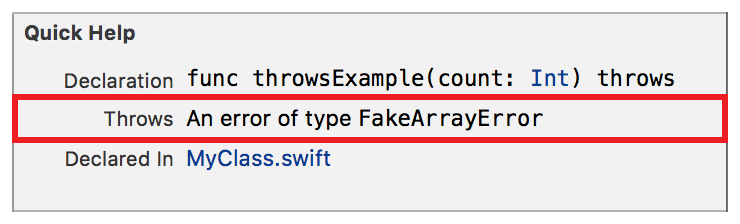

> 导航：[总目录](../../../README.md) · [documentation](../../../_indexes/documentation.md) · [Markup Formatting Reference](index.md)


## Throws

Add the `Throws` section to Quick Help for a symbol using the Throws delimiter. Use the throws section to specify any errors thrown by a method or function

> [!IMPORTANT]
> 

Works with:

- Playgrounds
- ✓ Symbol documentation

### Syntax

- ```
  * | + | - Throws : description
  ```
- ```
  optional continuation of description
  ```

The description displayed in Quick Help for the throws section is created as described in [Parameters Section](SymbolDocumentation.md#apple-f4xwc4dqnrsv64tfmyxwi33df52wszbpkridimbqge3diojxfvbuqnjrfvjvoni).

### Example

1. `` /// - Throws: An error of type `FakeArrayError` ``



[Since](Since.md#apple-f4xwc4dqnrsv64tfmyxwi33df52wszbpkridimbqge3diojxfvbuqnbwfvjvomi)

[To Do](Todo.md#apple-f4xwc4dqnrsv64tfmyxwi33df52wszbpkridimbqge3diojxfvbuqnbxfvjvomi)
