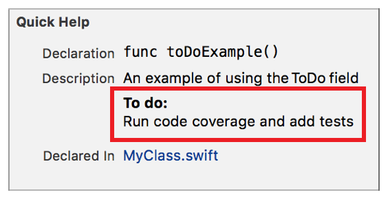

> 导航：[总目录](../../../README.md) · [documentation](../../../_indexes/documentation.md) · [Markup Formatting Reference](index.md)


## To Do

Add a `ToDo` callout to the Quick Help for a symbol using the To Do delimiter. Multiple `To do` callouts appear in the description section in the same order as they do in the markup.

Use the callout to add tasks required to complete or update the functionality of the symbol.

Works with:

- Playgrounds
- ✓ Symbol documentation

### Syntax

- ```
  * | + | - ToDo: description
  ```
- ```
  optional continuation of description
  ```

The description displayed in Quick Help for the todo callout is created as described in [Parameters Section](SymbolDocumentation.md#apple-f4xwc4dqnrsv64tfmyxwi33df52wszbpkridimbqge3diojxfvbuqnjrfvjvoni).

### Example

1. `/**`
2. `An example of using the ToDo field`
4. `- ToDo: Run code coverage and add tests`
5. `*/`



[Throws](Throws.md#apple-f4xwc4dqnrsv64tfmyxwi33df52wszbpkridimbqge3diojxfvbuqmrwfvjvomi)

[Version](Version.md#apple-f4xwc4dqnrsv64tfmyxwi33df52wszbpkridimbqge3diojxfvbuqnbyfvjvomi)
