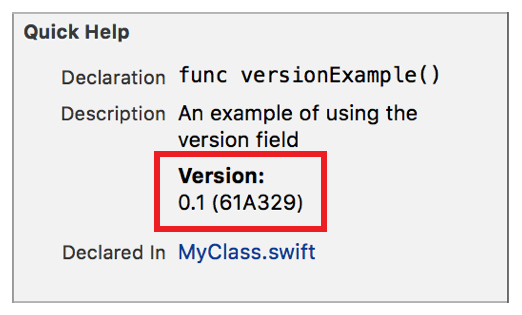

> 导航：[总目录](../../../README.md) · [documentation](../../../_indexes/documentation.md) · [Markup Formatting Reference](index.md)


## Version

Add a `Version` callout to the Quick Help for a symbol using the Version delimiter. Multiple `Version` callouts appear in the description section in the same order as they do in the markup.

Works with:

- Playgrounds
- ✓ Symbol documentation

### Syntax

- ```
  * | + | - Version: description
  ```
- ```
  optional continuation of description
  ```

The description of the for the version callout is created as described in [Parameters Section](SymbolDocumentation.md#apple-f4xwc4dqnrsv64tfmyxwi33df52wszbpkridimbqge3diojxfvbuqnjrfvjvoni).

### Example

1. `/**`
2. `An example of using the version field`
4. `- Version: 0.1 (61A329)`
5. `*/`



[To Do](Todo.md#apple-f4xwc4dqnrsv64tfmyxwi33df52wszbpkridimbqge3diojxfvbuqnbxfvjvomi)

[Warning](Warning.md#apple-f4xwc4dqnrsv64tfmyxwi33df52wszbpkridimbqge3diojxfvbuqnbzfvjvomi)
