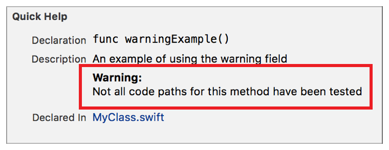

> 导航：[总目录](../../../README.md) · [documentation](../../../_indexes/documentation.md) · [Markup Formatting Reference](index.md)


## Warning

Add a `Warning` callout to the Quick Help for a symbol using the Warning delimiter. Multiple `Warning` callouts appear in the description section in the same order as they do in the markup.

Works with:

- Playgrounds
- ✓ Symbol documentation

### Syntax

- ```
  * | + | - Warning: description
  ```
- ```
  optional continuation of description
  ```

The description displayed in Quick Help for the warning callout is created as described in [Parameters Section](SymbolDocumentation.md#apple-f4xwc4dqnrsv64tfmyxwi33df52wszbpkridimbqge3diojxfvbuqnjrfvjvoni).

### Example

1. `/**`
2. `An example of using the warning field`
4. `- Warning:`
5. `Not all code paths for this method have been tested`
6. `*/`



[Version](Version.md#apple-f4xwc4dqnrsv64tfmyxwi33df52wszbpkridimbqge3diojxfvbuqnbyfvjvomi)

[Escapes](SpecialCharacter.md#apple-f4xwc4dqnrsv64tfmyxwi33df52wszbpkridimbqge3diojxfvbuqmjzfvjvomi)
