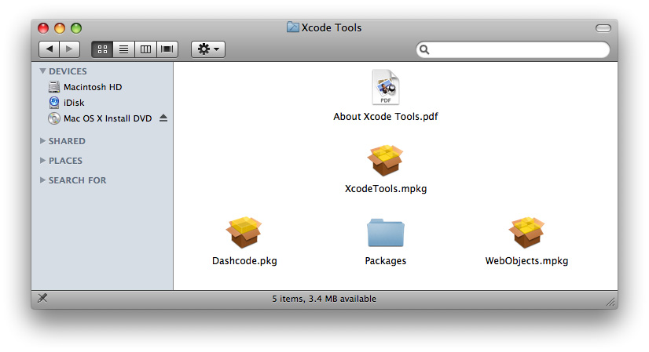
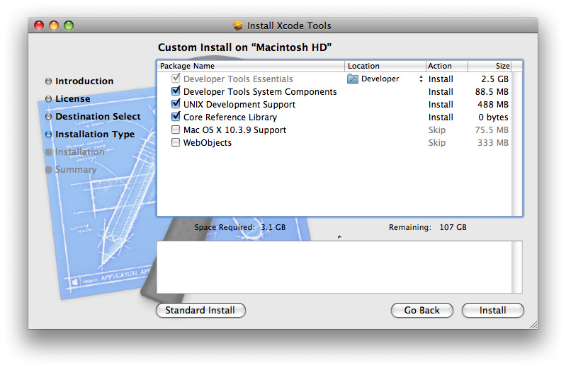

> 导航：[总目录](../../../README.md) · [documentation](../../../_indexes/documentation.md) · [Xcode Installation Guide](Introduction%20to%20Xcode%20Installation%20Guide.md)


[Next](Xcode%20Installation%20Details.md)[Previous](Introduction%20to%20Xcode%20Installation%20Guide.md)

# Xcode Installation Basics

Beginning in Mac OS X v10.5, Xcode supports installing multiple versions of the Xcode developer tools. When installing, the default location for the Xcode developer tools continues to be `/Developer`; however, you can install Xcode developer tools to any other directory or volume, including external drives. The Xcode directory can also be named something other than Developer. As with previous releases, the subdirectory hierarchy inside the installed Xcode directory should not be altered or rearranged.

Installing Xcode on a Macintosh computer is an easy affair: just run the Xcode Tools installer. You can install more than one release of Xcode, which provides you with one or more Xcode environments. You can take advantage of multiple Xcode environments to work on projects using a release of Xcode other than the release you typically use, or to run a test build of a future release of Xcode.

After installing Xcode, the essential Xcode tools are contained in a single directory, known as the `<Xcode>` directory. By default, the Xcode Tools installer sets `/Developer` as the `<Xcode>` directory, but users can choose a different location for this directory.

The Xcode Tools disk packages a set of applications, command-line tools, SDKs, and other resources used to develop software that runs on Mac OS X.

__Figure 1-1__  Xcode Tools disk



The Xcode Tools disk includes a set of UNIX developer tools, which include GCC, GDB and others. An Xcode installation contains a `<Xcode>/usr` directory with these tools. To support traditional UNIX-based development, you have the option of installing a second set of the UNIX developer tools in `/usr`. By default, this option is selected. You can also modify your shell environment to use the Xcode-provided UNIX tools.

You can customize one of all the Xcode environments on your computer by moving files between the file-system locations Xcode programs look in when searching for development resources. For example, instead of having the ADC Core Reference Library documentation set on all the Xcode releases on a computer, you can move it to your home directory or the local domain of your file system to save space.

The Xcode Tools installer gives you all the options you need when installing and obviates the need to install content from individual packages. The installation choices in the "Custom Install..." panel have been organized into six groups, as shown in Figure 1-2.

__Figure 1-2__  Xcode Tools installer



The first group, Developer Tools Essentials, is always installed; the remaining groups are optional. The list that follows explains what each group contains and where it is stored.

- __Developer Tools Essentials__ (always installed). Contains the main applications, command-line tools, and other resources that make up the Xcode development environment. This group includes the Xcode application, Interface Builder, Instruments, Dashcode, Quartz Composer, GCC 4.0.1, and the Mac OS X v10.4 (Universal) and Mac OS X v10.5 SDKs, as well as sample source code.
- __Developer Tools System Components__ (selected by default). The CHUD performance tools (including Shark) for measuring and optimizing software performance on Mac OS X, hardware bringup, and system benchmarking. Also includes support for enabling distributed builds and Instruments/DTrace integration. Note: CHUD is installed into `/Developer` on the boot volume.
- __UNIX Development Support__ (selected by default). Optional content to allow command-line development from the boot volume. Installs a duplicate of the GCC compiler and command-line tools included with the Developer Tools Essentials group into the boot volume. It also installs header files, libraries, and other resources for developing software using Mac OS X into the boot volume. This package is provided for compatibility with shell scripts and makefiles that require access to the developer tools in specific system locations. This content is not relocatable and is installed only onto the boot volume.
- __Core Reference Library__ (selected by default). An Xcode documentation set consisting of Apple's Mac OS X and Developer Tools technical resources, including Guides, Reference, Release Notes, Sample Code, Technical Notes, and Technical Q&As.
- __Mac OS X 10.3.9 Support__ (selectable). Adds support for developing applications that target Mac OS X v10.3.9 APIs. Includes the Apple version of the GCC 3.3 compiler and the Mac OS X v10.3.9 SDK. Note: GCC 3.3 is not relocatable and is installed on the boot volume.
- __WebObjects__ (selectable). Installs WebObjects development tools, examples, and documentation. Note: WebObjects is not relocatable and is installed into `/Developer` on the boot volume.

To install the Xcode 3.0 Developer Tools using the Mac OS X v10.5 (Leopard) DVD:

1. Boot into a partition with Mac OS X v10.5 (Leopard) installed.
2. Insert the Mac OS X v10.5 (Leopard) Install DVD.
3. Double-click the file `XcodeTools.mpkg`, located inside the directory `Optional Installs/Xcode Tools`.
4. Follow the instructions in the Installer. The Installer provides several options:

   - If you want to install Xcode Tools in a different directory, or if you want to install Xcode Tools in the standard `/Developer` directory on a different volume, you must select Customize. Then choose a new location from the Location menu item for Developer Tools Essentials.
   - If you want to install Mac OS X 10.3.9 Support or WebObjects, you must select Customize and check those install groups.
5. Authenticate as the administrative user. The first user you create when setting up Mac OS X has administrator privileges by default.

Once you have installed the Xcode developer tools, you can access the documentation by launching Xcode and choosing any of the items in the Help menu. Developer applications such as Xcode, Instruments, and Interface Builder are installed in `<Xcode>/Applications`.

Because the Xcode Tools installer places files across several file-system domains, when you need to uninstall Xcode you should run its uninstall script. To uninstall an Xcode release, you must run the `uninstall-devtools` script, located in `<Xcode>/Library`. The script accepts one argument, `--mode`. Its value depends on what install groups you want to uninstall.

- To uninstall Xcode developer tools on the boot volume along with the Xcode directory, open a Terminal window and type:

```
sudo <Xcode>/Library/uninstall-devtools --mode=all
```
- To remove the underlying developer content on the boot volume but leave the Xcode directory untouched, from a Terminal window type:

```
sudo <Xcode>/Library/uninstall-devtools --mode=systemsupport
```
- To remove the UNIX development support on the boot volume but leave the Xcode directory and its supporting files untouched, from a Terminal window type:

```
sudo <Xcode>/Library/uninstall-devtools --mode=unixdev
```
- To uninstall only the Xcode directory, you can simply drag it to the trash or from a Terminal window type:

```
sudo <Xcode>/Library/uninstall-devtools --mode=xcodedir
```

For example, to remove the Developer Tools System Components file as well as the `<Xcode>` directory, run these commands:

```
sudo <Xcode>/Library/uninstall-devtools --mode=systemsupport
sudo <Xcode>/Library/uninstall-devtools --mode=xcodedir
```

Note that the `uninstall-devtools` script removes only the directories listed in [Table 2-2](Xcode%20Installation%20Details.md#apple-f4xwc4dqnrsv64tfmyxwi33df52wszbpkridimbqga3dkojzfvbuqnrnknltcnq). You must manually remove other directories Xcode may use, such as `~/Library/Developer/Xcode_3.0`.

[Next](Xcode%20Installation%20Details.md)[Previous](Introduction%20to%20Xcode%20Installation%20Guide.md)

