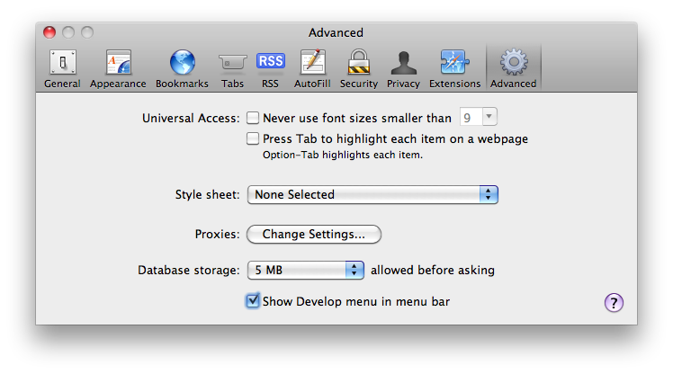

> 导航：[总目录](../../../README.md) · [documentation](../../../_indexes/documentation.md) · [Safari Client-Side Storage and Offline Applications Programming Guide](Introduction.md)


[Next](Key-Value%20Storage.md)[Previous](Introduction.md)

# HTML5 Offline Application Cache

Use the offline application cache to store HTML, JavaScript, CSS, and media resources locally, to create web-based applications that work even when a returning user is not connected to the Internet. You can also use the offline application cache simply to store static resources locally, to speed access to your website and lessen the server load when a user returns to your site.

The offline application cache lets you create web apps—such as canvas-based games, e-readers, and JavaScript calculators—that people can return to your site and continue to use even when they have no internet connection.

To use the offline application cache, you must create and declare a manifest file. The manifest file is a text file that contains a list of resources to be cached. Declare the manifest file in your HTML using the `manifest` attribute:

`<html manifest="path/filename">`

When a user comes to your website for the first time, Safari loads the webpage that declares the manifest—along with all the resources listed in the manifest file—from the web and stores copies in a cache. On subsequent visits, the webpage and resources are loaded directly from the cache, whether the user is online or offline. If the user is online, and the manifest has changed since the user’s last visit, a new cache is created and used on the following visit. (You can reload the site from the new cache immediately using JavaScript.)

When you specify a manifest file, you are telling Safari that your website is designed to operate offline. Consequently, Safari does not attempt to access resources unless they are listed in the manifest and stored in the cache. If you need to access online resources for your website to work correctly, specify the URLs or URL patterns in the `NETWORK` section of the manifest, as described in [Creating a Manifest File](#apple-f4xwc4dqnrsv64tfmyxwi33df52wszbpkridimbqga3tenjwfvbuqnznknlte).

If your website consists of multiple HTML pages that should all be cached in order for your site to operate correctly, list all of the pages in the cache manifest, and include the `manifest` attribute in every one of the HTML pages.

If you are using the offline application cache to speed access to your site for return visitors, instead of using the cache so your site can be used when the user is offline, be sure to specify your network URL pattern as `*`, so that all network access is enabled, and remember to update the manifest file whenever you update your site.

The manifest file specifies the resources to download and store in the application cache. Resources can include HTML, JavaScript, CSS, and image files. In Safari 5.1 and later, the manifest can specify audio and video media files as well. After the first time a webpage is loaded, the resources specified in the manifest file are loaded directly from the application cache, not from the web server.

The manifest file has the following requirements:

- The file must be served with a MIME type of `text/cache-manifest`. For most web servers, the filename must end in `.manifest`.
- The file must have the same origin (domain and scheme) as the HTML file that declares it.
- The first line of the file must consist of the text `CACHE MANIFEST`.
- Subsequent lines may contain section headings, URLs of resources to cache, network URLs, or comments.

  - Section headings consist of a single word, followed by a colon. Legal values are `CACHE:`, `NETWORK:`, or `FALLBACK:`.
  - Resource URLs can be absolute or relative to the manifest file (_not_ necessarily relative to the HTML page that uses the resource).
  - Network URLs may contain an asterisk as a wildcard character.
  - Comments must be on a single line and preceded by the `#` character. Comments may appear in any section of the manifest.

The manifest has one or more sections. There is normally a `CACHE` section, followed by an optional `NETWORK` section. There may also be `FALLBACK` sections and additional `CACHE` sections.

A `CACHE` section consists of a list of URLs of resources to be cached. By default, the manifest begins with a `CACHE` section declared implicitly. For example, your manifest may consist of the `CACHE MANIFEST` heading followed by a list of resource URLs, with no section heading.

If your manifest has other section types, followed by a `CACHE` section, however, you must declare any subsequent `CACHE` section explicitly using the `CACHE:` section header.

The `CACHE` sections of your manifest should list the URL of every resource your website needs to operate correctly when the user is offline. Resource URLs can be absolute or relative _to the manifest file_. Each URL must appear on a separate line.

You do not need to include the URL of the HTML file in which the manifest is declared; that file is included in the cache automatically.

If your website requires online resources to operate correctly, you must declare the URLs of the resources in the optional `NETWORK` section of the manifest file. These URLs comprise a whitelist of resources to access using the network.

A `NETWORK` section begins with the section header `NETWORK:` on a line by itself. This is followed by a list of URLs or URL patterns, each on its own line.

A URL may be a complete file specifier or a prefix. If the URL is a prefix, all files sharing the prefix are on the whitelist. The asterisk character (`*`) may be used as a wildcard that matches all URLs. For example:

- `http://example.com/myDirectory/myFile.jpg` puts `myFile.jpg` on the whitelist.
- `http://example.com/myDirectory/` puts all files in `myDirectory` on the whitelist.
- `http://example.com/` puts all files in `example.com` on the whitelist.
- `*` puts all files on the Internet on the whitelist.

A manifest can contain optional `FALLBACK` sections. A `FALLBACK` section contains one or more pairs of URLs. The first URL in each pair is the preferred URL for a resource to be cached. The second URL in the pair is a fallback URL to use if the file is inaccessible using the first URL.

A `FALLBACK` section begins with the section header `FALLBACK:` on a line of its own. Each URL pair appears on a separate line, with the two URLs separated by a space. For example:

`FALLBACK:`

`http://example.com/myFile http://server2.example.com/myFile`

`../media/image2.jpg ../legacy/genericImage.jpg`

The example just given caches `myFile` from `example.com`, falling back to an alternate server in the same domain if the file is inaccessible using the first server. The example then caches an image from the `media` directory, falling back to a generic image in the `legacy` directory if the preferred image is unavailable.

The fallback section can also be used to add pages from your site to the cache “lazily,” as the user loads them. Such use of the fallback section allows the user to revisit previously opened pages while offline, but specifies a default page to use when an offline visitor attempts to open a new page. For example:

`FALLBACK:`

`/ /myDirectory/notAvailable.html`

In the example just given, the URL pattern “`/`” matches all files with the same origin as the manifest file—all the pages on your site. Any page from within your domain is therefore added to the cache when the user loads it and remains available when the user is offline. If the user attempts to load a new page while offline, the file `notAvailable.html` is used instead.

For lazy caching to work, each page to be cached must include the `manifest` attribute in the `<html>` tag.

A sample manifest file is shown in Listing 1-1.

__Listing 1-1__  Sample manifest file

```
CACHE MANIFEST
# This is a comment.
# Cache manifest version 0.0.1
# If you change the version number in this comment,
# the cache manifest is no longer byte-for-byte
# identical.

demoimages/clownfish.jpg
demoimages/clownfishsmall.jpg
demoimages/flowingrock.jpg
demoimages/flowingrocksmall.jpg
demoimages/stones.jpg

NETWORK:
# All URLs that start with the following lines
# are whitelisted.
http://example.com/examplepath/
http://www.example.org/otherexamplepath/

CACHE:
# Additional items to cache.
demoimages/stonessmall.jpg

FALLBACK:
demoimages/currentImg.jpg images/stockImage.jpg
```


When Safari revisits your site, the site is loaded from the cache. If the cache manifest has changed, Safari checks the HTML file that declares the cache, as well as each resource listed in the manifest, to see if any of them has changed.

A file is considered unchanged if it is byte-for-byte identical to the previous version; changing the modification date of a file does not trigger an update. You must change the contents of the file. (Changing a comment is sufficient.)

If the manifest file has changed, and checking reveals that a resource file has changed, the new version is copied into the cache.The newly cached resources are not immediately used, however, as that would result in reloading changed resources piecemeal as they are cached. Instead, all of the changed resources are loaded as a group the next time the user revisits your site.

In other words, users who return to your site do not see changes immediately. They see changes when they return a second time. If you want Safari to reload the site with the changed resources the first time a user returns to your site, you can trigger an update using JavaScript.

To interact with the application cache from JavaScript, work with the `applicationCache` object. To force a reload of the contents of the new cache, respond to an `"updateready"` event whose target is the cache by calling the cache’s `swapCache()` method, as shown in the following snippet:

```
function updateSite(event) {
    window.applicationCache.swapCache();
}
window.applicationCache.addEventListener('updateready',
    updateSite, false);
```

The `"updateready"` event fires when all of the changed resources have been copied into a new cache. Calling `swapCache()` loads the new cache, causing your webpage to reload,

Note that errors can occur when updating the application cache. A resource may be inaccessible, for example, or the manifest file may be modified in the midst of a cache reload. If a failure occurs while downloading the manifest file, its parent HTML file, or a resource specified in the manifest file, the entire update process fails. The browser continues to use the existing version of the application cache and the `"updateready"` event does not fire. If the update is successful, Safari uses the new cache the next time the site is loaded.

See the documentation for [DOMApplicationCache](https://developer.apple.com/documentation/webkitjs/domapplicationcache) for a complete list of application cache event types.

Debug offline applications using Safari’s built-in developer tools. Enable the developer tools in Safari preferences, open your webpage in Safari, and choose Show Web Inspector from the Develop menu.



Click the Resources button in the Web Inspector to inspect the application cache. The display of cached data is not updated dynamically as the cache is modified; to refresh the display, click the “recycle” button in the bottom bar.

For more information about using the Web Inspector, see _[Safari Web Inspector Guide](../../Apple%20Applications/Safari%20Web%20Inspector%20Guide/About%20Safari%20Web%20Inspector.md#apple-f4xwc4dqnrsv64tfmyxwi33df52wszbpkridimbqga3tqnzu)_.

You cannot test offline applications by dragging a local webpage into Safari. Safari uses the manifest file only when it is loaded with the MIME type of `text/cache-manifest`, which requires loading the manifest from a web server.

If you are developing on Mac OS X, your Mac has a built-in web server that you can use to test your manifest file locally. Enable web sharing in System Preferences and drag the website into your Sites directory, then type the IP address of the local web server into Safari’s address bar. The site should open, and the manifest file and all the listed resources should load into the application cache and be viewable using the Web Inspector.

To verify the behavior of your website when the user is offline, turn off web sharing in System Preferences and reload your website in Safari. The site should open normally using the cached files.

To test an offline application website installed on a remote server, load the site normally, then take Safari offline and load the site again.

Safari operates in offline mode only when there is no Internet connection. To test your web-based application in offline mode, disconnect the device you wish to test from the Internet. For example, put an iOS-based device into Airplane Mode, or create and choose a nonfunctioning network connection in Mac OS X System Preferences.

When debugging offline applications, it can be helpful to monitor and log cache events. The `applicationCache` element generates the following events:

- `"checking"`—Safari is reading the manifest file for the first time or checking to see if it has changed. This event should always fire once.
- `"noupdate"`—The manifest file has not changed.
- `"downloading"`—Safari is downloading a changed resource.
- `"cached"`—Safari has downloaded all listed resources into the cache.
- `"updateready"`—A new copy of the cache is ready to be swapped in.
- `"obsolete"`—The manifest file is code 404 or code 410; the application cache for the site has been deleted.
- `"error"`—An error occurred when loading the manifest, its parent page, or a listed resource, or the manifest file changed while the update was running. The cache update has been aborted.

The snippet in Listing 1-2 can be added to the `<head>` section of your webpage to monitor and log the cache events. For more information about logging using the console API, see _[Safari Web Inspector Guide](../../Apple%20Applications/Safari%20Web%20Inspector%20Guide/About%20Safari%20Web%20Inspector.md#apple-f4xwc4dqnrsv64tfmyxwi33df52wszbpkridimbqga3tqnzu)_.

__Listing 1-2__  Log cache events

```
<script type="text/javascript">

  function logEvent(event) {
      console.log(event.type);
  }

  window.applicationCache.addEventListener('checking',logEvent,false);
  window.applicationCache.addEventListener('noupdate',logEvent,false);
  window.applicationCache.addEventListener('downloading',logEvent,false);
  window.applicationCache.addEventListener('cached',logEvent,false);
  window.applicationCache.addEventListener('updateready',logEvent,false);
  window.applicationCache.addEventListener('obsolete',logEvent,false);
  window.applicationCache.addEventListener('error',logEvent,false);

  </script>
```

[Next](Key-Value%20Storage.md)[Previous](Introduction.md)

