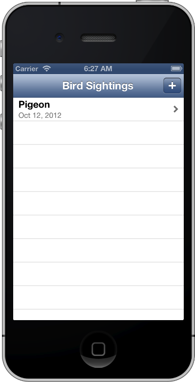

> 导航：[总目录](../../../README.md) · [documentation](../../../_indexes/documentation.md)

[Next](Getting%20Started.md)

# About Creating Your Second iOS App

_Your Second iOS App: Storyboards_ describes how to use storyboards to create a navigation-based app. With the app, users can view details about each item in a master list and add new items to the list. The finished app looks something like this:

After you complete the steps in this tutorial, you’ll know how to:

- Design a model layer that represents and manages an app’s data
- Create new scenes and segues in a storyboard
- Pass data to and retrieve it from a scene

To get the most from this tutorial, you should already have some familiarity with iOS app programming in general and the Objective-C language in particular. If you’ve never written an iOS app, read _[Start Developing iOS Apps Today (Retired)](https://developer.apple.com/library/archive/referencelibrary/GettingStarted/RoadMapiOS-Legacy/index.html#//apple_ref/doc/uid/TP40011343)_ (and go through the tutorial _Your First iOS App_) before you begin this tutorial.

_Your Second iOS App: Storyboards_ builds on the knowledge you gained in _Your First iOS App_ (which is part of _[Start Developing iOS Apps Today (Retired)](https://developer.apple.com/library/archive/referencelibrary/GettingStarted/RoadMapiOS-Legacy/index.html#//apple_ref/doc/uid/TP40011343)_): It introduces you to more of the powerful features that storyboards provide and also describes some ways in which you can take advantage of table views in an app.

### Designing and Implementing a Model Layer

A well-designed app defines a model layer that includes both the data objects that the app handles and the management of the data objects. Although the model layer in the tutorial app is very simple, designing and implementing it introduces you to concepts that you can apply to more complex apps.

### Designing and Implementing the Master and Detail Scenes

The app in this tutorial is based on the master-detail format, in which users select an item in a master list to see details about the item in a secondary screen. Many iOS apps are based on the master-detail format, including Mail and Settings. This tutorial shows how easy it is to use storyboards to base an app on this format and to send data to the detail screen for display.

### Creating a New Scene

Most of the Xcode templates place one or more scenes in the storyboard by default, but you can also add new scenes as needed. In this tutorial, you add a scene and embed it within a navigation controller so that you can offer users a way to enter new information to include in the master list.

### Solving Problems and Thinking About Your Next Steps

As you create the app in this tutorial, you might encounter problems that you don’t know how to solve. _Your Second iOS App: Storyboards_ includes some problem-solving advice, in addition to complete code listings against which you can compare your code.

There are many ways in which you can increase your knowledge of iOS app development. This tutorial suggests several ways to improve the app you create and to learn new skills.

In addition to the documents suggested in [Next Steps](Next%20Steps.md#apple-f4xwc4dqnrsv64tfmyxwi33df52wszbpkridimbqgeytgmjyfvbuqobnknltc), there are many other resources that can help you develop great iOS apps:

- To learn about the recommended approaches to designing the user interface and user experience of an iOS app, see _iOS Human Interface Guidelines_.
- For comprehensive guidance on creating a full-featured iOS app, see _[App Programming Guide for iOS](https://developer.apple.com/library/archive/documentation/iPhone/Conceptual/iPhoneOSProgrammingGuide/Introduction/Introduction.html#//apple_ref/doc/uid/TP40007072)_.
- To learn more about the many features of Xcode, see _[Xcode Overview](https://developer.apple.com/library/archive/documentation/ToolsLanguages/Conceptual/Xcode_Overview/index.html#//apple_ref/doc/uid/TP40010215)_.
- To learn about all the tasks you need to perform as you prepare to submit your app to the App Store, see _App Distribution Guide_.
[Next](Getting%20Started.md)

