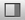
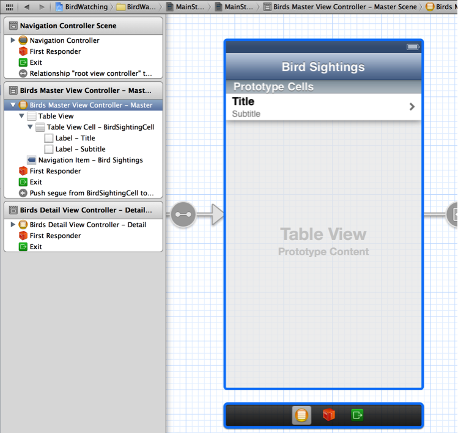
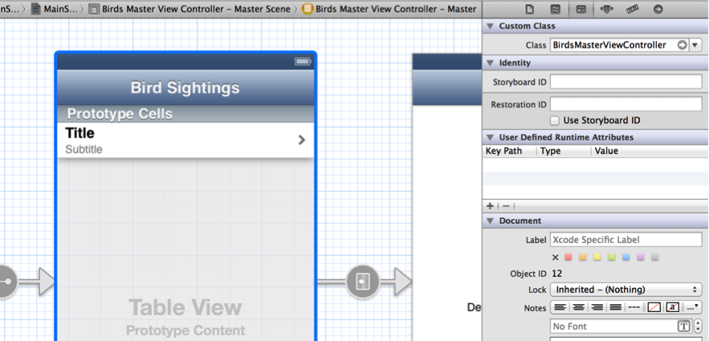

> 导航：[总目录](../../../README.md) · [documentation](../../../_indexes/documentation.md) · [Your Second iOS App: Storyboards](About%20Creating%20Your%20Second%20iOS%20App.md)


[Next](Displaying%20Information%20in%20the%20Detail%20Scene.md)[Previous](Designing%20the%20Model%20Layer.md)

# Designing the Master Scene

When users start the BirdWatching app, the first screen they see displays the master list of bird sightings. In this chapter, you design the appearance of the master list and give the master view controller access to the data in the model layer.

You’ve been writing a lot of code so far in this tutorial; now you’ll do some design work on the canvas. Open the storyboard on the canvas by selecting `MainStoryboard.storyboard` in the project navigator.

iOS apps often use table views to display lists of items, because tables provide efficient and customizable ways to display both large and small amounts of data. For example, Mail, Settings, Contacts, and Music use various types of tables to display information. In this section, you specify the overall appearance of the master scene and design the layout of its table rows.

To specify the appearance of the master scene

1. On the canvas, adjust the zoom level (if necessary) to focus on the master scene.
2. Double-click the title in the navigation bar (that is, Master) and type `Bird Sightings`.
3. Click the center of the scene to select the table view.

   If you prefer, you can select the table view by selecting Table View in the Birds Master View Controller section in the document outline pane.
4. If necessary, click the Utilities View button to open the utilities area.

   The Utilities View button looks like this: 
5. In the utility area, click the Attributes button to open the Attributes inspector.

   The Attributes button looks like this: 
6. In the Table View section of the Attributes inspector, ensure that the Style pop-up menu displays Plain.

   As you can see in the master scene, a row in a plain-style table extends the full width of the table view. The rows in a grouped-style table are inset from the edges of the table view, leaving a margin of the background appearance visible on all sides. (To see an example of a grouped-style table, open the Settings app on an iOS-based device.)

When you use storyboards, you have two convenient ways to design the appearance of a table’s rows (which are called _cells_):

- Dynamic prototypes allow you to design one cell and then use it as the template for other cells in the table. Use a dynamic prototype when you want every cell to use the same layout and you can’t predict how many cells the table might display.
- Static cells allow you to design the overall layout of the table, including the total number of cells. Use static cells when a table does not change its appearance, regardless of the specific information it displays.

In the master scene, you want each bird-sighting item to be displayed using the same layout, regardless of how many items the user adds, so you design a prototype cell for the master scene’s table. As the app runs, copies of this prototype cell are created as needed to display bird-sighting items.

For this step, the canvas should still be open and the Attributes inspector should still be focused on the master scene’s table view.

To design a prototype cell for the master bird-sighting list

1. In the Table View section of the Attributes inspector, make sure that Dynamic Prototypes is chosen in the Content pop-up menu.
2. On the canvas, select the table view cell to display table-cell information in the Attributes inspector.
3. In the Table View Cell section of the Attributes inspector, choose Subtitle in the Style pop-up menu.

   The built-in subtitle style causes the cell to display two left-aligned labels: Title in a large bold font and Subtitle in a smaller gray font. When you use a built-in cell style, the connections between these labels and the cell’s properties are made automatically. In a cell that uses the subtitle style, the `textLabel` property refers to the title and the `detailTextLabel` property refers to the subtitle.
4. Change the default value in the Identifier text field of the Table View Cell Attributes inspector.

   The value in the Identifier field is called a _reuse identifier_, and it gives the compiler a way to identify the appropriate prototype cell when it’s time to create new cells for the table. By convention, a cell’s reuse identifier should describe what the cell contains, so in this tutorial replace the default value (that is, `Cell`) with `BirdSightingCell`. Note that you’ll need to use this reuse ID elsewhere in your code, so you might want to copy it.
5. Still in the Attributes inspector, choose Disclosure Indicator in the Accessory pop-up menu, if necessary.

   An accessory is a standard user interface (UI) element that can appear in a table cell. The disclosure indicator accessory (which looks similar to “>”) tells users that tapping an item reveals related information in a new screen.

Before you edit the master scene’s code files, make sure that the scene on the canvas represents the master view controller class in your code. If you forget this step, none of your customization of the code and of the canvas will be visible when you run the app.

To specify the identity of the master scene

1. In the document outline, select Birds Master View Controller - Master.

   On the canvas, the selected master scene is outlined in blue, as shown here:

   
2. Click the Identity button at the top of the utility area to open the Identity inspector.
3. In the Identity inspector, make sure that the Class field contains `BirdsMasterViewController`.

   You should see something like this:

   

Before you write the code that allows the master view controller to display the master list of bird sightings, you need to bypass some of the code that the template provides. For example, you don’t need the template-provided Edit button (because the master list in the BirdWatching app doesn’t support editing) or the default `_objects` array (because you’ll use the data model classes you created earlier).

Although you can delete the unnecessary code, it’s often better to use the multiline comment symbols to make the code invisible to the compiler (the multiline comment symbols are `/*` and `*/`). Commenting out code that you don’t need makes it easier to change the implementation of your app in the future. For example, the Master-Detail template comments out the `moveRowAtIndexPath` and `canMoveRowAtIndexPath` table view methods in the master view controller implementation file because not all apps need tables that can be rearranged.

To bypass unnecessary code in the master view controller implementation file

1. In the project navigator, select `BirdsMasterViewController.m`.
2. Comment out the declaration of the private `_objects` array.

   Because you designed your own data model classes, you don’t need the template-provided `_objects` array. After you add the comment symbols, the beginning of `BirdsMasterViewController.m` should look like this:

```objc
#import "BirdsMasterViewController.h"
/*
@interface BirdsMasterViewController () {
   NSMutableArray *_objects;
}
@end
*/
@implementation BirdsMasterViewController
```

   After you add the comment symbols, Xcode displays several problem indicators because the template-provided master view controller code refers to `_objects` in several places. You’ll fix some of these problems when you comment out more code. You’ll fix the remaining problems when you write your own method implementations.
3. Comment out most of the contents of the `viewDidLoad` method.

   For now, the `viewDidLoad` method should only contain the call to `[super viewDidLoad]`. After you comment out the rest of the template-provided code, your `viewDidLoad` method should look like this:

```objc
- (void)viewDidLoad
{
    [super viewDidLoad];
    // Do any additional setup after loading the view, typically from a nib.
    /*
    self.navigationItem.leftBarButtonItem = self.editButtonItem;

    UIBarButtonItem *addButton = [[UIBarButtonItem alloc] initWithBarButtonSystemItem:UIBarButtonSystemItemAdd target:self action:@selector(insertNewObject:)];
    self.navigationItem.rightBarButtonItem = addButton;
     */
}
```
4. Comment out the `insertNewObject` method.

   The `insertNewObject` method adds new objects to the `_objects` array and updates the table. You don’t need this method, because you’ll be updating your custom data model objects and the master list in other ways.

   Xcode removes a few problem indicators when you comment out the `insertNewObject` method.
5. Change the return value of the `canEditRowAtIndexPath` table view method.

   By default, the Master-Detail template enables table view editing in the master view controller’s table view. Because you won’t be giving users an Edit button in the master scene, change the default return value to `NO`.

   After you make this change, the `canEditRowAtIndexPath` method should look like this:

```objc
- (BOOL)tableView:(UITableView *)tableView canEditRowAtIndexPath:(NSIndexPath *)indexPath
{
    // Return NO if you do not want the specified item to be editable.
    return NO;
}
```
6. Comment out the `tableView:commitEditingStyle:forRowAtIndexPath:` method.

   You won’t be using the template-provided Edit button in this tutorial, so you don’t need to implement the `commitEditingStyle` method’s support for removing and adding table rows.

   Commenting out the `commitEditingStyle` method removes one of the problem indicators.

After you finish commenting out the code you don’t need (and updating the `canEditRowAtIndexPath` method), you still see a few problem indicators. You fix two of these problems in the next step.

Typically, an app displays data in a table by implementing the table view data source methods in a table view controller class. At a minimum, the table view controller class implements the `numberOfRowsInSection` and `cellForRowAtIndexPath` methods.

To display the master list of bird sightings, the master view controller implements these two data source methods. But first, the master view controller must have access to the data that is managed by the model layer objects.

To give the master view controller access to the data in the model layer

1. In the project navigator, select `BirdsMasterViewController.h`.
2. Add a forward declaration of the `BirdSightingDataController` class.

   Between the `#import` and `@interface` statements, add the following code line:

```
@class BirdSightingDataController;
```
3. Declare a data controller property.

   Edit the `BirdsMasterViewController` header file so that it looks like this:

```objc
@interface BirdsMasterViewController : UITableViewController
@property (strong, nonatomic) BirdSightingDataController *dataController;
@end
```
4. In the project navigator, select `BirdsMasterViewController.m`.
5. In `BirdsMasterViewController.m`, add the following code lines after `#import “BirdsDetailViewController.h”` to import the header files of the model layer classes:

```objc
#import "BirdSightingDataController.h"
#import "BirdSighting.h"
```
6. Implement the `awakeFromNib` method to associate a new data controller object with the `dataController` property you declared.

   To the `awakeFromNib` method, add the following code line after `[super awakeFromNib];`:

```
self.dataController = [[BirdSightingDataController alloc] init];
```

Now that the master view controller has access to the data from the model layer, it can pass that data to the table view data source methods. Make sure that `BirdsMasterViewController.m` is still open for this step.

To implement the table view data source methods in the master view controller

1. Implement the `numberOfRowsInSection` method to return the number of `BirdSighting` objects in the array.

   Replace the default implementation of `numberOfRowsInSection` with the following code:

```objc
- (NSInteger)tableView:(UITableView *)tableView numberOfRowsInSection:(NSInteger)section {
    return [self.dataController countOfList];
}
```

   Providing this implementation of the `numberOfRowsInSection` method removes one of the problem indicators, because the method no longer refers to the `_objects` array.
2. Implement the `cellForRowAtIndexPath` method to create a new cell from the prototype and populate it with data from the appropriate `BirdSighting` object.

   Replace the default implementation of `cellForRowAtIndexPath` with the following code:

```objc
- (UITableViewCell *)tableView:(UITableView *)tableView cellForRowAtIndexPath:(NSIndexPath *)indexPath {

    static NSString *CellIdentifier = @"BirdSightingCell";

    static NSDateFormatter *formatter = nil;
    if (formatter == nil) {
        formatter = [[NSDateFormatter alloc] init];
        [formatter setDateStyle:NSDateFormatterMediumStyle];
    }
    UITableViewCell *cell = [tableView dequeueReusableCellWithIdentifier:CellIdentifier];

    BirdSighting *sightingAtIndex = [self.dataController objectInListAtIndex:indexPath.row];
    [[cell textLabel] setText:sightingAtIndex.name];
    [[cell detailTextLabel] setText:[formatter stringFromDate:(NSDate *)sightingAtIndex.date]];
    return cell;
}
```

   Because the new method implementation does not refer to the `_objects` array, Xcode removes another problem indicator.

A table view object invokes the `cellForRowAtIndexPath` method every time it needs to display a table row. In this implementation of the `cellForRowAtIndexPath` method, you identify the prototype cell that should be used to create new table cells and you specify the format to use for displaying the date. Then, if there are no reusable table cells available, you create a new cell based on the prototype cell you designed on the canvas. Finally, you retrieve the `BirdSighting` object that’s associated with the row that the user tapped in the master list and update the new cell’s labels with the bird sighting information.

After you complete these steps, the remaining problems are in the `prepareForSegue` method. You’ll edit this method later.

In this chapter, you took advantage of dynamic prototype cells to design the layout of the rows in the master scene’s list. Then you implemented the master scene view controller by giving it access to the data in the model layer and using that information in the implementation of the table view data source methods.

At this point in the tutorial, the code in the `BirdsMasterViewController.h` file should look similar to this:

```objc
#import <UIKit/UIKit.h>
@class BirdSightingDataController;
@interface BirdsMasterViewController : UITableViewController
@property (strong, nonatomic) BirdSightingDataController *dataController;
@end
```

The code in the `BirdsMasterViewController.m` file should look similar to this (methods that you commented out or that you don’t edit in this tutorial are not shown):

```objc
#import "BirdsMasterViewController.h"

#import "BirdsDetailViewController.h"
#import "BirdSightingDataController.h"
#import "BirdSighting.h"

@implementation BirdsMasterViewController

- (void)awakeFromNib
{
    [super awakeFromNib];
    self.dataController = [[BirdSightingDataController alloc] init];
}

- (void)viewDidLoad
{
    [super viewDidLoad];
    // Do any additional setup after loading the view, typically from a nib.
}

- (void)didReceiveMemoryWarning
{
    [super didReceiveMemoryWarning];
    // Dispose of any resources that can be recreated.
}

#pragma mark - Table View

- (NSInteger)numberOfSectionsInTableView:(UITableView *)tableView
{
    return 1;
}

- (NSInteger)tableView:(UITableView *)tableView numberOfRowsInSection:(NSInteger)section {
    return [self.dataController countOfList];
}

- (UITableViewCell *)tableView:(UITableView *)tableView cellForRowAtIndexPath:(NSIndexPath *)indexPath {

    static NSString *CellIdentifier = @"BirdSightingCell";

    static NSDateFormatter *formatter = nil;
    if (formatter == nil) {
        formatter = [[NSDateFormatter alloc] init];
        [formatter setDateStyle:NSDateFormatterMediumStyle];
    }
    UITableViewCell *cell = [tableView dequeueReusableCellWithIdentifier:CellIdentifier];

    BirdSighting *sightingAtIndex = [self.dataController objectInListAtIndex:indexPath.row];
    [[cell textLabel] setText:sightingAtIndex.name];
    [[cell detailTextLabel] setText:[formatter stringFromDate:(NSDate *)sightingAtIndex.date]];
    return cell;
}

- (BOOL)tableView:(UITableView *)tableView canEditRowAtIndexPath:(NSIndexPath *)indexPath
{
    // Return NO if you do not want the specified item to be editable.
    return NO;
}

- (void)prepareForSegue:(UIStoryboardSegue *)segue sender:(id)sender
{
    if ([[segue identifier] isEqualToString:@"showDetail"]) {
        NSIndexPath *indexPath = [self.tableView indexPathForSelectedRow];
        NSDate *object = _objects[indexPath.row];
        [[segue destinationViewController] setDetailItem:object];
    }
}

@end
```

[Next](Displaying%20Information%20in%20the%20Detail%20Scene.md)[Previous](Designing%20the%20Model%20Layer.md)

