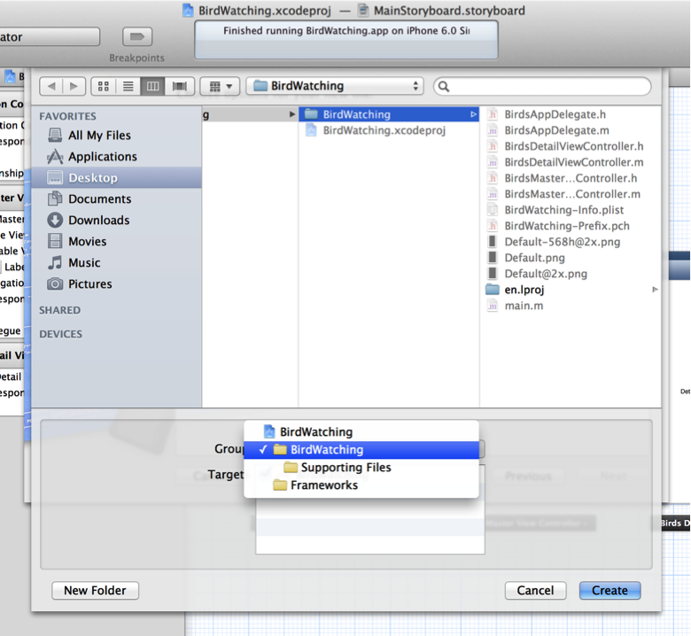
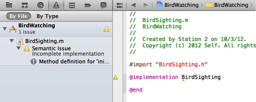
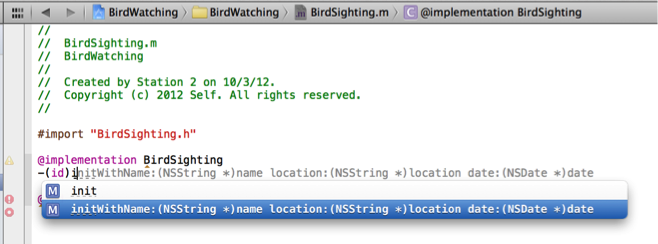

> 导航：[总目录](../../../README.md) · [documentation](../../../_indexes/documentation.md) · [Your Second iOS App: Storyboards](About%20Creating%20Your%20Second%20iOS%20App.md)


[Next](Designing%20the%20Master%20Scene.md)[Previous](Getting%20Started.md)

# Designing the Model Layer

Every app handles data of some kind. In this tutorial, the BirdWatching app handles a list of bird-sighting events. To follow the [Model-View-Controller](https://developer.apple.com/library/archive/documentation/General/Conceptual/DevPedia-CocoaCore/MVC.html#//apple_ref/doc/uid/TP40008195-CH32) (MVC) design pattern, you need to create classes that represent and manage this data.

In this chapter, you design two classes. The first represents the primary unit of data that the app handles. The second class creates and manages instances of this data unit. These classes, together with the master list of data, make up the model layer of the BirdWatching app.

To design a data object class, first examine the app’s functionality to discover what units of data it needs to handle. For example, you might consider defining a bird class and a bird-sighting class. But to keep this tutorial as simple as possible, you’ll define a single data object class—a bird-sighting class—that contains properties that represent a bird name, a sighting location, and a date.

To produce bird-sighting objects that the BirdWatching app can use, you need to add a custom class to your project. Because the bird-sighting object needs very little functionality (for the most part, it simply needs to behave as an Objective-C object), create a new subclass of `NSObject`.

To create the class files for the bird-sighting object

1. In Xcode, choose File > New > File (or press Command-N).
2. In the dialog that appears, select Cocoa Touch in the iOS section at the left side of the dialog.
3. In the main area of the dialog, select Objective-C class and then click Next.
4. In the next pane of the dialog, type the name `BirdSighting` in the Class field, choose `NSObject` in the “Subclass of” pop-up menu, and click Next.

   By convention, the name of a data object class is a noun because it names the thing that the class represents.
5. In the next dialog that appears, choose the BirdWatching folder in the Group pop-up menu:

   
6. In the dialog, click Create.

Xcode creates two new files, named `BirdSighting.h` and `BirdSighting.m`, and adds them to the BirdWatching folder in the project. By default, Xcode automatically opens the implementation file (that is, `BirdSighting.m`) in the editor area of your workspace window.

The `BirdSighting` class needs a way to hold the three pieces of information that define a bird sighting. In this tutorial, you use [declared properties](https://developer.apple.com/library/archive/documentation/General/Conceptual/DevPedia-CocoaCore/DeclaredProperty.html#//apple_ref/doc/uid/TP40008195-CH13) to represent these items. When you use declared properties, you let the compiler synthesize [accessor methods](https://developer.apple.com/library/archive/documentation/General/Conceptual/DevPedia-CocoaCore/AccessorMethod.html#//apple_ref/doc/uid/TP40008195-CH2) for each one.

The `BirdSighting` class also needs to initialize new instances of itself with information that represents an individual bird sighting. To accomplish this, add a custom initializer method to the class.

First, declare the properties and the custom initialization method in the header file.

To declare properties and a custom initializer method in BirdSighting.h

1. Select `BirdSighting.h` in the project navigator to open it in the editor area.
2. Add the following code between the `@interface` and `@end` statements:

```objc
@property (nonatomic, copy) NSString *name;
@property (nonatomic, copy) NSString *location;
@property (nonatomic, strong) NSDate *date;
```
3. Add the following code line after the third property definition:

```objc
-(id)initWithName:(NSString *)name location:(NSString *)location date:(NSDate *)date;
```
To implement the custom initializer method

1. In the project navigator, select `BirdSighting.m`.

   When `BirdSighting.m` opens in the editor, Xcode displays a warning icon—in the activity viewer in the middle of the toolbar and in the bar above the editor. Click the warning button in the navigator selector bar to view the warning (the warning button is the middle button in the navigator selector bar). You should see something like this:

   

   In this case, Xcode is reminding you that the implementation of the `BirdSighting` class is incomplete because you haven’t implemented the `initWithName` method. You fix this problem next.
2. In the code editor, between the `@implementation` and `@end` statements in `BirdSighting.m`, begin typing the `initWithName` method and let code completion finish it.

   Code completion is especially useful when entering method signatures because it helps you avoid common mistakes, such as mixing the order of parameters. When you start typing `-(id)i` you should see something like this:

   

   When you press Return, Xcode adds the highlighted code-completion suggestion to your file. If the highlighted suggestion is not the one you want, use the Arrow keys to highlight a different one.

   A method requires an implementation block—which is not included in the completed method signature—so Xcode displays a couple of problem indicators. You can ignore these indicators because you add the implementation code next.
3. Implement the `initWithName` method by entering the following code after the method signature:

```
{
    self = [super init];
    if (self) {
       _name = name;
       _location = location;
       _date = date;
       return self;
    }
    return nil;
}
```

After you enter all the code in this step, the warning and problem indicators disappear.

Notice that the `initWithName` method uses versions of the property names that begin with an underscore (the `_name`, `_location`, and `_date` symbols refer to the instance variables that these properties represent). By convention, the underscore serves as a reminder that you shouldn’t access instance variables directly. In almost all of your code, you should use the accessor methods—such as `self.name`—to get or set an object’s properties. The only two places where you should _not_ use accessor methods are in `init` methods—such as `initWithName`—and in `dealloc` methods.

From an academic perspective, avoiding the direct access of instance variables helps preserve encapsulation, but there are also a couple of practical benefits:

- Some Cocoa technologies (notably [key-value coding](https://developer.apple.com/library/archive/documentation/General/Conceptual/DevPedia-CocoaCore/KeyValueCoding.html#//apple_ref/doc/uid/TP40008195-CH25)) depend on the use of accessor methods and on the appropriate naming of the accessor methods. If you don’t use accessor methods, your app may be less able to take advantage of standard Cocoa features.
- Some property values are created on demand. If you try to use the instance variable directly, you may get `nil` or an uninitialized value. (A view controller’s view is a good example of a property value that’s created on demand.)

(If you’re interested, you can read more about encapsulation in [Storing and Accessing Properties](../../Cocoa/Cocoa%20Fundamentals%20Guide/Adding%20Behavior%20to%20a%20Cocoa%20Program.md#apple-f4xwc4dqnrsv64tfmyxwi33df52wszbpkridimbqgazdsnzufvbuqnjnknltk) in _[Cocoa Fundamentals Guide](../../Cocoa/Cocoa%20Fundamentals%20Guide/Introduction.md#apple-f4xwc4dqnrsv64tfmyxwi33df52wszbpkridimbqgazdsnzu)_.)

The `BirdSighting` class is one part of the model layer in the BirdWatching app. To preserve the `BirdSighting` class as a pure representation of a model object, you must also design a controller class to instantiate new `BirdSighting` objects and control the collection that contains them. A data controller class allows other objects in the app to access individual `BirdSighting` objects and the master list without needing to know anything about how the data model is implemented. You create the data controller class in the next step.

A data controller class typically handles the loading, saving, and accessing of data for an app. Although the BirdWatching app does not access a file to load or store its data, it still needs a data controller to create new `BirdSighting` objects and manage a collection of them. Specifically, the app needs a class that:

- Creates the master collection that holds all `BirdSighting` objects
- Returns the number of `BirdSighting` objects in the collection
- Returns the `BirdSighting` object at a specific location in the collection
- Creates a new `BirdSighting` object using input from the user and adds it to the collection

As you did for the `BirdSighting` class, create the interface and implementation files for a new class that inherits from `NSObject` and add them to the project.

To create the data controller class files

1. Choose File > New > File (or press Command-N).
2. In the dialog that appears, select Cocoa Touch in the iOS section at the left side of the dialog.
3. In the main area of the dialog, select Objective-C class and then click Next.
4. In the next pane of the dialog, enter the class name `BirdSightingDataController`, choose NSObject in the Subclass pop-up menu, and click Next.
5. In the next dialog that appears, choose the BirdWatching folder in the Group pop-up menu and click Create.

In this tutorial, the collection of `BirdSighting` objects is represented by an array. An _array_ is a collection object that holds items in an ordered list and includes methods that can access items at specific locations in the list. The BirdWatching app allows users to add new bird sightings to the master list, so you use a [mutable](https://developer.apple.com/library/archive/documentation/General/Conceptual/DevPedia-CocoaCore/ObjectMutability.html#//apple_ref/doc/uid/TP40008195-CH42) array, which is an array that can grow.

The `BirdSightingDataController` class needs a property for the master array that it creates.

To declare the data controller’s property

1. Open `BirdSightingDataController.h` in the editor by selecting it in the project navigator.
2. Add the following code line between the `@interface` and `@end` statements:

```objc
@property (nonatomic, copy) NSMutableArray *masterBirdSightingList;
```

   Notice the `copy` attribute in the `masterBirdSightingList` property definition: It specifies that a copy of the object should be used for assignment. Later, in the implementation file, you’ll create a custom setter method that ensures that the array copy is also mutable.

Don’t close the header file yet because you still need to add the method declarations. As mentioned at the beginning of this section, there are four tasks the data controller needs to perform. Three of these tasks give other objects ways to get information about the list of `BirdSighting` objects or to add a new object to the list. But the “create the master collection” task is a task that only the data controller object needs to know about. Because this method does not need to be exposed to other objects, you do not need to declare it in the header file.

To declare the data controller’s three data-access methods

1. Add the following code lines after the property declaration in the `BirdSightingDataController.h` file:

```objc
- (NSUInteger)countOfList;
- (BirdSighting *)objectInListAtIndex:(NSUInteger)theIndex;
- (void)addBirdSightingWithSighting:(BirdSighting *)sighting;
```

   Notice that Xcode displays red problem icons in the gutter to the left of the `objectInListAtIndex` and `addBirdSightingWithSighting` methods. When you click either indicator, Xcode displays the message “Expected a type.” This means that Xcode does not recognize `BirdSighting` as a valid return type. To fix this, you need to add a _forward declaration_, which is a statement that tells the compiler to treat a symbol as a class symbol. In effect, it “promises” the compiler that the project contains a definition for this class elsewhere.
2. Add a forward declaration of the `BirdSighting` class.

   Enter the following line between the `#import` and `@interface` statements at the beginning of the header file:

```
@class BirdSighting;
```

   After a few seconds, the problem icons disappear.

You’re finished with the header file, so now open the `BirdSightingDataController.m` file in the editor and begin implementing the class. Notice that Xcode displays a warning indicator in the gutter next to the `@implementation` statement because you haven’t yet implemented the methods you declared in `BirdSightingDataController.h`.

As you determined earlier, the data controller needs to create the master list and populate it with a placeholder item. A good way to do this is to write a method that performs this task, and then call it using the data controller’s `init` method.

To implement the list-creation method

1. Import the `BirdSighting` header file so that the data controller methods can refer to objects of this type.

   Add the following code line after the `#import “BirdSightingDataController.h”` statement:

```objc
#import "BirdSighting.h"
```
2. Declare the list-creation method by adding an `@interface` statement before the `@implementation` statement.

   The `@interface` statement should look like this:

```objc
@interface BirdSightingDataController ()
- (void)initializeDefaultDataList;
@end
```

   The `@interface BirdSightingDataController ()` code block is called a class extension. A _class extension_ allows you to declare a method that is private to the class (to learn more, see [Categories Extend Existing Classes](../../Cocoa/Programming%20with%20Objective-C/About%20Objective-C.md#apple-f4xwc4dqnrsv64tfmyxwi33df52wszbpkridimbqgeytemjqfvbuqmjnknltcna)).
3. Implement the list-creation method by entering the following code lines between the `@implementation` and `@end` statements:

```objc
- (void)initializeDefaultDataList {
    NSMutableArray *sightingList = [[NSMutableArray alloc] init];
    self.masterBirdSightingList = sightingList;
    BirdSighting *sighting;
    NSDate *today = [NSDate date];
    sighting = [[BirdSighting alloc] initWithName:@"Pigeon" location:@"Everywhere" date:today];
    [self addBirdSightingWithSighting:sighting];
}
```

   The `initializeDefaultDataList` method does the following things: First, it assigns a new mutable array to the `sightingList` variable. Then, it uses some default data to create a new `BirdSighting` object and passes it to the `addBirdSightingWithSighting` method that you declared in [To declare the data controller’s three data-access methods](#apple-f4xwc4dqnrsv64tfmyxwi33df52wszbpkridimbqgeytgmjyfvbuqmznknltc), which adds the new sighting to the master list.

Although Xcode automatically synthesized accessor methods for the master list property, you need to override its default setter method to make sure that the new array remains mutable. By default, the method signature of a setter method is `set`_PropertyName_ (notice that the first letter of the property name becomes capitalized when it’s in the setter method name). It’s crucial that you use the correct name when you create a custom accessor method; otherwise, the default accessor method is called instead of your custom method.

To implement a custom setter for the master list property

- Add the following code lines within the `@implementation` block of `BirdSightingDataController.m`:

```objc
- (void)setMasterBirdSightingList:(NSMutableArray *)newList {
    if (_masterBirdSightingList != newList) {
        _masterBirdSightingList = [newList mutableCopy];
    }
}
```

By default, Xcode does not include a stub implementation of the `init` method when you create new Objective-C class files. This is because most objects don’t need to do anything other than call `[super init]`. In this tutorial, the data controller class needs to create the master list.

To initialize the data controller object

- Enter the following code lines within the `@implementation` block of `BirdSightingDataController.m`:

```objc
- (id)init {
    if (self = [super init]) {
        [self initializeDefaultDataList];
        return self;
    }
   return nil;
}
```

  This method assigns to `self` the value returned from the super class’s initializer. If `[super init]` is successful, the method then calls the `initializeDefaultDataList` method that you wrote earlier and returns the newly initialized instance of itself.

You’ve given the data controller class the ability to create the master list, populate it with a placeholder item, and initialize a new instance of itself. Now give other objects the ability to interact with the master list by implementing the three data-access methods you declared in the header file:

- `countOfList`
- `objectInListAtIndex:`
- `addBirdSightingWithSighting:sighting:`

To implement the data controller’s data-access methods

1. Implement the `countOfList` method by entering the following code lines in the `@implementation` block of `BirdSightingDataController.m`:

```objc
- (NSUInteger)countOfList {
    return [self.masterBirdSightingList count];
}
```

   The [count](https://developer.apple.com/library/archive/documentation/LegacyTechnologies/WebObjects/WebObjects_3.5/Reference/Frameworks/ObjC/Foundation/Classes/NSArrayClassCluster/Description.html#//apple_ref/occ/instm/NSArray/count) method is an `NSArray` method that returns the total number of items in an array. Because `masterBirdSightingList` is of type `NSMutableArray`, which inherits from `NSArray`, the property can respond to the `count` message.
2. Implement the `objectInListAtIndex:` method by entering the following code lines:

```objc
- (BirdSighting *)objectInListAtIndex:(NSUInteger)theIndex {
    return [self.masterBirdSightingList objectAtIndex:theIndex];
}
```
3. Implement the `addBirdSightingWithSighting:sighting:` method by entering the following code lines:

```objc
- (void)addBirdSightingWithSighting:(BirdSighting *)sighting {
    [self.masterBirdSightingList addObject:sighting];
}
```

   This method creates and initializes a new `BirdSighting` object by sending to the `initWithName:location:date:` method the name and location the user entered, along with today’s date. Then, the method adds the new `BirdSighting` object to the array.

When you finish entering the code in this step, you complete the implementation of `BirdSightingDataController` and Xcode removes the warning indicator.

You can build and run the app at this point, but nothing has changed from the first time you ran it because the view controllers don’t know anything about the data model you implemented. In the next chapter, you edit the master view controller and app delegate files so that the app can display the placeholder data.

In this chapter, you designed and implemented the data layer for the BirdWatching app. Following the MVC design pattern, you created classes that contain and manage the data that the app works with.

At this point in the tutorial, the project should contain interface and implementation files for both the `BirdSighting` and the `BirdSightingDataController` classes. The code for all four files is listed below so that you can check the code in your project for accuracy.

The code in `BirdSighting.h` should look like this:

```objc
#import <Foundation/Foundation.h>

@interface BirdSighting : NSObject
@property (nonatomic, copy) NSString *name;
@property (nonatomic, copy) NSString *location;
@property (nonatomic, strong) NSDate *date;
-(id)initWithName:(NSString *)name location:(NSString *)location date:(NSDate *)date;
@end
```

The code in `BirdSighting.m` should look like this:

```objc
#import "BirdSighting.h"

@implementation BirdSighting
-(id)initWithName:(NSString *)name location:(NSString *)location date:(NSDate *)date
{
    self = [super init];
    if (self) {
        _name = name;
        _location = location;
        _date = date;
        return self;
    }
    return nil;
}
@end
```

The code in `BirdSightingDataController.h` should look like this:

```objc
#import <Foundation/Foundation.h>
@class BirdSighting;
@interface BirdSightingDataController : NSObject
@property (nonatomic, copy) NSMutableArray *masterBirdSightingList;
- (NSUInteger)countOfList;
- (BirdSighting *)objectInListAtIndex:(NSUInteger)theIndex;
- (void)addBirdSightingWithSighting:(BirdSighting *)sighting;
@end
```

The code in `BirdSightingDataController.m` should look like this:

```objc
#import "BirdSightingDataController.h"
#import "BirdSighting.h"
@interface BirdSightingDataController ()
- (void)initializeDefaultDataList;
@end
@implementation BirdSightingDataController
- (void)initializeDefaultDataList {
    NSMutableArray *sightingList = [[NSMutableArray alloc] init];
    self.masterBirdSightingList = sightingList;
    BirdSighting *sighting;
    NSDate *today = [NSDate date];
    sighting = [[BirdSighting alloc] initWithName:@"Pigeon" location:@"Everywhere" date:today];
    [self addBirdSightingWithSighting:sighting];
}
- (void)setMasterBirdSightingList:(NSMutableArray *)newList {
    if (_masterBirdSightingList != newList) {
        _masterBirdSightingList = [newList mutableCopy];
    }
}
- (id)init {
    if (self = [super init]) {
        [self initializeDefaultDataList];
        return self;
    }
    return nil;
}
- (NSUInteger)countOfList {
    return [self.masterBirdSightingList count];
}
- (BirdSighting *)objectInListAtIndex:(NSUInteger)theIndex {
    return [self.masterBirdSightingList objectAtIndex:theIndex];
}
- (void)addBirdSightingWithSighting:(BirdSighting *)sighting {
    [self.masterBirdSightingList addObject:sighting];
}
@end
```

[Next](Designing%20the%20Master%20Scene.md)[Previous](Getting%20Started.md)

