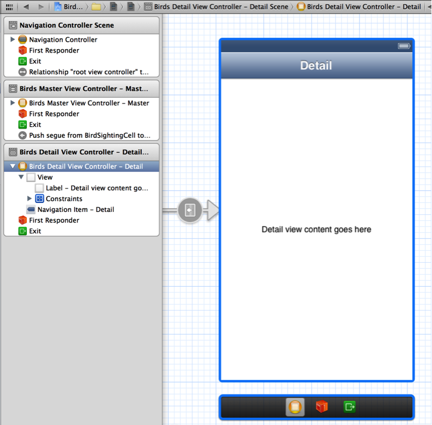
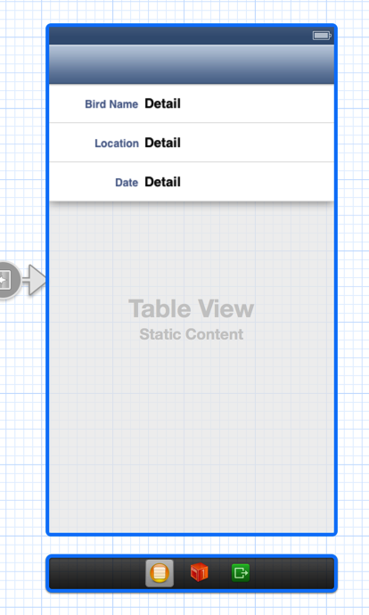
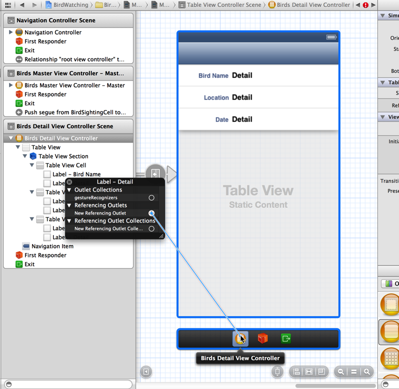

> 导航：[总目录](../../../README.md) · [documentation](../../../_indexes/documentation.md) · [Your Second iOS App: Storyboards](About%20Creating%20Your%20Second%20iOS%20App.md)


[Next](Enabling%20the%20Addition%20of%20New%20Items.md)[Previous](Designing%20the%20Master%20Scene.md)

# Displaying Information in the Detail Scene

When iOS users tap a table row that includes a disclosure indicator, they expect to see a new screen that displays information related to the row item, typically in another table. In the BirdWatching app, each cell in the master scene’s table displays a bird-sighting item and a disclosure indicator. When users tap an item, a detail screen appears that displays the bird’s name and location and date of the bird sighting.

In this chapter, you create the detail scene that displays the information about the selected bird sighting.

The detail scene should display the information from the `BirdSighting` object that’s associated with the selected table cell. Unlike the work you did on the master scene, you’ll write the detail view controller code first and design the scene on the canvas in a later step.

To customize the detail view controller header file

1. Select `BirdsDetailViewController.h` in the project navigator.
2. Between the `#import` and `@interface` statements, add a forward declaration of the `BirdSighting` class:

```
@class BirdSighting;
```
3. Change the parent class of the default detail view controller to `UITableViewController`.

   After you do this, the edited `@interface` statement should look like this:

```objc
@interface BirdsDetailViewController : UITableViewController
```

   Note that changing the default detail scene from a generic view controller to a table view controller is a design decision; that is, this change is not required for the app to run correctly. The main reason for this design decision is that using a table to display the bird sighting details provides a user experience that is consistent with the master scene. A secondary reason is that it gives you the opportunity to learn how to use static cells to design a table.
4. Declare properties that refer to the `BirdSighting` object and its properties.

   You don’t need the default `detailItem` and `detailDescriptionLabel` property declarations provided by the template. Replace these with the following property declarations:

```objc
@property (strong, nonatomic) BirdSighting *sighting;
@property (weak, nonatomic) IBOutlet UILabel *birdNameLabel;
@property (weak, nonatomic) IBOutlet UILabel *locationLabel;
@property (weak, nonatomic) IBOutlet UILabel *dateLabel;
```

   Xcode displays additional problem indicators after you replace the default properties because the code still references the old properties.

In the detail scene implementation file, you first need to give the detail scene access to objects of type `BirdSighting`. Then, you need to implement two of the default methods.

To give the detail scene access to BirdSighting objects

1. Select `BirdsDetailViewController.m` in the project navigator.

   Xcode displays red problem indicators next to each usage of the `detailItem` and `detailDescriptionLabel` symbols because you removed the property declarations for them.
2. At the beginning of the file, import the `BirdSighting` header file by adding the following code line:

```objc
#import "BirdSighting.h"
```

By default, the `BirdsDetailViewController` implementation file includes stub implementations of the `setDetailItem` and `configureView` methods. Notice that the `setDetailItem` method is a custom setter method for the `detailItem` property that was provided by the template (and that you removed in [To customize the detail view controller header file](#apple-f4xwc4dqnrsv64tfmyxwi33df52wszbpkridimbqgeytgmjyfvbuqnjnknlte)). The reason the template uses a custom setter method—and not the default setter that Xcode can synthesize—is so that `setDetailItem` can call `configureView`.

In this tutorial, the detail item is a `BirdSighting` object, so the `sighting` property takes the place of the `detailItem` property. Because these two properties play similar roles, you can use the structure of the `setDetailItem` method to help you create a custom setter for the `sighting` property.

To create a custom setter method for the sighting property

- In `BirdsDetailViewController.m`, replace the `setDetailItem` method with the following code:

```objc
- (void)setSighting:(BirdSighting *) newSighting
{
    if (_sighting != newSighting) {
        _sighting = newSighting;

        // Update the view.
        [self configureView];
    }
}
```

The `configureView` method (which is called in both the new `setSighting` method and the default `viewDidLoad` method) updates the UI of the detail scene with specific information. Edit this method so that it updates the detail scene with data from the selected `BirdSighting` object.

To implement the configureView method

- In `BirdsDetailViewController.m`, replace the default `configureView` method with the following code:

```objc
- (void)configureView
{
    // Update the user interface for the detail item.
   BirdSighting *theSighting = self.sighting;

    static NSDateFormatter *formatter = nil;
    if (formatter == nil) {
        formatter = [[NSDateFormatter alloc] init];
        [formatter setDateStyle:NSDateFormatterMediumStyle];
    }
    if (theSighting) {
        self.birdNameLabel.text = theSighting.name;
        self.locationLabel.text = theSighting.location;
        self.dateLabel.text = [formatter stringFromDate:(NSDate *)theSighting.date];
    }
}
```

In the next section, you’ll lay out the detail scene on the canvas.

In the previous section, you changed the parent class of the template-provided detail view controller from `UIViewController` to `UITableViewController`. In this section, you replace the default detail scene on the canvas with a new table view controller from the object library.

To replace the default UIViewController scene with a UITableViewController scene

1. Select `MainStoryboard.storyboard` in the project navigator to open it on the canvas.
2. Select the detail scene and press Delete.

   To make sure that you delete the scene itself—and not just an element in the scene—you need to make sure that the entire scene is selected on the canvas. An easy way to do this is to select the scene’s view controller in the document outline. For example, when you select Birds Detail View Controller - Detail in the document outline, you see something like this:

   
3. Drag a table view controller from the object library to the canvas.
4. With the new scene still selected on the canvas, click the Identity button in the utility area to open the Identity inspector.

   If necessary, select Table View Controller in the document outline to ensure that the scene is selected on the canvas.
5. In the Custom Class section of the Identity inspector, choose `BirdsDetailViewController` in the Class pop-up menu.

When you delete a scene from the canvas, all segues to that scene also disappear. You need to reestablish the segue from the master scene to the detail scene so that the master scene can transition to the detail scene when the user selects an item. Make sure that you can see both the master scene and the new detail scene on the canvas.

To create a segue from the master scene to the detail scene

1. Control-drag from the table cell in the master scene to the detail scene.

   In the Selection Segue area of the translucent panel that appears, select Push. A selection segue occurs when the user selects the table row; a push segue causes the new scene to slide over the previous scene from the right edge of the screen. (The Accessory Action area lists segues that can be triggered when the user interacts with a table accessory, such as a detail disclosure button.)

   Notice that Xcode automatically displays a navigation bar in the detail scene. This is because Xcode knows that the source scene—in this case, the master Bird Sightings scene—is part of a navigation controller hierarchy, and so it simulates the appearance of the bar in the detail scene to make it easier for you to design the layout.
2. On the canvas, select the push segue you just created.
3. In the Attributes inspector, enter a custom ID in the Identifier field.

   By convention, it’s best to use an identifier that describes what the segue does. In this tutorial, use `ShowSightingDetails` because this segue reveals sighting details in the detail scene.

   If a scene can transition to different destination scenes, it’s important to give each segue a unique identifier so that you can differentiate them in code. In this tutorial, the master scene can transition to the detail scene and to the add scene (which you’ll create in [Enabling the Addition of New Items](Enabling%20the%20Addition%20of%20New%20Items.md#apple-f4xwc4dqnrsv64tfmyxwi33df52wszbpkridimbqgeytgmjyfvbuqnrnknltc)), so you need to have a way to distinguish between these two segues.

Although the details about a bird sighting vary, the app should always display them in the same format—specifically: name, date, and location. Because you never want the detail table to display information in a different layout, you can use static table cells to design this layout on the canvas.

By default, a new table view controller scene contains a table that uses prototype-based cells. Before you design the detail table layout, change its content type.

To change the detail table-view content type

1. On the canvas, select the table view in the detail scene.
2. In the Attributes inspector, choose Static Cells in the Content pop-up menu.

When you change the content type of a table view from dynamic prototypes to static cells, the resulting table automatically contains three cells. By coincidence, three happens to be the number of table rows that you want to display in the app. You could design each cell separately, but because each cell uses the same layout, it’s more convenient to design one of them and copy it to create the others.

To design one static table cell and copy it

1. Remove two of the cells by selecting them and pressing Delete.
2. Select the remaining cell (if necessary) and choose `Left Detail` in the Style pop-up menu of the Table View Cell Attributes inspector.
3. In the document outline, select Table View Section.
4. In the Table View Section area of the Attributes inspector, use the Rows stepper to increase the number of rows to 3.
5. In each cell, double-click the title label and enter the appropriate description.

   In the top cell, enter `Bird Name`; in the middle cell, enter `Location`; and in the bottom cell, enter `Date`.

After you finish laying out the cells in the table, the detail scene should look similar to this:



When the app runs, you want the right-hand label in each cell to display one of the pieces of information in the selected `BirdSighting` object. Earlier, you gave the detail view controller three properties, each of which accesses one property of a `BirdSighting` object. In this step, connect each label in the detail scene to the appropriate property in the detail view controller.

To connect the detail text labels to the detail view controller’s properties

1. In the Table View section of the document outline, locate the table view cell that contains the Bird Name label (it should be the first one).
2. Control-click the Label - Detail object listed below Label - Bird Name.
3. In the translucent panel that appears, Control-drag from the empty circle in the New Referencing Outlet item to the `BirdsDetailViewController` object in the scene dock on the canvas.

   The scene dock is the bar below the scene. When the scene or any element within it is selected, the scene dock typically displays three proxy objects: An orange cube that represents the first responder, a yellow sphere that represents the scene’s view controller object, and a green square that represents the destination of an unwind segue. An _unwind segue_ is a segue you use to return to an existing scene without instantiating a new view controller object. (Later, you’ll be using an unwind segue to add to the master list information about a new bird sighting.) At other times, the scene dock displays the scene’s name.

   As you Control-drag from the New Referencing Outlet item in the translucent panel, you see something like this:

   
4. In the Connections panel that appears when you release the Control-drag, choose `birdNameLabel`.
5. Perform steps 1, 2, and 3 with the detail label in the Location cell. This time, choose `locationLabel` in the Connections panel.
6. Perform steps 1, 2, and 3 with the detail label in the Date cell. This time, choose `dateLabel` in the Connections panel.

All the elements of the detail scene’s UI seem to be connected with the code, but the detail scene still doesn’t have access to the `BirdSighting` object that represents the item the user selected in the master list. You fix this in the next step.

Storyboards make it easy to pass data from one scene to another using the `prepareForSegue` method. This method is called when the first scene (the _source_) is about to transition to the next scene (the _destination_). The source view controller can implement `prepareForSegue` to perform setup tasks, such as passing to the destination view controller the data it should display in its views.

In your implementation of the `prepareForSegue` method, you need the ID that you gave to the segue between the master scene and the detail scene. In this tutorial, the ID is already part of the code listing for the method; when you write an app from scratch, you need to copy the ID from the segue Attributes inspector.

To send setup information to the detail scene

1. Select `BirdsMasterViewController.m` in the project navigator to open the file in the editor.
2. Make sure the detail view’s header file is imported.

   Near the top of the file, you should see the following code line:

```objc
#import "BirdsDetailViewController.h"
```
3. In the `@implementation` block, replace the default `prepareForSegue` method with the following code:

```objc
- (void)prepareForSegue:(UIStoryboardSegue *)segue sender:(id)sender {
    if ([[segue identifier] isEqualToString:@"ShowSightingDetails"]) {
        BirdsDetailViewController *detailViewController = [segue destinationViewController];

        detailViewController.sighting = [self.dataController objectInListAtIndex:[self.tableView indexPathForSelectedRow].row];
    }
}
```

   After a few seconds, Xcode removes all the remaining problem indicators.

Build and run the project. In Simulator, you should see the placeholder data that you created in the `BirdSightingDataController` class displayed in the master scene. Notice that the master scene no longer displays the Edit button and Add button (+) because you removed the code that created these buttons from `BirdsMasterViewController.m`.

In the master scene, select the placeholder item. The master scene transitions to the detail scene, which displays information about the item in the table configuration that you designed. Click the back button that appears in the upper-left corner of the screen to return to the master list.

In the next chapter, you’ll design a new scene in which user can enter information about a new bird sighting and add it to the master list. For now, quit iOS Simulator.

In this chapter, you customized the template-provided detail view controller so that it displays the details about the item the user selects in the master list. You edited the detail view controller code to change the parent class to `UITableViewController`, added properties that refer to bird-sighting details, and implemented methods that update the UI.

On the canvas, you replaced the template-provided detail scene with a table view controller. When you did this, you learned that you had to re-create the segue from the master scene to the detail scene. Because the detail scene should always display the same configuration of data, you used a static-content based table to lay out three table cells—one cell for each bird sighting detail.

Finally, you implemented the `prepareForSegue` method in the master view controller, which allowed you to pass to the detail scene the `BirdSighting` object that’s associated with the user’s selection in the master list.

At this point in the tutorial, the code in `BirdsDetailViewController.h` should look like this:

```objc
#import <UIKit/UIKit.h>
@class BirdSighting;
@interface BirdsDetailViewController : UITableViewController

@property (strong, nonatomic) BirdSighting *sighting;
@property (weak, nonatomic) IBOutlet UILabel *birdNameLabel;
@property (weak, nonatomic) IBOutlet UILabel *locationLabel;
@property (weak, nonatomic) IBOutlet UILabel *dateLabel;
@end
```

The code in `BirdsDetailViewController.m` should look similar to this (not including template-provided code that you don’t edit in this tutorial):

```objc
#import "BirdsDetailViewController.h"
#import "BirdSighting.h"
@interface BirdsDetailViewController ()
- (void)configureView;
@end

@implementation BirdsDetailViewController

#pragma mark - Managing the detail item

- (void)setSighting:(BirdSighting *) newSighting
{
    if (_sighting != newSighting) {
        _sighting = newSighting;

        // Update the view.
        [self configureView];
    }
}

- (void)configureView
{
    // Update the user interface for the detail item.
    BirdSighting *theSighting = self.sighting;

    static NSDateFormatter *formatter = nil;
    if (formatter == nil) {
        formatter = [[NSDateFormatter alloc] init];
        [formatter setDateStyle:NSDateFormatterMediumStyle];
    }
    if (theSighting) {
        self.birdNameLabel.text = theSighting.name;
        self.locationLabel.text = theSighting.location;
        self.dateLabel.text = [formatter stringFromDate:(NSDate *)theSighting.date];
    }
}

- (void)viewDidLoad
{
    [super viewDidLoad];
    // Do any additional setup after loading the view, typically from a nib.
    [self configureView];
}
@end
```

The `prepareForSegue` method in `BirdsMasterViewController.m` should look similar to this (edits that you made to this file earlier in the tutorial are not shown):

```objc
#import "BirdsDetailViewController.h"
...
- (void)prepareForSegue:(UIStoryboardSegue *)segue sender:(id)sender

{
    if ([[segue identifier] isEqualToString:@"ShowSightingDetails"]) {
        BirdsDetailViewController *detailViewController = [segue destinationViewController];

        detailViewController.sighting = [self.dataController objectInListAtIndex:[self.tableView indexPathForSelectedRow].row];
    }
}
...
@end
```

[Next](Enabling%20the%20Addition%20of%20New%20Items.md)[Previous](Designing%20the%20Master%20Scene.md)

