> 导航：[总目录](../../../README.md) · [documentation](../../../_indexes/documentation.md) · [Your Second iOS App: Storyboards](About%20Creating%20Your%20Second%20iOS%20App.md)


[Next](Troubleshooting.md)[Previous](Displaying%20Information%20in%20the%20Detail%20Scene.md)

# Enabling the Addition of New Items

At this point in the tutorial, the BirdWatching app displays a placeholder item in the master scene and additional information about the item in the detail scene. You’ve learned how easy it is to design and implement this common app design using storyboards.

In this chapter, you create a new scene that lets users enter information about a new bird sighting and add it to the master list. You’ll learn how to:

- Add a new navigation controller hierarchy to the storyboard
- Present a scene modally
- Use Auto Layout to specify the visual relationships among UI elements
- Allow a destination scene to send information back to its source scene
- Improve the accessibility of your app

In this step, you create the interface and implementation files for the view controller that manages the add scene that lets users add a new bird-sighting to the master list. Then, you design the add scene on the canvas. You don’t do much implementation of the view controller in this step, but it’s useful to add the files to your project before you work with the scene on the canvas because doing so allows you to set up property declarations and action methods by dragging from the canvas to the appropriate class file.

To create the add scene view controller class files

1. Choose File > New > File (or press Command-N).
2. In the dialog that appears, select Cocoa Touch in the iOS section on the left.
3. In the main area of the dialog, select Objective-C Class and then click Next.
4. In the next pane of the dialog, enter `AddSightingViewController` in the Class field and choose `UITableViewController` in the Subclass pop-up menu.

   You want the add scene to be a table view controller subclass because each input text field is displayed in a table cell.
5. Make sure that the “Targeted for iPad” and “With XIB for user interface” options are not selected and then click Next.
6. In the next dialog that appears, choose the BirdWatching folder in the Group pop-up menu and click Create.

Now create the add scene in the storyboard file.

To create the add scene on the canvas

1. Select `MainStoryboard.storyboard` in the project navigator.

   To give yourself more room, close the document outline pane by clicking the button in the lower-left corner of the canvas that looks like this: 

   If you want, you can also adjust the canvas zoom level.
2. Drag a table view controller from the object library to the canvas.

The add scene needs to include a Done button and a Cancel button so that users can either save their input or cancel the add action. Typically, Done and Cancel buttons belong in a navigation bar at the top of a screen. Although the add scene doesn’t need to be part of a navigation hierarchy (because it doesn’t allow users to transition to additional scenes), the easiest way to give it a navigation bar is to embed the add scene in a navigation controller. Embedding a scene in a navigation controller also has the following advantages:

- It ensures that the navigation bar doesn’t scroll off the screen if the main content view scrolls. This is not a problem in this tutorial (because the add scene’s table view has only two cells), but it’s a good technique to know.
- It makes it easy to extend the current design to transition to additional scenes from the add scene. See [Next Steps](Next%20Steps.md#apple-f4xwc4dqnrsv64tfmyxwi33df52wszbpkridimbqgeytgmjyfvbuqobnknltc) for some ways in which you can enhance the BirdWatching app.

To embed the add scene in a navigation controller

1. On the canvas, click the status bar of the add scene to select it.
2. Choose Editor > Embed In > Navigation Controller.

   Xcode adds a navigation controller scene to the canvas and automatically connects it to the add scene with a relationship. You should see something like this:

   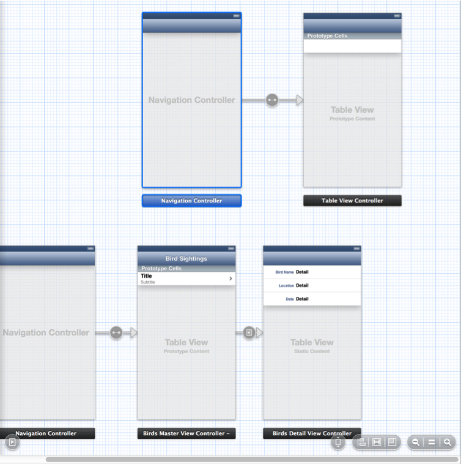

After you finish embedding the new table view controller in a navigation controller, Xcode warns you about a few issues. Specifically:

- The implementation of `AddSightingViewController` is potentially incomplete.
- Prototype table cells need reuse identifiers.
- The scene you just added to the canvas is currently unreachable.

The first issue occurs because Xcode automatically includes stubs for the table view data source methods in a new `UITableViewController` implementation file. (You implemented some of these methods for the master view controller in [To implement the table view data source methods in the master view controller](Designing%20the%20Master%20Scene.md#apple-f4xwc4dqnrsv64tfmyxwi33df52wszbpkridimbqgeytgmjyfvbuqnbnknlte).) But unlike the table in the master scene, which must be able to display as many bird sighting items as the user wants to enter, the add scene’s table always displays the same configuration of content. Therefore, you can base the add scene’s table on static content, as you did for the detail scene’s table, rather than on dynamic prototypes, as you did for the master scene’s table. When you base a table on static content, the table view controller automatically handles the data source needs of the table view, so you don’t have to implement the data source methods.

The second issue arises because when you drag a new table view controller scene to the canvas, it is based on prototype cells by default. In the next section, when you change the add scene’s table to be based on static content, you also resolve this issue, because static cells don’t need reuse identifiers.

The third issue is that the add scene is not connected to any other scene in your app. You’ll fix that situation later when you create a segue from the master scene to the add scene.

Because the add scene doesn’t need the table view data source methods, you can delete (or comment out) the following stubs in `AddSightingViewController.m`:

- `numberOfSectionsInTableView`
- `numberOfRowsInSection`
- `cellForRowAtIndexPath`
- `didSelectRowAtIndexPath`

Before you continue, you can also delete or comment out the default `initWithStyle` method because you will specify the table view’s style on the canvas.

Before you lay out the add scene, first specify the custom view controller class that manages it. If you don’t do this, none of the work you do in this chapter will have any effect on the running app.

To specify the identity of the add scene

1. Select `MainStoryboard.storyboard` in the project navigator.
2. On the canvas, select the add scene—that is, the table view controller object you dragged out of the object library.

   Make sure you select the add scene itself, and not the navigation controller in which you embedded it.
3. In the Identity inspector, choose `AddSightingViewController` in the Class pop-up menu.

To give users the ability to save information about a new bird sighting—or to abandon their input—you need to put Cancel and Done buttons in the add scene’s navigation bar.

To add Cancel and Done buttons to the add scene

1. On the canvas, zoom in on the add scene.
2. One at a time, drag two bar button items from the object library, placing one item in each end of the add scene’s navigation bar.

   You don’t have to be very careful where you release the bar button items. As long as you drag the button to one side or the other of the navigation bar’s center, Xcode automatically places it in the proper location.
3. Select the left bar button and ensure that the Attributes inspector is open.
4. In the Bar Button Item section of the Attributes inspector, choose Cancel in the Identifier pop-up menu.
5. Select the right bar button and choose Done in the Identifier pop-up menu.

As you did in the detail scene, you want to design static cells for the add scene’s table view because the table view should always use the same layout to display the labels and input text fields. Before you can do this, you must change the content type of the table view from dynamic prototype to static cell.

To change the content type of the add scene’s table

1. Select the add scene’s table view, and open the Attributes inspector.
2. In the Attributes inspector, choose Static Cells in the Content pop-up menu.

The add scene needs only two table cells—one for the bird name and one for the sighting location—because the app uses the current date for the date of the sighting. Each cell needs a label and a text input field so that users know what information to enter. In this step, you lay out the top table cell first and then duplicate it for the bottom cell.

As you lay out the table cell, take advantage of Auto Layout to ensure that the UI elements behave correctly when the device rotates. Using the Auto Layout system, you define and prioritize layout _constraints_—which represent relationships between UI elements—and allow the system to lay out the UI in the way that best satisfies those constraints. (Auto Layout also helps you prepare for localization; to learn how to localize an app, see _Internationalize Your App_, which is part of _[Start Developing iOS Apps Today (Retired)](https://developer.apple.com/library/archive/referencelibrary/GettingStarted/RoadMapiOS-Legacy/index.html#//apple_ref/doc/uid/TP40011343)_.)

In the add scene, you want to allow the label to expand to fit its contents but you don’t want it to cause the text field to become too narrow. Also, you want the space between the label and text field to remain constant. You define these layout relationships by giving a high priority to the label’s Horizontal Content Hugging constraint, adding a minimum width constraint to the text field, and specifying a horizontal spacing constraint for the space between the two elements.

To lay out the first cell in the add scene’s table

1. On the canvas, select two of the three default cells in the add scene’s table view and press Delete.
2. Drag a label from the object library to the remaining table cell.
3. Keeping the label vertically centered in the cell, move the label to the left until you see a vertical dashed blue line appear at its left edge:

   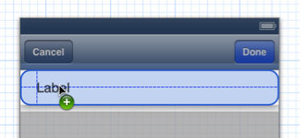

   As you can see above, Xcode displays a horizontal dashed blue line through the middle of a UI element when it’s vertically centered in its parent view.
4. Drag a text field from the object library to the cell, moving it to the right—again, keeping it vertically centered—until you see a vertical dashed blue line appear at the field’s right edge.

   After you add the label and the text field, you should see something like this:

   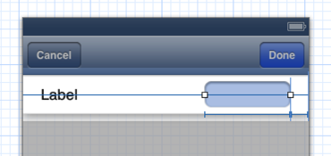

   The solid horizontal blue line that runs through both the label and the text field is a Center Y Alignment Constraint, which ensures that both UI elements are vertically centered in their parent view (that is, in the table cell).
5. Click the Show Document Outline button in the bottom-left corner of the canvas to reveal the document outline.
6. In the Add Sighting View Controller Scene section of the document outline, select the label to reveal its current bounds and constraints.

   You should see something like this:

   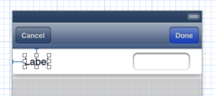

   The horizontal blue I-beam to the left of the label is a Horizontal Space Constraint, which specifies a system-defined space between the leading edge of the label and the left edge of the cell. (The text field has a similar Horizontal Space Constraint between its right—or trailing—edge, but you don’t see it unless you select the text field.)
7. With the label still selected, open the Size inspector by clicking the Size button in the utility area.

   The Size inspector button looks like this: 
8. In the Content Hugging Priority section of the Size inspector, type `999` in the text field to the right of the Horizontal slider.

   A value of 1000 for a constraint priority means that the constraint is required. By giving the label a Horizontal Content Hugging Priority of 999, you specify that it’s very important—but not required—that the label will expand in width to fit its contents.
9. On the canvas, select the text field.
10. In the Constraints section of the Size inspector, click the gear icon in the Width Equals section and choose Select and Edit.

    The Size inspector closes and the Attributes inspector opens, which displays information about the width constraint.
11. In the Width Constraint section of the Attributes inspector, choose Greater Than or Equal in the Relation pop-up menu.

    Specifying Greater Than or Equal means that the text field will not get narrower than the default width of 97 points, no matter how wide the label becomes.
12. On the canvas, select both the label and the text field and click the pin constraint button in the lower-right corner of the canvas.

    The pin constraint button is the middle button in the group that looks like this: 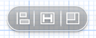
13. In the Pin menu that appears, choose Horizontal Spacing.

    You should see something like this:

    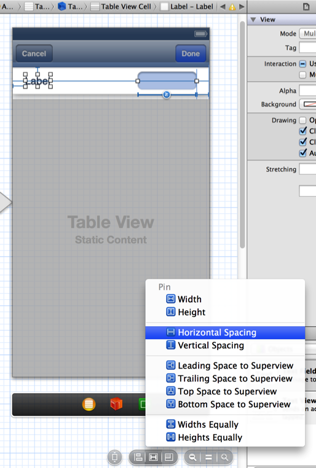
14. In the Horizontal Space Constraint section of the Attributes inspector, select the Standard checkbox.

    Horizontal spacing refers to the space between two selected objects. Choosing the standard space between the label and the text field—and leaving the priority set to 1000—ensures that content in these two elements won’t collide.

    On the canvas, you should see something like this:

    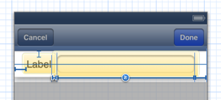
15. Select the text field and make the following choices in the Attributes inspector:

    - In the Capitalization pop-up menu, choose Words.
    - Ensure that the Keyboard pop-up menu is set to Default.
    - In the Return Key pop-up menu, choose Done.

After you finish laying out the first table cell, you can duplicate it to create the second cell. Then, make a few minor changes to the labels in both cells to customize them.

To create a second table cell and customize both cells

1. On the canvas, select the cell you created and press Command-D to duplicate it.

   The easiest way to select the cell—and not the label or the text field—is to click in one of the cell corners. The duplicated cell appears below the original cell.
2. Double-click the default text in each label and replace it with custom text.

   For the label in the top cell, type `Bird Name`; for the label in the bottom cell, type `Location`.

   Because Bird Name is longer than Location, the text field in the top cell becomes narrower than the text field in the bottom cell. You specified this behavior by requiring that the horizontal space between a label and a text field remain constant and by requiring the label to expand to fit its contents.

After you finish laying out the table cells in the add scene, the canvas should look something like this:

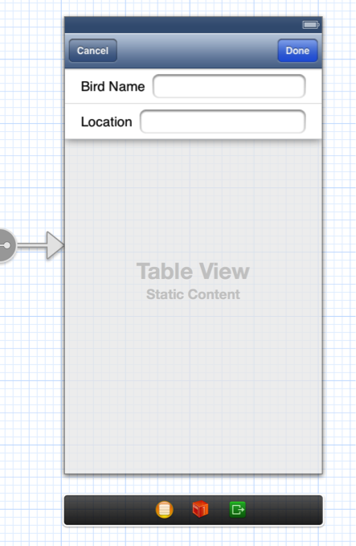

In iOS apps, users typically enter new information in a self-contained, modally presented screen. For example, when users tap the Add button in Contacts on iPhone, a new screen slides up in which they can enter information. When they finish the task (or they cancel it), the screen slides back down, revealing the previous screen.

To follow this design pattern, you want the add scene to slide up when the user taps an Add button in the master scene and slide back down when the user taps the add scene’s Done or Cancel button. You enable the modal display of the add scene by creating a modal segue from the master scene to the add scene (you’ll enable the dismissal of the add scene in a later step).

To allow the master scene to transition to the add scene

1. On the canvas, zoom in on the master scene.
2. Drag a bar button item out of the object library into the right end of the master scene’s navigation bar.
3. With the bar button still selected, open the Attributes inspector and choose Add in the Identifier pop-up menu.
4. On the canvas, Control-drag from the Add button to the navigation controller in which you embedded the add scene.
5. In the Action Segue menu that appears, select modal.

   After you create the modal segue, the canvas should look something like this:

   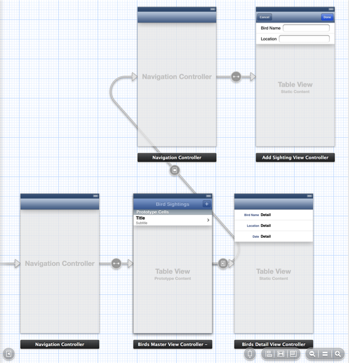

   Even though Xcode shows the new segue emerging from the middle of the master scene, and not from the Add button, the actual connection is associated with the button.

Recall that in [To send setup information to the detail scene](Displaying%20Information%20in%20the%20Detail%20Scene.md#apple-f4xwc4dqnrsv64tfmyxwi33df52wszbpkridimbqgeytgmjyfvbuqnjnknltc), you implemented the `prepareForSegue` method so that the master scene sends a `BirdSighting` object to the detail scene when the user selects an item in the master list. But when the master scene prepares to segue to the add scene, it does not need to send any data for the add scene to display, so you don’t need to create an ID for the add-scene segue or update the master scene’s `prepareForSegue` method.

The add scene’s view controller needs access to the two text fields you added in [Connect the Master Scene to the Add Scene](#apple-f4xwc4dqnrsv64tfmyxwi33df52wszbpkridimbqgeytgmjyfvbuqnrnknltk) so that it can capture the information that users enter. You also want the view controller to respond appropriately when the user taps the Cancel and Done buttons. Because you already added the `AddSightingViewController` code files to the project, you can let Xcode create the appropriate code as you make connections between the text fields on the canvas and the view controller header file. (You’ll be writing the code to handle the buttons yourself.)

Each text field in the add scene needs an outlet in the view controller code so that the view controller and the text field can communicate at runtime. Set up the outlets for the input text fields by Control-dragging from each element to the view controller header file.

To create outlets for the input text fields

1. On the canvas, double-click the add scene to zoom in on it and select it.
2. In the Xcode toolbar, click the Utility button to hide the utility area and click the Assistant editor button to display the Assistant editor pane.

   The Assistant editor button is to the left of the three View buttons (which include the Utility button) and it looks like this: 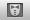
3. Make sure that the Assistant displays the view controller’s header file (that is, `AddSightingViewController.h`).

   If the Assistant displays a different file, it might be because you forgot to set the identity of the add scene to `AddSightingViewController` or because the add scene isn’t selected on the canvas.
4. Control-drag from the text field in the Bird Name cell to the method declaration area in the header file.

   As you Control-drag, you should see something like this:

   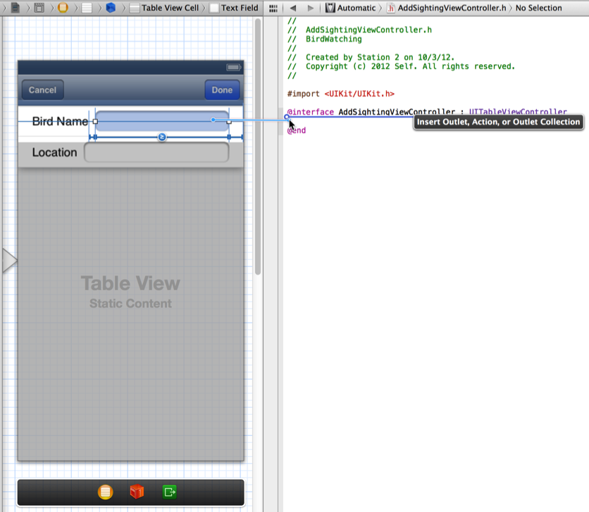

   When you release the Control-drag, Xcode displays a popover in which you configure the outlet connection you just made:

   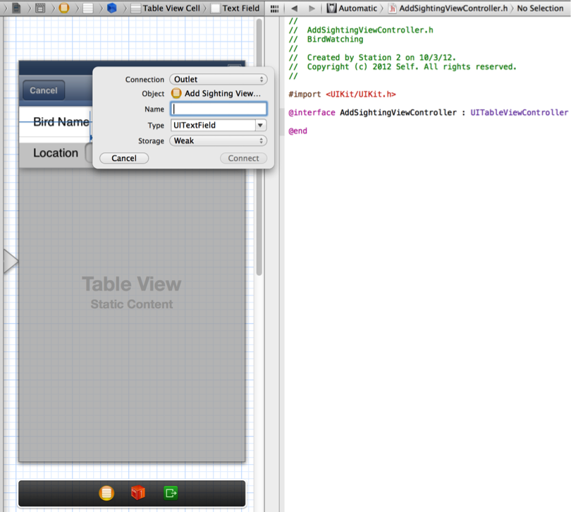
5. In the popover that appears when you release the Control-drag, configure the outlet in the following way:

   - Make sure that the Connection pop-up menu contains Outlet.
   - In the Name field, type `birdNameInput`.
   - Make sure that the Type field contains `UITextField` and that the Storage pop-up menu contains `Weak`.
6. In the popover, click Connect.
7. Perform actions similar to steps 3, 4, and 5 to create an outlet for the text field in the Location table cell:

   - Control-drag from the text field to an area between the `@property` statement Xcode added for `birdNameInput` and the `@end` statement in the header file.
   - In the popover that appears when you release the Control-drag, make sure that the Connection menu contains Outlet and type `locationInput` in the Name field.
   - Make sure that the Type field contains `UITextField` and that the Storage menu contains `Weak`; then click Connect.

By Control-dragging to establish an outlet connection between each text field and the view controller, you told Xcode to add code to the view controller files. Specifically, Xcode added the following declarations to `AddSightingViewController.h`:

```objc
@property (weak, nonatomic) IBOutlet UITextField *birdNameInput;
@property (weak, nonatomic) IBOutlet UITextField *locationInput;
```

Xcode also automatically synthesizes the appropriate accessor methods for these properties, although no code is added to `AddSightingViewController.m`.

Now that you’ve set up the outlets, you need to manage the interaction between the text fields and the system keyboard. To give yourself more room, click the Standard editor button to close the Assistant editor and expand the canvas editing area. The Standard editor button looks like this: 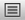

As you learned in _Your First iOS App_ (which is part of _[Start Developing iOS Apps Today (Retired)](https://developer.apple.com/library/archive/referencelibrary/GettingStarted/RoadMapiOS-Legacy/index.html#//apple_ref/doc/uid/TP40011343)_), an app can make the system keyboard appear and disappear as a side effect of toggling the first responder status of a text entry element, such as a text field. The `UITextFieldDelegate` [protocol](https://developer.apple.com/library/archive/documentation/General/Conceptual/DevPedia-CocoaCore/Protocol.html#//apple_ref/doc/uid/TP40008195-CH45) includes the `textFieldShouldReturn:` method, which a text field calls when the user wants to dismiss the keyboard. To revoke the text field’s first responder status—and cause the keyboard to dismiss—you choose an app object to act as the text field’s delegate and implement `textFieldShouldReturn:`. In the BirdWatching app, set each text field’s delegate to the add scene and implement the required protocol method in `AddSightingViewController.m`.

To set the delegate for the text fields and implement the textFieldShouldReturn: method

1. On the canvas, double-click the add scene to zoom in on it, if necessary.
2. Click the top text field to select it.
3. Control-drag from the text field to the view controller proxy object displayed in the scene dock.

   The view controller proxy object is represented by the yellow sphere.
4. In the Outlets section of the translucent panel that appears, select `delegate`.
5. In the add scene, select the bottom text field and perform steps 3 and 4 again.
6. In the project navigator, select `AddSightingViewController.h`.
7. Update the `@interface` code line to look like this:

```objc
@interface AddSightingViewController : UITableViewController <UITextFieldDelegate>
```

   Adding `UITextFieldDelegate` to the `@interface` line in this way signals that the add scene adopts the text field delegate protocol.
8. In the project navigator, select `AddSightingViewController.m`.
9. Implement the `UITextFieldDelegate` protocol method by adding the following code to the implementation block:

```objc
- (BOOL)textFieldShouldReturn:(UITextField *)textField {
if ((textField == self.birdNameInput) || (textField == self.locationInput)) {
        [textField resignFirstResponder];
}
    return YES;
}
```

   The `if` statement in this implementation ensures that the text field resigns its first responder status regardless of which button the user taps.

After the user finishes entering a new bird sighting, the add scene needs to package the information and pass it to the master scene for addition to the list. You already created a class whose instances represent bird sightings, so now you need to give the add sighting view controller the ability to create new `BirdSighting` objects and send them back to the master view controller.

To give the add scene access to BirdSighting objects

1. In the document outline, select `AddSightingViewController.h`.
2. Add a forward declaration of the bird-sighting class so that the add sighting view controller recognizes its type.

   Add the following line of code after the `#import` statement:

```
@class BirdSighting;
```
3. Declare a bird-sighting property.

   Before the `@end` statement, add the following code:

```objc
@property (strong, nonatomic) BirdSighting *birdSighting;
```


When the user taps the Cancel or Done button in the add scene, you want to dismiss the scene and return to the master list, updated with the user’s input. To enable this behavior, you use unwind segues and custom methods that handle the new bird-sighting information. Unlike a standard segue—which instantiates the destination scene before displaying it—an _unwind segue_ allows the source scene to target a destination scene that already exists. (In both unwind and standard segues, the source scene can implement `prepareForSegue` to send information to the destination.)

To make itself available as the destination of an unwind segue, a scene must declare unwind action methods. In this tutorial, you want the add scene’s Cancel and Done buttons to trigger unwind segues that transition to the master scene, so you declare and implement these methods in `BirdsMasterViewController`.

To set up unwind action methods for the Done and Cancel buttons

1. In the project navigator, select `BirdsMasterViewController.h`.
2. Declare the unwind action methods by adding the following code before the `@end` statement:

```objc
- (IBAction)done:(UIStoryboardSegue *)segue;
- (IBAction)cancel:(UIStoryboardSegue *)segue;
```
3. In the project navigator, select `BirdsMasterViewController.m`.
4. Import the `AddSightingViewController` header file.

   Add the following code line above the `@implementation` statement:

```objc
#import "AddSightingViewController.h"
```
5. Implement the `done` method by adding the following code to the implementation block:

```objc
- (IBAction)done:(UIStoryboardSegue *)segue
{
    if ([[segue identifier] isEqualToString:@"ReturnInput"]) {

        AddSightingViewController *addController = [segue sourceViewController];
        if (addController.birdSighting) {
            [self.dataController addBirdSightingWithSighting:addController.birdSighting];
            [[self tableView] reloadData];
        }
        [self dismissViewControllerAnimated:YES completion:NULL];
    }
}
```

   Notice that the code above specifies a segue identifier—that is, `ReturnInput`—that’s not yet associated with a segue on the canvas. In a later step, you enter this ID in the Attributes inspector for the unwind segue you create for the Done button.
6. Still in `BirdsMasterViewController.m`, implement the `cancel` method by adding the following code to the implementation block:

```objc
- (IBAction)cancel:(UIStoryboardSegue *)segue
{
    if ([[segue identifier] isEqualToString:@"CancelInput"]) {
        [self dismissViewControllerAnimated:YES completion:NULL];
    }
}
```

   As with the segue ID specified in the `done` method, in a later step you enter `CancelInput` in the Attributes inspector for the unwind segue you create for the Cancel button.

When you added the declarations of the `cancel` and `done` methods to the master view controller, you allowed it to advertise itself as a destination for unwind segues. Now you can create unwind segues for the Cancel and Done buttons and associate them with these methods.

To set up unwind segues for the Cancel and Done buttons

1. Select `MainStoryboard.storyboard` in the project navigator.
2. If necessary, zoom in and adjust the canvas so that you can focus on the add scene.
3. Control-drag from the Cancel button in the add scene to the unwind segue’s destination proxy object in the scene dock.

   The destination proxy object is represented by the Exit icon, which looks like this: 
4. In the Action Segue menu that appears when you release the Control-drag, choose the `cancel:` action method.

   After you choose `cancel:`, Xcode displays the segue in the Add Sighting View Controller Scene section of the document outline:

   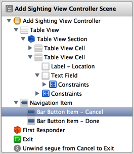
5. In the same way, create an unwind segue for the Done button.

   - Control-drag from the Done button in the add scene to the Exit icon in the scene dock.
   - In the Action Segue menu that appears when you release the Control-drag, choose `done:`.
6. In the Add Sighting View Controller Scene section of the document outline, select “Unwind segue from Cancel to Exit.”
7. If necessary, click the Utilities button to open the utility area.
8. In the Storyboard Unwind Segue section of the Attributes inspector, enter `CancelInput` in the Identifier text field.

   As with other segues you’ve created, it’s crucial to use the same ID value in both the Identifier text field and in code.
9. In the same way, identify the Done button’s unwind segue by entering the ID you specified in the master scene’s `done` method:

   - In the Add Sighting View Controller Scene section of the document outline, select “Unwind segue from Done to Exit.”
   - In the Storyboard Unwind Segue section of the Attributes inspector, enter `ReturnInput` in the Identifier text field.

Even though the master scene is prepared to handle the unwind actions in its `cancel` and `done` methods, it doesn’t yet have access to the user’s input. To fix this situation, implement `prepareForSegue` in the add scene to create a new `BirdSighting` object from the user’s input and send it to the master scene.

To send the user’s input to the master scene

1. In the project navigator, select `AddSightingViewController.m`.
2. Import `BirdSighting.h` by adding the following code line before the `@interface` statement:

```objc
#import "BirdSighting.h"
```
3. Implement the `prepareForSegue` method by adding the following code to the implementation block:

```objc
- (void)prepareForSegue:(UIStoryboardSegue *)segue sender:(id)sender {
    if ([[segue identifier] isEqualToString:@"ReturnInput"]) {
        if ([self.birdNameInput.text length] || [self.locationInput.text length]) {
            BirdSighting *sighting;
            NSDate *today = [NSDate date];
            sighting = [[BirdSighting alloc] initWithName:self.birdNameInput.text location:self.locationInput.text date:today];
            self.birdSighting = sighting;
        }
    }
}
```


An accessible app reports information about its UI elements and behavior so that people with disabilities can use an assistive technology—such as VoiceOver—to interact with the app. Every app should be accessible.

Standard UI elements are accessible by default because they automatically report information to VoiceOver. VoiceOver uses this information—provided in an element’s _accessibility attributes_—to describe the element and its current state to VoiceOver users.

Although the BirdWatching app is also accessible by default—because it contains only standard UI elements—it’s important to look for ways to enhance the experience for VoiceOver users. In this tutorial, you’ll improve the accessibility of your app by describing what the master scene’s Add button does.

Before you make any changes, it’s a good idea to find out what VoiceOver already knows about your app. To help you do this, iOS Simulator provides Accessibility Inspector.

To test the accessibility of your app

1. In Xcode, click Run to open your app in iOS Simulator.
2. At the bottom of the simulated device screen, click the Home button.
3. Open the Settings app.

   You might have to navigate to a different Home screen to find the Settings app.
4. In Settings > General > Accessibility, turn on Accessibility Inspector.

   The Accessibility Inspector panel—which floats above all other content in iOS Simulator—appears onscreen. When Accessibility Inspector is active, the panel displays accessibility information about an element, which looks something like this:

   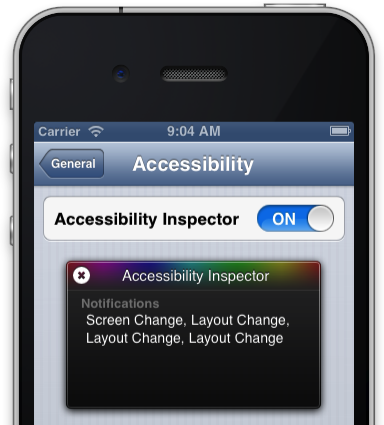

   When Accessibility Inspector is active, you must perform the following actions to interact with an onscreen element:

   1. Single-click the element to focus on it.

      When Accessibility Inspector focuses on an element, it draws a shaded box around the element.
   2. Triple-click the focused element to activate it.

      For example, instead of single-clicking in a text field to bring up the keyboard, you single-click the text field to focus on it and then triple-click in it.
5. Click the close button in the upper-left corner of the Accessibility Inspector panel to deactivate it.

   When Accessibility Inspector is inactive, it looks like this:

   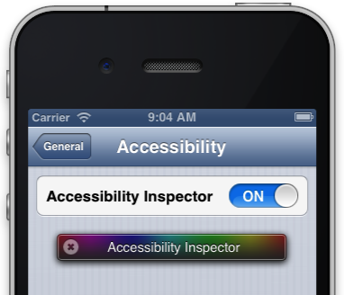

   When you deactivate Accessibility Inspector it means that you don’t have to use the focus and triple-click technique to activate UI elements in iOS Simulator. You can reactivate Accessibility Inspector when you want to view an element’s accessibility information.
6. Click the Home button to close Settings and return to the Home screen.
7. On the Simulator Home screen, locate and open the BirdWatching app.
8. Click the close button in the Accessibility Inspector panel to reactivate it.
9. In BirdWatching, click the first table row to view its accessibility information.

   You should see something like this:

   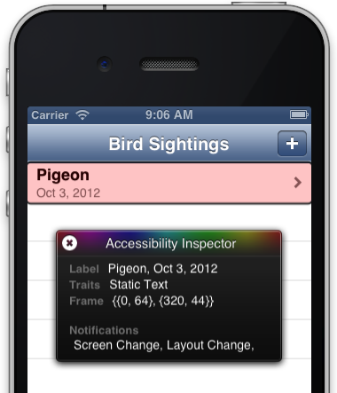

   Notice that the table cell automatically combines the title and subtitle text into a single accessibility label attribute that VoiceOver speaks to users.
10. Click the Add button.

    As you can see here, the Add button’s default label is accurate, but not particularly helpful:

    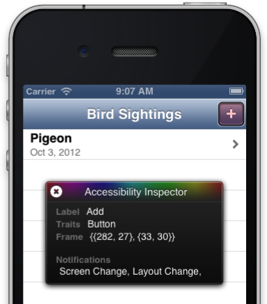
11. Deactivate Accessibility Inspector and stop iOS Simulator.

    The Stop button is in the left end of the Xcode toolbar, and it looks like this: 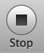

    Whether you stop or quit iOS Simulator, Accessibility Inspector remains on until you turn it off.

In [To allow the master scene to transition to the add scene](#apple-f4xwc4dqnrsv64tfmyxwi33df52wszbpkridimbqgeytgmjyfvbuqnrnknlteni), you used system-provided items to create a standard Add button, so VoiceOver already knows that the element is a button and that the plus sigh (+) means add. But VoiceOver can’t tell users about the type of thing that gets added, because the button doesn’t supply any other information. To clarify the Add button’s behavior, you can supply a _hint_, which is an accessibility attribute that describes the results of interacting with a control.

The hint attribute is represented by a property that’s available to objects that implement the `UIAccessibility` protocol. Because standard UI elements—such as buttons, text fields, and sliders—implement the `UIAccessibility` protocol by default, you can set this property in your code.

To provide an accessibility hint for the Add button

1. In the project navigator, select `BirdsMasterViewController.m`.
2. In the `viewDidLoad` method, set the `accessibilityHint` property.

   Add the following line of code after the `[super viewDidLoad];` statement:

```
self.navigationItem.rightBarButtonItem.accessibilityHint = @"Adds a new bird-sighting event";
```

Run the app again and activate Accessibility Inspector. When you click the Add button this time, you should see something like this:

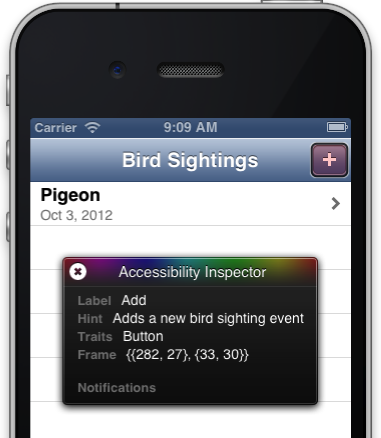

Before you do additional testing, turn off Accessibility Inspector in iOS Simulator.

To turn off Accessibility Inspector

1. If necessary, click the close button in the Accessibility Inspector panel to deactivate it.
2. Click the Home button and open Settings.
3. Choose General > Accessibility and turn off Accessibility Inspector.

At this point in the tutorial, Xcode should not report any errors. If it does, check the code that you added in this chapter against the code listings in [Recap](#apple-f4xwc4dqnrsv64tfmyxwi33df52wszbpkridimbqgeytgmjyfvbuqnrnknltg).

Run the app again. When BirdWatching opens in iOS Simulator, there are several things you should test.

__Try adding new bird sighting information to the master list.__ Make sure that you can select the new bird in the master scene and see details about it in the detail scene.

__Change the device orientation to landscape while you’re in the add scene.__ Each text field should automatically expand in width, but it should remain separated from its label and the right edge of the screen by constant amounts.

To change the device orientation in iOS Simulator

Do one of the following:

- Choose Hardware > Rotate Left (or press Command-Left Arrow).
- Choose Hardware > Rotate Right (or press Command-Right Arrow).

Each action performs a 90° rotation in the direction you specify.

If you choose Rotate Left, for example, you should see something like this:

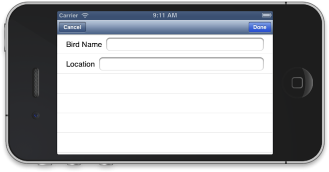

__Change the simulated device to iPhone 5.__ The master and detail scenes should display additional table rows automatically. In the add scene, change the device orientation to landscape and confirm that the text fields still behave as designed.

To change the simulated device in iOS Simulator

- Choose Hardware > Device > iPhone (Retina 4-inch).

Congratulations! You’ve created an app that enables some the most common iOS user experiences, such as navigating through a stack of progressively more detailed screens and entering new information in a modal screen. If you’re having any difficulties getting the app to run correctly, be sure to browse the advice in [Troubleshooting](Troubleshooting.md#apple-f4xwc4dqnrsv64tfmyxwi33df52wszbpkridimbqgeytgmjyfvbuqnznknltc) and check your code against the complete listings in [Code Listings](Code%20Listings.md#apple-f4xwc4dqnrsv64tfmyxwi33df52wszbpkridimbqgeytgmjyfvbuqojnknltc). And if you’re ready for some challenges, read [Next Steps](Next%20Steps.md#apple-f4xwc4dqnrsv64tfmyxwi33df52wszbpkridimbqgeytgmjyfvbuqobnknltc), which suggests some ways in which you can expand and improve the BirdWatching app.

In this chapter, you created the class files for a new scene managed by a table view controller. When you created this scene on the canvas, you designed a static-content–based table that contains one cell for each of the two pieces of information that users can enter about a new bird sighting. In doing this, you learned that a table view controller that manages a static content–based table automatically takes care of the table’s data source needs. You also embedded the new scene in a navigation controller so that it can display the Cancel and Done buttons in a navigation bar.

Next, you took advantage of Xcode’s code-addition features to create stubs for action methods by Control-dragging from items on the canvas to the `AddSightingViewController` header file. You also specified that `AddSightingViewController` should adopt the text field delegate protocol so that—by implementing the `textFieldShouldReturn` method—the keyboard disappears when users finish entering text.

You also learned how to set up unwind actions in the master view controller so that the buttons in the add scene can trigger unwind segues and pass information back to the master scene. Finally, you learned how to test the accessibility of your app and enhance the experience for VoiceOver users by updating an accessibility attribute.

The code in the new `AddSightingViewController.h` file should look like this:

```objc
#import <UIKit/UIKit.h>
@class BirdSighting;
@interface AddSightingViewController : UITableViewController <UITextFieldDelegate>
@property (weak, nonatomic) IBOutlet UITextField *birdNameInput;
@property (weak, nonatomic) IBOutlet UITextField *locationInput;
@property (strong, nonatomic) BirdSighting *birdSighting;
@end
```

The code in the new `AddSightingViewController.m` file should look like this:

```objc
#import "AddSightingViewController.h"
#import "BirdSighting.h"
@interface AddSightingViewController ()

@end

@implementation AddSightingViewController
- (BOOL)textFieldShouldReturn:(UITextField *)textField {
    if ((textField == self.birdNameInput) || (textField == self.locationInput)) {
        [textField resignFirstResponder];
    }
    return YES;
}
- (void)viewDidLoad
{
    [super viewDidLoad];

    // Uncomment the following line to preserve selection between presentations.
    // self.clearsSelectionOnViewWillAppear = NO;

    // Uncomment the following line to display an Edit button in the navigation bar for this view controller.
    // self.navigationItem.rightBarButtonItem = self.editButtonItem;
}

- (void)didReceiveMemoryWarning
{
    [super didReceiveMemoryWarning];
    // Dispose of any resources that can be recreated.
}

- (void)prepareForSegue:(UIStoryboardSegue *)segue sender:(id)sender {
    if ([[segue identifier] isEqualToString:@"ReturnInput"]) {
        if ([self.birdNameInput.text length] || [self.locationInput.text length]) {
            BirdSighting *sighting;
            NSDate *today = [NSDate date];
            sighting = [[BirdSighting alloc] initWithName:self.birdNameInput.text location:self.locationInput.text date:today];
            self.birdSighting = sighting;
        }
    }
}
@end
```

The updated `BirdsMasterViewController.h` file should look like this:

```objc
#import <UIKit/UIKit.h>
@class BirdSightingDataController;
@interface BirdsMasterViewController : UITableViewController
@property (strong, nonatomic) BirdSightingDataController *dataController;
- (IBAction)done:(UIStoryboardSegue *)segue;
- (IBAction)cancel:(UIStoryboardSegue *)segue;
@end
```

The updated `BirdsMasterViewController.m` file should include the following additional code lines (edits you made to this file earlier in the tutorial are not shown):

```objc
...
#import "AddSightingViewController.h"
...
@implementation BirdsMasterViewController
...
- (IBAction)done:(UIStoryboardSegue *)segue
{
    if ([[segue identifier] isEqualToString:@"ReturnInput"]) {

        AddSightingViewController *addController = [segue sourceViewController];
        if (addController.birdSighting) {
            [self.dataController addBirdSightingWithSighting:addController.birdSighting];
            [[self tableView] reloadData];
        }
        [self dismissViewControllerAnimated:YES completion:NULL];
    }
}
- (IBAction)cancel:(UIStoryboardSegue *)segue
{
    if ([[segue identifier] isEqualToString:@"CancelInput"]) {
        [self dismissViewControllerAnimated:YES completion:NULL];
    }
}
...
@end
```

[Next](Troubleshooting.md)[Previous](Displaying%20Information%20in%20the%20Detail%20Scene.md)

