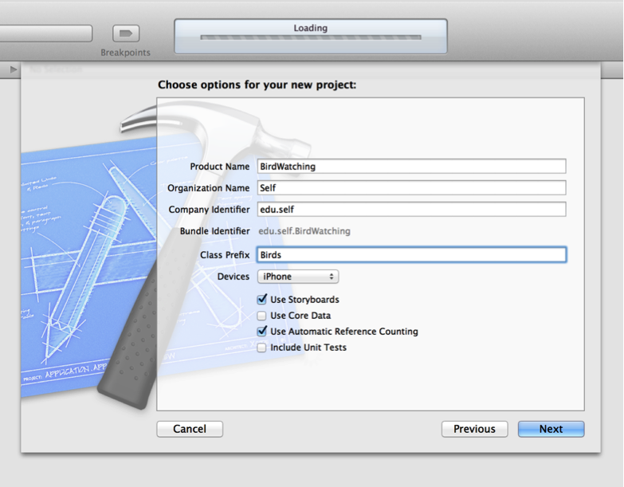
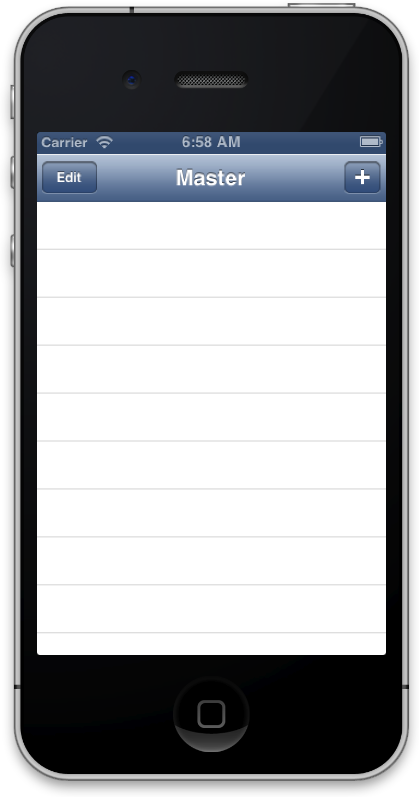
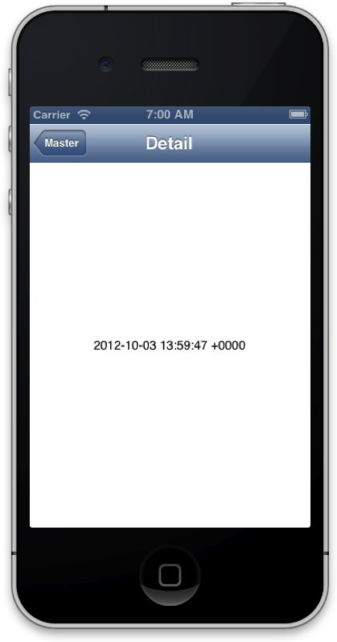
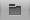
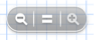
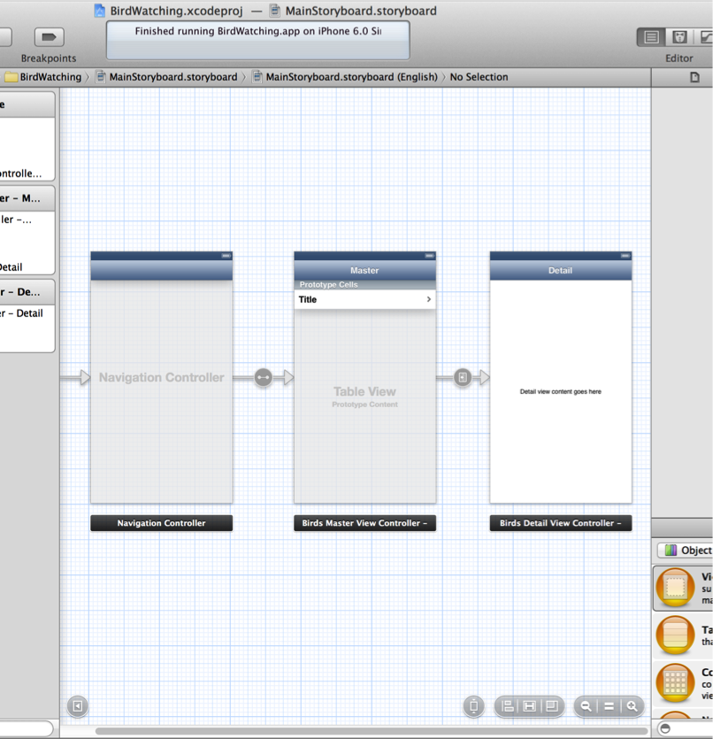
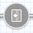
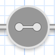
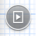
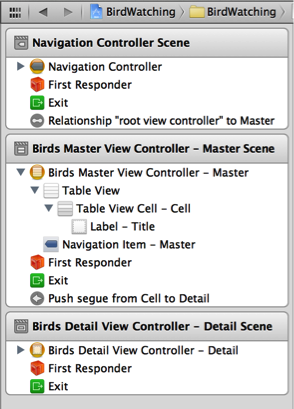

> 导航：[总目录](../../../README.md) · [documentation](../../../_indexes/documentation.md) · [Your Second iOS App: Storyboards](About%20Creating%20Your%20Second%20iOS%20App.md)

[Next](Designing%20the%20Model%20Layer.md)[Previous](About%20Creating%20Your%20Second%20iOS%20App.md)

# Getting Started

To create the iOS app in this tutorial, you need Xcode 4.5 or later and the iOS SDK for iOS 6.0 or later. When you install Xcode on your Mac, you also get the iOS SDK, which includes the programming interfaces of the iOS platform.

In this chapter, you create a new Xcode project, build and run the default app that the project creates, and learn how the storyboard defines the user interface and some of the app’s behavior.

The app in this tutorial displays a list of bird sightings. When users select a specific sighting, they see some details about it on a new screen. Users can also add to the list by entering details about new sightings.

Transitioning from a master list of items to a more detailed view of one item is part of a common design pattern in iOS apps. Many iOS apps allow users to drill down into a hierarchy of data by navigating through a series of progressively more detailed screens. For example, Mail allows users to drill down from a master list of accounts through progressively more detailed screens until they reveal a specific message.

Xcode provides the Master-Detail template to make it easy to build an app that allows users to navigate through a data hierarchy.

Begin developing the BirdWatching app by creating a new Xcode project for an iOS app that’s based on the Master-Detail template.

To create a new project for the BirdWatching app

1. Open Xcode and choose File > New > Project.
2. In the iOS section at the left side of the dialog, select Application.
3. In the main area of the dialog, select Master-Detail Application and then click Next.

   A new dialog appears that prompts you to name your app and choose additional options for your project.
4. In the dialog fill in the following fields with these values:

   - __Product Name__ `BirdWatching`
   - __Organization Name__ Your company’s name. If you don’t have a company name, you can use `Self`.
   - __Company Identifier__ The prefix of your company’s bundle identifier. If you don’t have a company identifier, you can use `edu.self`.
   - __Class Prefix__ `Birds`
5. In the Devices pop-up menu, make sure that iPhone is chosen.
6. Make sure that the Use Storyboards and Use Automatic Reference Counting options are selected and that the Use Core Data and the Include Unit Tests options are unselected.

   After you finish entering this information, the dialog should look similar to this:

   
7. Click Next.
8. In the new dialog that appears, enter a location to save your project, make sure the Source Control option is unselected, and click Create.

   Xcode opens your new project in a window, which is called the _workspace window_. By default, the workspace window displays information about the BirdWatching [target](https://developer.apple.com/library/archive/featuredarticles/XcodeConcepts/Concept-Targets.html#//apple_ref/doc/uid/TP40009328-CH4).

As with all template-based projects, you can build and run the new project before you make any changes. It’s a good idea to do this because it helps you understand the functionality that the template provides.

To build the default project and run it in iOS Simulator

1. Make sure that the Scheme pop-up menu in the Xcode toolbar displays BirdWatching > iPhone 6.0 Simulator.

   If the menu doesn’t display this choice, open it and choose iPhone 6.0 Simulator.
2. Click the Run button in the toolbar (or choose Product > Run).

   If Xcode asks you whether you want to enable developer mode, you can click Enable to let Xcode perform certain debugging tasks without requiring your password every time. For this tutorial, it doesn’t matter whether you enable developer mode or not.

   Xcode displays messages about the build process in the activity viewer, which is in the middle of the toolbar.

After Xcode finishes building your project, iOS Simulator should start automatically.

When you created the project, because you specified an iPhone product (as opposed to an iPad product), Simulator displays a window that looks like an iPhone. On the simulated iPhone screen, Simulator opens the default app, which should look like this:

There is already quite a bit of functionality in the default app. For example, the navigation bar includes an Add button (+) and an Edit button that you can use to add and remove items in the master list.

In Simulator, click the Add button (+) in the right end of the navigation bar to add an item to the list (by default, the item is the current data and time). After you add an item, select it to reveal the detail screen. The default detail screen should look like this:

As the detail screen is revealed, notice that a back button appears in the left end of the navigation bar, titled with the title of the previous screen (in this case, Master). The back button is provided automatically by the navigation controller that manages the master-detail hierarchy. Click the back button to return to the master list screen.

In the next section, you use the storyboard to represent the app’s user interface and to implement much of its behavior. For now, quit iOS Simulator.

A storyboard represents the screens in an app and the transitions between them. The storyboard in the BirdWatching app contains just a few screens, but a more complex app might have multiple storyboards, each of which represents a different subset of its screens.

Click `MainStoryboard.storyboard` in the Xcode project navigator to open the BirdWatching app’s storyboard on the canvas. The project navigator should already be open in the left side of the Xcode window. If it’s not, click the button that looks like this: 

You might have to adjust the zoom level to see all three screens on the canvas without scrolling.

To adjust the canvas zoom level

Do one of the following:

- Click the zoom controls in the lower-right corner of the canvas.

  The zoom controls look like this: 

  The middle zoom control acts as a toggle that switches between the most recent zoom level and 100%.
- Choose Editor > Canvas > Zoom, and then choose the appropriate zoom command.
- Double-click the canvas.

  A double-click on the canvas acts as a toggle that switches between 100% and 50% zoom levels.

Zoom in on the canvas so that you see all three screens in the project. You should see something like this:

The default storyboard in the Master-Detail Application template contains three scenes and two segues.

A _scene_ represents an onscreen content area that is managed by a view controller. A _view controller_ is an object that manages a set of views that are responsible for drawing content onscreen. (In the context of a storyboard, _scene_ and _view controller_ are synonymous terms.) The leftmost scene in the default storyboard represents a navigation controller. A navigation controller is called a _container view controller_ because, in addition to its views, it also manages a set of other view controllers. For example, the navigation controller in the default BirdWatching app manages the master and detail view controllers, in addition to the navigation bar and the back button that you saw when you ran the app.

A _segue_ represents the transition from one scene (called the _source_) to the next scene (called the _destination_). For example, in the default project, the master scene is the source and the detail scene is the destination. When you tested the default app, you triggered a segue from the source to the destination when you selected the Detail item in the master list. In this case, the segue is a _push segue_, which means that the destination scene slides over the source scene from right to left. On the canvas, a push segue looks like this:

When you create a segue between two scenes, you have the opportunity to customize the setup of the destination scene and pass data to it (you do this in [Send Data to the Detail Scene](Displaying%20Information%20in%20the%20Detail%20Scene.md#apple-f4xwc4dqnrsv64tfmyxwi33df52wszbpkridimbqgeytgmjyfvbuqnjnknlti)). You learn more about how to send data from a destination scene back to its source in [Get the User’s Input](Enabling%20the%20Addition%20of%20New%20Items.md#apple-f4xwc4dqnrsv64tfmyxwi33df52wszbpkridimbqgeytgmjyfvbuqnrnknlti).

A _relationship_ is a type of connection between scenes. On the canvas, a relationship looks similar to a segue, except that its icon looks like this:

In the default storyboard, there is a relationship between the navigation controller and the master scene. In this case, the relationship represents the containment of the master scene by the navigation controller. When the default app runs, the navigation controller automatically loads the master scene and displays the navigation bar at the top of the screen.

The canvas displays a graphical representation of each scene, its contents, and its connections, but you can also get a hierarchical listing of this information in the document outline. The document outline pane appears between the project navigator and the canvas. If you don’t see it, click the Document Outline button in the lower-left corner of the canvas to reveal it. The Document Outline button looks like this:

To examine the contents of scenes in the document outline

1. If necessary, resize the document outline pane so that you can read the names of the elements.
2. Click the disclosure triangle next to each element in a view controller section.

   For example, when you reveal the hierarchy of elements in the Birds Master View Controller section, you see something like this:

   

In this chapter, you used Xcode to create a new iOS app project based on the Master-Detail Application template. When you ran the default app, you found that it behaved much like other navigation-based iOS apps on iPhone, such as Mail and Contacts.

When you opened the template-provided storyboard on the Xcode canvas, you learned a couple of ways to examine the storyboard and its contents. You also learned about the components of the storyboard and the parts of the app that they represent.

[Next](Designing%20the%20Model%20Layer.md)[Previous](About%20Creating%20Your%20Second%20iOS%20App.md)

