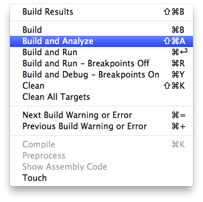
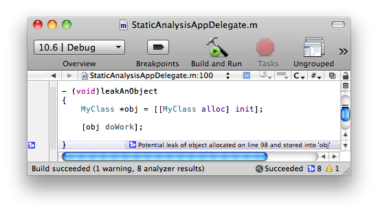
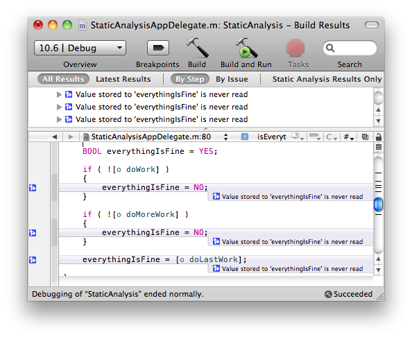
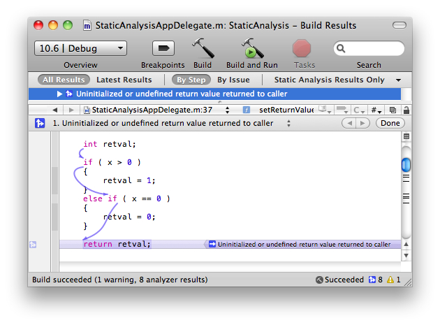
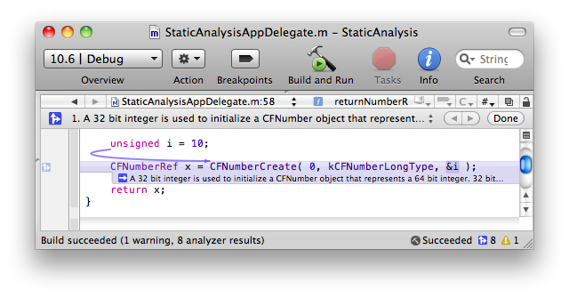
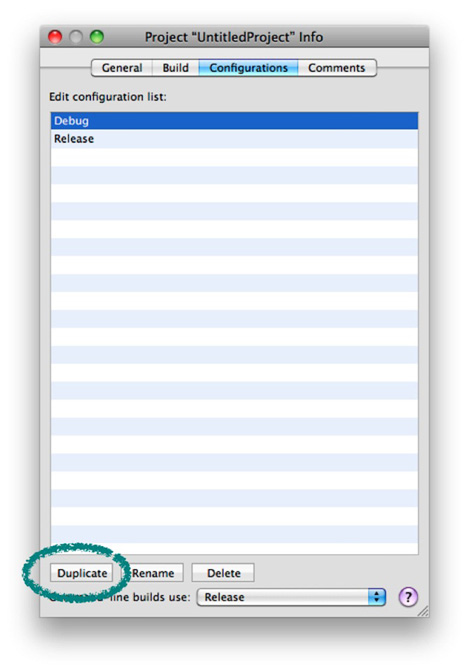
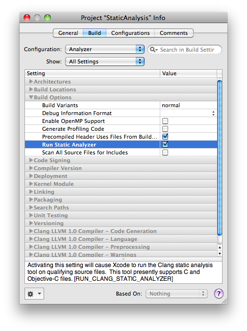

> 导航：[总目录](../../README.md) · [featuredarticles](../../_indexes/featuredarticles.md)

# Static Analysis in Xcode

New for Mac OS X v10.6, Xcode 3.2 introduces a revolutionary feature known as static analysis. You can think of static analysis as advanced warnings, identifying bugs in your code before it is run—hence the term “static.” Unlike traditional compiler warnings, the Xcode 3.2 static analyzer has a much deeper understanding of your code. The static analyzer travels down each possible code path, identifying logical errors such as unreleased memory—well beyond simple syntax errors normally found at compile time.

Xcode's static analyzer runs as part of the build process, but when a coding mistake is identified, Xcode integrates the analysis report in a truly innovative manner. Message bubbles appear beside the suspect code, and upon clicking the message bubble, the editor walks you through the logical steps in your code using graphical arrows. These arrows step you through the code that leads to the identified bug.

By following the arrows through your code, it becomes clear why your objects may be leaking, where coding conventions may be misused, or why your case statements never return the values you expect. These bugs would otherwise have been found at runtime, perhaps after your application was already in production.

This article discusses how to get started with the static analyzer to evaluate your source code for potential problems. Note that the static analyzer only works within individual functions and methods. And static analysis can only catch bugs that it’s designed to spot, so you still need to follow good programming practices.

You can run the analyzer on demand or as part of your regular builds. This article illustrates both approaches.

This section shows several examples of using the static analyzer. Although the examples are fairly simple, the analyzer is capable of detecting far more complicated bugs, so try it with your own projects.

Running the static analyzer on demand is easily accomplished using the Build > Build and Analyze menu item, as shown in [Figure 1-1](#apple-f4xwc4dqnrsv64tfmyxwi33df52wszbpkridimbqga4dsmrwfvbuqmjnknltc).

__Figure 1-1__  Build and Analyze Menu Item

Memory leaks are a very serious type of bug that the static analyzer can help you discover. In the following example, the analyzer has detected a potential memory leak for the instance of `MyClass`. If your project does not have garbage collection enabled or cannot support garbage collection, tracking down memory leaks is critical. Even if you are using garbage collection, you can still be vulnerable to memory leaks if you use Core Foundation objects, which are not automatically managed and need special handling. The static analyzer is highly effective at discovering these types of leaks as well.

__Figure 1-2__  Potential Memory Leak

In the following example, the variable `everythingIsFine` gets assigned a value, but is never read, resulting in a “dead store.” A dead store is an example of dead code, and can reflect a potentially serious logic bug or a potential optimization opportunity. In this case, it is a serious logic bug.

__Figure 1-3__  Dead Store

The static analyzer can also catch initialization bugs. In the following example, the static analyzer flags the variable `retval` as possibly being uninitialized at return time. Because `retval` was not initialized at declaration time, if the if-else clause does not trigger (in the case where `x` is negative), `retval` will remain unassigned, resulting in potentially undesired behavior.

Note that the analyzer provides additional detail when you click on the message bubble. This analyzer mode shows the control-flow (blue arrows) and a set of "events" that give a full diagnosis of the bug. Most issues reported by the analyzer have this information, making analysis and subsequent fixing of the error much easier.

__Figure 1-4__  Uninitialized Variable

Another type of problem is data type size differences between 32- and 64-bit build architectures. In the following example, using the unsigned int `i` to initialize the `CFNumberRef` `x` is not a problem when building a 32-bit application. However, if you build a 64-bit binary, the type difference becomes an error. The full text of the analyzer message is, “A 32 bit integer is used to initialize a CFNumber object that represents a 64 bit integer. 32 bits of the CFNumber value will be garbage.” Because `CFNumberCreate` expects a pointer to long when told to expect a `kCFNumberLongType`, the unsigned variable i is not the correct type. While unsigned int and long are both 32 bits on the 32 bit architecture, on the 64 bit architecture unsigned int is 32 bits and long is 64 bits. Because `CFNumberCreate` expects a long, running on the 64-bit architecture the program reads 64 bits from a 32 bit wide quantity, causing the initialized CFNumber object to have a garbage value. The program then has completely undefined behavior based on how the created CFNumber object is used.

__Figure 1-5__  Type Size Mismatch

In addition to 'Build and Analyze', Xcode gives you the option to automatically analyze your code whenever your project is built. You can create a custom build configuration that runs the static analyzer, similar to the Debug and Release configurations that Xcode creates automatically. Open the project information window and select the Configurations tab. Choose the Debug configuration, then click on the button labeled Duplicate at the bottom of the window. See [Figure 1-6](#apple-f4xwc4dqnrsv64tfmyxwi33df52wszbpkridimbqga4dsmrwfvbuqmjnknlte). This creates a copy of the configuration.

__Figure 1-6__  Duplicate an Existing Build Configuration

Rename the new configuration to Analyzer. Then edit the configuration settings to run the static analyzer, as shown in [Figure 1-7](#apple-f4xwc4dqnrsv64tfmyxwi33df52wszbpkridimbqga4dsmrwfvbuqmjnknltg).

__Figure 1-7__  Enable Static Analysis for this Build Configuration

You now have a build configuration that automatically runs the static analyzer.

The technology that powers the Xcode static analyzer is part of the Clang open source project. Developers who are interested in getting involved should investigate the [Clang home page.](http://clang.llvm.org/)

