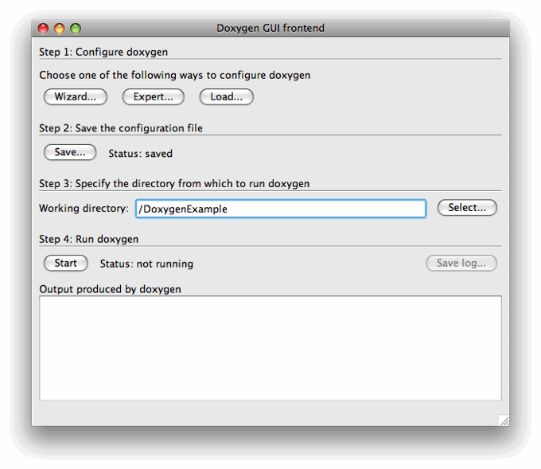
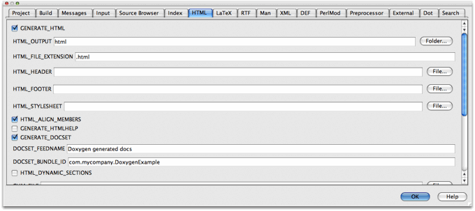
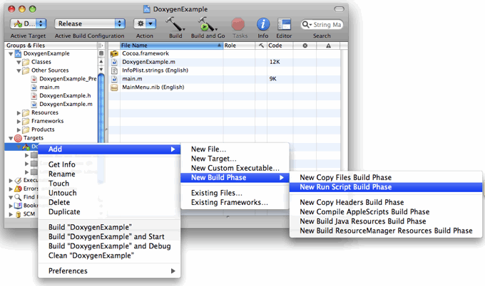
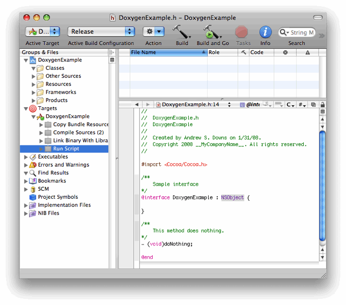
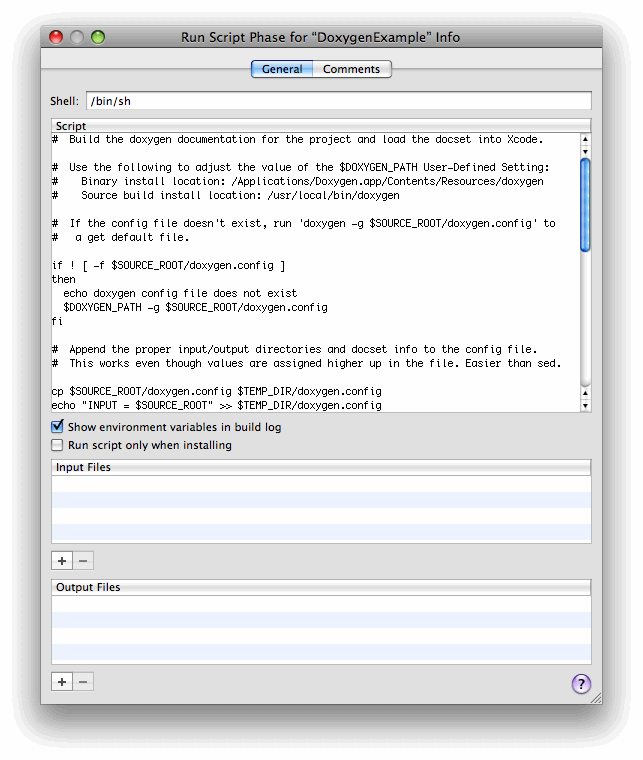
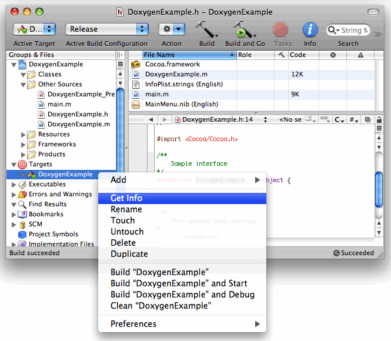
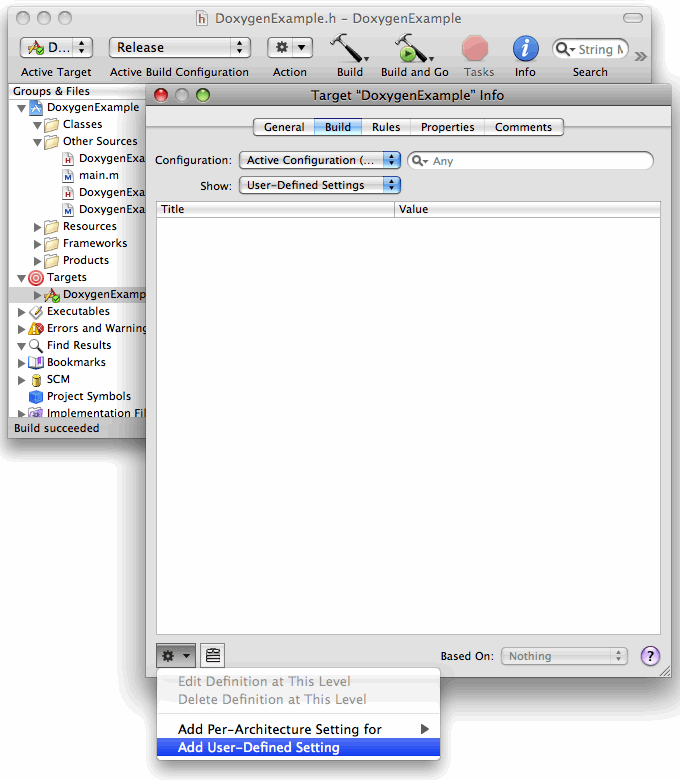
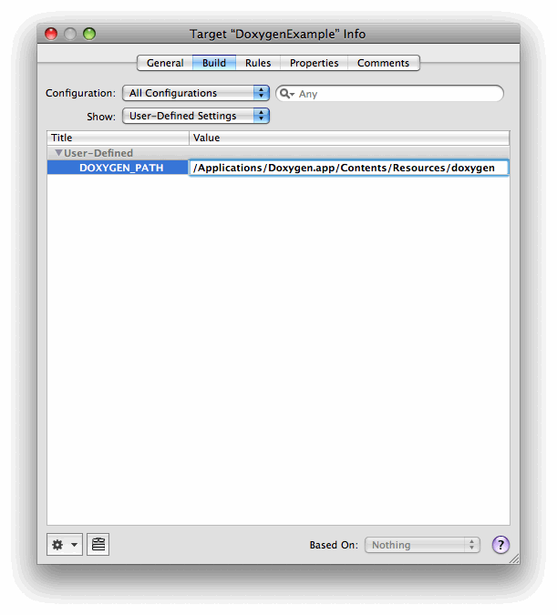
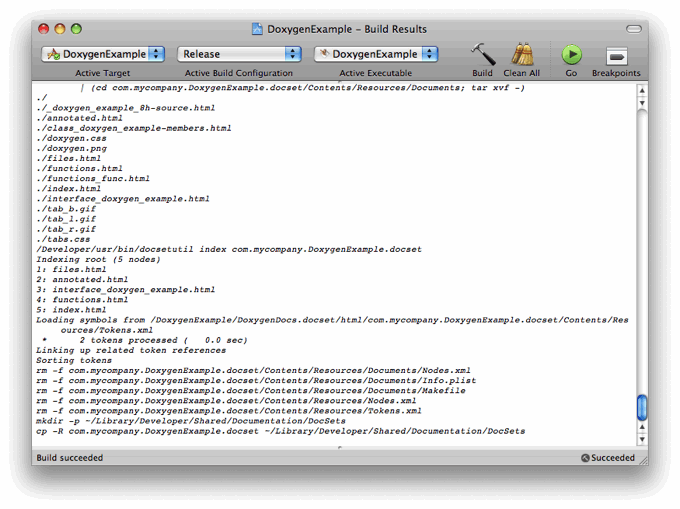
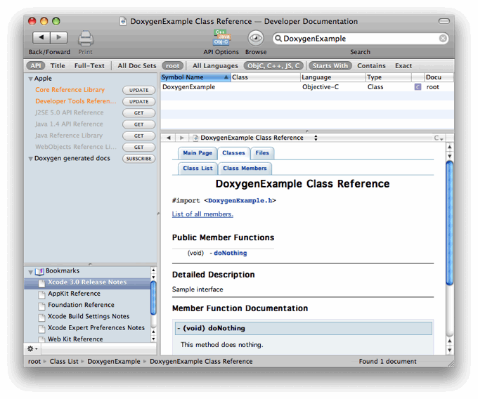

> 导航：[总目录](../../README.md) · [featuredarticles](../../_indexes/featuredarticles.md)


## Using Doxygen to Create Xcode Documentation Sets

Documentation sets (doc sets) provide a convenient way for an Xcode developer to search API and conceptual documentation (including guides, tutorials, TechNotes, and Q&As), sample code, and anything else provided by the doc set creator. Many developers already use Apple-provided doc sets, as shown in Figure 1.

__Figure 1__  Apple Doc Sets in Xcode

!!

In Xcode 3.0, you can integrate doc sets for your own products into the Xcode Documentation window. By providing your documentation as a doc set, users
can take advantage of all the Xcode documentation-viewing features to browse and search for
information in your documents. In addition, the API docs provided in a doc set can be hooked up to the Research Assistant in Xcode. The Research Assistant, shown in Figure 2, follows your selection in the code editor and offers information on documented API and build settings. Clicking on a symbol brings up a summary of the documentation for that symbol and provides links to the complete documentation.

__Figure 2__  Research Assistant in Xcode

!

In this article we show how to generate the documentation, package it as a doc set, and place it in a location known to Xcode. Another option is to publish the doc set as a feed, which is an RSS-based subscription mechanism. An RSS feed is very useful for development teams of all sizes. By subscribing to the RSS feed you easily and automatically receive updates to the doc set, which Xcode will install for you.

Doc sets have a well-defined structure, as outlined in the Documentation Set Guide (see the link at the end of this article.) But the process of getting everything in the right place can be tedious if done by hand. Fortunately there is an easier alternative. Doxygen, the open source documentation generator, allows you to generate doc sets directly from your source code. It handles the HTML generation, packaging, and placement of the doc set, freeing you to focus on content.

### Doxygen

Doxygen generates documentation from source code files. You can use Doxygen to create online and offline reference material in a number of different formats. Doxygen supports many popular programming languages, including C/C++, Objective-C, Java, Python, and others. In this article we use Doxygen to create a HTML doc set from an Xcode Objective-C project. A header file from the project is shown in Listing 1. Remember that the more comments you include, the more documentation Doxygen will produce!

__Listing 1:__ DoxygenExample.h

```objc

//
//  DoxygenExample.h
//  DoxygenExample
//
//  Created on 1/31/08.
//  Copyright 2008 __MyCompanyName__. All rights reserved.
//

#import <Cocoa/Cocoa.h>

/**
  Sample interface
*/
@interface DoxygenExample : NSObject {

}

/**
  This method does nothing.
*/
- (void)doNothing;

@end
```


#### Using the Doxygen GUI

To get started with Doxygen, you first need to download a copy of the application from the web site, which is linked at the end of this article. The Doxygen home page contains a link to the Doxygen application disk image, as well as to the latest source code. The application includes an OS X graphical user interface (GUI) that provides easy access to the command-line features. The GUI is shown in Figure 3.

__Figure 3__  The Doxygen GUI



Conveniently, the GUI lists the steps required to generate documentation. The first step is to configure Doxygen using one of the three available options. The Wizard makes it easy to get started, but you will often want the flexibility offered by Expert mode, while Load allows you to select and use an existing configuration file. Once you have changed any settings, save the configuration file. Click the __Save__ button and select the location and name for your configuration file. Next, specify the directory containing your source code. Finally, click the __Start__ button to generate the documentation.

Now that you have had an introduction to running Doxygen, we turn our attention to creating a doc set.

You can easily generate a doc set using the Doxygen GUI. Figure 4 shows the HTML settings tab in the Expert mode configuration dialog. Many of the default settings are adequate for generating documentation, but you can customize the output in many ways. Make sure the GENERATE_HTML box is checked. In Figure 4, if you look closely you can see the doc set settings. Be sure to check GENERATE_DOCSET. Xcode will display the DOCSET_FEEDNAME value in the documentation window as the name of your doc set, so even if you are not providing an RSS feed, you should fill-in this text field with something meaningful. Use your company and product reverse-DNS name for the DOCSET_BUNDLE_ID.

__Figure 4__  Configuring Doxygen



Next, click the __Start__ button shown in Figure 3. Doxygen will
create the HTML documentation, along with a Makefile. When you run
"make install" on this Makefile, Doxygen will package and install the HTML
as a doc set that can be opened in the Xcode documentation window.

### Generating Doc Sets In Xcode

There is another way to generate a doc set with Doxygen, and that is to create it as part of your project build in Xcode. To accomplish this, you can add a script as a build phase to your Xcode project. In Xcode parlance this is a "Run Script Build Phase". Figure 5 shows the menu selections needed to add this script as a build phase. In Figure 6 the new Run Script phase is highlighted under the target.

__Figure 5__  Add a Run Script Build Phase to an Xcode Project



__Figure 6__  The Run Script Build Phase



Once you add it, double-clicking on the Run Script build phase displays a window in which you can write your script. Paste the script from Listing 2 into the script window. The result should look similar to Figure 7.

__Listing 2:__ Doc Set Build Script

```

#  Build the doxygen documentation for the project and load the docset into Xcode.

#  Use the following to adjust the value of the $DOXYGEN_PATH User-Defined Setting:
#    Binary install location: /Applications/Doxygen.app/Contents/Resources/doxygen
#    Source build install location: /usr/local/bin/doxygen

#  If the config file doesn't exist, run 'doxygen -g $SOURCE_ROOT/doxygen.config' to
#   a get default file.

if ! [ -f $SOURCE_ROOT/doxygen.config ]
then
  echo doxygen config file does not exist
  $DOXYGEN_PATH -g $SOURCE_ROOT/doxygen.config
fi

#  Append the proper input/output directories and docset info to the config file.
#  This works even though values are assigned higher up in the file. Easier than sed.

cp $SOURCE_ROOT/doxygen.config $TEMP_DIR/doxygen.config

echo "INPUT = $SOURCE_ROOT" >> $TEMP_DIR/doxygen.config
echo "OUTPUT_DIRECTORY = $SOURCE_ROOT/DoxygenDocs.docset" >> $TEMP_DIR/doxygen.config
echo "GENERATE_DOCSET        = YES" >> $TEMP_DIR/doxygen.config
echo "DOCSET_BUNDLE_ID       = com.mycompany.DoxygenExample" >> $TEMP_DIR/doxygen.config

#  Run doxygen on the updated config file.
#  Note: doxygen creates a Makefile that does most of the heavy lifting.

$DOXYGEN_PATH $TEMP_DIR/doxygen.config

#  make will invoke docsetutil. Take a look at the Makefile to see how this is done.

make -C $SOURCE_ROOT/DoxygenDocs.docset/html install

#  Construct a temporary applescript file to tell Xcode to load a docset.

rm -f $TEMP_DIR/loadDocSet.scpt

echo "tell application \"Xcode\"" >> $TEMP_DIR/loadDocSet.scpt
echo "load documentation set with path \"/Users/$USER/Library/Developer/Shared/Documentation/DocSets/\""
     >> $TEMP_DIR/loadDocSet.scpt
echo "end tell" >> $TEMP_DIR/loadDocSet.scpt

#  Run the load-docset applescript command.

osascript $TEMP_DIR/loadDocSet.scpt

exit 0
```


__Figure 7__  Type or Paste the Script into the Script Phase Window



You may have noticed that the script uses a variable that specifies the path to the Doxygen executable. This is necessary because the Doxygen binary, as installed from the disk image, installs in a different location than if you build from source. The respective paths are listed at the top of the script.

Figure 8 illustrates the __Get Info__ command, which displays the target information.

__Figure 8__  Display the Target Info Window



In the Build pane, the User-Defined Settings menu lets you assign a value to an environment variable. This value can be used to control the build. Figure 9 shows how to add a setting.

__Figure 9__  Add a User-Defined Setting



In Figure 10, set the value for the path to the Doxygen binary.

__Figure 10__  Set the Doxygen Path



Now build the Xcode project. When the Run Script phase executes, it should generate the doc set. If all goes well you will see build results similar to Figure 11.

__Figure 11__  The Build Results Window



Doxygen is highly configurable, but we only changed a few settings to generate a doc set that Xcode can open and search. You can reuse the script in Listing 2 with minor modifications in other Xcode projects. Here are some important points regarding the script:

- The first step in using Doxygen to generate a doc set is to create the Doxygen configuration file. This tells Doxygen what output to generate, where to put it, and so on. The script uses the `doxygen -g` command to generate a default configuration file.
- Some of the default settings in the configuration file need to be changed in order to generate a doc set. The script simply appends the new settings to the file. This approach works, but the result may be aesthetically unappealing. Using `sed` would be cleaner, but requires more code, and no one will probably look at the configuration file anyway.
- The script creates a temporary AppleScript that instructs Xcode to open the new doc set. After Xcode loads the doc set, you can search for your class, interface, or method names, as shown in Figure 12.

__Figure 12__  Updated Doc Set



Doxygen is highly configurable and can generate output in several formats. This example only generated HTML output, but you should look at the generated configuration and Makefiles to get an idea of other options. And even though everything you need to build a doc set is included in the current version of Doxygen, you may wish to experiment with the latest Doxygen source code, which is available on Sourceforge. The Doxygen web site has additional information, including download, build and installation instructions.

### For More Information

Using the techniques discussed in this article, you
can use Doxygen to create your own documentation sets for use in Xcode.
The Apple Developer Reference Library documents
listed below will help you find more specific information.

