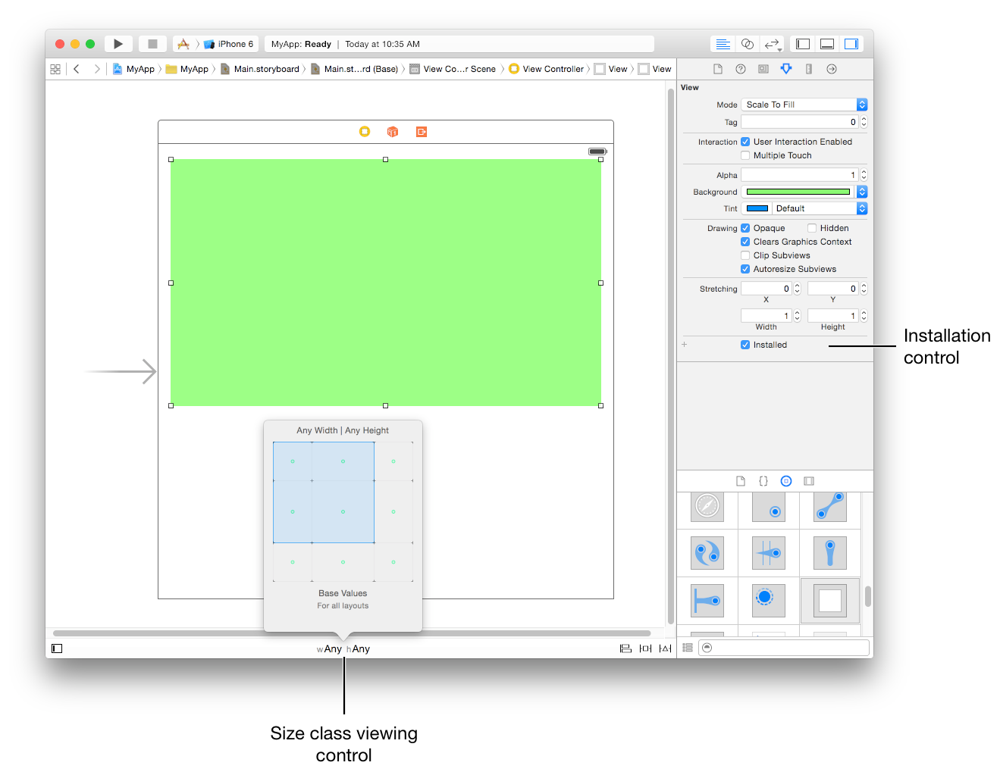
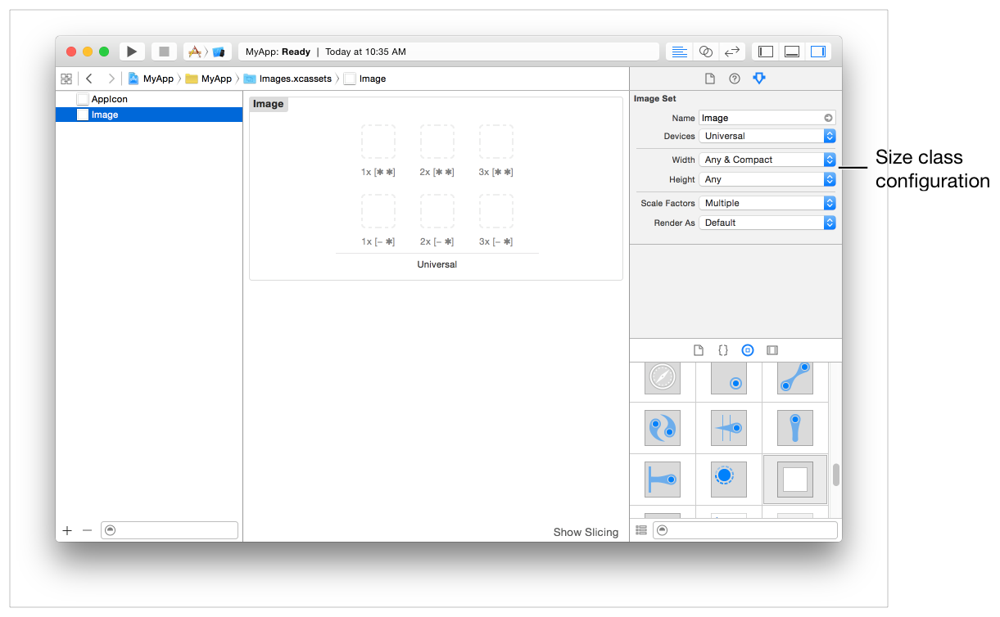
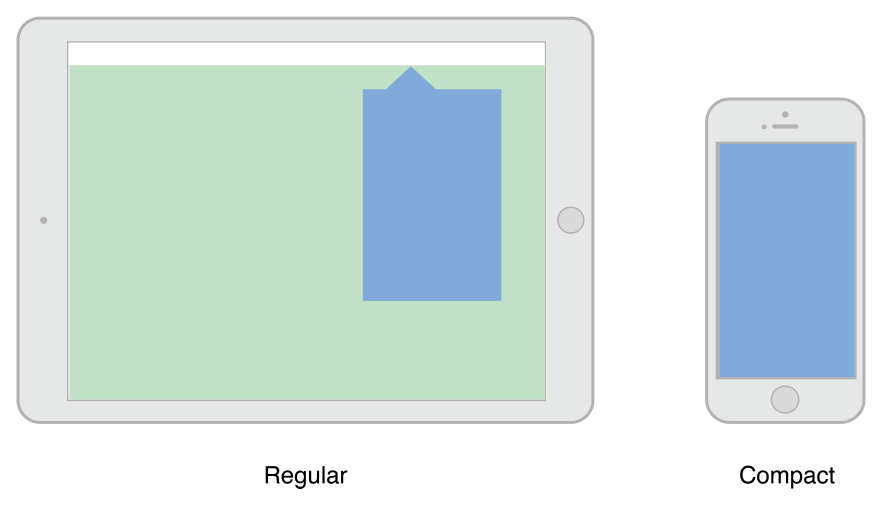
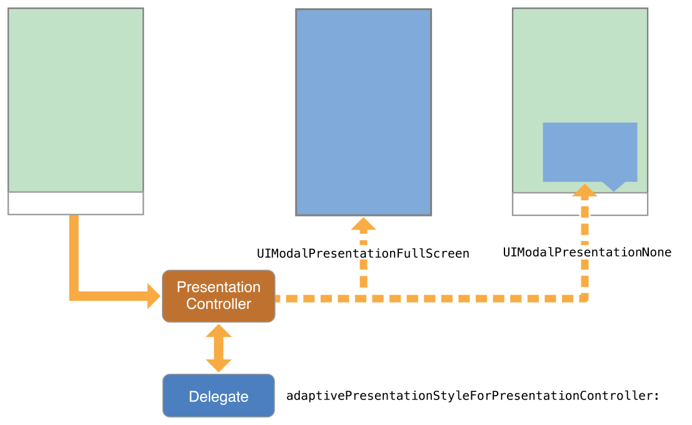

> 导航：[总目录](../../README.md) · [featuredarticles](../../_indexes/featuredarticles.md) · [View Controller Programming Guide for iOS](index.md)

## Building an Adaptive Interface

An adaptive interface should respond to both trait and size changes. At the view controller level, you use traits to make coarse-level determinations about the content you display and the layout of that content. For example, when changing between size classes, you might choose to change view attributes, show or hide views, or display an entirely different set of views. After those big decisions are made, you use size changes to fine-tune your content.

### Adapting to Trait Changes

Traits give you a way to configure your app differently for different environments, and you use them to make coarse adjustments to your interface. Most of the changes you make with traits can be done directly in your storyboard files, but some require additional code.

### Configuring Your Storyboard to Handle Different Size Classes

Interface Builder makes it easy to adapt your interface to different size classes. The storyboard editor includes support for displaying your interface in different size class configurations, for removing views in specific configurations, and for specifying different layout constraints. You can also create image assets that deliver different images for different size classes. Using these tools means that you do not have to make the same changes programmatically at runtime. Instead, UIKit automatically updates your interface when the current size class changes.

Figure 13-1 shows the tools you use to configure your interface in Interface Builder. The size class viewing control changes the appearance of your interface. Use that control to see how your interface will look for a given size class. For individual views, use the installation control to configure whether the view is present for a given size class configuration. Use the plus (+) button to the left of the checkbox to add new configurations.

__Figure 13-1__Customizing your interface for different size classes

> [!NOTE]
> 

Image assets are the preferred way to store your app’s image resources. Each image asset contains multiple versions of the same image, with each version designed for a specific configuration. In addition to specifying different images for standard and Retina displays, you can specify different images for different horizontal and vertical size classes. When configured with an image asset, a [UIImageView](https://developer.apple.com/documentation/uikit/uiimageview) object automatically selects the image associated with the current size classes and resolution.

Figure 13-2 shows the image asset attributes. Changing the width and height attributes adds slots for more images in the catalog. Fill those slots with the images to use for each size class combination.

__Figure 13-2__Configuring image assets for different size classes

### Changing the Traits of a Child View Controller

Child view controllers inherit the traits of their parent view controller by default. For traits like size classes, it may not make sense for each child to have the same traits as its parent. For example, a view controller in a regular environment might want to assign a compact size class to one or more of its children to reflect a diminished amount of space for that child. When implementing a container view controller, you modify the traits of the child by calling the [setOverrideTraitCollection:forChildViewController:](https://developer.apple.com/documentation/uikit/uiviewcontroller/1621406-setoverridetraitcollection) method of the container view controller.

Listing 13-1 shows how you create a new set of traits and associate them with a child view controller. You execute this code from your parent view controller and only need to do so once. Overridden traits remain with the child until you change them again or until you remove the child from your view controller hierarchy.

__Listing 13-1__Changing the traits of a child view controller

1. `UITraitCollection* horizTrait = [UITraitCollection`
2. `traitCollectionWithHorizontalSizeClass:UIUserInterfaceSizeClassRegular];`
3. `UITraitCollection* vertTrait = [UITraitCollection`
4. `traitCollectionWithVerticalSizeClass:UIUserInterfaceSizeClassCompact];`
5. `UITraitCollection* childTraits = [UITraitCollection`
6. `traitCollectionWithTraitsFromCollections:@[horizTrait, vertTrait]];`
8. `[self setOverrideTraitCollection:childTraits forChildViewController:self.childViewControllers[0]];`

When the traits of the parent view controller change, children inherit any traits that are not explicitly overridden by the parent. For example, when the parent’s horizontal size class changes from regular to compact, the child in the preceding example retains its regular horizontal size class. However, if the [displayScale](https://developer.apple.com/documentation/uikit/uitraitcollection/1623519-displayscale) trait changes, the child inherits the new value.

### Adapting Presented View Controllers to a New Style

Presented view controllers adapt automatically between horizontally regular and compact environments. When transitioning from a horizontally regular to a horizontally compact environment, UIKit changes the built-in presentation styles to [UIModalPresentationFullScreen](https://developer.apple.com/documentation/uikit/uimodalpresentationstyle/fullscreen) by default. For custom presentation styles, your presentation controller can determine the adaptation behavior and adjust the presentation accordingly.

For some apps, adapting to a full-screen style may present problems. For example, a popover is normally dismissed by tapping outside its bounds, but doing so is not possible in a compact environment where the popover covers the entire screen, as shown in Figure 13-3. When the default adaptation style is not appropriate, you can tell UIKit to use a different style or present an entirely different view controller that is better suited to the full-screen style.

__Figure 13-3__A popover in regular and compact environments

To change the default adaptive behavior for a presentation style, assign a [delegate](https://developer.apple.com/documentation/uikit/uipresentationcontroller/1618329-delegate) to the associated presentation controller. You access the presentation controller using the presented view controller’s [presentationController](https://developer.apple.com/documentation/uikit/uiviewcontroller/1621426-presentationcontroller) property. The presentation controller consults your delegate object before making any adaptivity-related changes. The delegate can return a different presentation style than the default and it can provide the presentation controller with an alternate view controller to display.

Use the delegate’s [adaptivePresentationStyleForPresentationController:](https://developer.apple.com/documentation/uikit/uiadaptivepresentationcontrollerdelegate/1618343-adaptivepresentationstyleforpres) method to specify a different presentation style than the default. When transitioning to a compact environment, the only supported styles are the two full-screen styles or [UIModalPresentationNone](https://developer.apple.com/documentation/uikit/uimodalpresentationstyle/none). Returning `UIModalPresentationNone` tells the presentation controller to ignore the compact environment and continue using the previous presentation style. In the case of a popover, ignoring the change gives you the same iPad-like popover behavior on all devices. Figure 13-4 shows the default full-screen adaption and no adaptation side by side so that you can compare the resulting presentations.

__Figure 13-4__Changing the adaptive behavior for a presented view controller

To replace the view controller altogether, implement the delegate’s [presentationController:viewControllerForAdaptivePresentationStyle:](https://developer.apple.com/documentation/uikit/uiadaptivepresentationcontrollerdelegate/1618326-presentationcontroller) method. When adapting to a compact environment, you might use that method to insert a navigation controller into your view hierarchy or load a view controller that was specifically designed for the smaller space.

### Tips for Implementing Adaptive Popovers

Popovers require additional modifications when changing from horizontally regular to horizontally compact. The default behavior for horizontally compact popovers it to change to a full-screen presentation. Because popovers are usually dismissed by tapping outside the bounds of the popover, changing to a full-screen presentation eliminates the main technique for dismissing the popover. You can compensate for that behavior by doing one of the following:

- __Push the popover’s view controller onto an existing navigation stack.__ When there is a parent navigation controller available, dismiss the popover and push its view controller onto the navigation stack.
- __Add controls to dismiss the popover when it is presented full-screen.__ You can add controls to the popover’s view controller, but a better option is to swap out the popover for a navigation controller using the [presentationController:viewControllerForAdaptivePresentationStyle:](https://developer.apple.com/documentation/uikit/uiadaptivepresentationcontrollerdelegate/1618326-presentationcontroller) method. Using a navigation controller gives you a modal interface and space to add a Done button or other controls to dismiss the content.
- __Use a presentation controller delegate to eliminate any adaptivity changes.__ Get the popover presentation controller and assign a delegate to it that implements the [adaptivePresentationStyleForPresentationController:](https://developer.apple.com/documentation/uikit/uiadaptivepresentationcontrollerdelegate/1618343-adaptivepresentationstyleforpres) method. Returning [UIModalPresentationNone](https://developer.apple.com/documentation/uikit/uimodalpresentationstyle/none) from that method causes the popover to continue to be displayed as a popover. For more information, see [Adapting Presented View Controllers to a New Style](#apple-f4xwc4dqnrsv64tfmyxwi33df52wszbpkridimbqga3tinjxfvbuqmzsfvjvonq).

### Responding to Size Changes

Size changes can occur for many reasons, including the following:

- The dimensions of the underlying window change, usually because of an orientation change.
- A parent view controller resizes one of its children.
- A presentation controller changes the size of its presented view controller.

When size changes happen, UIKit automatically updates the size and position of the visible view controller hierarchies through the normal layout process. If you specified the size and position of your views using Auto Layout constraints, your app adapts automatically to any size changes and should run on devices with different screen sizes.

If your Auto Layout constraints are insufficient to achieve the look you want, you can use the [viewWillTransitionToSize:withTransitionCoordinator:](https://developer.apple.com/documentation/uikit/uicontentcontainer/1621466-viewwilltransitiontosize) method to make changes to your layout. You can also use that method to create additional animations to run alongside the size-change animations. For example, during an interface rotation, you might use the transition coordinator’s [targetTransform](https://developer.apple.com/documentation/uikit/uiviewcontrollertransitioncoordinatorcontext/1619289-targettransform) property to to create a counter-rotation matrix for parts of your interface.

[The Adaptive Model](TheAdaptiveModel.md#apple-f4xwc4dqnrsv64tfmyxwi33df52wszbpkridimbqga3tinjxfvbuqmjzfvjvomi)
