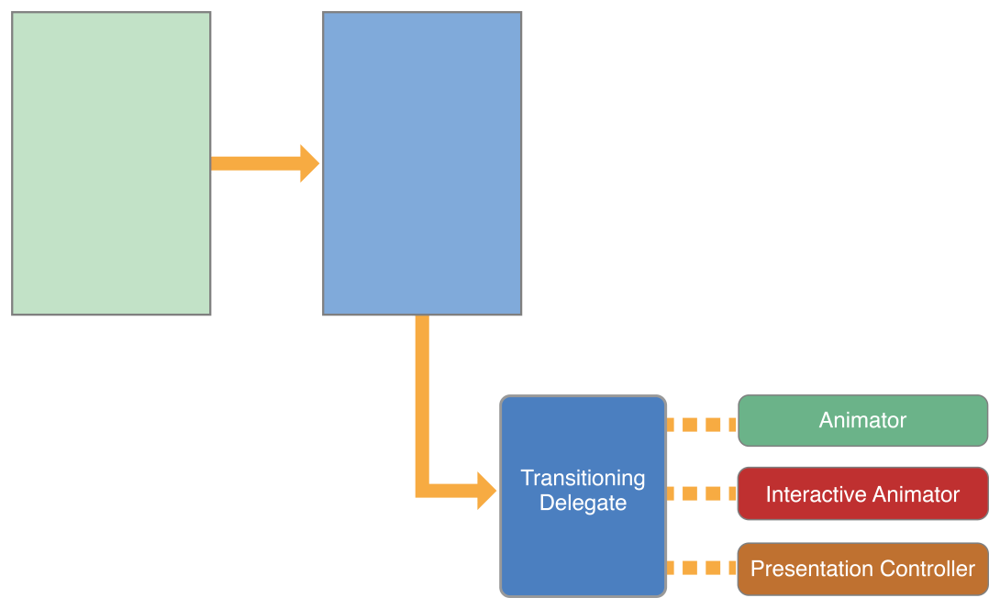
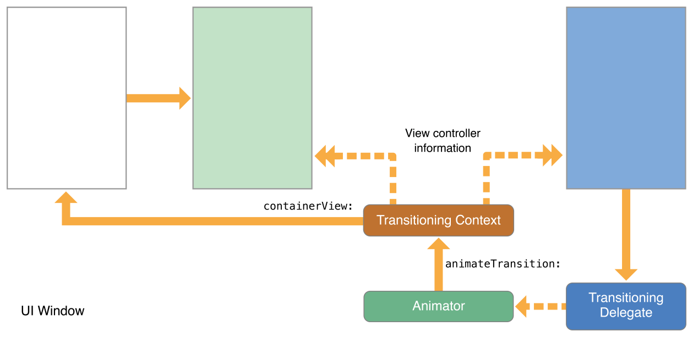
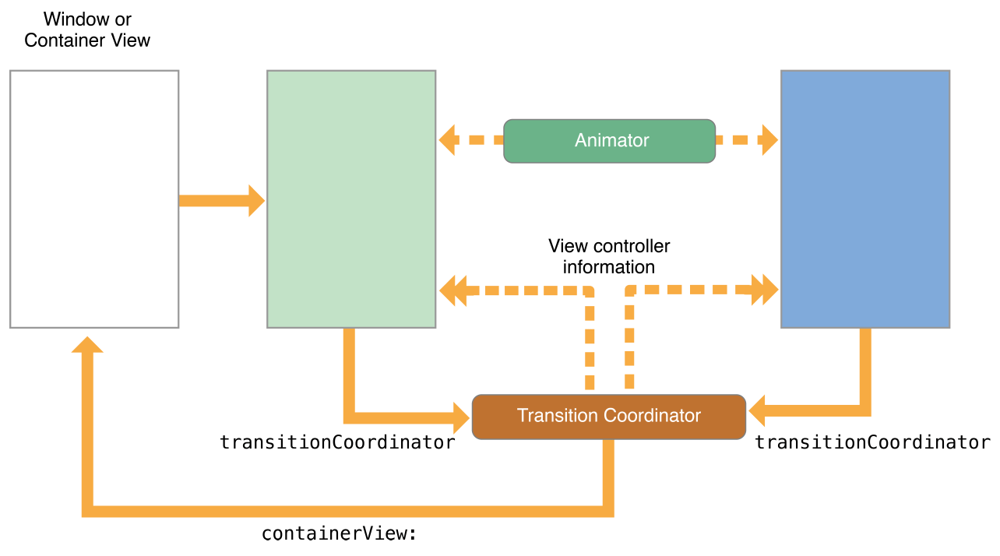
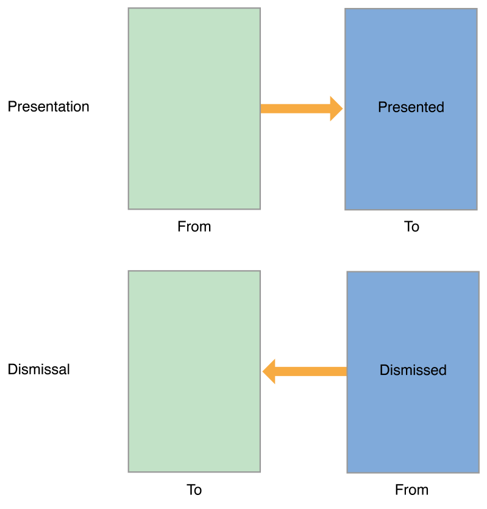
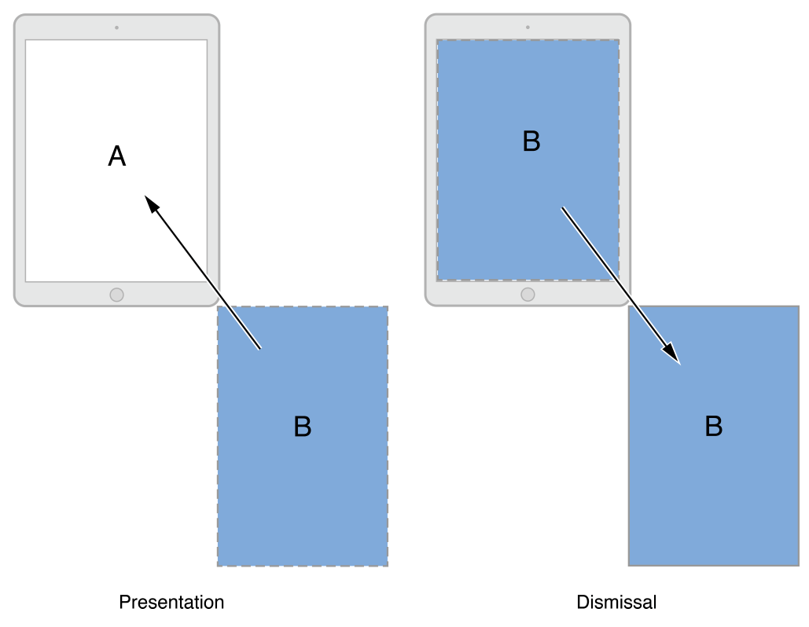

> 导航：[总目录](../../README.md) · [featuredarticles](../../_indexes/featuredarticles.md) · [View Controller Programming Guide for iOS](index.md)

## Customizing the Transition Animations

Transition animations provide visual feedback about changes to your app’s interface. UIKit provides a set of standard transition styles to use when presenting view controllers, and you can supplement the standard transitions with custom transitions of your own.

### The Transition Animation Sequence

A transition animation swaps the contents of one view controller for the contents of another. There are two types of transitions: presentations and dismissals. A presentation transition adds a new view controller to your app’s view controller hierarchy, whereas a dismissal transition removes one or more view controllers from the hierarchy.

It takes many objects to implement a transition animation. UIKit provides default versions of all of the objects involved in transitions, and you can customize all of them or only a subset. If you choose the right set of objects, you should be able to create your animations with only a small amount of code. Even animations that include interactions can be implemented easily if you take advantage of the existing code that UIKit provides.

### The Transitioning Delegate

The transitioning delegate is the starting point for transition animations and custom presentations. The transitioning delegate is an object that you define and that conforms to the [UIViewControllerTransitioningDelegate](https://developer.apple.com/documentation/uikit/uiviewcontrollertransitioningdelegate) protocol. Its job is to provide UIKit with the following objects:

- __Animator objects.__ An animator object is responsible for creating the animations used to reveal or hide a view controller’s view. The transitioning delegate can supply separate animator objects for presenting and dismissing the view controller. Animator objects conform to the [UIViewControllerAnimatedTransitioning](https://developer.apple.com/documentation/uikit/uiviewcontrolleranimatedtransitioning) protocol.
- __Interactive animator objects.__ An interactive animator object drives the timing of custom animations using touch events or gesture recognizers. Interactive animator objects conform to the [UIViewControllerInteractiveTransitioning](https://developer.apple.com/documentation/uikit/uiviewcontrollerinteractivetransitioning) protocol.

  The easiest way to create an interactive animator is to subclass [UIPercentDrivenInteractiveTransition](https://developer.apple.com/documentation/uikit/uipercentdriveninteractivetransition) class and add event-handling code to your subclass. That class controls the timing of animations created using your existing animator objects. If you create your own interactive animator, you must render each frame of the animation yourself.
- __Presentation controller.__ A presentation controller manages the presentation style while the view controller is onscreen. The system provides presentation controllers for the built-in presentation styles and you can provide custom presentation controllers for your own presentation styles. For more information about creating a custom presentation controller, see [Creating Custom Presentations](DefiningCustomPresentations.md#apple-f4xwc4dqnrsv64tfmyxwi33df52wszbpkridimbqga3tinjxfvbuqmrvfvjvomi).

Assigning a transitioning delegate to the [transitioningDelegate](https://developer.apple.com/documentation/uikit/uiviewcontroller/1621421-transitioningdelegate) property of a view controller tells UIKit that you want to perform a custom transition or presentation. Your delegate can be selective about which objects it provides. If you do not provide animator objects, UIKit uses the standard transition animation in the view controller’s [modalTransitionStyle](https://developer.apple.com/documentation/uikit/uiviewcontroller/1621388-modaltransitionstyle) property.

Figure 10-1 shows the relationship of the transitioning delegate and animator objects to the presented view controller. The presentation controller is used only when the view controller’s [modalPresentationStyle](https://developer.apple.com/documentation/uikit/uiviewcontroller/1621355-modalpresentationstyle) property is set to [UIModalPresentationCustom](https://developer.apple.com/documentation/uikit/uimodalpresentationstyle/custom)

__Figure 10-1__The custom presentation and animator objects

For information about how to implement your transitioning delegate, see [Implementing the Transitioning Delegate](#apple-f4xwc4dqnrsv64tfmyxwi33df52wszbpkridimbqga3tinjxfvbuqmjwfvjvomjv). For more information about the methods of the transitioning delegate object, see _[UIViewControllerTransitioningDelegate Protocol Reference](https://developer.apple.com/documentation/uikit/uiviewcontrollertransitioningdelegate)_.

### The Custom Animation Sequence

When the [transitioningDelegate](https://developer.apple.com/documentation/uikit/uiviewcontroller/1621421-transitioningdelegate) property of a presented view controller contains a valid object, UIKit presents that view controller using the custom animator objects you provide. As it prepares a presentation, UIKit calls the [animationControllerForPresentedController:presentingController:sourceController:](https://developer.apple.com/documentation/uikit/uiviewcontrollertransitioningdelegate/1622037-animationcontroller) method of your transitioning delegate to retrieve the custom animator object. If an object is available, UIKit performs the following steps:

1. UIKit calls the transitioning delegate’s [interactionControllerForPresentation:](https://developer.apple.com/documentation/uikit/uiviewcontrollertransitioningdelegate/1622050-interactioncontrollerforpresenta) method to see if an interactive animator object is available. If that method returns `nil`, UIKit performs the animations without user interactions.
2. UIKit calls the [transitionDuration:](https://developer.apple.com/documentation/uikit/uiviewcontrolleranimatedtransitioning/1622032-transitionduration) method of the animator object to get the animation duration.
3. UIKit calls the appropriate method to start the animations:

   - For non-interactive animations, UIKit calls the [animateTransition:](https://developer.apple.com/documentation/uikit/uiviewcontrolleranimatedtransitioning/1622061-animatetransition) method of the animator object.
   - For interactive animations, UIKit calls the [startInteractiveTransition:](https://developer.apple.com/documentation/uikit/uiviewcontrollerinteractivetransitioning/1622028-startinteractivetransition) method of the interactive animator object.
4. UIKit waits for an animator object to call the [completeTransition:](https://developer.apple.com/documentation/uikit/uiviewcontrollercontexttransitioning/1622042-completetransition) method of the context transitioning object.

   Your custom animator calls this method after its animations finish, typically in the animation’s completion block. Calling this method ends the transition and lets UIKit know that it can call the completion handler of the [presentViewController:animated:completion:](https://developer.apple.com/documentation/uikit/uiviewcontroller/1621380-presentviewcontroller) method and call the animator object’s own [animationEnded:](https://developer.apple.com/documentation/uikit/uiviewcontrolleranimatedtransitioning/1622059-animationended) method.

When dismissing a view controller, UIKit calls the [animationControllerForDismissedController:](https://developer.apple.com/documentation/uikit/uiviewcontrollertransitioningdelegate/1622047-animationcontroller) method of your transitioning delegate and performs the following steps:

1. UIKit calls the transitioning delegate’s [interactionControllerForDismissal:](https://developer.apple.com/documentation/uikit/uiviewcontrollertransitioningdelegate/1622030-interactioncontrollerfordismissa) method to see if an interactive animator object is available. If that method returns `nil`, UIKit performs the animations without user interactions.
2. UIKit calls the [transitionDuration:](https://developer.apple.com/documentation/uikit/uiviewcontrolleranimatedtransitioning/1622032-transitionduration) method of the animator object to get the animation duration.
3. UIKit calls the appropriate method to start the animations:

   - For non-interactive animations, UIKit calls the [animateTransition:](https://developer.apple.com/documentation/uikit/uiviewcontrolleranimatedtransitioning/1622061-animatetransition) method of the animator object.
   - For interactive animations, UIKit calls the [startInteractiveTransition:](https://developer.apple.com/documentation/uikit/uiviewcontrollerinteractivetransitioning/1622028-startinteractivetransition) method of the interactive animator object.
4. UIKit waits for an animator object to call the [completeTransition:](https://developer.apple.com/documentation/uikit/uiviewcontrollercontexttransitioning/1622042-completetransition) method of the context transitioning object.

   Your custom animator calls this method after its animation finishes, typically in the animation’s completion block. Calling this method ends the transition and lets UIKit know that it can call the completion handler of the [presentViewController:animated:completion:](https://developer.apple.com/documentation/uikit/uiviewcontroller/1621380-presentviewcontroller) method and call the animator object’s own [animationEnded:](https://developer.apple.com/documentation/uikit/uiviewcontrolleranimatedtransitioning/1622059-animationended) method.

> [!IMPORTANT]
> 

### The Transitioning Context Object

Before a transition animation begins, UIKit creates a transitioning context object and fills it with information about how to perform the animations. The transitioning context object is an important part for your code. It implements the [UIViewControllerContextTransitioning](https://developer.apple.com/documentation/uikit/uiviewcontrollercontexttransitioning) protocol and stores references to the view controllers and views involved in the transition. It also stores information about how you should perform the transition, including whether the animation is interactive. Your animator objects need all of this information to set up and execute the actual animations.

> [!IMPORTANT]
> 

Figure 10-2 shows how the transition context object interacts with other objects. Your animator object receives the object in its [animateTransition:](https://developer.apple.com/documentation/uikit/uiviewcontrolleranimatedtransitioning/1622061-animatetransition) method. The animations you create should take place inside the provided container view. For example, when presenting a view controller, add its view as a subview of the container view. The container view might be the window or a regular view but it is always configured to run your animations.

__Figure 10-2__The transitioning context object

For more information about the transitioning context object, see _[UIViewControllerContextTransitioning Protocol Reference](https://developer.apple.com/documentation/uikit/uiviewcontrollercontexttransitioning)_.

### The Transition Coordinator

For both the built-in transitions and your custom transitions, UIKit creates a transition coordinator object to facilitate any extra animations that you might need to perform. Aside from the presentation and dismissal of a view controller, transitions can occur when an interface rotation occurs or when the frame of a view controller changes. All of these transitions represent changes to the view hierarchy. The transition coordinator is a way to track those changes and animate your own content at the same time. To access the transition coordinator, get the object in the [transitionCoordinator](https://developer.apple.com/documentation/uikit/uiviewcontroller/1619294-transitioncoordinator) property of the affected view controller. A transition coordinator exists only for the duration of the transition.

Figure 10-3 shows the relationship of the transition coordinator to the view controllers involved in a presentation. Use the transition coordinator to get information about the transition and to register animation blocks that you want performed at the same time as the transition animations. Transition coordinator objects conform to the [UIViewControllerTransitionCoordinatorContext](https://developer.apple.com/documentation/uikit/uiviewcontrollertransitioncoordinatorcontext) protocol, which provides timing information, information about the animation’s current state, and the views and view controllers involved in the transition. When your animation blocks are executed, they similarly receive a context object with the same information.

__Figure 10-3__The transition coordinator objects

For more information about the transition coordinator object, see _[UIViewControllerTransitionCoordinator Protocol Reference](https://developer.apple.com/documentation/uikit/uiviewcontrollertransitioncoordinator)_. For information about the contextual information that you can use to configure your animations, see _[UIViewControllerTransitionCoordinatorContext Protocol Reference](https://developer.apple.com/documentation/uikit/uiviewcontrollertransitioncoordinatorcontext)_.

### Presenting a View Controller Using Custom Animations

To present a view controller using custom animations, do the following in an action method of your existing view controllers:

1. Create the view controller that you want to present.
2. Create your custom transitioning delegate object and assign it to the view controller’s [transitioningDelegate](https://developer.apple.com/documentation/uikit/uiviewcontroller/1621421-transitioningdelegate) property. The methods of your transitioning delegate should create and return your custom animator objects when asked.
3. Call the [presentViewController:animated:completion:](https://developer.apple.com/documentation/uikit/uiviewcontroller/1621380-presentviewcontroller) method to present the view controller.

When you call the `presentViewController:animated:completion:` method, UIKit initiates the presentation process. Presentations start during the next run loop iteration and continue until your custom animator calls the [completeTransition:](https://developer.apple.com/documentation/uikit/uiviewcontrollercontexttransitioning/1622042-completetransition) method. Interactive transitions allow you to process touch events while the transition is ongoing, but noninteractive transitions run for the duration specified by the animator object.

### Implementing the Transitioning Delegate

The purpose of the transitioning delegate is to create and return your custom objects. Listing 10-1 shows how simple the implementation of your transitioning methods can be. This example creates and returns a custom animator object. Most of the actual work is handled by the animator object itself.

__Listing 10-1__Creating an animator object

1. `- (id<UIViewControllerAnimatedTransitioning>)`
2. `animationControllerForPresentedController:(UIViewController *)presented`
3. `presentingController:(UIViewController *)presenting`
4. `sourceController:(UIViewController *)source {`
5. `MyAnimator* animator = [[MyAnimator alloc] init];`
6. `return animator;`
7. `}`

The other methods of your transitioning delegate can be as simple as the one in the preceding listing. You can also incorporate custom logic to return different animator objects based on the current state of your app. For more information about the methods of the transitioning delegate, see _[UIViewControllerTransitioningDelegate Protocol Reference](https://developer.apple.com/documentation/uikit/uiviewcontrollertransitioningdelegate)_.

### Implementing Your Animator Objects

An animator object is any object that adopts the [UIViewControllerAnimatedTransitioning](https://developer.apple.com/documentation/uikit/uiviewcontrolleranimatedtransitioning) protocol. An animator object creates animations that execute over a fixed period of time. The key to an animator object is its [animateTransition:](https://developer.apple.com/documentation/uikit/uiviewcontrolleranimatedtransitioning/1622061-animatetransition) method, which you use to create the actual animations. The animation process is roughly divided into the following segments:

1. Getting the animation parameters.
2. Creating the animations using Core Animation or [UIView](https://developer.apple.com/documentation/uikit/uiview) animation methods.
3. Cleaning up and completing the transition.

### Getting the Animation Parameters

The context transitioning object passed to your `animateTransition:` method contains the data to use when performing your animations. Never use your own cached information or fetch information from your view controllers when you can get more up-to-date information from the context transitioning object. Presenting and dismissing view controllers sometimes involves objects outside of your view controllers. For example, a custom presentation controller might add a background view as part of a presentation. The context transitioning object takes extra views and objects into account and provides you with the correct views to animate.

- Call the [viewControllerForKey:](https://developer.apple.com/documentation/uikit/uiviewcontrollercontexttransitioning/1622043-viewcontrollerforkey) method twice to get the "from” and “to” view controller’s involved in the transition. Never assume that you know which view controllers are taking part in a transition. UIKit might change the view controllers while adapting to a new trait environment or in response to a request from your app.
- Call the [containerView](https://developer.apple.com/documentation/uikit/uiviewcontrollercontexttransitioning/1622045-containerview) method to get the superview for the animations. Add all key subviews to this view. For example, during a presentation, add the presented view controller’s view to this view.
- Call the [viewForKey:](https://developer.apple.com/documentation/uikit/uiviewcontrollercontexttransitioning/1622055-view) method to get the view to be added or removed. A view controller’s view might not be the only one added or removed during a transition. A presentation controller might insert views into the hierarchy that must also be added or removed. The `viewForKey:` method returns the root view that contains everything you need to add or remove.
- Call the [finalFrameForViewController:](https://developer.apple.com/documentation/uikit/uiviewcontrollercontexttransitioning/1622024-finalframe) method to get the final frame rectangle for the view being added or removed.

The context transitioning object uses “from” and “to” nomenclature to identify the view controllers, views, and frame rectangles involved in a transition. The “from” view controller is always the one whose view is onscreen at the beginning of the transition, and the “to” view controller is the one whose view will be visible at the end of the transition. As you can see in Figure 10-4 , the “from” and “to” view controllers swap positions between a presentation and a dismissal.

__Figure 10-4__The from and to objects

Swapping the values makes it easier to write a single animator that handles both presentations and dismissals. When you design your animator, all you have to do is include a property to know whether it is animating a presentation or dismissal. The only required difference between the two is the following:

- For a presentation, add the “to” view to the container view hierarchy.
- For a dismissal, remove the “from” view from the container view hierarchy.

### Creating the Transition Animations

During a typical presentation, the view belonging to the presented view controller is animated into place. Other views may be animated as part of your presentation, but the main target of your animations is always the view being added to the view hierarchy.

When animating the main view, the basic actions you take to configure your animations are the same. You fetch the objects and data you need from the transitioning context object and use that information to create your actual animations.

- Presentation animations:

  1. Use the [viewControllerForKey:](https://developer.apple.com/documentation/uikit/uiviewcontrollercontexttransitioning/1622043-viewcontrollerforkey) and [viewForKey:](https://developer.apple.com/documentation/uikit/uiviewcontrollercontexttransitioning/1622055-view) methods to retrieve the view controllers and views involved in the transition.
  2. Set the starting position of the “to” view. Set any other properties to their starting values as well.
  3. Get the end position of the “to” view from the [finalFrameForViewController:](https://developer.apple.com/documentation/uikit/uiviewcontrollercontexttransitioning/1622024-finalframe) method of the context transitioning context.
  4. Add the “to” view as a subview of the container view.
  5. Create the animations.

     - In your animation block, animate the “to” view to its final location in the container view. Set any other properties to their final values as well.
     - In the completion block, call the [completeTransition:](https://developer.apple.com/documentation/uikit/uiviewcontrollercontexttransitioning/1622042-completetransition) method, and perform any other cleanup.
- Dismissal animations:

  1. Use the [viewControllerForKey:](https://developer.apple.com/documentation/uikit/uiviewcontrollercontexttransitioning/1622043-viewcontrollerforkey) and [viewForKey:](https://developer.apple.com/documentation/uikit/uiviewcontrollercontexttransitioning/1622055-view) methods to retrieve the view controllers and views involved in the transition.
  2. Compute the end position of the “from” view. This view belongs to the presented view controller that is now being dismissed.
  3. Add the “to” view as a subview of the container view.

     During a presentation, the view belonging to the presenting view controller is removed when the transition completes. As a result, you must add that view back to the container during a dismissal operation.
  4. Create the animations.

     - In your animation block, animate the “from” view to its final location in the container view. Set any other properties to their final values as well.
     - In the completion block, remove the “from” view from your view hierarchy and call the [completeTransition:](https://developer.apple.com/documentation/uikit/uiviewcontrollercontexttransitioning/1622042-completetransition) method. Perform any other cleanup as needed.

Figure 10-5 shows a custom presentation and dismissal transition that animates its view diagonally. During a presentation, the presented view starts offscreen and animates diagonally up and to the left until it is visible. During a dismissal, the view reverses its direction and animates down and to the right until it is offscreen once again.

__Figure 10-5__A custom presentation and dismissal

Listing 10-2 shows how you would implement the transitions shown in [Figure 10-5](#apple-f4xwc4dqnrsv64tfmyxwi33df52wszbpkridimbqga3tinjxfvbuqmjwfvjvomrs). After retrieving the objects needed for the animation, the [animateTransition:](https://developer.apple.com/documentation/uikit/uiviewcontrolleranimatedtransitioning/1622061-animatetransition) method computes the frame rectangle of the affected view. During a presentation, the presented view is represented by the `toView` variable. In a dismissal, the dismissed view is represented by the `fromView` variable. The `presenting` property is a custom property on the animator object itself that the transitioning delegate sets to an appropriate value when it creates the animator.

__Listing 10-2__Animations for implementing a diagonal presentation and dismissal

1. `- (void)animateTransition:(id<UIViewControllerContextTransitioning>)transitionContext {`
2. `// Get the set of relevant objects.`
3. `UIView *containerView = [transitionContext containerView];`
4. `UIViewController *fromVC = [transitionContext`
5. `viewControllerForKey:UITransitionContextFromViewControllerKey];`
6. `UIViewController *toVC = [transitionContext`
7. `viewControllerForKey:UITransitionContextToViewControllerKey];`
9. `UIView *toView = [transitionContext viewForKey:UITransitionContextToViewKey];`
10. `UIView *fromView = [transitionContext viewForKey:UITransitionContextFromViewKey];`
12. `// Set up some variables for the animation.`
13. `CGRect containerFrame = containerView.frame;`
14. `CGRect toViewStartFrame = [transitionContext initialFrameForViewController:toVC];`
15. `CGRect toViewFinalFrame = [transitionContext finalFrameForViewController:toVC];`
16. `CGRect fromViewFinalFrame = [transitionContext finalFrameForViewController:fromVC];`
18. `// Set up the animation parameters.`
19. `if (self.presenting) {`
20. `// Modify the frame of the presented view so that it starts`
21. `// offscreen at the lower-right corner of the container.`
22. `toViewStartFrame.origin.x = containerFrame.size.width;`
23. `toViewStartFrame.origin.y = containerFrame.size.height;`
24. `}`
25. `else {`
26. `// Modify the frame of the dismissed view so it ends in`
27. `// the lower-right corner of the container view.`
28. `fromViewFinalFrame = CGRectMake(containerFrame.size.width,`
29. `containerFrame.size.height,`
30. `toView.frame.size.width,`
31. `toView.frame.size.height);`
32. `}`
34. `// Always add the "to" view to the container.`
35. `// And it doesn't hurt to set its start frame.`
36. `[containerView addSubview:toView];`
37. `toView.frame = toViewStartFrame;`
39. `// Animate using the animator's own duration value.`
40. `[UIView animateWithDuration:[self transitionDuration:transitionContext]`
41. `animations:^{`
42. `if (self.presenting) {`
43. `// Move the presented view into position.`
44. `[toView setFrame:toViewFinalFrame];`
45. `}`
46. `else {`
47. `// Move the dismissed view offscreen.`
48. `[fromView setFrame:fromViewFinalFrame];`
49. `}`
50. `}`
51. `completion:^(BOOL finished){`
52. `BOOL success = ![transitionContext transitionWasCancelled];`
54. `// After a failed presentation or successful dismissal, remove the view.`
55. `if ((self.presenting && !success) || (!self.presenting && success)) {`
56. `[toView removeFromSuperview];`
57. `}`
59. `// Notify UIKit that the transition has finished`
60. `[transitionContext completeTransition:success];`
61. `}];`
63. `}`

### Cleaning Up After the Animations

At the end of a transition animation, it is critical that you call the [completeTransition:](https://developer.apple.com/documentation/uikit/uiviewcontrollercontexttransitioning/1622042-completetransition) method. Calling that method tells UIKit that the transition is complete and that the user may begin to use the presented view controller. Calling that method also triggers a cascade of other completion handlers, including the one from the [presentViewController:animated:completion:](https://developer.apple.com/documentation/uikit/uiviewcontroller/1621380-presentviewcontroller) method and the animator object’s own [animationEnded:](https://developer.apple.com/documentation/uikit/uiviewcontrolleranimatedtransitioning/1622059-animationended) method. The best place to call the `completeTransition:` method is in the completion handler of your animation block.

Because transitions can be canceled, you should use the return value of the [transitionWasCancelled](https://developer.apple.com/documentation/uikit/uiviewcontrollercontexttransitioning/1622039-transitionwascancelled) method of the context object to determine what cleanup is required. When a presentation is canceled, your animator must undo any modifications it made to the view hierarchy. A successful dismissal requires similar actions.

### Adding Interactivity to Your Transitions

The easiest way to make your animations interactive is to use a [UIPercentDrivenInteractiveTransition](https://developer.apple.com/documentation/uikit/uipercentdriveninteractivetransition) object. A `UIPercentDrivenInteractiveTransition` object works with your existing animator objects to control the timing of their animations. It does this using a completion percentage value that you provide. All you have to do is set up the event-handling code needed to compute that completion percentage value and update it as each new event arrives.

You can use a `UIPercentDrivenInteractiveTransition` class with or without subclassing. If you subclass, use the `init` method of your subclass (or the `startInteractiveTransition:` method) to perform a one-time setup of your event-handling code. After that, use your custom event-handling code to compute a new completion percentage value and call the `updateInteractiveTransition:` method. When your code determines that the transition should complete, call the `finishInteractiveTransition` method.

Listing 10-3 shows a custom implementation of the `startInteractiveTransition:` method of a `UIPercentDrivenInteractiveTransition` subclass. This method sets up a pan-gesture recognizer to track touch events and installs that gesture recognizer on the container view for the animations. It also saves a reference to the transition context for later use.

__Listing 10-3__Configuring a percent-driven interactive animator

1. `- (void)startInteractiveTransition:(id<UIViewControllerContextTransitioning>)transitionContext {`
2. `// Always call super first.`
3. `[super startInteractiveTransition:transitionContext];`
5. `// Save the transition context for future reference.`
6. `self.contextData = transitionContext;`
8. `// Create a pan gesture recognizer to monitor events.`
9. `self.panGesture = [[UIPanGestureRecognizer alloc]`
10. `initWithTarget:self action:@selector(handleSwipeUpdate:)];`
11. `self.panGesture.maximumNumberOfTouches = 1;`
13. `// Add the gesture recognizer to the container view.`
14. `UIView* container = [transitionContext containerView];`
15. `[container addGestureRecognizer:self.panGesture];`
16. `}`

A gesture recognizer calls its action method for each new event that arrives. Your implementation of the action method can use the gesture recognizer’s state information to determine whether the gesture succeeded, failed, or is still in progress. At the same time, you can use the latest touch event information to compute a new percentage value for the gesture.

Listing 10-4 shows the method called by the pan gesture recognizer configured in [Listing 10-3](#apple-f4xwc4dqnrsv64tfmyxwi33df52wszbpkridimbqga3tinjxfvbuqmjwfvjvomrt). As new events arrive, this method uses the vertical travel distance to compute the completion percentage of the animation. When the gesture ends, the method finishes the transition.

__Listing 10-4__Using events to update the animation progress

1. `-(void)handleSwipeUpdate:(UIGestureRecognizer *)gestureRecognizer {`
2. `UIView* container = [self.contextData containerView];`
4. `if (gestureRecognizer.state == UIGestureRecognizerStateBegan) {`
5. `// Reset the translation value at the beginning of the gesture.`
6. `[self.panGesture setTranslation:CGPointMake(0, 0) inView:container];`
7. `}`
8. `else if (gestureRecognizer.state == UIGestureRecognizerStateChanged) {`
9. `// Get the current translation value.`
10. `CGPoint translation = [self.panGesture translationInView:container];`
12. `// Compute how far the gesture has travelled vertically,`
13. `// relative to the height of the container view.`
14. `CGFloat percentage = fabs(translation.y / CGRectGetHeight(container.bounds));`
16. `// Use the translation value to update the interactive animator.`
17. `[self updateInteractiveTransition:percentage];`
18. `}`
19. `else if (gestureRecognizer.state >= UIGestureRecognizerStateEnded) {`
20. `// Finish the transition and remove the gesture recognizer.`
21. `[self finishInteractiveTransition];`
22. `[[self.contextData containerView] removeGestureRecognizer:self.panGesture];`
23. `}`
24. `}`

> [!NOTE]
> 

### Creating Animations that Run Alongside a Transition

View controllers involved in a transition can perform additional animations on top of any presentation or transition animations. For example, a presented view controller might animate its own view hierarchy during the transition and add motion effects or other visual feedback while the transition occurs. Any object can create animations, as long as it is able to access the [transitionCoordinator](https://developer.apple.com/documentation/uikit/uiviewcontroller/1619294-transitioncoordinator) property of the presented or presenting view controller. The transition coordinator exists only while a transition is in progress.

To create animations, call the [animateAlongsideTransition:completion:](https://developer.apple.com/documentation/uikit/uiviewcontrollertransitioncoordinator/1619300-animatealongsidetransition) or [animateAlongsideTransitionInView:animation:completion:](https://developer.apple.com/documentation/uikit/uiviewcontrollertransitioncoordinator/1619295-animatealongsidetransition) method of the transition coordinator. The blocks you provide are stored until the transition animations begin, at which point they are executed along with the rest of the transition animations.

### Using a Presentation Controller with Your Animations

For custom presentations, you can provide your own presentation controller to give the presented view controller a custom appearance. Presentation controllers manage any custom chrome that is separate from the view controller and its contents. For example, a dimming view placed behind the view controller’s view would be managed by a presentation controller. The fact that it does not manage a specific view controller’s view means that you can use the same presentation controller with any view controller in your app.

You provide a custom presentation controller from the transitioning delegate of the presented view controller. (The [modalTransitionStyle](https://developer.apple.com/documentation/uikit/uiviewcontroller/1621388-modaltransitionstyle) property of the view controller must be [UIModalPresentationCustom](https://developer.apple.com/documentation/uikit/uimodalpresentationstyle/custom).) The presentation controller operates in parallel with any animator objects. As the animator objects animate the view controller’s view into place, the presentation controller animates any additional views into place. At the end of a transition, the presentation controller has an opportunity to perform any final adjustments to the view hierarchy.

For information about how to create a custom presentation controller, see [Creating Custom Presentations](DefiningCustomPresentations.md#apple-f4xwc4dqnrsv64tfmyxwi33df52wszbpkridimbqga3tinjxfvbuqmrvfvjvomi).

[Using Segues](UsingSegues.md#apple-f4xwc4dqnrsv64tfmyxwi33df52wszbpkridimbqga3tinjxfvbuqmjvfvjvomi)

[Creating Custom Presentations](DefiningCustomPresentations.md#apple-f4xwc4dqnrsv64tfmyxwi33df52wszbpkridimbqga3tinjxfvbuqmrvfvjvomi)
