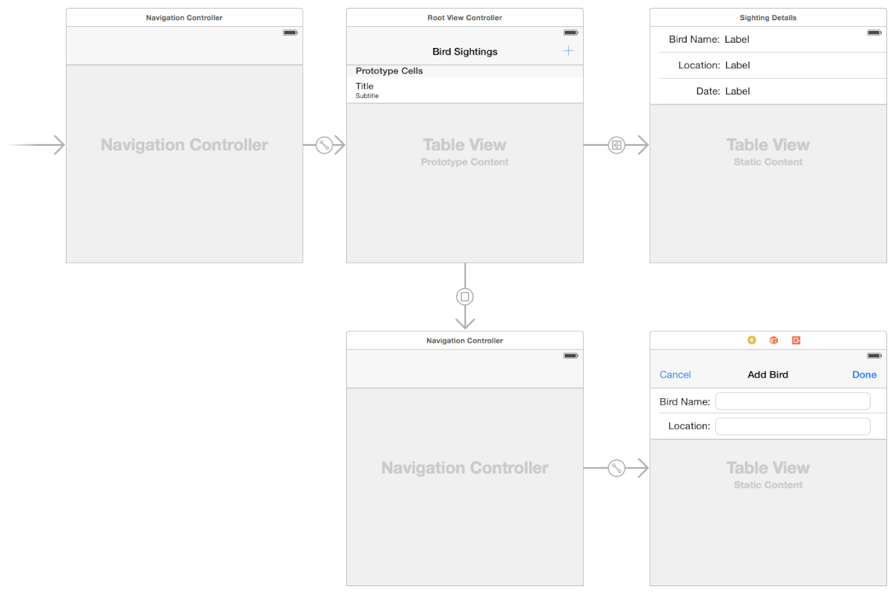

> 导航：[总目录](../../README.md) · [featuredarticles](../../_indexes/featuredarticles.md) · [View Controller Programming Guide for iOS](index.md)

## Defining Your Subclass

You use custom subclasses of [UIViewController](https://developer.apple.com/documentation/uikit/uiviewcontroller) to present your app’s content. Most custom view controllers are _content view controllers_—that is, they own all of their views and are responsible for the data in those views. By contrast, a _container view controller_ does not own all of its views; some of its views are managed by other view controllers. Most of the steps for defining content and container view controllers are the same and are discussed in the sections that follow.

For content view controllers, the most common parent classes are as follows:

- Use [UITableViewController](https://developer.apple.com/documentation/uikit/uitableviewcontroller) specifically when your view controller’s main view is a table.
- Use [UICollectionViewController](https://developer.apple.com/documentation/uikit/uicollectionviewcontroller) specifically when your view controller’s main view is a collection view.
- Use [UIViewController](https://developer.apple.com/documentation/uikit/uiviewcontroller) for all other view controllers.

For container view controllers, the parent class depends on whether you are modifying an existing container class or creating your own. For existing containers, choose whichever view controller class you want to modify. For new container view controllers, you usually subclass [UIViewController](https://developer.apple.com/documentation/uikit/uiviewcontroller). For additional information about creating a container view controller, see [Implementing a Container View Controller](ImplementingaContainerViewController.md#apple-f4xwc4dqnrsv64tfmyxwi33df52wszbpkridimbqga3tinjxfvbuqmjrfvjvomi).

### Defining Your UI

Define the UI for your view controller visually using storyboard files in Xcode. Although you can also create your UI programmatically, storyboards are an excellent way to visualize your view controller’s content and customize your view hierarchy (as needed) for different environments. Building your UI visually lets you make changes quickly and lets you see the results without having to build and run your app.

Figure 4-1 shows an example of a storyboard. Each of the rectangular areas represents a view controller and its associated views. The arrows between view controllers are the view controller relationships and segues. _Relationships_ connect a container view controller to its child view controllers. _Segues_ let you navigate between view controllers in your interface.

__Figure 4-1__A storyboard holds a set of view controllers and views

Each new project has a main storyboard that typically contains one or more view controllers already. You can add new view controllers to your storyboard by dragging them from the library to your canvas. New view controllers do not have an associated class initially, so you must assign one using the Identity inspector.

Use the storyboard editor to do the following:

- Add, arrange, and configure the views for a view controller.
- Connect outlets and actions; see [Handling User Interactions](#apple-f4xwc4dqnrsv64tfmyxwi33df52wszbpkridimbqga3tinjxfvbuqnznknltcmi).
- Create relationships and segues between your view controllers; see [Using Segues](UsingSegues.md#apple-f4xwc4dqnrsv64tfmyxwi33df52wszbpkridimbqga3tinjxfvbuqmjvfvjvomi).
- Customize your layout and views for different size classes; see [Building an Adaptive Interface](BuildinganAdaptiveInterface.md#apple-f4xwc4dqnrsv64tfmyxwi33df52wszbpkridimbqga3tinjxfvbuqmzsfvjvomi).
- Add gesture recognizers to handle user interactions with views; see _Event Handling Guide for iOS_.

If you are new to using storyboards to build your interface, you can find step-by-step instructions for creating a storyboard-based interface in _[Start Developing iOS Apps Today (Retired)](https://developer.apple.com/library/archive/referencelibrary/GettingStarted/RoadMapiOS-Legacy/index.html#//apple_ref/doc/uid/TP40011343)_.

### Handling User Interactions

An app’s responder objects process incoming events and take appropriate actions. Although view controllers are responder objects, they rarely process touch events directly. Instead, view controllers typically handle events in the following ways.

- __View controllers define action methods for handling higher-level events.__ [Action methods](https://developer.apple.com/library/archive/documentation/General/Conceptual/Devpedia-CocoaApp/TargetAction.html#//apple_ref/doc/uid/TP40009071-CH3) respond to:

  - Specific actions. Controls and some views call an action method to report specific interactions.
  - Gesture recognizers. Gesture recognizers call an action method to report the current status of a gesture. Use your view controller to process status changes or respond to the completed gesture.
- __View controllers observe notifications sent by the system or other objects.__ Notifications report changes and are a way for the view controller to update its state.
- __View controllers act as a data source or delegate for another object.__ View controllers are often used to manage the data for tables, and collection views. You can also use them as a delegate for an object such as a [CLLocationManager](https://developer.apple.com/documentation/corelocation/cllocationmanager) object, which sends updated location values to its delegate.

Responding to events often involves updating the content of views, which requires having references to those views. Your view controller is a good place to define [outlets](https://developer.apple.com/library/archive/documentation/General/Conceptual/Devpedia-CocoaApp/Outlet.html#//apple_ref/doc/uid/TP40009071-CH4) for any views that you need to modify later. Declare your outlets as properties using the syntax shown in Listing 4-1. The custom class in the listing defines two outlets (designated by the `IBOutlet` keyword) and a single action method (designated by the `IBAction` return type). The outlets store references to a button and a text field in the storyboard, while the action method responds to taps in the button.

__Listing 4-1__Defining outlets and actions in a view controller class

Objective-C

1. `@interface MyViewController : UIViewController`
2. `@property (weak, nonatomic) IBOutlet UIButton *myButton;`
3. `@property (weak, nonatomic) IBOutlet UITextField *myTextField;`
5. `- (IBAction)myButtonAction:(id)sender;`
7. `@end`

Swift

1. `class MyViewController: UIViewController {`
2. `@IBOutlet weak var myButton : UIButton!`
3. `@IBOutlet weak var myTextField : UITextField!`
5. `@IBAction func myButtonAction(sender: id)`
6. `}`

In your storyboard, remember to connect your view controller’s outlets and actions to the corresponding views. Connecting outlets and actions in your storyboard file ensures that they are configured when the views are loaded. For information about how to create outlet and action connections in Interface Builder, see Interface Builder Connections Help. For information about how to handle events in your app, see _Event Handling Guide for iOS_.

### Displaying Your Views at Runtime

Storyboards make the process of loading and displaying your view controller’s views very simple. UIKit automatically loads views from your storyboard file when they are needed. As part of the loading process, UIKit performs the following sequence of tasks:

1. Instantiates views using the information in your storyboard file.
2. Connects all outlets and actions.
3. Assigns the root view to the view controller’s [view](https://developer.apple.com/documentation/uikit/uiviewcontroller/1621460-view) property.
4. Calls the view controller’s [awakeFromNib](https://developer.apple.com/documentation/objectivec/nsobject/1402907-awakefromnib) method.

   When this method is called, the view controller’s trait collection is empty and views may not be in their final positions.
5. Calls the view controller’s [viewDidLoad](https://developer.apple.com/documentation/uikit/uiviewcontroller/1621495-viewdidload) method.

   Use this method to add or remove views, modify layout constraints, and load data for your views.

Before displaying a view controller’s views onscreen, UIKit gives you some additional chances to prepare those views before and after they are onscreen. Specifically, UIKit performs the following sequence of tasks:

1. Calls the view controller’s [viewWillAppear:](https://developer.apple.com/documentation/uikit/uiviewcontroller/1621510-viewwillappear) method to let it know that its views are about to appear onscreen.
2. Updates the layout of the views.
3. Displays the views onscreen.
4. Calls the [viewDidAppear:](https://developer.apple.com/documentation/uikit/uiviewcontroller/1621423-viewdidappear) method when the views are onscreen.

When you add, remove, or modify the size or position of views, remember to add and remove any constraints that apply to those views. Making layout-related changes to your view hierarchy causes UIKit to mark the layout as dirty. During the next update cycle, the layout engine computes the size and position of views using the current layout constraints and applies those changes to the view hierarchy.

For information about how to create views without using storyboards, see the view management information in _[UIViewController Class Reference](https://developer.apple.com/documentation/uikit/uiviewcontroller)_.

### Managing View Layout

When the size and position of views changes, UIKit updates the layout information for your view hierarchy. For views configured using Auto Layout, UIKit engages the Auto Layout engine and uses it to update the layout according to the current constraints. UIKit also lets other interested objects, such as the active presentation controller, know abut the layout changes so that they can respond accordingly.

During the layout process, UIKit notifies you at several points so that you can perform additional layout-related tasks. Use these notifications to modify your layout constraints or to make final tweaks to the layout after the layout constraints have been applied. During the layout process, UIKit does the following for each affected view controller:

1. Updates the trait collections of the view controller and its views, as needed; see [When Do Trait and Size Changes Happen?](TheAdaptiveModel.md#apple-f4xwc4dqnrsv64tfmyxwi33df52wszbpkridimbqga3tinjxfvbuqmjzfvjvonq)
2. Calls the view controller’s [viewWillLayoutSubviews](https://developer.apple.com/documentation/uikit/uiviewcontroller/1621437-viewwilllayoutsubviews) method.
3. Calls the [containerViewWillLayoutSubviews](https://developer.apple.com/documentation/uikit/uipresentationcontroller/1618341-containerviewwilllayoutsubviews) method of the current [UIPresentationController](https://developer.apple.com/documentation/uikit/uipresentationcontroller) object.
4. Calls the [layoutSubviews](https://developer.apple.com/documentation/uikit/uiview/1622482-layoutsubviews) method of view controller’s root view.

   The default implementation of this method computes the new layout information using the available constraints. The method then traverses the view hierarchy and calls `layoutSubviews` for each subview.
5. Applies the computed layout information to the views.
6. Calls the view controller’s [viewDidLayoutSubviews](https://developer.apple.com/documentation/uikit/uiviewcontroller/1621398-viewdidlayoutsubviews) method.
7. Calls the [containerViewDidLayoutSubviews](https://developer.apple.com/documentation/uikit/uipresentationcontroller/1618331-containerviewdidlayoutsubviews) method of the current [UIPresentationController](https://developer.apple.com/documentation/uikit/uipresentationcontroller) object.

View controllers can use the `viewWillLayoutSubviews` and `viewDidLayoutSubviews` methods to perform additional updates that might impact the layout process. Before layout, you might add or remove views, update the size or position of views, update constraints, or update other view-related properties. After layout, you might reload table data, update the content of other views, or make final adjustments to the size and position of views.

Here are some tips for managing your layout effectively:

- __Use Auto Layout.__ The constraints you create using Auto Layout are a flexible and easy way to position your content on different screen sizes.
- __Take advantage of the top and bottom layout guides.__ Laying out content to these guides ensures that your content is always visible. The position of the top layout guide factors in the height of the status bar and navigation bar. Similarly, the position of the bottom layout guide factors in the height of a tab bar or toolbar.
- __Remember to update constraints when adding or removing views.__ If you add or remove views dynamically, remember to update the corresponding constraints.
- __Remove constraints temporarily while animating your view controller’s views.__ When animating views using UIKit Core Animation, remove your constraints for the duration of the animations and add them back when the animations finish. Remember to update your constraints if the position or size of your views changed during the animation.

For information about presentation controllers and the role they play in the view controller architecture, see [The Presentation and Transition Process](PresentingaViewController.md#apple-f4xwc4dqnrsv64tfmyxwi33df52wszbpkridimbqga3tinjxfvbuqmjufvjvony).

### Managing Memory Efficiently

Although most aspects of memory allocation are for you to decide, Table 4-1 lists the methods of [UIViewController](https://developer.apple.com/documentation/uikit/uiviewcontroller) where you are most likely to allocate or deallocate memory. Most deallocations involve removing strong references to objects. To remove a strong reference to an object, set properties and variables pointing to that object to `nil`.

__Table 4-1__Places to allocate and deallocate memory

| Task | Methods | Discussion |
| --- | --- | --- |
| Allocate critical data structures required by your view controller. | Initialization methods | Your custom [initialization](https://developer.apple.com/library/archive/documentation/General/Conceptual/DevPedia-CocoaCore/Initialization.html#//apple_ref/doc/uid/TP40008195-CH21) method (whether it is named `init` or something else) is always responsible for putting your view controller object into a known good state. Use these methods to allocate whatever data structures are needed to ensure proper operation. |
| Allocate or load data to be displayed in your view. | [viewDidLoad](https://developer.apple.com/documentation/uikit/uiviewcontroller/1621495-viewdidload) | Use the `viewDidLoad` method to load any data objects you intend to display. By the time this method is called, your view objects are guaranteed to exist and to be in a known good state. |
| Respond to low-memory notifications. | [didReceiveMemoryWarning](https://developer.apple.com/documentation/uikit/uiviewcontroller/1621409-didreceivememorywarning) | Use this method to deallocate all noncritical objects associated with your view controller. Deallocate as much memory as you can. |
| Release critical data structures required by your view controller. | [dealloc](https://developer.apple.com/library/archive/documentation/LegacyTechnologies/WebObjects/WebObjects_3.5/Reference/Frameworks/ObjC/Foundation/Classes/NSObject/Description.html#//apple_ref/occ/instm/NSObject/dealloc) | Override this method only to perform any last-minute cleanup of your view controller class. The system automatically releases objects stored in instance variables and properties of your class, so you do not need to release those explicitly. |

[Design Tips](DesignTips.md#apple-f4xwc4dqnrsv64tfmyxwi33df52wszbpkridimbqga3tinjxfvbuqnjnknltc)

[Implementing a Container View Controller](ImplementingaContainerViewController.md#apple-f4xwc4dqnrsv64tfmyxwi33df52wszbpkridimbqga3tinjxfvbuqmjrfvjvomi)
