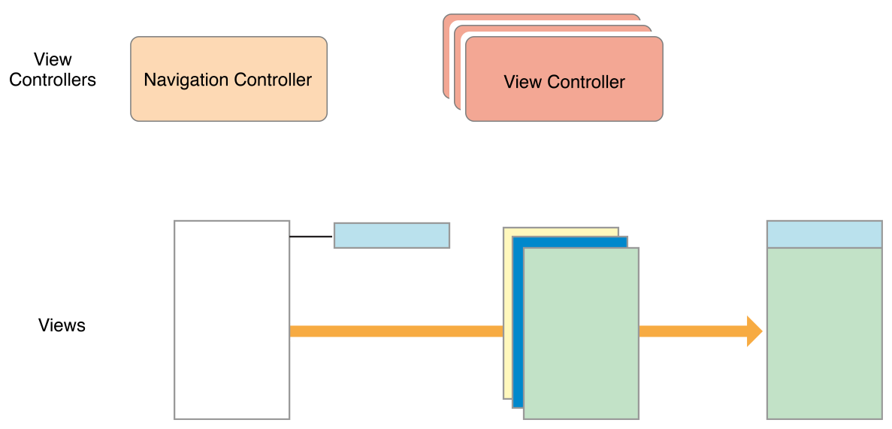
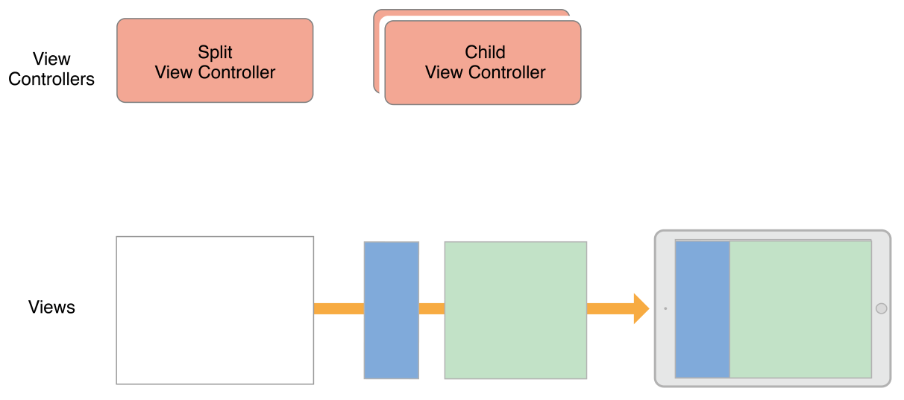
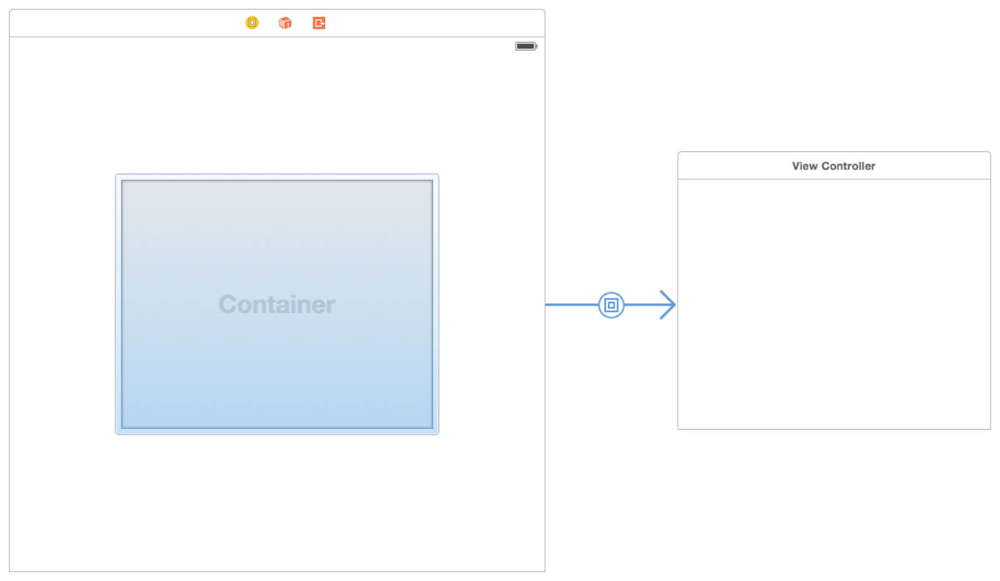

> 导航：[总目录](../../README.md) · [featuredarticles](../../_indexes/featuredarticles.md) · [View Controller Programming Guide for iOS](index.md)

## Implementing a Container View Controller

Container view controllers are a way to combine the content from multiple view controllers into a single user interface. Container view controllers are most often used to facilitate navigation and to create new user interface types based on existing content. Examples of container view controllers in UIKit include `UINavigationController`, `UITabBarController`, and `UISplitViewController`, all of which facilitate navigation between different parts of your user interface.

### Designing a Custom Container View Controller

In almost every way, a container view controller is like any other content view controller in that it manages a root view and some content. The difference is that a container view controller gets part of its content from other view controllers. The content it gets is limited to the other view controllers’ views, which it embeds inside its own view hierarchy. The container view controller sets the size and position of any embedded views, but the original view controllers still manage the content inside those views.

When designing your own container view controllers, always understand the relationships between the container and contained view controllers. The relationships of the view controllers can help inform how their content should appear onscreen and how your container manages them internally. During the design process, ask yourself the following questions:

- What is the role of the container and what role do its children play?
- How many children are displayed simultaneously?
- What is the relationship (if any) between sibling view controllers?
- How are child view controllers added to or removed from the container?
- Can the size or position of the children change? Under what conditions do those changes occur?
- Does the container provide any decorative or navigation-related views of its own?
- What kind of communication is required between the container and its children? Does the container need to report specific events to its children other than the standard ones defined by the [UIViewController](https://developer.apple.com/documentation/uikit/uiviewcontroller) class?
- Can the appearance of the container be configured in different ways? If so, how?

The implementation of a container view controller is relatively straightforward after you have defined the roles of the various objects. The only requirement from UIKit is that you establish a formal parent-child relationship between the container view controller and any child view controllers. The parent-child relationship ensures that the children receive any relevant system messages. Apart from that, most of the real work happens during the layout and management of the contained views, which is different for each container. You can place views anywhere in your container’s content area and size those views however you want. You can also add custom views to the view hierarchy to provide decoration or to aid in navigation.

### Example: Navigation Controller

A [UINavigationController](https://developer.apple.com/documentation/uikit/uinavigationcontroller) object supports navigation through a hierarchical data set. A navigation interface presents one child view controller at a time. A navigation bar at the top of the interface displays the current position in the data hierarchy and displays a back button to move back one level. Navigation down into the data hierarchy is left to the child view controller and can involve the use of tables or buttons.

Navigation between view controllers is managed jointly by the navigation controller and its children. When the user interacts with a button or table row of a child view controller, the child asks the navigation controller to push a new view controller into view. The child handles the configuration of the new view controller’s contents, but the navigation controller manages the transition animations. The navigation controller also manages the navigation bar, which displays a back button for dismissing the topmost view controller.

Figure 5-1 shows the structure of a navigation controller and its views. Most of the content area is filled by the topmost child view controller and only a small portion is occupied by the navigation bar.

__Figure 5-1__Structure of a navigation interface

In both compact and regular environments, a navigation controller displays only one child view controller at a time. The navigation controller resizes its child to fit the available space.

### Example: Split View Controller

A [UISplitViewController](https://developer.apple.com/documentation/uikit/uisplitviewcontroller) object displays the content of two view controllers in a master-detail arrangement. In this arrangement, the content of one view controller (the master) determines what details are displayed by the other view controller. The visibility of the two view controllers is configurable but is also governed by the current environment. In a regularly horizontal environment, the split view controller can show both child view controllers side-by-side or it can hide the master and display it as needed. In a compact environment, the split view controller displays only one view controller at a time.

Figure 5-2 shows the structure of a split view interface and its views in a regularly horizontal environment. The split view controller itself has only its container view by default. In this example, the two child views are displayed side-by-side. The size of the child views is configurable, as is the visibility of the master view.

__Figure 5-2__A split view interface

### Configuring a Container in Interface Builder

To create a parent-child container relationship at design time, add a container view object to your storyboard scene, as shown in Figure 5-3. A container view object is a placeholder object that represents the contents of a child view controller. Use that view to size and position the child’s root view in relation to the other views in the container.

__Figure 5-3__Adding a container view in Interface Builder

When you load a view controller with one or more container views, Interface Builder also loads the child view controllers associated with those views. The children must be instantiated at the same time as the parent so that the appropriate parent-child relationships can be created.

If you do not use Interface Builder to set up your parent-child container relationships, you must create those relationships programmatically by adding each child to the container view controller, as described in [Adding a Child View Controller to Your Content](#apple-f4xwc4dqnrsv64tfmyxwi33df52wszbpkridimbqga3tinjxfvbuqmjrfvjvomjt).

### Implementing a Custom Container View Controller

To implement a container view controller, you must establish relationships between your view controller and its child view controllers. Establishing these parent-child relationships is required before you try to manage the views of any child view controllers. Doing so lets UIKit know that your view controller is managing the size and position of the children. You can create these relationships in Interface Builder or create them programmatically. When creating parent-child relationships programmatically, you explicitly add and remove child view controllers as part of your view controller setup.

### Adding a Child View Controller to Your Content

To incorporate a child view controller into your content programmatically, create a parent-child relationship between the relevant view controllers by doing the following:

1. Call the [addChildViewController:](https://developer.apple.com/documentation/uikit/uiviewcontroller/1621394-addchildviewcontroller) method of your container view controller.

   This method tells UIKit that your container view controller is now managing the view of the child view controller.
2. Add the child’s root view to your container’s view hierarchy.

   Always remember to set the size and position of the child’s frame as part of this process.
3. Add any constraints for managing the size and position of the child’s root view.
4. Call the [didMoveToParentViewController:](https://developer.apple.com/documentation/uikit/uiviewcontroller/1621405-didmove) method of the child view controller.

Listing 5-1 shows how a container embeds a child view controller in its container. After establishing the parent-child relationship, the container sets the frame of its child and adds the child’s view to its own view hierarchy. Setting the frame size of the child’s view is important and ensures that the view shows up correctly in your container. After adding the view, the container calls the child’s `didMoveToParentViewController:` method to give the child view controller a chance to respond to the change in view ownership.

__Listing 5-1__Adding a child view controller to a container

1. `- (void) displayContentController: (UIViewController*) content {`
2. `[self addChildViewController:content];`
3. `content.view.frame = [self frameForContentController];`
4. `[self.view addSubview:self.currentClientView];`
5. `[content didMoveToParentViewController:self];`
6. `}`

In the preceding example, notice that you call only the `didMoveToParentViewController:` method of the child. That is because the `addChildViewController:` method calls the child’s `willMoveToParentViewController:` method for you. The reason that you must call the `didMoveToParentViewController:` method yourself is that the method cannot be called until after you embed the child’s view into your container’s view hierarchy.

When using Auto Layout, set up constraints between the container and child after adding the child to the container’s view hierarchy. Your constraints should affect the size and position of only the child’s root view. Do not alter the contents of the root view or any other views in the child’s view hierarchy.

### Removing a Child View Controller

To remove a child view controller from your content, remove the parent-child relationship between the view controllers by doing the following:

1. Call the child’s [willMoveToParentViewController:](https://developer.apple.com/documentation/uikit/uiviewcontroller/1621381-willmovetoparentviewcontroller) method with the value `nil`.
2. Remove any constraints that you configured with the child’s root view.
3. Remove the child’s root view from your container’s view hierarchy.
4. Call the child’s [removeFromParentViewController](https://developer.apple.com/documentation/uikit/uiviewcontroller/1621425-removefromparentviewcontroller) method to finalize the end of the parent-child relationship.

Removing a child view controller permanently severs the relationship between parent and child. Remove a child view controller only when you no longer need to refer to it. For example, a navigation controller does not remove its current child view controllers when a new one is pushed onto the navigation stack. It removes them only when they are popped off the stack.

Listing 5-2 shows you how to remove a child view controller from its container. Calling the `willMoveToParentViewController:` method with the value `nil` gives the child view controller an opportunity to prepare for the change. The `removeFromParentViewController` method also calls the child’s [didMoveToParentViewController:](https://developer.apple.com/documentation/uikit/uiviewcontroller/1621405-didmove) method, passing that method a value of `nil`. Setting the parent view controller to `nil` finalizes the removal of the child’s view from your container.

__Listing 5-2__Removing a child view controller from a container

1. `- (void) hideContentController: (UIViewController*) content {`
2. `[content willMoveToParentViewController:nil];`
3. `[content.view removeFromSuperview];`
4. `[content removeFromParentViewController];`
5. `}`

### Transitioning Between Child View Controllers

When you want to animate the replacement of one child view controller with another, incorporate the addition and removal of the child view controllers into the transition animation process. Before the animations, make sure both child view controllers are part of your content but let the current child know that it is about to go away. During your animations, move the new child’s view into position and remove the old child’s view. At the completion of the animation, complete the removal of the child view controller.

Listing 5-3 shows an example of how to swap one child view controller for another using a transition animation. In this example, the new view controller is animated to the rectangle currently occupied by the existing child view controller, which is moved offscreen. After the animations finish, the completion block removes the child view controller from the container. In this example, the [transitionFromViewController:toViewController:duration:options:animations:completion:](https://developer.apple.com/documentation/uikit/uiviewcontroller/1621363-transition) method automatically updates the container’s view hierarchy, so you do not need to add and remove the views yourself.

__Listing 5-3__Transitioning between two child view controllers

1. `- (void)cycleFromViewController: (UIViewController*) oldVC`
2. `toViewController: (UIViewController*) newVC {`
3. `// Prepare the two view controllers for the change.`
4. `[oldVC willMoveToParentViewController:nil];`
5. `[self addChildViewController:newVC];`
7. `// Get the start frame of the new view controller and the end frame`
8. `// for the old view controller. Both rectangles are offscreen.`
9. `newVC.view.frame = [self newViewStartFrame];`
10. `CGRect endFrame = [self oldViewEndFrame];`
12. `// Queue up the transition animation.`
13. `[self transitionFromViewController: oldVC toViewController: newVC`
14. `duration: 0.25 options:0`
15. `animations:^{`
16. `// Animate the views to their final positions.`
17. `newVC.view.frame = oldVC.view.frame;`
18. `oldVC.view.frame = endFrame;`
19. `}`
20. `completion:^(BOOL finished) {`
21. `// Remove the old view controller and send the final`
22. `// notification to the new view controller.`
23. `[oldVC removeFromParentViewController];`
24. `[newVC didMoveToParentViewController:self];`
25. `}];`
26. `}`

### Managing Appearance Updates for Children

After adding a child to a container, the container automatically forwards appearance-related messages to the child. This is normally the behavior you want, because it ensures that all events are properly sent. However, sometimes the default behavior may send those events in an order that doesn’t make sense for your container. For example, if multiple children are simultaneously changing their view state, you may want to consolidate the changes so that the appearance callbacks all happen at the same time in a more logical order.

To take over responsibility for appearance callbacks, override the [shouldAutomaticallyForwardAppearanceMethods](https://developer.apple.com/documentation/uikit/uiviewcontroller/1621389-shouldautomaticallyforwardappear) method in your container view controller and return `NO``false`, as shown in Listing 5-4. Returning `NO``false` lets UIKit know that your container view controller notifies its children of changes in its appearance.

__Listing 5-4__Disabling automatic appearance forwarding

1. `- (BOOL) shouldAutomaticallyForwardAppearanceMethods {`
2. `return NO;`
3. `}`

When an appearance transition occurs, call the child’s [beginAppearanceTransition:animated:](https://developer.apple.com/documentation/uikit/uiviewcontroller/1621387-beginappearancetransition) or [endAppearanceTransition](https://developer.apple.com/documentation/uikit/uiviewcontroller/1621503-endappearancetransition) method as appropriate. For example, if your container has a single child referenced by a `child` property, your container would forward these messages to the child as shown in Listing 5-5.

__Listing 5-5__Forwarding appearance messages when the container appears or disappears

1. `-(void) viewWillAppear:(BOOL)animated {`
2. `[self.child beginAppearanceTransition: YES animated: animated];`
3. `}`
5. `-(void) viewDidAppear:(BOOL)animated {`
6. `[self.child endAppearanceTransition];`
7. `}`
9. `-(void) viewWillDisappear:(BOOL)animated {`
10. `[self.child beginAppearanceTransition: NO animated: animated];`
11. `}`
13. `-(void) viewDidDisappear:(BOOL)animated {`
14. `[self.child endAppearanceTransition];`
15. `}`

### Suggestions for Building a Container View Controller

Designing, developing, and testing a new container view controller takes time. Although the individual behaviors are straightforward, the controller as a whole can be quite complex. Consider the following tips when implementing your own container classes:

- __Access only the root view of a child view controller.__ A container should access only the root view of each child—that is, the view returned by the child’s [view](https://developer.apple.com/documentation/uikit/uiviewcontroller/1621460-view) property. It should never access any of the child’s other views.
- __Child view controllers should have minimal knowledge of their container.__ A child view controller should focus on its own content. If the container allows its behavior to be influenced by a child, it should use the [delegation](https://developer.apple.com/library/archive/documentation/General/Conceptual/DevPedia-CocoaCore/Delegation.html#//apple_ref/doc/uid/TP40008195-CH14) design pattern to manage those interactions.
- __Design your container using regular views first.__ Using regular views (instead of the views from child view controllers) gives you an opportunity to test layout constraints and animated transitions in a simplified environment. When the regular views work as expected, swap them out for the views of your child view controllers.

### Delegating Control to a Child View Controller

A container view controller can delegate some aspects of its own appearance to one or more of its children. You can delegate control in the following ways:

- __Let a child view controller determine the status bar style.__ To delegate the status bar appearance to a child, override one or both of the `childViewControllerForStatusBarStyle` and `childViewControllerForStatusBarHidden` methods in your container view controller.
- __Let the child specify its own preferred size.__ A container with a flexible layout can use the child’s own [preferredContentSize](https://developer.apple.com/documentation/uikit/uicontentcontainer/1621481-preferredcontentsize) property to help determine the size of the child.

[Defining Your Subclass](DefiningYourSubclass.md#apple-f4xwc4dqnrsv64tfmyxwi33df52wszbpkridimbqga3tinjxfvbuqnznknltc)

[Supporting Accessibility](SupportingAccessibility.md#apple-f4xwc4dqnrsv64tfmyxwi33df52wszbpkridimbqga3tinjxfvbuqmjsfvjvomi)
