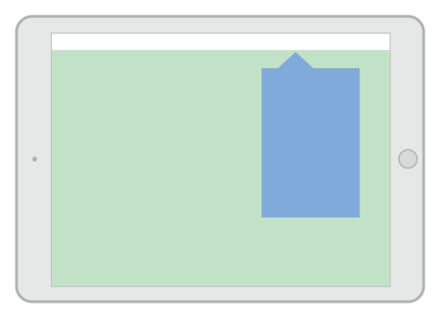
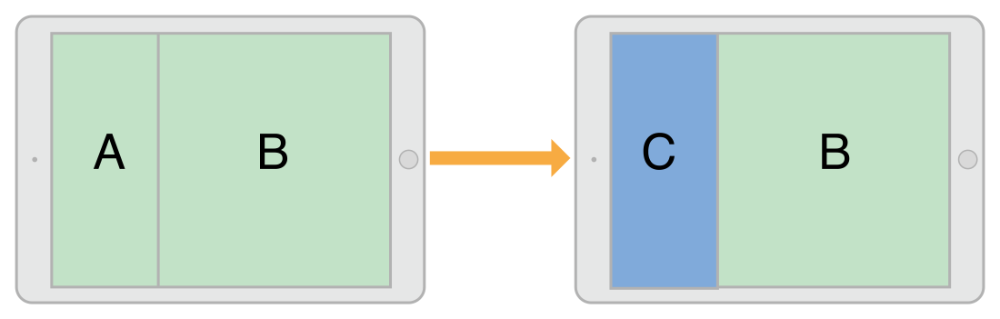
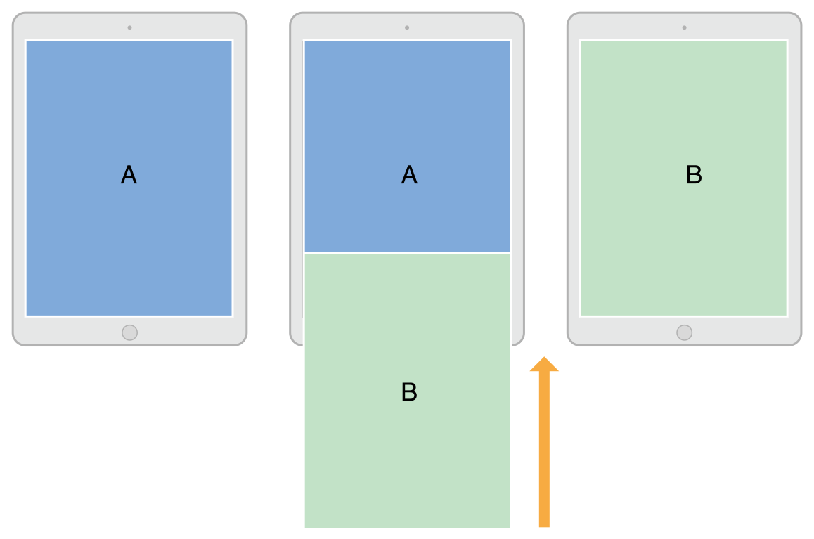

> 导航：[总目录](../../README.md) · [featuredarticles](../../_indexes/featuredarticles.md) · [View Controller Programming Guide for iOS](index.md)

## Presenting a View Controller

There are two ways to display a view controller onscreen: embed it in a container view controller or present it. Container view controllers provide an app’s primary navigation, but presenting view controllers is also an important navigation tool. You use direct presentation to display a new view controller on top of the current one. Typically, you present view controllers when you want to implement modal interfaces, but you can also use them for other purposes.

Support for presenting view controllers is built in to the [UIViewController](https://developer.apple.com/documentation/uikit/uiviewcontroller) class and is available to all view controller objects. You can present any view controller from any other view controller, although UIKit might reroute the request to a different view controller. Presenting a view controller creates a relationship between the original view controller, known as the _presenting view controller_, and the new view controller to be displayed, known as the _presented view controller_. This relationship forms part of the view controller hierarchy and remains in place until the presented view controller is dismissed.

### The Presentation and Transition Process

Presenting a view controller is a quick and easy way to animate new content onto the screen. The presentation machinery built into UIKit lets you display a new view controller using built-in or custom animations. The built-in presentations and animations require very little code because UIKit handles all of the work. You can also create custom presentations and animations with little extra effort and use them with any of your view controllers.

You can initiate the presentation of a view controller programmatically or using segues. If you know your app’s navigation at design time, segues are the easiest way to initiate presentations. For more dynamic interfaces, or in cases where there is no dedicated control to initiate the segue, use the methods of [UIViewController](https://developer.apple.com/documentation/uikit/uiviewcontroller) to present your view controllers.

### Presentation Styles

The _presentation style_ of a view controller governs its appearance onscreen. UIKit defines many standard presentation styles, each with a specific appearance and intent. You can also define your own custom presentation styles. When designing your app, choose the presentation style that makes the most sense for what you are trying to do and assign the appropriate constant to the [modalPresentationStyle](https://developer.apple.com/documentation/uikit/uiviewcontroller/1621355-modalpresentationstyle) property of the view controller you want to present.

### Full-Screen Presentation Styles

Full screen presentation styles cover the entire screen, preventing interactions with the underlying content. In a horizontally regular environment, only one of the full-screen styles covers the underlying content completely. The rest incorporate dimming views or transparency to allow portions of the underlying view controller to show through. In a horizontally compact environment, full-screen presentations automatically adapt to the `UIModalPresentationFullScreen` style and cover all of the underlying content.

Figure 8-1 illustrates the appearance of presentations using the [UIModalPresentationFullScreen](https://developer.apple.com/documentation/uikit/uimodalpresentationstyle/fullscreen), [UIModalPresentationPageSheet](https://developer.apple.com/documentation/uikit/uimodalpresentationstyle/pagesheet), and [UIModalPresentationFormSheet](https://developer.apple.com/documentation/uikit/uimodalpresentationstyle/formsheet) styles in a horizontally regular environment. In the figure, the green view controller on the top-left presents the blue view controller on the top-right and the results of each presentation style are shown below. For some presentation styles, UIKit inserts a dimming view between the content of the two view controllers.

__Figure 8-1__The full screen presentation styles

> [!NOTE]
> 

When using one of the full-screen presentation styles, the view controller that initiates the presentation must itself cover the entire screen. If the presenting view controller does not cover the screen, UIKit walks up the view controller hierarchy until it finds one that does. If it can’t find an intermediate view controller that fills the screen, UIKit uses the root view controller of the window.

### The Popover Style

The [UIModalPresentationPopover](https://developer.apple.com/documentation/uikit/uimodalpresentationstyle/uimodalpresentationpopover) style displays the view controller in a popover view. Popovers are useful for displaying additional information or a list of items related to a focused or selected object. In a horizontally regular environment, the popover view covers only part of the screen, as shown in Figure 8-2. In a horizontally compact environment, popovers adapt to the [UIModalPresentationOverFullScreen](https://developer.apple.com/documentation/uikit/uimodalpresentationstyle/uimodalpresentationoverfullscreen) presentation style by default. A tap outside the popover view dismiss the popover automatically.

__Figure 8-2__The popover presentation style

Because popovers adapt to full-screen presentations in a horizontally compact environment, you usually need to modify your popover code to handle the adaptation. In full-screen mode, you need a way to dismiss a presented popover. You can do that by adding a button, embedding the popover in a dismissible container view controller, or changing the adaptation behavior itself.

For tips on how to configure a popover presentation, see [Presenting a View Controller in a Popover](#apple-f4xwc4dqnrsv64tfmyxwi33df52wszbpkridimbqga3tinjxfvbuqmjufvjvomjt).

### The Current Context Styles

The [UIModalPresentationCurrentContext](https://developer.apple.com/documentation/uikit/uimodalpresentationstyle/uimodalpresentationcurrentcontext) style covers a specific view controller in your interface. When using the contextual style, you designate which view controller you want to cover by setting its [definesPresentationContext](https://developer.apple.com/documentation/uikit/uiviewcontroller/1621456-definespresentationcontext) property to `YES``true`. Figure 8-3 illustrates a current context presentation that covers only one child view controller of a split view controller.

__Figure 8-3__The current context presentation style

> [!NOTE]
> 

The view controller that defines the presentation context can also define the transition animations to use during the presentation. Normally, UIKit animates view controllers onscreen using the value in the [modalTransitionStyle](https://developer.apple.com/documentation/uikit/uiviewcontroller/1621388-modaltransitionstyle) property of the presented view controller. If the presentation context view controller has its [providesPresentationContextTransitionStyle](https://developer.apple.com/documentation/uikit/uiviewcontroller/1621356-providespresentationcontexttrans) set to `YES``true`, UIKit uses the value in that view controller’s `modalTransitionStyle` property instead.

When transitioning to a horizontally compact environment, the current context styles adapt to the [UIModalPresentationFullScreen](https://developer.apple.com/documentation/uikit/uimodalpresentationstyle/fullscreen) style. To change that behavior, use an adaptive presentation delegate to specify a different presentation style or view controller.

### Custom Presentation Styles

The [UIModalPresentationCustom](https://developer.apple.com/documentation/uikit/uimodalpresentationstyle/custom) style lets you present a view controller using a custom style that you define. Creating a custom style involves subclassing [UIPresentationController](https://developer.apple.com/documentation/uikit/uipresentationcontroller) and using its methods to animate any custom view onto the screen and to set the size and position of the presented view controller. The presentation controller also handles any adaptations that occur because of changes to the presented view controller’s traits.

For information on how to define a custom presentation controller, see [Creating Custom Presentations](DefiningCustomPresentations.md#apple-f4xwc4dqnrsv64tfmyxwi33df52wszbpkridimbqga3tinjxfvbuqmrvfvjvomi).

### Transition Styles

Transition styles determine the type of animations used to display a presented view controller. For the built-in transition styles, you assign one of the standard transition styles to the [modalTransitionStyle](https://developer.apple.com/documentation/uikit/uiviewcontroller/1621388-modaltransitionstyle) property of the view controller you want to present. When you present the view controller, UIKit creates the animations that correspond to that style. For example, Figure 8-4 illustrates how the standard slide-up transition ([UIModalTransitionStyleCoverVertical](https://developer.apple.com/documentation/uikit/uimodaltransitionstyle/uimodaltransitionstylecoververtical)) animates the view controller onscreen. View controller B starts offscreen and animates up and over the top of view controller A. When view controller B is dismissed, the animation reverses so that B slides down to reveal A.

__Figure 8-4__A transition animation for a view controller

You can create custom transitions using an animator object and transitioning delegate. The animator object creates the transition animations for placing the view controller onscreen. The transitioning delegate supplies that animator object to UIKit at the appropriate time. For information about how to implement custom transitions, see [Customizing the Transition Animations](CustomizingtheTransitionAnimations.md#apple-f4xwc4dqnrsv64tfmyxwi33df52wszbpkridimbqga3tinjxfvbuqmjwfvjvomi).

### Presenting Versus Showing a View Controller

The [UIViewController](https://developer.apple.com/documentation/uikit/uiviewcontroller) class offers two ways to display a view controller:

- The [showViewController:sender:](https://developer.apple.com/documentation/uikit/uiviewcontroller/1621377-showviewcontroller) and [showDetailViewController:sender:](https://developer.apple.com/documentation/uikit/uiviewcontroller/1621432-showdetailviewcontroller) methods offer the most adaptive and flexible way to display view controllers. These methods let the presenting view controller decide how best to handle the presentation. For example, a container view controller might incorporate the view controller as a child instead of presenting it modally. The default behavior presents the view controller modally.
- The [presentViewController:animated:completion:](https://developer.apple.com/documentation/uikit/uiviewcontroller/1621380-presentviewcontroller) method always displays the view controller modally. The view controller that calls this method might not ultimately handle the presentation but the presentation is always modal. This method adapts the presentation style for horizontally compact environments.

The `showViewController:sender:` and `showDetailViewController:sender:` methods are the preferred way to initiate presentations. A view controller can call them without knowing anything about the rest of the view controller hierarchy or the current view controller’s position in that hierarchy. These methods also make it easier to reuse view controllers in different parts of your app without writing conditional code paths.

### Presenting a View Controller

There are several ways to initiate the presentation of a view controller:

- Use a segue to present the view controller automatically. The segue instantiates and presents the view controller using the information you specified in Interface Builder. For more information on how to configure segues, see [Using Segues](UsingSegues.md#apple-f4xwc4dqnrsv64tfmyxwi33df52wszbpkridimbqga3tinjxfvbuqmjvfvjvomi).
- Use the [showViewController:sender:](https://developer.apple.com/documentation/uikit/uiviewcontroller/1621377-showviewcontroller) or [showDetailViewController:sender:](https://developer.apple.com/documentation/uikit/uiviewcontroller/1621432-showdetailviewcontroller) method to display the view controller. In custom view controllers, you can change the behavior of these methods to something more suitable for your view controller.
- Call the [presentViewController:animated:completion:](https://developer.apple.com/documentation/uikit/uiviewcontroller/1621380-presentviewcontroller) method to present the view controller modally.

For information about how to dismiss a view controller that you presented using one of these techniques, see [Dismissing a Presented View Controller](#apple-f4xwc4dqnrsv64tfmyxwi33df52wszbpkridimbqga3tinjxfvbuqmjufvjvomjq).

### Showing View Controllers

When using the `showViewController:sender:` and `showDetailViewController:sender:` methods, the process for getting a new view controller onscreen is straightforward:

1. [Create](https://developer.apple.com/library/archive/documentation/General/Conceptual/DevPedia-CocoaCore/ObjectCreation.html#//apple_ref/doc/uid/TP40008195-CH39) the view controller object you want to present. When creating the view controller, it is your responsibility to initialize it with whatever data it needs to perform its task.
2. Set the [modalPresentationStyle](https://developer.apple.com/documentation/uikit/uiviewcontroller/1621355-modalpresentationstyle) property of the new view controller to the preferred presentation style. This style might not be used in the final presentation.
3. Set the [modalTransitionStyle](https://developer.apple.com/documentation/uikit/uiviewcontroller/1621388-modaltransitionstyle) property of the view controller to the desired transition animation style. This style might not be used in the final animations.
4. Call the [showViewController:sender:](https://developer.apple.com/documentation/uikit/uiviewcontroller/1621377-showviewcontroller) and [showDetailViewController:sender:](https://developer.apple.com/documentation/uikit/uiviewcontroller/1621432-showdetailviewcontroller) method of the current view controller.

UIKit forwards calls to the `showViewController:sender:` and `showDetailViewController:sender:` methods to the appropriate presenting view controller. That view controller can then decide how best to perform the presentation and can change the presentation and transition styles as needed. For example, a navigation controller might push the view controller onto its navigation stack.

For information about the differences between showing view controllers and presenting them modally, see [Presenting Versus Showing a View Controller](#apple-f4xwc4dqnrsv64tfmyxwi33df52wszbpkridimbqga3tinjxfvbuqmjufvjvona).

### Presenting View Controllers Modally

When presenting a view controller directly, you tell UIKit how you want the new view controller to be displayed and how it should be animated onscreen.

1. [Create](https://developer.apple.com/library/archive/documentation/General/Conceptual/DevPedia-CocoaCore/ObjectCreation.html#//apple_ref/doc/uid/TP40008195-CH39) the view controller object you want to present.

   When creating the view controller, it is your responsibility to initialize it with whatever data it needs to perform its task.
2. Set the [modalPresentationStyle](https://developer.apple.com/documentation/uikit/uiviewcontroller/1621355-modalpresentationstyle) property of the new view controller to the desired presentation style.
3. Set the [modalTransitionStyle](https://developer.apple.com/documentation/uikit/uiviewcontroller/1621388-modaltransitionstyle) property of the view controller to the desired animation style.
4. Call the [presentViewController:animated:completion:](https://developer.apple.com/documentation/uikit/uiviewcontroller/1621380-presentviewcontroller) method of the current view controller.

The view controller that calls the `presentViewController:animated:completion:` method may not be the one that actually performs the modal presentation. The presentation style determines how that view controller is to be presented, including the characteristics required of the presenting view controller. For example, a full-screen presentation must be initiated by a full-screen view controller. If the current presenting view controller is not suitable, UIKit walks the view controller hierarchy until it finds one that is. Upon completion of a modal presentation, UIKit updates the [presentingViewController](https://developer.apple.com/documentation/uikit/uiviewcontroller/1621430-presentingviewcontroller) and [presentedViewController](https://developer.apple.com/documentation/uikit/uiviewcontroller/1621407-presentedviewcontroller) properties of the affected view controllers.

Listing 8-1 demonstrates how to present a view controller programmatically. When the user adds a new recipe, the app prompts the user for basic information about the recipe by presenting a navigation controller. A navigation controller was chosen so that there would be a standard place to put a Cancel and Done button. Using a navigation controller also makes it easier to expand the new recipe interface in the future. All you have to do is push new view controllers on the navigation stack.

__Listing 8-1__Presenting a view controller programmatically

1. `- (void)add:(id)sender {`
2. `// Create the root view controller for the navigation controller`
3. `// The new view controller configures a Cancel and Done button for the`
4. `// navigation bar.`
5. `RecipeAddViewController *addController = [[RecipeAddViewController alloc] init];`
7. `addController.modalPresentationStyle = UIModalPresentationFullScreen;`
8. `addController.transitionStyle = UIModalTransitionStyleCoverVertical;`
9. `[self presentViewController:addController animated:YES completion: nil];`
10. `}`

### Presenting a View Controller in a Popover

Popovers require additional configuration before you can present them. After setting the modal presentation style to [UIModalPresentationPopover](https://developer.apple.com/documentation/uikit/uimodalpresentationstyle/uimodalpresentationpopover), configure the following popover-related attributes:

- Set the [preferredContentSize](https://developer.apple.com/documentation/uikit/uiviewcontroller/1621476-preferredcontentsize) property of your view controller to the desired size.
- Set the popover anchor point using the associated [UIPopoverPresentationController](https://developer.apple.com/documentation/uikit/uipopoverpresentationcontroller) object, which is accessible from the view controller’s [popoverPresentationController](https://developer.apple.com/documentation/uikit/uiviewcontroller/1621428-popoverpresentationcontroller) property. Set only one of the following:

  - Set the [barButtonItem](https://developer.apple.com/documentation/uikit/uipopoverpresentationcontroller/1622314-barbuttonitem) property to a bar button item.
  - Set the [sourceView](https://developer.apple.com/documentation/uikit/uipopoverpresentationcontroller/1622313-sourceview) and [sourceRect](https://developer.apple.com/documentation/uikit/uipopoverpresentationcontroller/1622324-sourcerect) properties to a specific region in one of your views.

You can use the [UIPopoverPresentationController](https://developer.apple.com/documentation/uikit/uipopoverpresentationcontroller) object to make other adjustments to the popover’s appearance as needed. The popover presentation controller also supports a delegate object that you can use to respond to changes during the presentation process. For example, you can use the delegate to respond when the popover appears, disappears, or is repositioned on the screen. Fore more information about this object, see _[UIPopoverPresentationController Class Reference](https://developer.apple.com/documentation/uikit/uipopoverpresentationcontroller)_.

### Dismissing a Presented View Controller

To dismiss a presented view controller, call the [dismissViewControllerAnimated:completion:](https://developer.apple.com/documentation/uikit/uiviewcontroller/1621505-dismissviewcontrolleranimated) method of the presenting view controller. You can also call this method on the presented view controller itself. When you call the method on the presented view controller, UIKit automatically forwards the request to the presenting view controller.

Always save any important information from a view controller before dismissing it. Dismissing a view controller removes it from the view controller hierarchy and removes its view from the screen. If you do not have a strong reference to the view controller stored elsewhere, dismissing it releases the memory associated with it.

If the presented view controller must return data to the presenting view controller, use the [delegation](https://developer.apple.com/library/archive/documentation/General/Conceptual/DevPedia-CocoaCore/Delegation.html#//apple_ref/doc/uid/TP40008195-CH14) design pattern to facilitate the transfer. Delegation makes it easier to reuse view controllers in different parts of your app. With delegation, the presented view controller stores a reference to a delegate object that implements methods from a formal [protocol](https://developer.apple.com/library/archive/documentation/General/Conceptual/DevPedia-CocoaCore/Protocol.html#//apple_ref/doc/uid/TP40008195-CH45). As it gathers results, the presented view controller calls those methods on its delegate. In a typical implementation, the presenting view controller makes itself the delegate of its presented view controller.

### Presenting a View Controller Defined in a Different Storyboard

Although you can create segues between view controllers in the same storyboard, you cannot create segues between storyboards. When you want to display a view controller stored in a different storyboard, you must instantiate that view controller explicitly before presenting it, as shown in Listing 8-2. The example presents the view controller modally but you could push it onto a navigation controller or display it in other ways.

__Listing 8-2__Loading a view controller from a storyboard

1. `UIStoryboard* sb = [UIStoryboard storyboardWithName:@"SecondStoryboard" bundle:nil];`
2. `MyViewController* myVC = [sb instantiateViewControllerWithIdentifier:@"MyViewController"];`
4. `// Configure the view controller.`
6. `// Display the view controller`
7. `[self presentViewController:myVC animated:YES completion:nil];`

There is no requirement that you create multiple storyboards in your app. Here, though, are a few cases where multiple storyboards might be useful:

- You have a large programming team, with different portions of the user interface assigned to different parts of the team. Each team owns its portion of the user interface in a different storyboard file to minimize contention.
- You purchased or created a library that predefines a collection of view controller types; the contents of those view controllers are defined in a storyboard provided by the library.
- You have content that needs to be displayed on an external screen. In this case, you might keep all of the view controllers associated with the alternate screen inside a separate storyboard. An alternative pattern for the same scenario is to write a custom segue.

[Preserving and Restoring State](PreservingandRestoringState.md#apple-f4xwc4dqnrsv64tfmyxwi33df52wszbpkridimbqga3tinjxfvbuqmryfvjvomi)

[Using Segues](UsingSegues.md#apple-f4xwc4dqnrsv64tfmyxwi33df52wszbpkridimbqga3tinjxfvbuqmjvfvjvomi)
