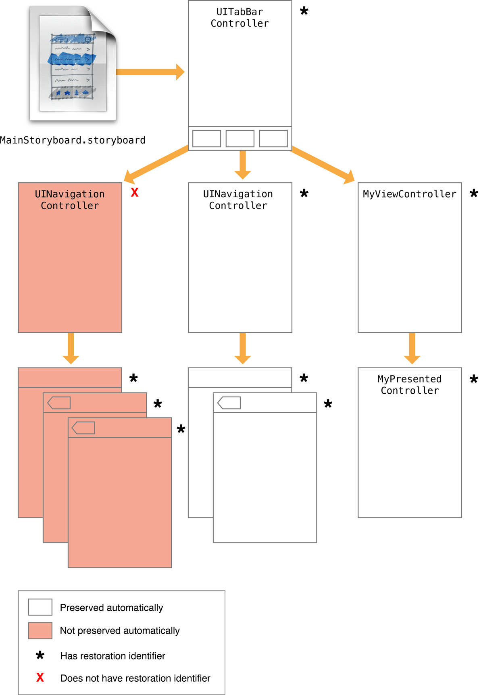
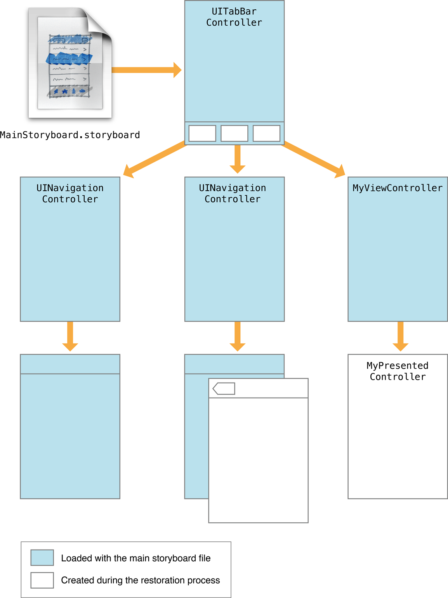

> 导航：[总目录](../../README.md) · [featuredarticles](../../_indexes/featuredarticles.md) · [View Controller Programming Guide for iOS](index.md)

## Preserving and Restoring State

View controllers play an important role in the state preservation and restoration process. State preservation records the configuration of your app before it is suspended so that the configuration can be restored on a subsequent app launch. Returning an app to its previous configuration saves time for the user and offers a better user experience.

The preservation and restoration process is mostly automatic, but you need to tell iOS which parts of your app to preserve. The steps for preserving your app’s view controllers are as follows:

- (Required) Assign restoration identifiers to the view controllers whose configuration you want to preserve; see [Tagging View Controllers for Preservation](#apple-f4xwc4dqnrsv64tfmyxwi33df52wszbpkridimbqga3tinjxfvbuqmryfvjvomq).
- (Required) Tell iOS how to create or locate new view controller objects at launch time; see [Restoring View Controllers at Launch Time](#apple-f4xwc4dqnrsv64tfmyxwi33df52wszbpkridimbqga3tinjxfvbuqmryfvjvoni).
- (Optional) For each view controller, store any specific configuration data needed to return that view controller to its original configuration; see [Encoding and Decoding Your View Controller’s State](#apple-f4xwc4dqnrsv64tfmyxwi33df52wszbpkridimbqga3tinjxfvbuqmryfvjvonq).

For an overview of the preservation and restoration process, see _[App Programming Guide for iOS](https://developer.apple.com/library/archive/documentation/iPhone/Conceptual/iPhoneOSProgrammingGuide/Introduction/Introduction.html#//apple_ref/doc/uid/TP40007072)_.

### Tagging View Controllers for Preservation

UIKit preserves only the view controllers you tell it to preserve. Each view controller has a [restorationIdentifier](https://developer.apple.com/documentation/uikit/uiviewcontroller/1621499-restorationidentifier) property, whose value is `nil` by default. Setting that property to a valid string tells UIKit that the view controller and its views should be preserved. You can assign restoration identifiers programmatically or in your storyboard file.

When assigning restoration identifiers, remember that all parent view controllers in the view controller hierarchy must have restoration identifiers too. During the preservation process, UIKit starts at the window’s root view controller and walks the view controller hierarchy. If a view controller in that hierarchy does not have a restoration identifier, the view controller and all of its child view controllers and presented view controllers are ignored.

### Choosing Effective Restoration Identifiers

UIKit uses your restoration identifier strings to recreate view controllers later, so choose strings that are easily identifiable to your code. If UIKit cannot automatically create one of your view controllers, it asks you to create it, providing you with the restoration identifiers of the view controller and all of its parent view controllers. This chain of identifiers represents the _restoration path_ for the view controller and is how you determine which view controller is being requested. The restoration path starts at the root view controller and includes every view controller up to and including the one that was requested.

Restoration identifiers are often just the class name of the view controller. If you use the same class in many places, you might want to assign more meaningful values. For example, you might assign a string based on the data being managed by the view controller.

The restoration path for every view controller must be unique. If a container view controller has two children, the container must assign each child a unique restoration identifier. Some container view controllers in UIKit automatically disambiguate their child view controllers, allowing you to use the same restoration identifiers for each child. For example, the [UINavigationController](https://developer.apple.com/documentation/uikit/uinavigationcontroller) class adds information to each child based on its position in the navigation stack. For more information about the behavior of a given view controller, see the corresponding class reference.

For more information on how you use restoration identifiers and restoration paths to create view controllers, see [Restoring View Controllers at Launch Time](#apple-f4xwc4dqnrsv64tfmyxwi33df52wszbpkridimbqga3tinjxfvbuqmryfvjvoni).

### Excluding Groups of View Controllers

To exclude an entire group of view controllers from the restoration process, set the restoration identifier of the parent view controller to `nil`. Figure 7-1 shows the impact that setting the restoration identifier to `nil` has on the view controller hierarchy. The lack of preservation data prevents that view controller from being restored later.

__Figure 7-1__Excluding view controllers from the automatic preservation process

Excluding one or more view controllers does not remove them altogether during a subsequent restore. At launch time, any view controllers that are part of your app’s default setup are still created, as shown in Figure 7-2. Such view controllers are recreated in their default configuration, but they are still created.

__Figure 7-2__Loading the default set of view controllers

Excluding a view controller from the automatic preservation process does not prevent you from preserving it manually. Saving a reference to the view controller in the restoration archive preserves the view controller and its state information. For example, if the app delegate in [Figure 7-1](#apple-f4xwc4dqnrsv64tfmyxwi33df52wszbpkridimbqga3tinjxfvbuqmryfvjvomzu) saved the three children of the navigation controller, their state would be preserved. During a restore, the app delegate could then recreate those view controllers and push them onto the navigation controller’s stack.

### Preserving a View Controller’s Views

Some views have additional state information that is relevant to the view but not to the parent view controller. For example, a scroll view has a scroll position that you might want to preserve. While the view controller is responsible for providing the content of the scroll view, the scroll view itself is responsible for preserving its visual state.

To save a view’s state, do the following:

- Assign a valid string to the view’s [restorationIdentifier](https://developer.apple.com/documentation/uikit/uiview/1622494-restorationidentifier) property.
- Use the view from a view controller that also has a valid restoration identifier.
- For table views and collection views, assign a data source that adopts the [UIDataSourceModelAssociation](https://developer.apple.com/documentation/uikit/uidatasourcemodelassociation) protocol.

Assigning a restoration identifier to a view tells UIKit that it should write that view’s state to the preservation archive. When the view controller is restored later, UIKit also restores the state of any views that had restoration identifiers.

### Restoring View Controllers at Launch Time

At launch time, UIKit tries to restore your app to its previous state. At that time, UIKit asks your app to create (or locate) the view controller objects that comprise your preserved user interface. UIKit searches in the following order when trying to locate view controllers:

1. __If the view controller had a restoration class, UIKit asks that class to provide the view controller.__ UIKit calls the [viewControllerWithRestorationIdentifierPath:coder:](https://developer.apple.com/documentation/uikit/uiviewcontrollerrestoration/1616859-viewcontroller) method of the associated restoration class to retrieve the view controller. If that method returns `nil`, it is assumed that the app does not want to recreate the view controller and UIKit stops looking for it.
2. __If the view controller did not have a restoration class, UIKit asks the app delegate to provide the view controller.__ UIKit calls the [application:viewControllerWithRestorationIdentifierPath:coder:](https://developer.apple.com/documentation/uikit/uiapplicationdelegate/1623062-application) method of your app delegate to look for view controllers without a restoration class. If that method returns `nil`, UIKit tries to find the view controller implicitly.
3. __If a view controller with the correct restoration path already exists, UIKit uses that object.__ If your app creates view controllers at launch time (either programmatically or by loading them from a storyboard) and those view controllers have restoration identifiers, UIKit finds them implicitly based on their restoration paths.
4. __If the view controller was originally loaded from a storyboard file, UIKit uses the saved storyboard information to locate and create it.__ UIKit saves information about a view controller’s storyboard inside the restoration archive. At restore time, UIKit uses that information to locate the same storyboard file and instantiate the corresponding view controller if the view controller was not found by any other means.

Assigning a restoration class to a view controller prevents UIKit from searching for that view controller implicitly. Using a restoration class gives you more control over whether you really want to create a view controller. For example, your `viewControllerWithRestorationIdentifierPath:coder:` method can return `nil` if your class determines that the view controller should not be recreated. When no restoration class is present, UIKit does everything it can to find or create the view controller and restore it.

When using a restoration class, your `viewControllerWithRestorationIdentifierPath:coder:` method should create a new instance of the class, perform minimal initialization, and return the resulting object. Listing 7-1 shows an example of how you might use this method to load a view controller from a storyboard. Because the view controller was originally loaded from a storyboard, this method uses the [UIStateRestorationViewControllerStoryboardKey](https://developer.apple.com/documentation/uikit/uiapplication/1616861-staterestorationviewcontrollerst) key to get the storyboard from the archive. Note that this method does not try to configure the view controller’s data fields. That step occurs later when the view controller’s state is decoded.

__Listing 7-1__Creating a new view controller during restoration

1. `+ (UIViewController*) viewControllerWithRestorationIdentifierPath:(NSArray *)identifierComponents`
2. `coder:(NSCoder *)coder {`
3. `MyViewController* vc;`
4. `UIStoryboard* sb = [coder decodeObjectForKey:UIStateRestorationViewControllerStoryboardKey];`
5. `if (sb) {`
6. `vc = (PushViewController*)[sb instantiateViewControllerWithIdentifier:@"MyViewController"];`
7. `vc.restorationIdentifier = [identifierComponents lastObject];`
8. `vc.restorationClass = [MyViewController class];`
9. `}`
10. `return vc;`
11. `}`

Reassigning the restoration identifier and restoration class is a good habit to adopt when recreating view controllers manually. The simplest way to restore the restoration identifier is to grab the last item in the `identifierComponents` array and assign it to your view controller.

For objects that were created from your app’s main storyboard file at launch time, do not create new instances of each object. Let UIKit find those objects implicitly or use the `application:viewControllerWithRestorationIdentifierPath:coder:` method of your app delegate to find the existing objects.

### Encoding and Decoding Your View Controller’s State

For each object slated for preservation, UIKit calls the object’s [encodeRestorableStateWithCoder:](https://developer.apple.com/documentation/uikit/uiviewcontroller/1621461-encoderestorablestatewithcoder) method to give it a chance to save its state. During the restoration process, UIKit calls the matching [decodeRestorableStateWithCoder:](https://developer.apple.com/documentation/uikit/uiviewcontroller/1621429-decoderestorablestatewithcoder) method to decode that state and apply it to the object. The implementation of these methods is optional, but recommended, for your view controllers. You might use them to save and restore the following types of information:

- References to any data being displayed (not the data itself)
- For a container view controller, references to its child view controllers
- Information about the current selection
- For view controllers with a user-configurable view, information about the current configuration of that view.

In your encode and decode methods, you can encode objects and any data types supported by the coder. For all objects except views and view controllers, the object must adopt the [NSCoding](https://developer.apple.com/library/archive/documentation/LegacyTechnologies/WebObjects/WebObjects_3.5/Reference/Frameworks/ObjC/Foundation/Protocols/NSCoding/Description.html#//apple_ref/occ/intf/NSCoding) protocol and use the methods of that protocol to write its state. For views and view controllers, the coder does not use the `NSCoding` protocol to save the object’s state. Instead, the coder saves the restoration identifier of the object and adds it to the list of preservable objects, which causes that object’s `encodeRestorableStateWithCoder:` method to be called.

The `encodeRestorableStateWithCoder:` and `decodeRestorableStateWithCoder:` methods of your view controllers must call `super` at some point in their implementation. Calling `super` gives the parent class a chance to save and restore any additional information. Listing 7-2 shows a sample implementation of these methods that save a numerical value used to identify the specified view controller.

__Listing 7-2__Encoding and decoding a view controller’s state.

1. `- (void)encodeRestorableStateWithCoder:(NSCoder *)coder {`
2. `[super encodeRestorableStateWithCoder:coder];`
4. `[coder encodeInt:self.number forKey:MyViewControllerNumber];`
5. `}`
7. `- (void)decodeRestorableStateWithCoder:(NSCoder *)coder {`
8. `[super decodeRestorableStateWithCoder:coder];`
10. `self.number = [coder decodeIntForKey:MyViewControllerNumber];`
11. `}`

Coder objects are not shared during the encode and decode process. Each object with preservable state receives its own coder object. The use of unique coders means that you do not have to worry about namespace collisions among your keys. However, do not use the [UIApplicationStateRestorationBundleVersionKey](https://developer.apple.com/documentation/uikit/uiapplication/1616852-staterestorationbundleversionkey), [UIApplicationStateRestorationUserInterfaceIdiomKey](https://developer.apple.com/documentation/uikit/uiapplication/1616853-staterestorationuserinterfaceidi), and [UIStateRestorationViewControllerStoryboardKey](https://developer.apple.com/documentation/uikit/uiapplication/1616861-staterestorationviewcontrollerst) key names yourself. Those keys are used by UIKit to store additional information about the state of your view controller.

For more information about implementing the encode and decode methods for your view controllers, see _[UIViewController Class Reference](https://developer.apple.com/documentation/uikit/uiviewcontroller)_.

### Tips for Saving and Restoring Your View Controllers

As you add support for state preservation and restoration in your view controllers, consider the following guidelines:

- __Remember that you might not want to preserve all view controllers.__ In some cases, it might not make sense to preserve a view controller. For example, if the app was displaying a change, you might want to cancel the operation and restore the app to the previous screen. In such a case, you would not preserve the view controller that asks for the new password information.
- __Avoid swapping view controller classes during the restoration process.__ The state preservation system encodes the class of the view controllers it preserves. During restoration, if your app returns an object whose class does not match (or is not a subclass of) the original object, the system does not ask the view controller to decode any state information. Thus, swapping out the old view controller for a completely different one does not restore the full state of the object.
- __The state preservation system expects you to use view controllers as they were intended.__ The restoration process relies on the containment relationships of your view controllers to rebuild your interface. If you do not use container view controllers properly, the preservation system cannot find your view controllers. For example, never embed a view controller’s view inside a different view unless there is a containment relationship between the corresponding view controllers.

[Supporting Accessibility](SupportingAccessibility.md#apple-f4xwc4dqnrsv64tfmyxwi33df52wszbpkridimbqga3tinjxfvbuqmjsfvjvomi)

[Presenting a View Controller](PresentingaViewController.md#apple-f4xwc4dqnrsv64tfmyxwi33df52wszbpkridimbqga3tinjxfvbuqmjufvjvomi)
