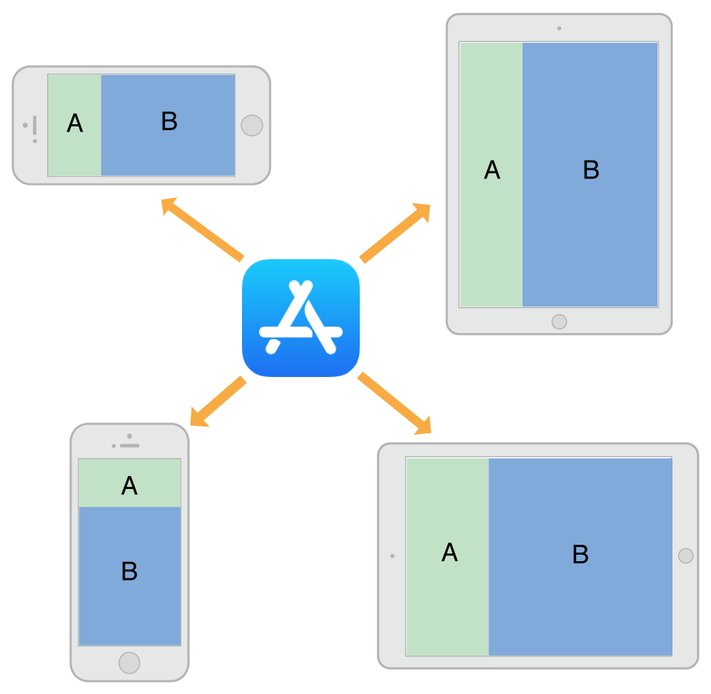
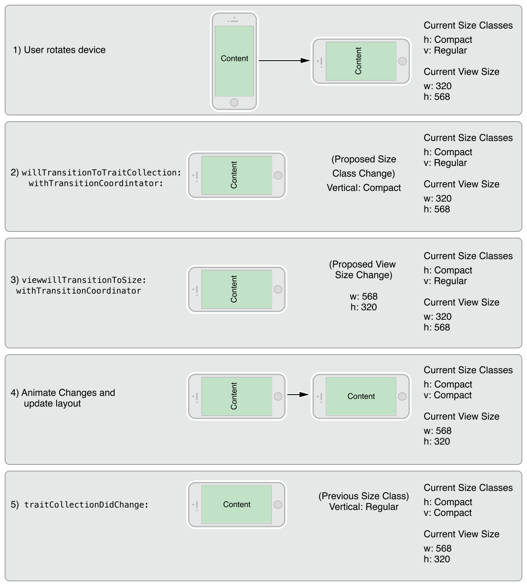

> 导航：[总目录](../../README.md) · [featuredarticles](../../_indexes/featuredarticles.md) · [View Controller Programming Guide for iOS](index.md)

## The Adaptive Model

An adaptive interface is one that makes the best use of the available space. Being adaptive means being able to adjust your content so that it fits well on any iOS device. The adaptive model in iOS supports simple but dynamic ways to rearrange and resize your content in response to changes. When you take advantage of this model, a single app can adapt to dramatically different screen sizes (as illustrated in Figure 12-1) with very little extra code.

__Figure 12-1__Adapting to different devices and orientations

An important tool for building adaptive interfaces is Auto Layout. Using Auto Layout, you define rules (known as _constraints_) that govern the layout of your view controller’s views. You can create these rules visually in Interface Builder or programmatically in your code. When the size of a parent view changes, iOS automatically resizes and repositions the rest of your views according to the constraints you specified.

Traits are another important component of the adaptive model. Traits describe the environment in which your view controllers and views must operate. Traits help you make high-level decisions about your interface.

### The Role of Traits

When constraints alone are not enough to manage layout, your view controllers have several opportunities to make changes. View controllers, views, and a few other objects manage a collection of _traits_ that specify the current environment associated with that object. Table 12-1 describes the traits and how you use them to affect your user interface.

__Table 12-1__Traits

| Trait | Examples | Description |
| --- | --- | --- |
| [horizontalSizeClass](https://developer.apple.com/documentation/uikit/uitraitcollection/1623508-horizontalsizeclass) | [UIUserInterfaceSizeClassCompact](https://developer.apple.com/documentation/uikit/uiuserinterfacesizeclass/compact) | This trait conveys the general width of your interface. Use it to make coarse-level layout decisions, such as whether views are stacked vertically, displayed side by side, hidden altogether, or displayed by another means. |
| [verticalSizeClass](https://developer.apple.com/documentation/uikit/uitraitcollection/1623513-verticalsizeclass) | [UIUserInterfaceSizeClassRegular](https://developer.apple.com/documentation/uikit/uiuserinterfacesizeclass/uiuserinterfacesizeclassregular) | This trait conveys the general height of your interface. If your design requires all of your content to fit on the screen without scrolling, use this trait to make layout decisions. |
| [displayScale](https://developer.apple.com/documentation/uikit/uitraitcollection/1623519-displayscale) | `2.0` | This trait conveys whether the content is displayed on a Retina display or a standard-resolution display. Use it (as needed) to make pixel-level layout decisions or to choose which version of an image to display. |
| [userInterfaceIdiom](https://developer.apple.com/documentation/uikit/uitraitcollection/1623521-userinterfaceidiom) | [UIUserInterfaceIdiomPhone](https://developer.apple.com/documentation/uikit/uiuserinterfaceidiom/phone) | This trait is provided for backward compatibility and conveys the type of device on which your app is running. Avoid using this trait as much as possible. For layout decisions, use the horizontal and vertical size classes instead. |

Use traits to make decisions about how to present your user interface. When building your interface in Interface Builder, use traits to change the views and images that you display or use them to apply different sets of constraints. Many UIKit classes, like [UIImageAsset](https://developer.apple.com/documentation/uikit/uiimageasset), tailor the information they provide using the traits you specify.

Here are some tips to help you understand when to use different types of traits:

- __Use size classes to make coarse changes to your interface.__ Size class changes are an appropriate time to add or remove views, add or remove child view controllers, or change your layout constraints. You can also do nothing and let your interface adapt automatically using its existing layout constraints.
- __Never assume that a size class corresponds to the specific width or height of a view.__ Your view controllers’ size classes can change for many reasons. For example, a container view controller on iPhone might make one of its children horizontally regular to force it to display its contents differently.
- __Use Interface Builder to specify different layout constraints for each size class, as appropriate.__ Using Interface Builder to specify constraints is much simpler than adding and removing constraints yourself. View controllers automatically handle size class changes by applying the appropriate constraints from their storyboard. For information about configuring layout constraints for different size classes, see [Configuring Your Storyboard to Handle Different Size Classes](BuildinganAdaptiveInterface.md#apple-f4xwc4dqnrsv64tfmyxwi33df52wszbpkridimbqga3tinjxfvbuqmzsfvjvomq).
- __Avoid using idiom information to make decisions about the layout or content of your interface.__ Apps running on iPad and iPhone should generally display the same information and should use size classes to make layout decisions.

### When Do Trait and Size Changes Happen?

Trait changes occur infrequently but they do occur. UIKit updates a view controller’s traits based on changes to the underlying environment. Size class traits are much more likely to change than the display scale trait. The idiom trait should rarely, if ever, change. Size class changes occur for the following reasons:

- The vertical or horizontal size class of the view controller’s window changed, usually because of a device rotation.
- The horizontal or vertical size class of a container view controller changed.
- The horizontal or vertical size class of the current view controller was changed explicitly by its container.

Size class changes in the view controller hierarchy propagate down to any child view controllers. The window object serves as the root of that hierarchy, providing the baseline size class traits for its root view controller. When the device orientation changes between portrait and landscape, the window updates its own size class information and propagates that information down the view controller hierarchy. Container view controllers can pass the changes to child view controllers unmodified or they can override the traits of each child.

In iOS 8 and later, the window origin is always in the upper-left corner and the window’s bounds change when the device rotates between landscape and portrait orientations. The window size change is propagated down the view controller hierarchy along with any corresponding trait changes. For each view controller in the hierarchy, UIKit calls the following methods to report those changes:

1. The [willTransitionToTraitCollection:withTransitionCoordinator:](https://developer.apple.com/documentation/uikit/uicontentcontainer/1621511-willtransitiontotraitcollection) tells each relevant view controller that its traits are about to change.
2. The [viewWillTransitionToSize:withTransitionCoordinator:](https://developer.apple.com/documentation/uikit/uicontentcontainer/1621466-viewwilltransitiontosize) tells each relevant view controller that its size is about to change.
3. The [traitCollectionDidChange:](https://developer.apple.com/documentation/uikit/uitraitenvironment/1623516-traitcollectiondidchange) tells each relevant view controller that its traits have now changed.

When walking the view controller hierarchy, UIKit reports changes to a view controller only when there is a change to report. If a container view controller overrides the size classes of its children, those children are not notified when the container’s size class changes. Similarly, if a view controller’s view has a fixed width and height, it does not receive size change notifications.

Figure 12-2 shows how a view controller’s traits and view size are updated when a rotation occurs on an iPhone 6. A rotation from portrait to landscape changes the vertical size class of the screen from regular to compact. The size class change and a corresponding view size change are then propagated down the view controller hierarchy. After animating the view to its new size, UIKit applies the size class and view size changes before calling the view controller’s `traitCollectionDidChange:` method.

__Figure 12-2__Updating a view controller’s traits and view size

### Default Size Classes for Different Devices

Each iOS device has a default set of size classes that you can use as a guide when designing your interface. Table 12-2 lists the size classes for devices in both portrait and landscape orientations. Devices not listed in the table have the same size classes as the device with the same screen dimensions.

__Table 12-2__Size classes for devices with different screen sizes.

| Device | Portrait | Landscape |
| --- | --- | --- |
| iPad (all)  iPad Mini | Vertical size class: Regular  Horizontal size class: Regular | Vertical size class: Regular  Horizontal size class: Regular |
| iPhone 6 Plus | Vertical size class: Regular  Horizontal size class: Compact | Vertical size class: Compact  Horizontal size class: Regular |
| iPhone 6 | Vertical size class: Regular  Horizontal size class: Compact | Vertical size class: Compact  Horizontal size class: Compact |
| iPhone 5s  iPhone 5c  iPhone 5 | Vertical size class: Regular  Horizontal size class: Compact | Vertical size class: Compact  Horizontal size class: Compact |
| iPhone 4s | Vertical size class: Regular  Horizontal size class: Compact | Vertical size class: Compact  Horizontal size class: Compact |

> [!IMPORTANT]
> 

[Creating Custom Presentations](DefiningCustomPresentations.md#apple-f4xwc4dqnrsv64tfmyxwi33df52wszbpkridimbqga3tinjxfvbuqmrvfvjvomi)

[Building an Adaptive Interface](BuildinganAdaptiveInterface.md#apple-f4xwc4dqnrsv64tfmyxwi33df52wszbpkridimbqga3tinjxfvbuqmzsfvjvomi)
