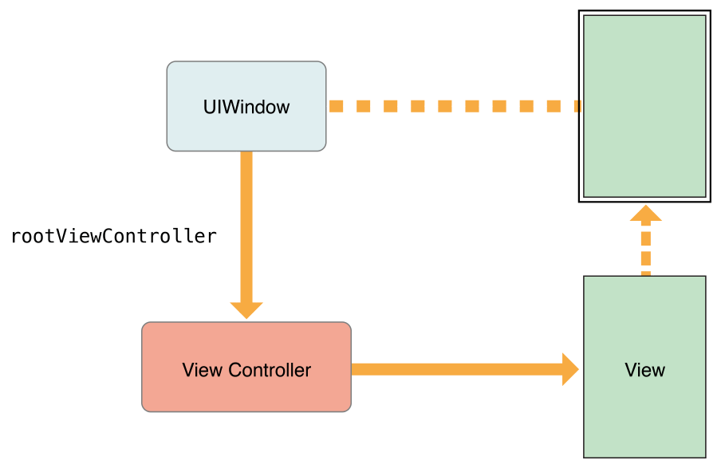
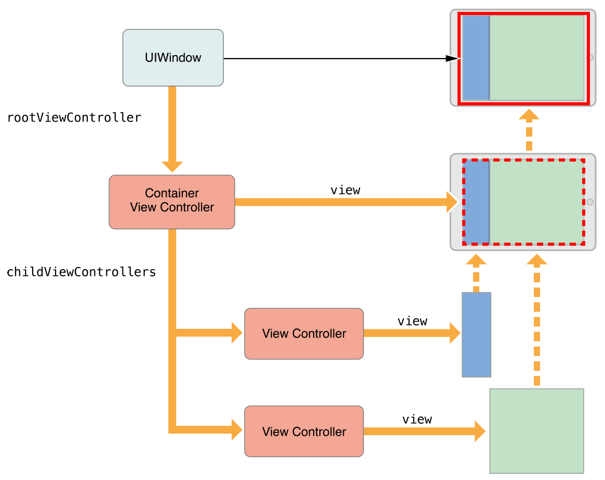
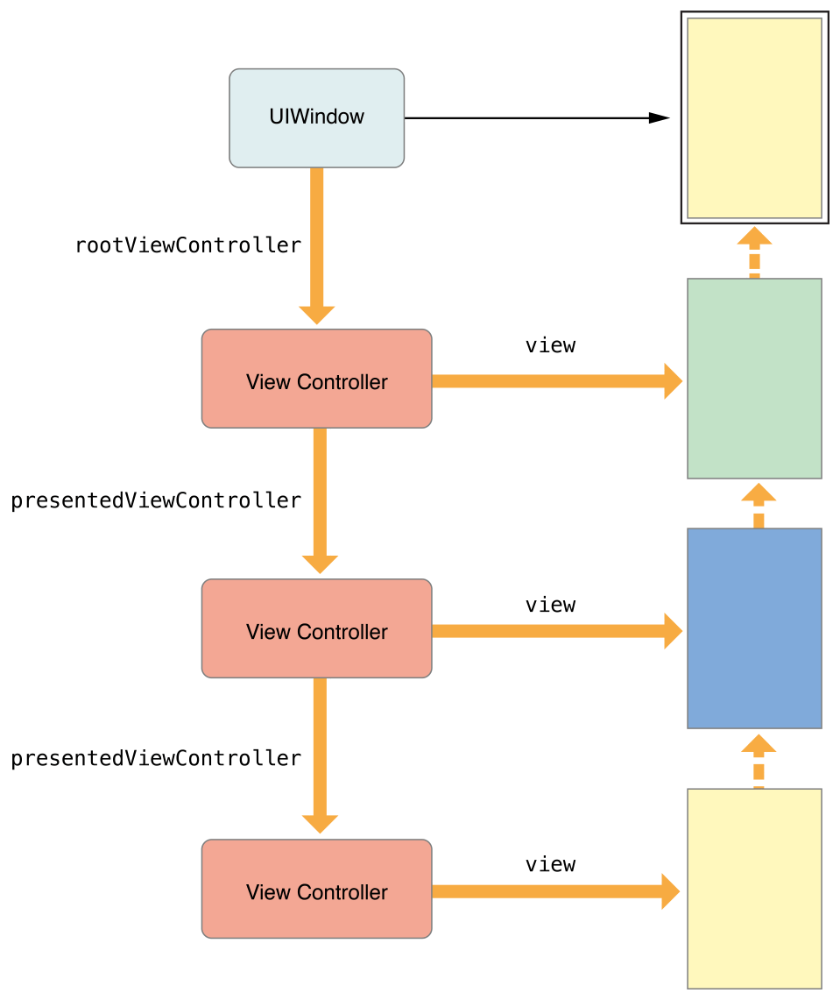
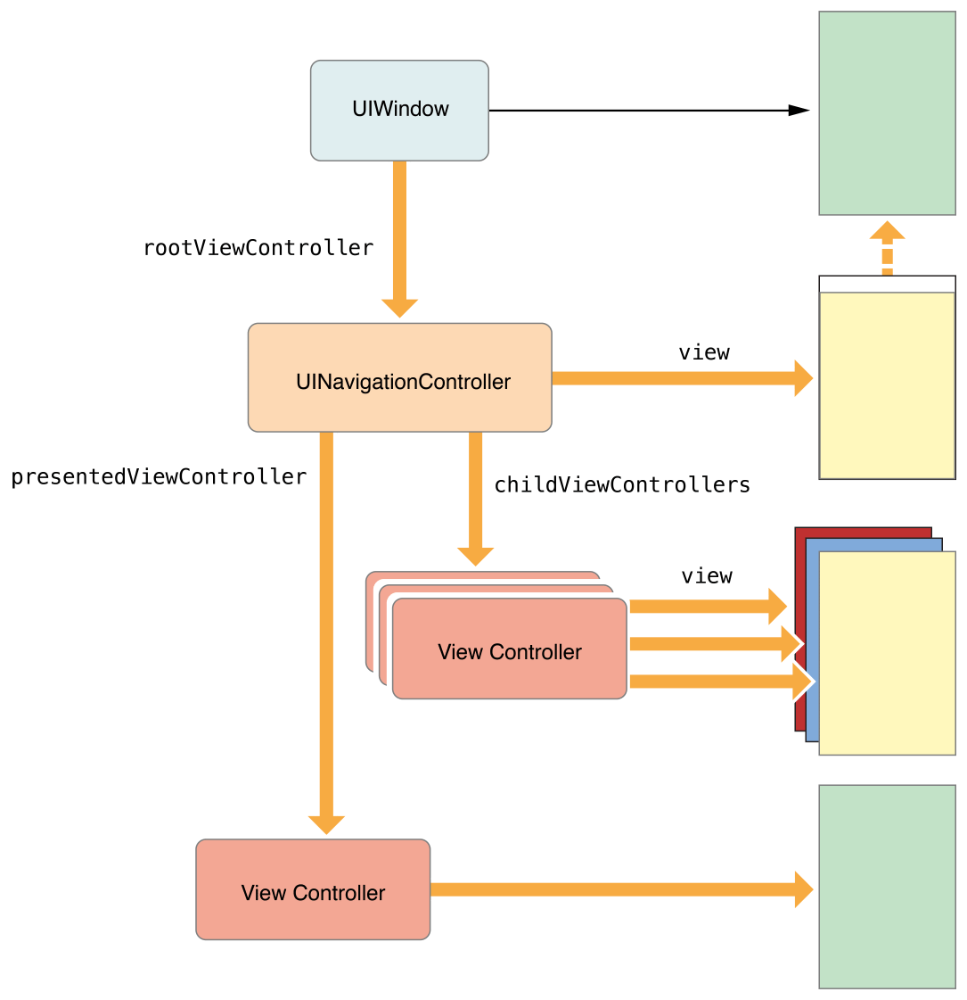

> 导航：[总目录](../../README.md) · [featuredarticles](../../_indexes/featuredarticles.md) · [View Controller Programming Guide for iOS](index.md)

## The View Controller Hierarchy

The relationships among your app’s view controllers define the behaviors required of each view controller. UIKit expects you to use view controllers in prescribed ways. Maintaining the proper view controller relationships ensures that automatic behaviors are delivered to the correct view controllers when they are needed. If you break the prescribed containment and presentation relationships, portions of your app will stop behaving as expected.

### The Root View Controller

The root view controller is the anchor of the view controller hierarchy. Every window has exactly one root view controller whose content fills that window. The root view controller defines the initial content seen by the user. Figure 2-1 shows the relationship between the root view controller and the window. Because the window has no visible content of its own, the view controller’s view provides all of the content.

__Figure 2-1__The root view controller

The root view controller is accessible from the [rootViewController](https://developer.apple.com/documentation/uikit/uiwindow/1621581-rootviewcontroller) property of the `UIWindow` object. When you use storyboards to configure your view controllers, UIKit sets the value of that property automatically at launch time. For windows you create programmatically, you must set the root view controller yourself.

### Container View Controllers

Container view controllers let you assemble sophisticated interfaces from more manageable and reusable pieces. A container view controller mixes the content of one or more child view controllers together with optional custom views to create its final interface. For example, a `UINavigationController` object displays the content from a child view controller together with a navigation bar and optional toolbar, which are managed by the navigation controller. UIKit includes several container view controllers, including [UINavigationController](https://developer.apple.com/documentation/uikit/uinavigationcontroller), [UISplitViewController](https://developer.apple.com/documentation/uikit/uisplitviewcontroller), and [UIPageViewController](https://developer.apple.com/documentation/uikit/uipageviewcontroller).

A container view controller’s view always fills the space given to it. Container view controllers are often installed as root view controllers in a window (as shown in Figure 2-2), but they can also be presented modally or installed as children of other containers. The container is responsible for positioning its child views appropriately. In the figure, the container places the two child views side by side. Although it depends on the container interface, child view controllers may have minimal knowledge of the container and any sibling view controllers.

__Figure 2-2__A container acting as the root view controller

Because a container view controller manages its children, UIKit defines rules for how you set up those children in custom containers. For detailed information about how to create a custom container view controller, see [Implementing a Container View Controller](ImplementingaContainerViewController.md#apple-f4xwc4dqnrsv64tfmyxwi33df52wszbpkridimbqga3tinjxfvbuqmjrfvjvomi).

### Presented View Controllers

Presenting a view controller replaces the current view controller’s contents with those of a new one, usually hiding the previous view controller’s contents. Presentations are most often used for displaying new content modally. For example, you might present a view controller to gather input from the user. You can also use them as a general building block for your app’s interface.

When you present a view controller, UIKit creates a relationship between the _presenting view controller_ and the _presented view controller_, as shown in Figure 2-3. (There is also a reverse relationship from the presented view controller back to its presenting view controller.) These relationships form part of the view controller hierarchy and are a way to locate other view controllers at runtime.

__Figure 2-3__Presented view controllers

When container view controllers are involved, UIKit may modify the presentation chain to simplify the code you have to write. Different presentation styles have different rules for how they appear onscreen—for example, a full-screen presentation always covers the entire screen. When you present a view controller, UIKit looks for a view controller that provides a suitable context for the presentation. In many cases, UIKit chooses the nearest container view controller but it might also choose the window’s root view controller. In some cases, you can also tell UIKit which view controller defines the presentation context and should handle the presentation.

Figure 2-4 shows why containers usually provide the context for a presentation. When performing a full-screen presentation, the new view controller needs to cover the entire screen. Rather than requiring the child to know the bounds of its container, the container decides whether to handle the presentation. Because the navigation controller in the example covers the entire screen, it acts as the presenting view controller and initiates the presentation.

__Figure 2-4__A container and a presented view controller

For information about presentations, see [The Presentation and Transition Process](PresentingaViewController.md#apple-f4xwc4dqnrsv64tfmyxwi33df52wszbpkridimbqga3tinjxfvbuqmjufvjvony).

[The Role of View Controllers](index.md#apple-f4xwc4dqnrsv64tfmyxwi33df52wszbpkridimbqga3tinjxfvbuqmrnknltc)

[Design Tips](DesignTips.md#apple-f4xwc4dqnrsv64tfmyxwi33df52wszbpkridimbqga3tinjxfvbuqnjnknltc)
