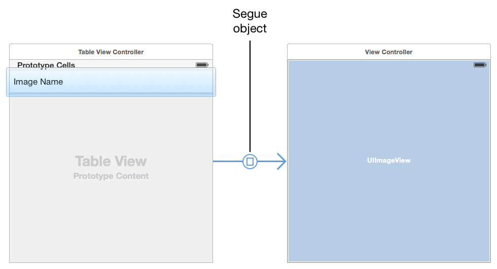
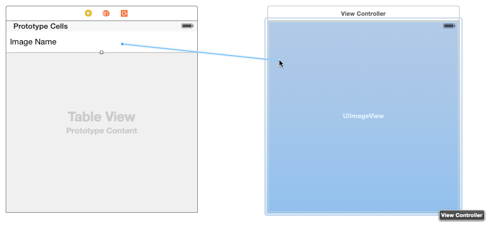
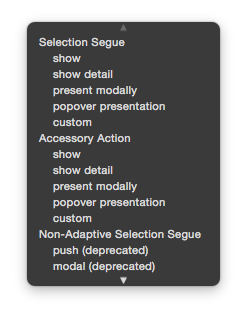
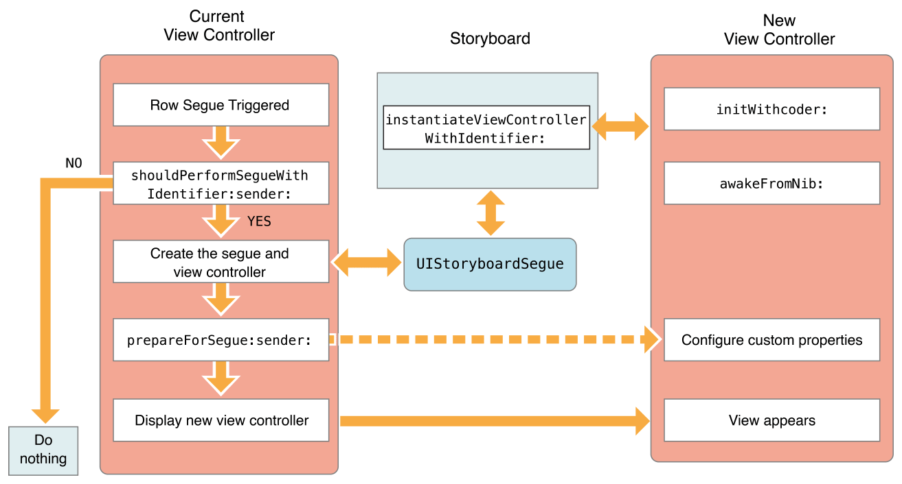
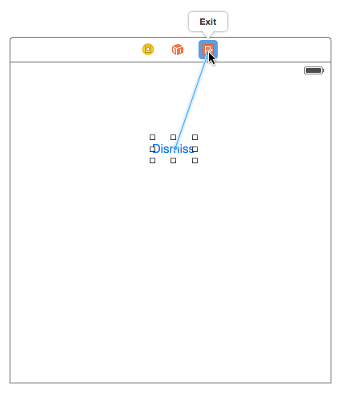

> 导航：[总目录](../../README.md) · [featuredarticles](../../_indexes/featuredarticles.md) · [View Controller Programming Guide for iOS](index.md)

## Using Segues

Use segues to define the flow of your app’s interface. A _segue_ defines a transition between two view controllers in your app’s storyboard file. The starting point of a segue is the button, table row, or gesture recognizer that initiates the segue. The end point of a segue is the view controller you want to display. A segue always presents a new view controller, but you can also use an _unwind segue_ to dismiss a view controller.

__Figure 9-1__A segue between two view controllers

You do not need to trigger segues programmatically. At runtime, UIKit loads the segues associated with a view controller and connects them to the corresponding elements. When the user interacts with the element, UIKit loads the appropriate view controller, notifies your app that the segue is about to occur, and executes the transition. You can use the notifications sent by UIKit to pass data to the new view controller or prevent the segue from happening altogether.

### Creating a Segue Between View Controllers

To create a segue between view controllers in the same storyboard file, Control-click an appropriate element in the first view controller and drag to the target view controller. The starting point of a segue must be a view or object with a defined action, such as a control, bar button item, or gesture recognizer. You can also create segues from cell-based views such as tables and collection views. Figure 9-2 shows the creation of a segue that displays a new view controller when a table row is tapped.

__Figure 9-2__Creating the segue relationship

> [!NOTE]
> 

When you release the mouse button, Interface Builder prompts you to select the type of relationship you want to create between the two view controllers, as shown in Figure 9-3. Select the segue that corresponds to the transition you want.

__Figure 9-3__Selecting the type of segue to create

When selecting the relationship type for your segue, select an adaptive segue whenever possible. Adaptive segues adjust their behavior automatically based on the current environment. For example, the behavior of a Show segue changes based on the presenting view controller. Nonadaptive segues are provided for apps that must also run on iOS 7, which does not support adaptive segues. Figure 9-1 lists the adaptive segues and how they behave in your app.

__Table 9-1__Adaptive segue types

| Segue type | Behavior |
| --- | --- |
| Show (Push) | This segue displays the new content using the [showViewController:sender:](https://developer.apple.com/documentation/uikit/uiviewcontroller/1621377-showviewcontroller) method of the target view controller. For most view controllers, this segue presents the new content modally over the source view controller. Some view controllers specifically override the method and use it to implement different behaviors. For example, a navigation controller pushes the new view controller onto its navigation stack.  UIKit uses the [targetViewControllerForAction:sender:](https://developer.apple.com/documentation/uikit/uiviewcontroller/1621415-targetviewcontroller) method to locate the source view controller. |
| Show Detail (Replace) | This segue displays the new content using the [showDetailViewController:sender:](https://developer.apple.com/documentation/uikit/uiviewcontroller/1621432-showdetailviewcontroller) method of the target view controller. This segue is relevant only for view controllers embedded inside a [UISplitViewController](https://developer.apple.com/documentation/uikit/uisplitviewcontroller) object. With this segue, a split view controller replaces its second child view controller (the detail controller) with the new content. Most other view controllers present the new content modally.  UIKit uses the [targetViewControllerForAction:sender:](https://developer.apple.com/documentation/uikit/uiviewcontroller/1621415-targetviewcontroller) method to locate the source view controller. |
| Present Modally | This segue displays the view controller modally using the specified presentation and transition styles. The view controller that defines the appropriate presentation context handles the actual presentation. |
| Present as Popover | In a horizontally regular environment, the view controller appears in a popover. In a horizontally compact environment, the view controller is displayed using a full-screen modal presentation. |

After creating a segue, select the segue object and assign an identifier to it using the attributes inspector. During a segue, you can use the identifier to determine which segue was triggered, which is especially useful if your view controller supports multiple segues. The identifier is included in the [UIStoryboardSegue](https://developer.apple.com/documentation/uikit/uistoryboardsegue) object delivered to your view controller when the segue is performed.

### Modifying a Segue’s Behavior at Runtime

Figure 9-4 shows what happens when a segue is triggered. Most of the work happens in the presenting view controller, which manages the transition to the new view controller. The configuration of the new view controller follows essentially the same process as when you create the view controller yourself and present it. Because segues are configured from storyboards, both view controllers involved in the segue must be in the same storyboard.

__Figure 9-4__Displaying a view controller using a segue

During a segue, UIKit calls methods of the current view controller to give you opportunities to affect the outcome of the segue.

- The [shouldPerformSegueWithIdentifier:sender:](https://developer.apple.com/documentation/uikit/uiviewcontroller/1621502-shouldperformseguewithidentifier) method gives you an opportunity to prevent a segue from happening. Returning `NO``false` from this method causes the segue to fail quietly but does not prevent other actions from happening. For example, a tap in a table row still causes the table to call any relevant delegate methods.
- The [prepareForSegue:sender:](https://developer.apple.com/documentation/uikit/uiviewcontroller/1621490-prepareforsegue) method of the source view controller lets you pass data from the source view controller to the destination view controller. The [UIStoryboardSegue](https://developer.apple.com/documentation/uikit/uistoryboardsegue) object passed to the method contains a reference to the destination view controller along with other segue-related information.

### Creating an Unwind Segue

Unwind segues let you dismiss view controllers that have been presented. You create unwind segues in Interface Builder by linking a button or other suitable object to the Exit object of the current view controller. When the user taps the button or interacts with the appropriate object, UIKit searches the view controller hierarchy for an object capable of handling the unwind segue. It then dismisses the current view controller and any intermediate view controllers to reveal the target of the unwind segue.

__To create an unwind segue__

1. Choose the view controller that should appear onscreen at the end of an unwind segue.
2. Define an unwind action method on the view controller you chose.

   The Swift syntax for this method is as follows:

   - `@IBAction func myUnwindAction(unwindSegue: UIStoryboardSegue)`

   The Objective-C syntax for this method is as follows:

   - `- (IBAction)myUnwindAction:(UIStoryboardSegue*)unwindSegue`
3. Navigate to the view controller that initiates the unwind action.
4. Control-click the button (or other object) that should initiate the unwind segue. This element should be in the view controller you want to dismiss.
5. Drag to the Exit object at the top of the view controller scene.
6. Select your unwind action method from the relationship panel.

You must define an unwind action method in one of your view controllers before trying to create the corresponding unwind segue in Interface Builder. The presence of that method is required and tells Interface Builder that there is a valid target for the unwind segue.

Use the implementation of your unwind action method to perform any tasks that are specific to your app. You do not need to dismiss any view controllers involved in the segue yourself; UIKit does that for you. Instead, use the segue object to fetch the view controller being dismissed so that you can retrieve data from it. You can also use the unwind action to update the current view controller before the unwind segue finishes.

### Initiating a Segue Programmatically

Segues are usually triggered because of the connections you create in your storyboard file. However, there may be times when you cannot create segues in your storyboard, perhaps because the destination view controller is not yet known. For example, a game app might transition to different screens depending on the outcome of the game. In those situations, you can trigger segues programmatically from your code using the [performSegueWithIdentifier:sender:](https://developer.apple.com/documentation/uikit/uiviewcontroller/1621413-performseguewithidentifier) method of the current view controller.

Listing 9-1 illustrates a segue that presents a specific view controller when rotating from portrait to landscape. Because the notification object in this case provides no useful information for performing the segue command, the view controller designates itself as the sender of the segue.

__Listing 9-1__Triggering a segue programmatically

1. `- (void)orientationChanged:(NSNotification *)notification {`
2. `UIDeviceOrientation deviceOrientation = [UIDevice currentDevice].orientation;`
3. `if (UIDeviceOrientationIsLandscape(deviceOrientation) &&`
4. `!isShowingLandscapeView) {`
5. `[self performSegueWithIdentifier:@"DisplayAlternateView" sender:self];`
6. `isShowingLandscapeView = YES;`
7. `}`
8. `// Remainder of example omitted.`
9. `}`

### Creating a Custom Segue

Interface Builder provides segues for all of the standard ways to transition from one view controller to another—from presenting a view controller to displaying a controller in a popover. However, if one of those segues doesn’t do what you want, you can create a custom segue.

### The Life Cycle of a Segue

To understand how custom segues work, you need to understand the life cycle of a segue object. Segue objects are instances of the [UIStoryboardSegue](https://developer.apple.com/documentation/uikit/uistoryboardsegue) class or one of its subclasses. Your app never creates segue objects directly; UIKit creates them when a segue is triggered. Here’s what happens:

1. The view controller to be presented is created and initialized.
2. The segue object is created and its [initWithIdentifier:source:destination:](https://developer.apple.com/documentation/uikit/uistoryboardsegue/1621908-initwithidentifier) method is called. The identifier is the unique string you provided for the segue in Interface Builder, and the two other parameters represent the two controller objects in the transition.
3. The presenting view controller’s [prepareForSegue:sender:](https://developer.apple.com/documentation/uikit/uiviewcontroller/1621490-prepareforsegue) method is called. See [Modifying a Segue’s Behavior at Runtime](#apple-f4xwc4dqnrsv64tfmyxwi33df52wszbpkridimbqga3tinjxfvbuqmjvfvjvomjr).
4. The segue object’s [perform](https://developer.apple.com/documentation/uikit/uistoryboardsegue/1621912-perform) method is called. This method performs a transition to bring the new view controller onscreen.
5. The reference to the segue object is released.

### Implementing a Custom Segue

To implement a custom segue, subclass `UIStoryboardSegue` and implement the following methods:

- Override the `initWithIdentifier:source:destination:` method and use it to initialize your custom segue object. Always call `super` first.
- Implement the `perform` method and use it to configure your transition animations.

> [!NOTE]
> 

Listing 9-2 shows a very simple custom segue. This example simply presents the destination view controller without any sort of animation, but you can extend this idea with your own animations as necessary.

__Listing 9-2__A custom segue

1. `- (void)perform {`
2. `// Add your own animation code here.`
4. `[[self sourceViewController] presentViewController:[self destinationViewController] animated:NO completion:nil];`
5. `}`

[Presenting a View Controller](PresentingaViewController.md#apple-f4xwc4dqnrsv64tfmyxwi33df52wszbpkridimbqga3tinjxfvbuqmjufvjvomi)

[Customizing the Transition Animations](CustomizingtheTransitionAnimations.md#apple-f4xwc4dqnrsv64tfmyxwi33df52wszbpkridimbqga3tinjxfvbuqmjwfvjvomi)
