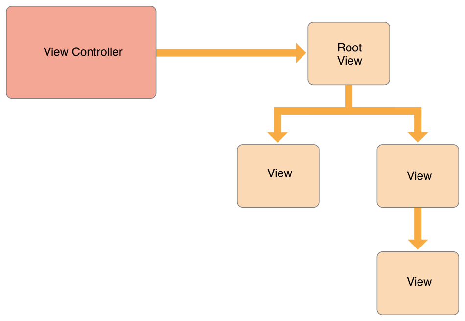
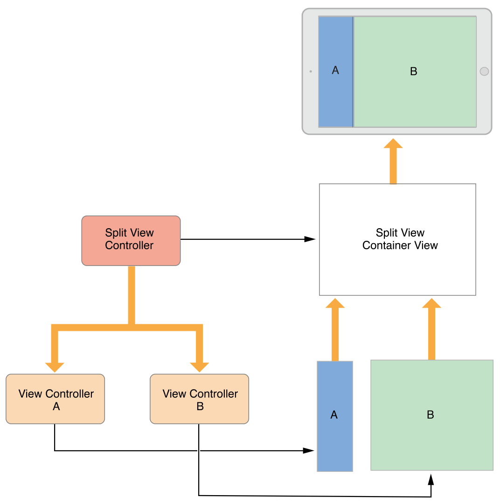
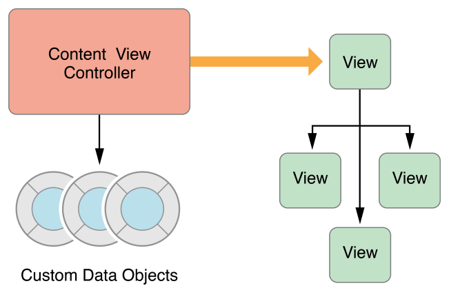
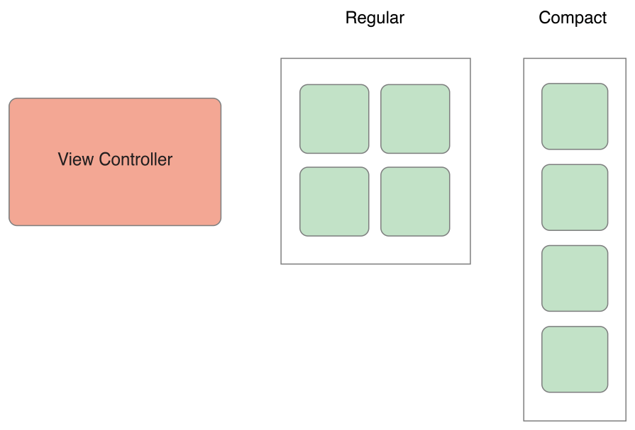

> 导航：[总目录](../../README.md) · [featuredarticles](../../_indexes/featuredarticles.md)

## The Role of View Controllers

View controllers are the foundation of your app’s internal structure. Every app has at least one view controller, and most apps have several. Each view controller manages a portion of your app’s user interface as well as the interactions between that interface and the underlying data. View controllers also facilitate transitions between different parts of your user interface.

Because they play such an important role in your app, view controllers are at the center of almost everything you do. The [UIViewController](https://developer.apple.com/documentation/uikit/uiviewcontroller) class defines the methods and properties for managing your views, handling events, transitioning from one view controller to another, and coordinating with other parts of your app. You subclass `UIViewController` (or one of its subclasses) and add the custom code you need to implement your app’s behavior.

There are two types of view controllers:

- _Content view controllers_ manage a discrete piece of your app’s content and are the main type of view controller that you create.
- _Container view controllers_ collect information from other view controllers (known as _child view controllers_) and present it in a way that facilitates navigation or presents the content of those view controllers differently.

Most apps are a mixture of both types of view controllers.

### View Management

The most important role of a view controller is to manage a hierarchy of views. Every view controller has a single root view that encloses all of the view controller’s content. To that root view, you add the views you need to display your content. Figure 1-1 illustrates the built-in relationship between the view controller and its views. The view controller always has a reference to its root view and each view has strong references to its subviews.

__Figure 1-1__Relationship between a view controller and its views

> [!NOTE]
> 

A content view controller manages all of its views by itself. A container view controller manages its own views plus the root views from one or more of its child view controllers. The container does not manage the content of its children. It manages only the root view, sizing and placing it according to the container’s design. Figure 1-2 illustrates the relationship between a split view controller and its children. The split view controller manages the overall size and position of its child views, but the child view controllers manage the actual contents of those views.

__Figure 1-2__View controllers can manage content from other view controllers

For information about managing your view controller’s views, see [Managing View Layout](DefiningYourSubclass.md#apple-f4xwc4dqnrsv64tfmyxwi33df52wszbpkridimbqga3tinjxfvbuqnznknltm).

### Data Marshaling

A view controller acts as an intermediary between the views it manages and the data of your app. The methods and properties of the [UIViewController](https://developer.apple.com/documentation/uikit/uiviewcontroller) class let you manage the visual presentation of your app. When you subclass `UIViewController`, you add any variables you need to manage your data in your subclass. Adding custom variables creates a relationship like the one in Figure 1-3, where the view controller has references to your data and to the views used to present that data. Moving data back and forth between the two is your responsibility.

__Figure 1-3__A view controller mediates between data objects and views

You should always maintain a clean separation of responsibilities within your view controllers and data objects. Most of the logic for ensuring the integrity of your data structures belongs in the data objects themselves. The view controller might validate input coming from views and then package that input in the format that your data objects require, but you should minimize the view controller’s role in managing the actual data.

A [UIDocument](https://developer.apple.com/documentation/uikit/uidocument) object is one way to manage your data separately from your view controllers. A document object is a controller object that knows how to read and write data to persistent storage. When you subclass, you add whatever logic and methods you need to extract that data and pass it to a view controller or other parts of your app. The view controller might store a copy of any data it receives to make it easier to update views, but the document still owns the true data.

### User Interactions

View controllers are [responder objects](https://developer.apple.com/library/archive/documentation/General/Conceptual/Devpedia-CocoaApp/Responder.html#//apple_ref/doc/uid/TP40009071-CH1) and are capable of handling events that come down the responder chain. Although they are able to do so, view controllers rarely handle touch events directly. Instead, views usually handle their own touch events and report the results to a method of an associated [delegate](https://developer.apple.com/library/archive/documentation/General/Conceptual/DevPedia-CocoaCore/Delegation.html#//apple_ref/doc/uid/TP40008195-CH14) or target object, which is usually the view controller. So most events in a view controller are handled using delegate methods or [action methods](https://developer.apple.com/library/archive/documentation/General/Conceptual/Devpedia-CocoaApp/TargetAction.html#//apple_ref/doc/uid/TP40009071-CH3).

For more information about implementing action methods in your view controller, see [Handling User Interactions](DefiningYourSubclass.md#apple-f4xwc4dqnrsv64tfmyxwi33df52wszbpkridimbqga3tinjxfvbuqnznknltcmi). For information about handling other types of events, see _Event Handling Guide for iOS_.

### Resource Management

A view controller assumes all responsibility for its views and any objects that it creates. The [UIViewController](https://developer.apple.com/documentation/uikit/uiviewcontroller) class handles most aspects of view management automatically. For example, UIKit automatically releases any view-related resources that are no longer needed. In your `UIViewController` subclasses, you are responsible for managing any objects you create explicitly.

When the available free memory is running low, UIKit asks apps to free up any resources that they no longer need. One way it does this is by calling the [didReceiveMemoryWarning](https://developer.apple.com/documentation/uikit/uiviewcontroller/1621409-didreceivememorywarning) method of your view controllers. Use that method to remove references to objects that you no longer need or can recreate easily later. For example, you might use that method to remove cached data. It is important to release as much memory as you can when a low-memory condition occurs. Apps that consume too much memory may be terminated outright by the system to recover memory.

### Adaptivity

View controllers are responsible for the presentation of their views and for adapting that presentation to match the underlying environment. Every iOS app should be able to run on iPad and on several different sizes of iPhone. Rather than provide different view controllers and view hierarchies for each device, it is simpler to use a single view controller that adapts its views to the changing space requirements.

In iOS, view controllers need to handle coarse-grained changes and fine-grained changes. Coarse-grained changes happen when a view controller’s traits change. Traits are attributes that describe the overall environment, such as the display scale. Two of the most important traits are the view controller’s horizontal and vertical size classes, which indicate how much space the view controller has in the given dimension. You can use size class changes to change the way you lay out your views, as shown in Figure 1-4. When the horizontal size class is _regular_, the view controller takes advantage of the extra horizontal space to arrange its content. When the horizontal size class is _compact_, the view controller arranges its content vertically.

__Figure 1-4__Adapting views to size class changes

Within a given size class, it is possible for more fine-grained size changes to occur at any time. When the user rotates an iPhone from portrait to landscape, the size class might not change but the screen dimensions usually change. When you use Auto Layout, UIKit automatically adjusts the size and position of views to match the new dimensions. View controllers can make additional adjustments as needed.

For more information about adaptivity, see [The Adaptive Model](TheAdaptiveModel.md#apple-f4xwc4dqnrsv64tfmyxwi33df52wszbpkridimbqga3tinjxfvbuqmjzfvjvomi).

[The View Controller Hierarchy](TheViewControllerHierarchy.md#apple-f4xwc4dqnrsv64tfmyxwi33df52wszbpkridimbqga3tinjxfvbuqmztfvjvomi)
