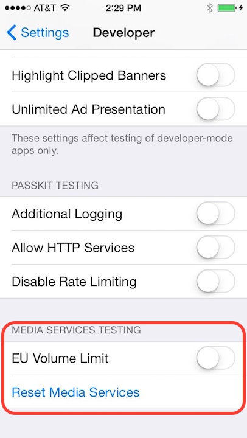

> 导航：[总目录](../../README.md) · [qa](../../_indexes/qa.md)

Technical Q&A QA1749

# AVAudioSession - General recommendations for handling AVAudioSessionMediaServicesWereResetNotification

## Q:  Should my application register for `AVAudioSessionMediaServicesWereResetNotification` and if so, how do I recover once media services were reset?

A: While this is a very rare occurrence, it is good practice to monitor for the `AVAudioSessionMediaServicesWereResetNotification` notification and if it does occur, take the appropriate steps to re-initialize any audio objects used by your application.

Re-initializing generally requires disposing all of an application's now orphaned audio objects (for example `AudioQueue`, `AURemoteIO`, `AudioConverter` and so on since none of them will function as expected), and re-creating them as if the application was starting up for the first time. Any errors returned during disposing can safely be ignored.

General recommendations for handling a media services reset (`AVAudioSessionMediaServicesWereResetNotification`):

- Register a notification listener for `AVAudioSessionMediaServicesWereResetNotification`

Upon receiving the `AVAudioSessionMediaServicesWereResetNotification` notification, applications should:

- Dispose orphaned audio objects and create new audio objects
- Reset any internal audio state being tracked, including all properties of `AVAudioSession`
- When appropriate, reactivate the `AVAudioSession` using the `setActive:error:` method

__Figure 1__

---

#### Document Revision History

| __Date__ | __Notes__ |
| 2015-05-21 | Adding note regarding how to test resetting the media server. |
| 2013-10-01 | Updated for AVAudioSession |
| 2011-08-22 | New document that discusses some steps audio applications may take to recover if media services were reset. |

