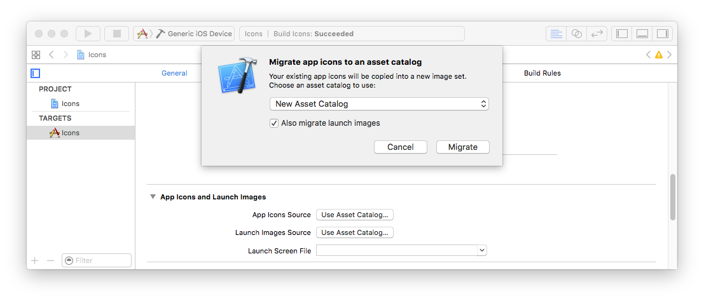

> 导航：[总目录](../../README.md) · [qa](../../_indexes/qa.md)


Technical Q&A QA1686

# App Icons on iPhone, iPad and Apple Watch

## Q:  What icons need to be included in an iOS Application, Apple Watch Application, iMessage Application, or Sticker Pack Application?

A: Below are guidelines for handling icon files for iPhone-only apps, iPad-only apps, universal apps, Apple Watch apps, and iMessage extensions. If you are building an iMessage Application or Sticker Pack Application, you must include icons for both the containing application and the iMessage extension.

If you don't provide artwork for one of the listed optional icons, the system will automatically scale one of your existing icon images to an appropriate size. It is strongly recommended that your application include artwork for all the icons listed, at the specific sizes needed.

Prior to iOS 3.2, icon images for iPhone applications were required to follow a strict naming convention. These legacy names are still listed in the tables below along with example names for the more recent icons. Except for `iTunesArtwork`, icon images included in your app can have arbitrary names.

iOS ignores the PPI (Pixels Per Inch) of icon images. You may author your icon images at any PPI but their width and height, as measured in pixels, must match the values in the tables below.

iPhone-only applications use the following icons. Items marked with "__Required__" must be included.

__Table 1__  iPhone-only application icon requirements.

| Image Size (px) | File Name | Used For | App Store | Ad Hoc |
| 512x512 | iTunesArtwork | App list in iTunes | Do not include | Optional but recommended |
| 1024x1024 | iTunesArtwork@2x | App list in iTunes on devices with retina display | Do not include | Optional but recommended |
| 120x120 | Icon-60@2x.png | Home screen on iPhone/iPod Touch with retina display | Required | Required |
| 180x180 | Icon-60@3x.png | Home screen on iPhone with retina HD display | Optional but recommended | Optional but recommended |
| 76x76 | Icon-76.png | Home screen on iPad | Optional but recommended | Optional but recommended |
| 152x152 | Icon-76@2x.png | Home screen on iPad with retina display | Optional but recommended | Optional but recommended |
| 167x167 | Icon-83.5@2x.png | Home screen on iPad Pro | Optional but recommended | Optional but recommended |
| 40x40 | Icon-Small-40.png | Spotlight | Optional but recommended | Optional but recommended |
| 80x80 | Icon-Small-40@2x.png | Spotlight on devices with retina display | Optional but recommended | Optional but recommended |
| 120x120 | Icon-Small-40@3x.png | Spotlight on devices with retina HD display | Optional but recommended | Optional but recommended |
| 29x29 | Icon-Small.png | Settings | Recommended if you have a Settings bundle, optional otherwise | Recommended if you have a Settings bundle, optional otherwise |
| 58x58 | Icon-Small@2x.png | Settings on devices with retina display | Recommended if you have a Settings bundle, optional otherwise | Recommended if you have a Settings bundle, optional otherwise |
| 87x87 | Icon-Small@3x.png | Settings on devices with retina HD display | Recommended if you have a Settings bundle, optional otherwise | Recommended if you have a Settings bundle, optional otherwise |

In addition to the above icons, iPhone-only applications with a deployment target of iOS 6.1 or earlier use the following icons. Items marked with "__Required__" must be included if the application's deployment target is iOS 6.1 or earlier.

__Table 2__  iPhone-only application icon requirements (iOS 6.1 and earlier).

| Image Size (px) | File Name | Used For | App Store | Ad Hoc |
| 57x57 | Icon.png | Home screen on iPhone/iPod touch (iOS 6.1 and earlier) | Required | Required |
| 114x114 | Icon@2x.png | Home screen on iPhone/iPod Touch with retina display (iOS 6.1 and earlier) | Optional but recommended | Optional but recommended |
| 72x72 | Icon-72.png | Home screen on iPad (iOS 6.1 and earlier) | Optional but recommended | Optional but recommended |
| 144x144 | Icon-72@2x.png | Home screen on iPad with retina display (iOS 6.1 and earlier) | Optional but recommended | Optional but recommended |
| 29x29 | Icon-Small.png | Spotlight on iPhone/iPod Touch (iOS 6.1 and earlier), and Settings on all devices | Recommended if you have a Settings bundle, otherwise optional but recommended | Recommended if you have a Settings bundle, otherwise optional but recommended |
| 58x58 | Icon-Small@2x.png | Spotlight on iPhone/iPod Touch with retina display (iOS 6.1 and earlier), and Settings on all devices with retina display | Recommended if you have a Settings bundle, otherwise optional but recommended | Recommended if you have a Settings bundle, otherwise optional but recommended |
| 50x50 | Icon-Small-50.png | Spotlight on iPad (iOS 6.1 and earlier) | Optional but recommended | Optional but recommended |
| 100x100 | Icon-Small-50@2x.png | Spotlight on iPad with retina display (iOS 6.1 and earlier) | Optional but recommended | Optional but recommended |

You can include distinct images for the iPhone and iPad icons in categories where the required sizes are equivalent, for example, Settings.

iPad-only applications use the following icons. Items marked with "__Required__" must be included.

__Table 3__  iPad-only application icon requirements.

| Image Size (px) | File Name | Used For | App Store | Ad Hoc |
| 512x512 | iTunesArtwork | Ad Hoc iTunes | Do not include | Optional but recommended |
| 1024x1024 | iTunesArtwork@2x | Ad Hoc iTunes on devices with retina display | Do not include | Optional but recommended |
| 76x76 | Icon-76.png | Home screen on iPad | Required | Required |
| 152x152 | Icon-76@2x.png | Home screen on iPad with retina display | Optional but recommended | Optional but recommended |
| 167x167 | Icon-83.5@2x.png | Home screen on iPad Pro | Optional but recommended | Optional but recommended |
| 40x40 | Icon-Small-40.png | Spotlight | Optional but recommended | Optional but recommended |
| 80x80 | Icon-Small-40@2x.png | Spotlight on devices with retina display | Optional but recommended | Optional but recommended |
| 29x29 | Icon-Small.png | Settings | Recommended if you have a Settings bundle, otherwise optional but recommended | Recommended if you have a Settings bundle, otherwise optional but recommended |
| 58x58 | Icon-Small@2x.png | Settings on devices with retina display | Recommended if you have a Settings bundle, otherwise optional but recommended | Recommended if you have a Settings bundle, otherwise optional but recommended |

In addition to the above icons, iPad-only applications with a deployment target of iOS 6.1 or earlier use the following icons. Items marked with "__Required__" must be included if the application's deployment target is iOS 6.1 or earlier.

__Table 4__  iPad-only application icon requirements (iOS 6.1 and earlier).

| Image Size (px) | File Name | Used For | App Store | Ad Hoc |
| 72x72 | Icon-72.png | Home screen on iPad (iOS 6.1 and earlier) | Required | Required |
| 144x144 | Icon-72@2x.png | Home screen on iPad with retina display (iOS 6.1 and earlier) | Optional but recommended | Optional but recommended |
| 50x50 | Icon-Small-50.png | Spotlight on iPad (iOS 6.1 and earlier) | Optional but recommended | Optional but recommended |
| 100x100 | Icon-Small-50@2x.png | Spotlight on iPad with retina display (iOS 6.1 and earlier) | Optional but recommended | Optional but recommended |

Universal applications use the following icons. Items marked with "__Required__" must be included.

__Table 5__  Universal application icon requirements.

| Image Size (px) | File Name | Used For | App Store | Ad Hoc |
| 512x512 | iTunesArtwork | App list in iTunes | Do not include | Optional but recommended |
| 1024x1024 | iTunesArtwork@2x | App list in iTunes for devices with retina display | Do not include | Optional but recommended |
| 120x120 | Icon-60@2x.png | Home screen on iPhone/iPod Touch with retina display | Required | Required |
| 180x180 | Icon-60@3x.png | Home screen on iPhone with retina HD display | Optional but recommended | Optional but recommended |
| 76x76 | Icon-76.png | Home screen on iPad | Required | Required |
| 152x152 | Icon-76@2x.png | Home screen on iPad with retina display | Optional but recommended | Optional but recommended |
| 167x167 | Icon-83.5@2x.png | Home screen on iPad Pro | Optional but recommended | Optional but recommended |
| 40x40 | Icon-Small-40.png | Spotlight | Optional but recommended | Optional but recommended |
| 80x80 | Icon-Small-40@2x.png | Spotlight on devices with retina display | Optional but recommended | Optional but recommended |
| 120x120 | Icon-Small-40@3x.png | Spotlight on devices with retina HD display | Optional but recommended | Optional but recommended |
| 29x29 | Icon-Small.png | Settings | Recommended if you have a Settings bundle, optional otherwise | Recommended if you have a Settings bundle, optional otherwise |
| 58x58 | Icon-Small@2x.png | Settings on devices with retina display | Recommended if you have a Settings bundle, optional otherwise | Recommended if you have a Settings bundle, optional otherwise |
| 87x87 | Icon-Small@3x.png | Settings on devices with retina HD display | Recommended if you have a Settings bundle, optional otherwise | Recommended if you have a Settings bundle, optional otherwise |

In addition to the above icons, universal applications with a deployment target of iOS 6.1 or earlier use the following icons. Items marked with "__Required__" must be included if the application's deployment target is iOS 6.1 or earlier.

__Table 6__  Universal application icon requirements (iOS 6.1 and earlier).

| Image Size (px) | File Name | Used For | App Store | Ad Hoc |
| 57x57 | Icon.png | Home screen on iPhone/iPod touch (iOS 6.1 and earlier) | Required | Required |
| 114x114 | Icon@2x.png | Home screen on iPhone/iPod Touch with retina display (iOS 6.1 and earlier) | Optional but recommended | Optional but recommended |
| 72x72 | Icon-72.png | Home screen on iPad (iOS 6.1 and earlier) | Required | Required |
| 144x144 | Icon-72@2x.png | Home screen on iPad with retina display (iOS 6.1 and earlier) | Optional but recommended | Optional but recommended |
| 29x29 | Icon-Small.png | Spotlight on iPhone/iPod Touch (iOS 6.1 and earlier), and Settings on all devices | Recommended if you have a Settings bundle, otherwise optional but recommended | Recommended if you have a Settings bundle, otherwise optional but recommended |
| 58x58 | Icon-Small@2x.png | Spotlight on iPhone/iPod Touch with retina display (iOS 6.1 and earlier), and Settings on all devices with retina display | Recommended if you have a Settings bundle, otherwise optional but recommended | Recommended if you have a Settings bundle, otherwise optional but recommended |
| 50x50 | Icon-Small-50.png | Spotlight on iPad (iOS 6.1 and earlier) | Optional but recommended | Optional but recommended |
| 100x100 | Icon-Small-50@2x.png | Spotlight on iPad with retina display (iOS 6.1 and earlier) | Optional but recommended | Optional but recommended |

You can include distinct images for the iPhone and iPad icons in categories where the required sizes are equivalent, for example, Settings.

Watch applications use the following icons. Items marked with "__Required__" must be included.

__Table 7__  Watch application icon requirements.

| Image Size (px) | File Name | Used For | App Store | Ad Hoc |
| 80x80 | AppIcon40x40@2x.png | Home screen on Apple Watch (38mm/42mm), Long-Look notification on Apple Watch (38mm) | Required | Required |
| 88x88 | AppIcon44x44@2x.png | Long-Look notification on Apple Watch (42mm) | Required | Required |
| 172x172 | AppIcon86x86@2x.png | Short-Look notification on Apple Watch (38mm) | Required | Required |
| 196x196 | AppIcon98x98@2x.png | Short-Look notification on Apple Watch (42mm) | Required | Required |
| 48x48 | AppIcon24x24@2x.png | Notification center on Apple Watch (38mm) | Required | Required |
| 55x55 | AppIcon27.5x27.5@2x.png | Notification center on Apple Watch (42mm) | Required | Required |
| 58x58 | AppIcon29x29@2x.png | Settings in the Apple Watch companion app on iPhone | Required | Required |
| 87x87 | AppIcon29x29@3x.png | Settings in the Apple Watch companion app on iPhone 6 Plus | Required | Required |

iMessage extensions and Sticker Pack extensions use the following icons. Items marked with "__Required__" must be included.

__Table 8__  iMessage extension and Sticker Pack extension icon requirements.

| Image Size (px) | File Name | Used For | App Store | Ad Hoc |
| 1024x768 | Messages1024x768.png | Messages App Store | Required | Required |
| 120x90 | Messages60x45@2x.png | Messages app drawer on iPhone/iPod Touch with retina display | Required | Required |
| 180x135 | Messages60x45@3x.png | Messages app drawer on iPhone with retina HD display | Required | Required |
| 134x100 | Messages67x50@2x.png | Messages app drawer on iPad with retina display | Required | Required |
| 148x110 | Messages74x55@2x.png | Messages app drawer on iPad Pro | Required | Required |
| 54x40 | Messages27x20@2x.png | Breadcrumb icons in the chat transcript on devices with retina display. | Required | Required |
| 81x60 | Messages27x20@3x.png | Breadcrumb icons in the chat transcript on iPhone with retina HD display | Required | Required |
| 64x48 | Messages32x24@2x.png | Messages app management screen, message bubble branding on devices with retina display | Required | Required |
| 96x72 | Messages32x24@3x.png | Messages app management screen, message bubble branding on iPhone with retina HD display | Required | Required |

Asset catalogs are the preferred way to manage your application's icons. New projects are configured to use asset catalogs by default. If you have an older project, see [Migrating an iOS App Icon Set](#apple-f4xwc4dqnrsv64tfmyxwi33df52wszbpirkfgnbqgaydsobygiwugsbrfvgusr2sifkek) to learn how to move existing app icons and launch images into an asset catalog. If you prefer not to use asset catalogs, or if you must support iOS 4.3, you can manually configure your application's icons by editing the information property list for your application. See [Configuring Icons Without an Asset Catalog](#apple-f4xwc4dqnrsv64tfmyxwi33df52wszbpirkfgnbqgaydsobygiwugsbrfvguctsvifga).

1. Select the asset catalog in the project navigator. It is named Assets.xcassets for new projects, or Images.xcassets for migrated projects, by default.
2. From the set outline view (left column), select the app icon set. For new or migrated projects it will be named 'AppIcon'. You may need to create an icon set by clicking the (+) button in the bottom left corner of the editor and choosing __App Icons and Launch Images__ > __New iOS App Icon__ from the context menu.

__Figure 1__  The AppIcon set selected in the asset catalog.

!

The set will only contain image wells for icons that are relevant depending upon the project's configuration at the time the asset catalog was created. If an image well is missing, expand the attributes inspector and select the appropriate options from the pull-down menus under the App Icon section, depending upon the project's deployment target and supported devices.

__Figure 2__  Enable the necessary image wells under the App Icon section of the attributes inspector.

!

1. Drag images from the Finder onto each image well to configure the associated icon.

__Figure 3__  Complete icon set for a universal application with a deployment target less than iOS 7.0

!!

Asset catalogs create a copy of images added to them. If you had previously added the images as resources to your project you can safely remove them.

1. Configure your application to use the new icon set.
2. 1. Select the project in the project navigator.
   2. Select the application target from the list in the left column of the project editor.
   3. Switch to the General pane at the top of the project editor.
   4. Select the app icon set from the App Icons Source popup menu under the App Icons And Launch Images section.

__Figure 4__  Selecting the icon set for the application's target.

!!

Simplify image management by moving existing app icons into an asset catalog.

1. In the project navigator, select your target.
2. Open the General pane, and scroll to the App Icons and Launch Images section.
3. Click the Use Asset Catalog button next to the App Icons Source label.



1. Configure any options in the dialog. To choose a different asset catalog or to create a new one, click on the pop-up menu. Choose an existing asset catalog or choose New Asset Catalog to create a new one. The menu is shown when there is at least one asset catalog in the project.
2. Click the Migrate button. If there is no asset catalog or if you selected New Asset Catalog from the pop-up menu, you will be prompted to create one. Canceling creation of the new asset catalog will cancel the migration.

The icons are migrated to the new or existing asset catalog.

1. Follow the steps in the [Xcode Help](http://help.apple.com/xcode/mac/8.0/#/dev81ce1d383) to add each icon image to your project as a resource.
2. Locate the target's information property list in the project navigator. By default it will be named `Info.plist`. Command click on it and choose __Open As > Source Code__ from the context menu.

As of iOS 5.0, icons are specified by including the `CFBundleIcons` key. Older applications may have previously specified their icons by including the `CFBundleIconFiles` key. This key should be removed if it is still present (don't forget to remove any device specific variants too). All applications should migrate to the `CFBundleIcons` key to specify their icons.

The value for the `CFBundleIcons` key is a dictionary with two child keys: `CFBundlePrimaryIcon` and `UINewsstandIcon`. The `UINewsstandIcon` key is for newsstand apps and can otherwise be omitted. The value for the `CFBundlePrimaryIcon` key is a dictionary that identifies the icon images associated with the bundle. It may contain two child keys: `CFBundleIconFiles` and `UIPrerenderedIcon`. The value for the `UIPrerenderedIcon` key is a boolean that specifies whether the images already incorporate a shine effect. The value for `CFBundleIconFiles` key is an array of strings, each identifying an image in the bundle.

__Listing 1__  Example configuration for a universal app.

```
<key>CFBundleIcons</key>
<dict>
    <key>CFBundlePrimaryIcon</key>
    <dict>
        <key>CFBundleIconFiles</key>
        <array>
            <string>Icon-Small</string>
            <string>Icon-Small-40</string>
            <string>Icon-Small-50</string>
            <string>Icon</string>
            <string>Icon-60</string>
            <string>Icon-72</string>
        </array>
    </dict>
</dict>
<key>CFBundleIcons~ipad</key>
<dict>
    <key>CFBundlePrimaryIcon</key>
    <dict>
        <key>CFBundleIconFiles</key>
        <array>
            <string>Icon-Small</string>
            <string>Icon-Small-40</string>
            <string>Icon-Small-50</string>
            <string>Icon-72</string>
            <string>Icon-76</string>
            <string>Icon-83.5</string>
        </array>
    </dict>
</dict>
```

If your application supports iOS 4.3 you must also include the `CFBundleIconFiles` key to specify the application's icon images. The value for this key is an array of strings, each identifying an image in the bundle. If you have included images for the iPad-specific icons, you may either list them under the `CFBundleIconFiles` key, or you may list them under the device specific `CFBundleIconFiles~ipad` key. iPad-only applications should list their icon images under the `CFBundleIconFiles` key.

__Listing 2__  Example configuration for a universal app with deployment target of iOS 4.3.

```
<key>CFBundleIconFiles</key>
<array>
    <string>Icon-Small</string>
    <string>Icon-Small-40</string>
    <string>Icon-Small-50</string>
    <string>Icon</string>
    <string>Icon-60</string>
    <string>Icon-72</string>
</array>
<key>CFBundleIconFiles~ipad</key>
<array>
    <string>Icon-Small</string>
    <string>Icon-Small-40</string>
    <string>Icon-Small-50</string>
    <string>Icon-72</string>
    <string>Icon-76</string>
    <string>Icon-167</string>
</array>
```


Asset catalogs are the preferred way to manage your Watch application's icons. New projects are configured to use asset catalogs by default.

1. Select the asset catalog in the project navigator. It is named Images.xcassets by default.
2. From the left column of the editor, select the icon set. For new it will be named 'AppIcon'. You may need to create an icon set by clicking the (+) button in the bottom left corner of the editor and choosing 'New App Icon' from the context menu.

__Figure 5__  The AppIcon set selected in the asset catalog.

!

By default, the set will only contain image wells for watch icons. If image wells for iOS app icons are present, expand the attributes inspector and select the appropriate options from the pull-down menus under the App Icon section.

__Figure 6__  Enable only the Apple Watch image wells under the App Icon pane of the settings inspector.

!

1. Drag images from the Finder onto each image well to configure the associated icon.

__Figure 7__  Complete icon set for a Watch application.

!!

Asset catalogs create a copy of images added to them. If you had previously added the images as resources to your project you can safely remove them.

1. Configure the Watch application to use the new icon set.
2. 1. Select the project in the project navigator.
   2. Select the Watch App target from the list in the left column of the project editor.
   3. Switch to the General pane at the top of the project editor.
   4. Select the icon set from the App Icons Source popup menu under the App Icons section.

__Figure 8__  Selecting the icon set for the Watch application's target.

!!

Asset catalogs are the preferred way to manage iMessage extension and Sticker Pack extension icons. New projects are configured to use asset catalogs by default.

1. Select the asset catalog in the project navigator. It is named Assets.xcassets by default.
2. From the set outline view (left column), select the app icon set. It is named 'iMessage App Icon' by default. You may need to create an icon set by clicking the (+) button in the bottom left corner of the editor and choosing __App Icons and Launch Images__ > __New Messages Extension Icon__ from the context menu.

__Figure 9__  The iMessage extension Icon set selected in the asset catalog.

!

1. Drag images from the Finder onto each image well to configure the associated icon.

__Figure 10__  Complete icon set for an iMessage extension. Sizes shown in each image are the height in pixels.

!

1. Configure the extension to use the new icon set.
2. 1. Select the project in the project navigator.
   2. Select the iMessage extension or Sticker Pack extension target from the list in the left column of the project editor.
   3. Switch to the General pane at the top of the project editor.
   4. Select the icon set from the Sticker Icons Source popup menu under the App Icons section.

__Figure 11__  Selecting the icon set for an iMessage extension's target.

!!

This section describes common problems and how to fix them.

If a target is using asset catalogs to manage its icons then its information property list should not include any icon related keys; they will be added at build time by the asset catalog compiler.

1. Open the information property list for the target. It can be found under the __Info__ tab in the project editor or in the project navigator where it will likely be named either `Info.plist` or `<ProductName>-Info.plist`.
2. Remove the following keys, including device specific variations.

   - “Icon file” (`CFBundleIconFile`)
   - “Icon files” (`CFBundleIconFiles`)
   - `CFBundleIcons`

If a target is using asset catalogs to manage its icons, verify that the asset catalog file is associated with the target and that the correct image set is selected for the target's App Icons Source.

1. Select the asset catalog in the project navigator.
2. In the utility panel, check the box next to the target under the Target Membership section as shown in Figure 12.

__Figure 12__  Associating an asset catalog with a build target

!

1. Select the project in the project navigator.
2. Select the target from the list in the left column of the project editor.
3. Switch to the General pane at the top of the project editor.
4. Verify that the name of the icon set is selected in the App Icons Source popup menu under the App Icons and Launch Images section as shown in Figure 4.

If a target is not using asset catalogs to manage its icons, verify that each of the icon images are associated with the target. Images that are not associated with the target are not copied into the target's bundle when it is built.

1. Select the icon image in the project navigator.
2. In the utility panel, check the box next to the target under the Target Membership pane as shown in Figure 13.

__Figure 13__  Associating an image with a build target

!!

If a target is not using asset catalogs to manage its icons, the information property list must contain the CFBundleIcons key to specify the application's icon images. See [Configuring Icons Without an Asset Catalog](#apple-f4xwc4dqnrsv64tfmyxwi33df52wszbpirkfgnbqgaydsobygiwugsbrfvguctsvifga).

If a target is not using asset catalogs to manage its icons, each of the entries under the CFBundleIcons key in the information property must reference at least one image in the app bundle. Remember that if you include filename extensions in the information property list, you must specify the names of all icon image files (including the high-resolution variants) explicitly.

__Figure 14__  There must be a matching image for each entry in the CFBundleIcons key.

!!

All icon images must be in PNG format and use a supported color model. Images that do not use the RGB color model may appear correctly in Xcode but will fail to load on the device. You can use the Preview application to inspect the format, color model, and size of an image.

1. Open the image in Preview

   - For an image inside of an asset catalog: Select the asset catalog in the project navigator, choose the image set containing the icons, select the image and choose __File > Open with External Editor__.
   - For an image not inside of an asset catalog: Select the image in the project navigator and choose __File > Open with External Editor__.
2. From the Preview menubar, choose __Tools > Show Inspector__.
3. The Inspector window opens

   - The value of the Document Type field shows the image format. It should be Portal Network Graphics image.
   - The value of the Image Size field shows the image size. It should match the size shown in the tabes above.
   - The value of the Color Model field shows the image size. It should be RGB.

__Figure 15__  The Preview inspector window.

!

If the Document Type is not a Portal Network Graphics image, use Preview to export a copy of the image in PNG format.

1. From the Preview menubar, choose __File > Export__.
2. Select PNG from the Format menu at the bottom of the save dialog.
3. Click the Save button.
4. Import the saved image into your Xcode project, replacing the original image.

Repeat the above for all icon images.

There are multiple icon-related problems that will result in your application failing validation by Xcode or iTunes Connect. The underlying issue depends upon the error.

You have not included an image for one or more of the required icons, based on your application's supported devices and deployment target.

Refer to the tables above for the list of required icons. Verify that each of your icon images matches the size listed in the table.

If your application was recently migrated to use asset catalogs to manage its icons, verify that you have removed all icon-related keys from your application's information property list.

If your application is not using asset catalogs to manage its icons, verify that the CFBundleIcons key is present in your application's information property list, and all listed images are present in your application bundle.

Your application's information property list references one or more icon images that were not included in the compiled bundle.

If your application is using asset catalogs to manage its icons, verify that you have removed all icon-related keys from your application's information property list.

If your application is not using asset catalogs to manage its icons, verify that all images referenced by the `CFBundleIcons` key in the application's information property list are present and are associated with the application target.

One or more of your application's icon images is not a valid PNG file. [Verify that all icon images are in PNG format, use a supported color model, and are the correct sizes](#apple-f4xwc4dqnrsv64tfmyxwi33df52wszbpirkfgnbqgaydsobygiwugsbrfvke6vkcjrcvgscpj5kf6sknifdukx2gj5je2qku).

One or more of the icons in your iMessage extension or Sticker Pack extension contains transparent areas. Icons for iMessage extensions and Sticker Pack extensions must be opaque.

You can use the Preview app to check your image for transparent areas, which will appear dark grey as shown in Figure 17. Use your preferred graphics editing software to fill in the transparent areas with the desired background color.

You have not included an image for one or more of the required icons in your iMessage extension or Sticker Pack extension, or one of your icons is not the correct size. Refer to the tables above for the list of required icons. Verify that each of your icon images matches the size listed in the table.

Icons for iMessage extensions and Sticker Pack Extensions must be added to the asset catalog associated with the iMessage extension or Sticker Pack extension target. See [Adding Icons to an iMessage Extension](#apple-f4xwc4dqnrsv64tfmyxwi33df52wszbpirkfgnbqgaydsobygiwugsbrfvauircuj5eu2rktknauorkflbkektstjfhu4).

If the project is using asset catalogs to manage its icons, verify that the asset catalog is associated with the target.

If the project is not using asset catalogs to manage its icons, verify that all images referenced by the `CFBundleIcons` key in the application's information property list are present are associated with the application target, and are in a supported format.

Your testing device or simulator may have a partially outdated build. That is, Xcode failed to copy a modified resource to the app bundle it installed on the device as part of the build & run process. To force Xcode to copy the most recent resources from your project directory:

1. Remove the app from your testing device or simulator.
2. Clean the build directory. Hold down the __Option__ key and choose __Product > Clean Build Folder__, then __Product > Build__ from the Xcode menu bar
3. Build and run your app.

If your project is using asset catalogs then you must replace the modified image in the asset catalog. Asset catalogs do not track files on disk, opting instead to make a copy of the image at the time it is added to the asset catalog.

Verify that you have included icons for all of the sizes listed in Table 8 in the iMessage extension or Sticker Pack extension target. See [Adding Icons to an iMessage Extension](#apple-f4xwc4dqnrsv64tfmyxwi33df52wszbpirkfgnbqgaydsobygiwugsbrfvauircuj5eu2rktknauorkflbkektstjfhu4).

In addition, open the information property list for the iMessage extension or Sticker Pack extension and remove all icon-related keys.

Your icon artwork includes rounded corners or transparent areas. iOS will automatically apply a mask that rounds the corners to each icon it displays on the Home screen. Do not inset your icon artwork and make sure your icon has 90° corners so it looks good after the mask is applied.

__Figure 16__  When iOS displays an app icon on the Home screen of a device, it automatically applies a mask that rounds the corners.

!

The Large App Icon you uploaded to iTunes Connect includes transparent areas. The [iTunes Connect Developer Guide](https://developer.apple.com/library/ios/documentation/LanguagesUtilities/Conceptual/iTunesConnect_Guide/Appendices/Properties.html) lists the complete requirements for the Large App Icon, including that it must be opaque.

You can use the Preview app to check your image for transparent areas, which will appear dark grey as shown in Figure 17. Use your preferred graphics editing software to fill in the transparent areas with the desired background color.

__Figure 17__  Preview's dark grey canvas background is visible through transparent areas in an image.

!

The application bundle includes additional images which are being detected as valid icon images.

__You may encounter this issue__ if your icon images deviate from the naming convention shown in the above tables. If your application bundle also contains one or more images that match the naming convention in the tables above, these images may be detected as valid icon images by the App Store. This may occur regardless of whether those images are included in the asset catalog or are referenced by the application's information property list. The solution is to rename or remove the images.

__You may encounter this issue__ when building an app using a third party development environment or if your project was created using a template project provided by a third party. Both will usually include a default set of icon images. If you fail to remove these images or replace __all__ of them with your own artwork, the App Store may display them in the search results for your app. Like the iOS home screen, the icons displayed in the search results depend upon the current device. It is possible that the incorrect icon is shown in the search results on certain devices but not others.

The solution is to delete any instances of the template-provided icons that remain in your project and remove any references to the deleted files from the information property list. Due to the wide variety of ways in which iOS versions have allowed developers to specify app icons in the information property list, you may find it simpler and less error prone to remove all icon related keys from the information property list and then reconfigure your app's icons using the steps presented in [Adding Icons to an iOS Application](#apple-f4xwc4dqnrsv64tfmyxwi33df52wszbpirkfgnbqgaydsobygiwugsbrfvauircuj5avaua). See [Start Over](#apple-f4xwc4dqnrsv64tfmyxwi33df52wszbpirkfgnbqgaydsobygiwugsbrfvauoqkjjy).

If the none of the above solutions resolve the problem, follow the steps below to remove all the icons and icon related configuration from the application. Then follow the steps in [Adding Icons to an iOS Application](#apple-f4xwc4dqnrsv64tfmyxwi33df52wszbpirkfgnbqgaydsobygiwugsbrfvauircuj5avaua) to re-configure the proper icons for the application.

1. Select the asset catalog in the project navigator. It is named Assets.xcassets or Images.xcassets by default.
2. From the set outline view (left column), control click the icon set and choose `Remove Selected Items` from the context menu. By default the icon set will be named 'AppIcon'.

Using the Xcode project navigator, remove any icon images from your project that were previously added to your project as resources. Icon images usually have a file name beginning with 'Icon' or 'AppIcon'.

1. Open the information property list for your application. It can be found under the __Info__ tab in the project editor or in the navigator where it will likely be named either `YourApp-Info.plist` or `Info.plist`.
2. Remove the following keys, including device specific variations.

   - “Icon file” (`CFBundleIconFile`)
   - “Icon files” (`CFBundleIconFiles`)
   - `CFBundleIcons`

To remove any cached icons, clean your target. Choose __Product > Clean__ from the menu bar.

Finally, follow the steps in [Adding Icons to an iOS Application](#apple-f4xwc4dqnrsv64tfmyxwi33df52wszbpirkfgnbqgaydsobygiwugsbrfvauircuj5avaua) to re-configure the proper icons for the application.

For additional information, see the [App Icons](https://developer.apple.com/library/ios/documentation/iPhone/Conceptual/iPhoneOSProgrammingGuide/ExpectedAppBehaviors/ExpectedAppBehaviors.html#//apple_ref/doc/uid/TP40007072-CH3-SW1) section in the iOS App Programming Guide.

For information about designing your application's icons, see the [App Icon](https://developer.apple.com/library/ios/documentation/UserExperience/Conceptual/MobileHIG/AppIcons.html#//apple_ref/doc/uid/TP40006556-CH19-SW1) section of the iOS Human Interface Guidelines.

For an example project with properly configured icons, see the [Application Icons and Launch Images for iOS](https://developer.apple.com/library/ios/samplecode/Icons/Introduction/Intro.html) sample code.

---

#### Document Revision History

| __Date__ | __Notes__ |
| 2016-12-20 | Updated for Xcode 8, Apple Watch and Messages extensions. |
| 2014-12-01 | Added iPhone 6 Plus icons. Further expanded the troubleshooting section. |
|  | Added iPhone 6 Plus icons. Further expanded the troubleshooting section. |
|  | Added iPhone 6 Plus icons. Further expanded the troubleshooting section. |
| 2014-05-19 | Added troubleshooting steps for incorrect icons appearing in the App Store search results. |
| 2014-02-03 | Updated for Xcode 5 and iOS 7. |
| 2013-07-18 | Added icon information for iPad with retina display. |
| 2011-07-14 | After iOS 4.3, order doesn't matter in the icon arrangement. Added links to related references. |
| 2010-07-14 | Fixed outdated "Add Icon files in Info.plist" section. |
| 2010-07-12 | Updated for iOS 4 requirements. |
| 2010-04-09 | New document that explains how the icon files in an application bundle are used on iPhone, iPad and Apple Watch. |

