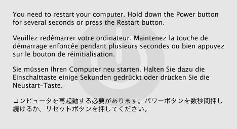

> 导航：[总目录](../../README.md) · [qa](../../_indexes/qa.md)


Technical Q&A QA1370

# Common QA and Roadmap for USB Software Development on Mac OS X

## Q:  Can you provide a roadmap for developing software to work with USB devices under Mac OS X?

A: The following is a roadmap for the development of USB Device Driver and User Client software and is presented as a Question and Answer session.

## Q:  Which USB Host Controller Interfaces does Mac OS support?

A: Mac OS X supports Open Host Controller Interface (OHCI), Enhanced Host Controller Interface (EHCI) and Universal Host Controller Interface (UHCI) USB Controllers since Mac OS X 10.4.x. For example, on Power PC Based Macintosh systems, one could install a PCI UHCI USB Controller card, or a CardBus UHCI USB Controller card, as applicable, and find that Mac OS X 10.4.x or greater, will support USB devices attached to the card.

## Q:  What Development Tools should I use and Where can I get them?

A: The optimum development platform is an Intel-based Macintosh system with a current release of Mac OS X. For development, use [Xcode](https://developer.apple.com/technologies/xcode.html). The latest version of [Xcode](https://developer.apple.com/technologies/xcode.html) provides support for writing USB Device Drivers, for both Application and in-kernel levels.

Two other important USB tools are USB Prober and the logging versions of the IOUSBFamily kext. USB Prober displays USB specific information from the system and from IORegistry. It also displays status messages generated by the USBLog function call. The logging version of the IOUSBFamily kext complements USB Prober as it is a version of the USB Driver designed to provide status information that the shipping release does not. The logging version of IOUSBFamily, provides detailed information as to USB device attachment, driver matching and probe score results, and requests made to USB devices.

USB Prober is installed as part of the Developer SDK installation. If the Developer SDK has been installed, then locate USB Prober at /Developer/Applications/Utilities/USB Prober.

The [Logging Version of the IOUSBFamily Kext](https://developer.apple.com/devicedrivers/download/usbdebug.html) is available from the Apple Developer Connection (ADC) website.

As of Mac OS X 10.6, the USB Prober application includes the usbtracer command line interface tool. Usbtracer can be used with both the non-logging and logging versions of the IOUSBFamily kext present. Refer to usbtracer tool QA for a demonstration of using the usbtracer tool in a Terminal window.

- [Total Phase, Inc.](http://www.totalphase.com/)
- [Ellisys](http://www.ellisys.com/)
- [LeCroy](http://www.lecroy.com/)
- [Finisar](http://www.data-transit.com/)

The logging version of the IOUSBFamily Kernel Extension does not provide packet data information that is available under Windows. Even under Windows, a USB Analyzer is required to analyze problems resulting from STALL, DATA TOGGLE, and other protocol error conditions.

## Q:  Which USB Device Driver type should I implement: Application level USB Driver or In-Kernel level USB Driver?

A: Software development is far easier in Application space. You can use the built in Xcode source level debugger with an Application-level driver. For in-Kernel drivers, you will need to use the GDB debugger to [debug your in-kernel device driver](https://developer.apple.com/mac/library/documentation/Darwin/Conceptual/KernelProgramming/About/About.html). Your development efforts are much more complex when you are [Coding in the Kernel](https://developer.apple.com/documentation/Darwin/Conceptual/ShouldYou.html). If at all possible, do not program in the kernel. Read [Getting Started with Device Drivers](https://developer.apple.com/referencelibrary/GettingStarted/GS_DeviceDrivers/index.html) for additional information.

You will use [IOKit](https://developer.apple.com/mac/library/documentation/DeviceDrivers/Conceptual/IOKitFundamentals/Introduction/Introduction.html) in programming a USB device driver for both the application and the kernel level. [Understanding IOKit](https://developer.apple.com/mac/library/documentation/DeviceDrivers/Conceptual/IOKitFundamentals/Introduction/Introduction.html) will help you to implement your USB Device driver.

## Q:  What are the common criteria for writing Application-level USB Software and where can I access sample code?

A: The following are some criteria and examples of cases where you will want to implement an Application-level USB driver/application. Links are provided to direct you to more information.

- Only your application will be communicating with the device.
- The software will not be used by a kernel process
- [Deva Sample code.](https://developer.apple.com/mac/library/samplecode/Deva_Example/) This example demonstrates how to communicate with a USB device from the application level. The sample is targeted for the [DevaSys](http://www.devasys.com/) USB I2C/IO,  Interface Board.
- [USB Private Data Sample](https://developer.apple.com/mac/library/samplecode/USBPrivateDataSample/index.html). This sample demonstrates how to use IOKitLib and IOUSBLib to set up asynchronous callbacks when a USB device is attached to or removed from the system. It also shows how to associate arbitrary data with each device instance.
- [Sample USB MIDI Driver](https://developer.apple.com/mac/library/samplecode/SampleUSBMIDIDriver/index.html)
- [Sample USB Audio Plug-in](https://developer.apple.com/mac/library/samplecode/SampleUSBAudioPlugin/index.html)
- [VendorSpecificType00](https://developer.apple.com/mac/library/samplecode/VendorSpecificType00/index.html). This is a Small Computer System Interface (SCSI) program sample which works with USB Mass Storage Class devices and demonstrates how to subclass the IOSCSIPeripheralType00 driver to add custom vendor specific functionality. It also shows how to set up a simple interface to user space code using I/O Registry properties. If you need to send SCSI commands to your USB Mass Storage Class device, you should review Technical Q&A1179 [Sending SCSI Commands to Storage Devices](https://developer.apple.com/qa/qa2001/qa1179.html).

To write an application level driver, you need to be familiar with device detection and opening the device interface. Information is provided on [Working with USB Device Interfaces](https://developer.apple.com/documentation/DeviceDrivers/Conceptual/USBBook/index.html). The [Deva Sample code](https://developer.apple.com/mac/library/samplecode/Deva_Example/) demonstrates how to detect both a USB device/interface from application space.

A large subset of USB composite class devices are Human Interface Devices (HID) - keyboards, mice, tablets, trackpads, game consoles, etc. To work with a USB HID device using the application level USB APIs may require implementing a means to prevent the HID device from being matched to the USB HID class driver. The preferred alternative to working with these devices is to use the [HID Manager](https://developer.apple.com/mac/library/documentation/DeviceDrivers/Conceptual/HID/intro/intro.html). A number of code samples demonstrating use of the HID Manager are provided in the following list.

- [HID Explorer](https://developer.apple.com/mac/library/samplecode/HID_Explorer/index.html). This complete program sample while not USB specific, demonstrates the use of the Human Interface Device (HID) Utilities to access and parse USB HID device report descriptors. This sample utility program works with most USB HID devices, such as mice, keyboards, keypads, joysticks, and game pads.
- [HID Utilities](https://developer.apple.com/mac/library/samplecode/HID_Utilities/index.html). This sample code is a library of useful HID routines and is used extensively in the [HID Explorer](https://developer.apple.com/mac/library/samplecode/HID_Explorer/index.html) sample code
- [HID LED test tool](https://developer.apple.com/mac/library/samplecode/HID_LED_test_tool/index.html). This sample code to show how to turn on/off LEDs on HID devices (for example the scroll or caps lock LEDs on keyboards).
- [HID Dumper](https://developer.apple.com/mac/library/samplecode/HID_Dumper/index.html). This sample code to show how to access HID information from a HID device.
- [HID Calibrator](https://developer.apple.com/mac/library/samplecode/HID_Calibrator/index.html). This sample code to show how to test HID calibration.

## Q:  When should I write a Kernel-level USB Device Driver?

A: You will implement a Kernel-level driver, when Apple provides no class driver that matches to your device and the device will be used by a kernel process. For example, USB networking, serial, and mass storage device drivers must be implemented as Kernel Extensions. HID Device Drivers may be in-kernel, when the device services will be available to all applications, but should be implemented as an application level driver if the device is to be used by specific applications.

As with application level USB drivers, you need to understand [IOKit](https://developer.apple.com/mac/library/documentation/DeviceDrivers/Conceptual/IOKitFundamentals/Introduction/Introduction.html) programming.

## Q:  What programming resources exist for Kernel-level USB drivers?

A: The following is a list of Apple USB Class drivers, for which source code is available from the [Darwin web site](http://www.opensource.apple.com/darwinsource/index.html). To access these source code files, you must have an Apple Developer Connection (ADC) Member ID, as well as agree to the [Apple Public Source License Agreement](http://www.opensource.apple.com/apsl/).

- USB OHCI Controller in the IOUSBFamily project
- USB EHCI Controller in the IOUSBFamily project
- USB Composite Class driver in the IOUSBFamily project
- USB HID driver in the IOUSBFamily project - which supports both keyboards and pointing devices
- USB CDC Device in the AppleUSBCDCDriver project
- USB Mass Storage Bulk Only Device in the IOUSBMassStorageClass project
- USB Mass Storage Control/Bulk/Interrupt (CBI) Device in the IOUSBMassStorageClass project
- USB Mass Storage Uniform Floppy Interface(UFI) Device in the IOUSBMassStorageClass project
- USB Audio Class Driver in the AppleUSBAudio project

The Apple USB Class Drivers are based on the Device Class Specifications that are available from the [USB-IF Device Class Documents web page](http://www.usb.org/developers/devclass/).

## Q:  Whom can I contact for more assistance?

A: The [USB Mailing list](http://lists.apple.com/mailman/listinfo/usb) is the best starting point for getting additional assistance. You must subscribe to the list to submit a question. Members of the USB Engineering team are members of the list, and they along with numerous developers on the list may respond to your question. If you have an introductory type question, peruse the [USB Mail archives](http://lists.apple.com/mailman/listinfo/usb) as the question may have been previously asked and answered.

If you find a bug with Mac OS X USB Class drivers, or with the use or implementation of the Apple supplied API's, submit a [Bug Report](https://developer.apple.com/bugreporter/index.html), so that you can track the matter. Use a [Bug Report](https://developer.apple.com/bugreporter/index.html) to submit enhancement requests to Mac OS X and to the Apple supplied API's.

For additional help, when there is no satisfactory response from the USB Mail List, you can submit a [Technical Support Incident](https://developer.apple.com/technicalsupport/gettingsupport.html) request.

## Q:  Can I license Apple Software or its logo?

A: If you will need to license Apple software, contact [Apple Software Licensing](https://developer.apple.com/softwarelicensing/) for a listing of licensable software and for the procedure to obtain the license. The Mac logo is also licensable from [Apple Software Licensing](https://developer.apple.com/softwarelicensing/).

## Q:  Can I have Apple help with compatibility testing of my device and software?

A: If you would like Apple to provide a quick look compatibility test of your product with the Apple Products that include USB support built-in, send 5 of your products to:


```
Craig Keithley I/O Technology Evangelist Apple, Inc. 1 Infinite Loop, MS-303-2TE Cupertino, CA 95014
```


The following are some common questions that developers new to developing USB Device Drivers for Mac OS X encounter and are frequently asked on the USB Mail List.

What are the rules for matching to USB devices and interfaces?

To understand the rules of device and interface matching, refer to [Technical Q&A QA1076 Tips on USB driver matching for Mac OS X](https://developer.apple.com/qa/qa2001/qa1076.html).

How can I determine what the non-zero results from USB calls mean?

The common error codes returned by USB functions are defined in the IOReturn.h and USB.h header files. Error results of the form 0xE0000XXX are general IOKit errors. Error results of the form 0xE00040XX are USB specific errors.

The complete path to the IOReturn.h header file is

/System/Library/Frameworks/IOKit.Framework/Headers/IOReturn.h.

The complete path to the USB.h header file is

/System/Library/Frameworks/IOKit.Framework/Headers/usb/USB.h.

You want to display the error result in hexadecimal to match against the error definitions listed in IOReturn.h or USB.h. For example, the `USBInterfaceOpen` call might fail with a result of -536870203. Convert this value to hexadecimal - 0xE00002C5. From the listing in IOReturn.h, this error equates to `kIOReturnExclusiveAccess`.

__Listing 1__  Excerpt from IOReturn.h

```
... #ifndef sys_iokit #define sys_iokit                    err_system(0x38) #endif /* sys_iokit */ #define sub_iokit_common             err_sub(0) #define sub_iokit_usb                err_sub(1) ... #define	iokit_common_err(return) (sys_iokit|sub_iokit_common|return) #define	iokit_family_err(sub,return) (sys_iokit|sub|return)  #define kIOReturnSuccess         KERN_SUCCESS            // OK .. #define kIOReturnNoResources     iokit_common_err(0x2be) // resource shortage  #define kIOReturnIPCError        iokit_common_err(0x2bf) // error during IPC  #define kIOReturnNoDevice        iokit_common_err(0x2c0) // no such device  #define kIOReturnNotPrivileged   iokit_common_err(0x2c1) // privilege violation  #define kIOReturnBadArgument     iokit_common_err(0x2c2) // invalid argument  #define kIOReturnLockedRead      iokit_common_err(0x2c3) // device read locked  #define kIOReturnLockedWrite     iokit_common_err(0x2c4) // device write locked  #define kIOReturnExclusiveAccess iokit_common_err(0x2c5) // exclusive access and                                                          //   device already open
```

To better understand the error declarations, refer to Technical Q&A QA1075 [Making Sense of I/O Kit Error Codes](https://developer.apple.com/qa/qa2001/qa1075.html) for an explanation of I/O Kit error codes.

When I load my in-kernel KEXT Device Driver, a window as shown in Figure 1, is displayed stating that the machine must be restarted. Where can I get more information on how to figure out what is happening and what to do for this situation?



When you see this window, a kernel panic has occurred. Refer to Tech Note 2063 [Understanding and Debugging Kernel Panics](https://developer.apple.com/technotes/tn2002/tn2063.html) for information on how to proceed.

How can I send custom SCSI commands to my USB Mass Storage Class Device?

This question is addressed in Technical Q&A QA1179 [Sending SCSI Commands to Storage Devices](https://developer.apple.com/qa/qa2001/qa1179.html).

Where do I find the usbtracer tool and how can I use it?

The usbtracer tool is useful for observing USB packet processing. The tool is available starting with Mac OS X 10.6. You can find the tool within the USB Prober application bundle, in the Resource folder. Listing 2 provides a short demonstration of the use of the tool. To learn more about the use of the tool open the tool in a Terminal window with the `-help` switch. Press `Ctrl-C` to quit the use of the tool. Note that admin privileges are required to use the tool. The tool works with both the logging and non-logging versions of the IOUSBFamily.

If you have the source code for the 10.6.x release of IOUSBFamily, you can find the tracepoints by looking for the call to the USBTrace function.

__Listing 2__  Sample Use of usbtracer

```swift
user$ cd /Developer/Applications/Utilities/USB\ Prober.app/Contents/Resources/ user$ sudo ./usbtracer  Password: 36:076:636    UHCI::FilterInterrupt (0x03860000) active interrupts 0x0001 36:076:661 -> UHCI::Begin HandleInterrupt (0x03860000)  36:076:663    UHCI::HandleInterrupt (0x03860000) Processing interrupt USBSTS = 0x0000 36:076:673    Controller::Complete (0x03860000) completion: 0x92d54a, status: 0x0 36:076:682    Controller::Interrupt Comp (0x00000000) Bus: 0x1d, Address: 2, Endpoint: 1  length: 64, data in: 0x058891d8 0x88daf399 36:076:683    Controller::Complete (0x03860000) completion: 0xf81318, status: 0x0 36:076:740 -> Controller::Interrupt Start (0x03860000) Bus: 0x1d, Address: 2, Endpoint: 1, (in) reqCount: 64 36:076:749 <- Controller::Interrupt End (0x03860000) error 0x0 36:076:766 <- UHCI::End HandleInterrupt (0x03860000)  36:084:628    UHCI::FilterInterrupt (0x03860000) active interrupts 0x0001 36:084:651 -> UHCI::Begin HandleInterrupt (0x03860000)  36:084:652    UHCI::HandleInterrupt (0x03860000) Processing interrupt USBSTS = 0x0000 36:084:663    Controller::Complete (0x03860000) completion: 0x92d54a, status: 0x0 36:084:673    Controller::Interrupt Comp (0x00000000) Bus: 0x1d, Address: 2, Endpoint: 1  length: 64, data in: 0x058892d8 0x88dbf399 36:084:674    Controller::Complete (0x03860000) completion: 0xf81318, status: 0x0 36:084:731 -> Controller::Interrupt Start (0x03860000) Bus: 0x1d, Address: 2, Endpoint: 1, (in) reqCount: 64 36:084:739 <- Controller::Interrupt End (0x03860000) error 0x0 36:084:744 <- UHCI::End HandleInterrupt (0x03860000)  36:092:631    UHCI::FilterInterrupt (0x03860000) active interrupts 0x0001 ... 53:923:044 -> Controller::Control Start (0x039a1000) Bus: 0xfd, Address: 3, Endpoint: 0, (in) bmRequestType: 0x80, bRequest: 0x06, wValue: 0x0200, wIndex: 0x0000, wLength: 0x0004 53:923:088 <- Controller::Control End (0x039a1000) error 0x0 53:923:118    EHCI::Primary Interrupt (0x039a1000) enabledInterrupts 0x0000001f activeInterrupts 0x00000001 53:923:141 -> EHCI::Begin PollInterrupts (0x039a1000) _errorInterrupt 0 _completeInterrupt 1 _portChangeInterrupt 0 53:923:141    EHCI::PollInterrupts (0x039a1000) Completion Interrupt 53:923:147    Controller::Complete (0x039a1000) completion: 0x92d9be, status: 0x0 53:923:148 -> Controller::PacketHandler (0x039a1000) Bus: 0xfd, Address: 3, Endpoint: 0 status 0x0 bufferSizeRemaining 0 53:923:149 <- Controller::PacketHandler (0x039a1000) Bus: 0xfd, Address: 3, Endpoint: 0 todo 0x60 status 0x0 53:923:156 <- EHCI::End PollInterrupts (0x039a1000)  53:923:377    EHCI::Primary Interrupt (0x039a1000) enabledInterrupts 0x0000001f activeInterrupts 0x00000001 53:923:392 -> EHCI::Begin PollInterrupts (0x039a1000) _errorInterrupt 0 _completeInterrupt 1 _portChangeInterrupt 0 53:923:392    EHCI::PollInterrupts (0x039a1000) Completion Interrupt 53:923:395    Controller::Complete (0x039a1000) completion: 0x92d9be, status: 0x0 53:923:396 -> Controller::PacketHandler (0x039a1000) Bus: 0xfd, Address: 3, Endpoint: 0 status 0x0 bufferSizeRemaining 0 53:923:397 <- Controller::PacketHandler (0x039a1000) Bus: 0xfd, Address: 3, Endpoint: 0 todo 0x40 status 0x0 53:923:398    Controller::Complete (0x039a1000) completion: 0x92d9be, status: 0x0 53:923:398 -> Controller::PacketHandler (0x039a1000) Bus: 0xfd, Address: 3, Endpoint: 0 status 0x0 bufferSizeRemaining 0 53:923:404    Controller::Packet Handler (0x00000000) Bus: 0xfd, Address: 3, Endpoint: 0  length: 4, data out: 0x09022700 0x00000000 53:923:410    Controller::Complete (0x039a1000) completion: 0x9267e0, status: 0x0 53:923:415 <- Controller::PacketHandler (0x039a1000) Bus: 0xfd, Address: 3, Endpoint: 0 todo 0x0 status 0x0 53:923:428 <- EHCI::End PollInterrupts (0x039a1000)   Ctrl-C to quit
```

The usbtracer data shown in Listing 2 shows the processing of USB packets from a USB keyboard. You can determine this by launching the USB Prober application. Click on the IORegistry tab, select the IOService Plane popup menu item and you should see data similar to the following taken from a Mac Book Pro system in Listing 3

__Listing 3__  USB Prober - IORegistry Listing

```
 0x1d: USB1@1D <class IOPCIDevice>                                              <- note bus 0x1D        AppleUSBUHCI <class AppleUSBUHCI>            1: UHCI Root Hub Simulation@1D <class IOUSBRootHubDevice>            2: Apple Internal Keyboard / Trackpad@1d200000 <class IOUSBDevice>   <- note address 2    0x3d: USB2@1D,1 <class IOPCIDevice>        AppleUSBUHCI <class AppleUSBUHCI>            1: UHCI Root Hub Simulation@1D,1 <class IOUSBRootHubDevice>    0x5d: USB3@1D,2 <class IOPCIDevice>        AppleUSBUHCI <class AppleUSBUHCI>            1: UHCI Root Hub Simulation@1D,2 <class IOUSBRootHubDevice>            2: IR Receiver@5d200000 <class IOUSBDevice>    0x7d: USB4@1D,3 <class IOPCIDevice>        AppleUSBUHCI <class AppleUSBUHCI>            1: UHCI Root Hub Simulation@1D,3 <class IOUSBRootHubDevice>            2: IOUSBWirelessControllerDevice@7d100000 <class IOUSBDevice>    0xfd: USB7@1D,7 <class IOPCIDevice>                                           <- note bus 0xFD        IOService <class IOService>        AppleUSBEHCI <class AppleUSBEHCI>            1: EHCI Root Hub Simulation@1D,7 <class IOUSBRootHubDevice>            2: Built-in iSight@fd400000 <class IOUSBDevice>            3: iPod@fd800000 <class IOUSBDevice>                                  <- note address 3
```

In Listing 2, there is the following entry

`36:076:682 Controller::Interrupt Comp (0x00000000) Bus: 0x1d, Address: 2, Endpoint: 1 length: 64, data in: 0x058891d8 0x88daf399e`

From Listing 3 note that bus 0x1D, address 2 matches to the Apple Internal Keyboard.

For the data in/out events, usbtracer shows the first 8 bytes of data when the system is operating in 32-bit mode. When the system is in 64-bit mode, usbtracer will show the first 16 bytes of data.

For the following entry in Listing 2

`53:923:044 -> Controller::Control Start (0x039a1000) Bus: 0xfd, Address: 3, Endpoint: 0, (in) bmRequestType: 0x80, bRequest: 0x06, wValue: 0x0200, wIndex: 0x0000, wLength: 0x0004`

From Listing 3 note that bus 0xFD, address 3 matches to the iPod. Note that usbtracer provides the USB Control request information being sent to the iPod.

---

#### Document Revision History

| __Date__ | __Notes__ |
| 2010-03-23 | Add reference to Total Phase as a USB Analyzer source. Remove outdated sample code references. Fixed outdated link references. Added usbtracer info. |
| 2006-02-28 | Updated to reflect UHCI support. Fixed typos. Added reference to Tech Note 2163 "Building Universal I/O Kit Drivers." |
| 2004-09-22 | New document that roadmap for development of USB Software on Mac OS X and some Common Questions and Answers |

