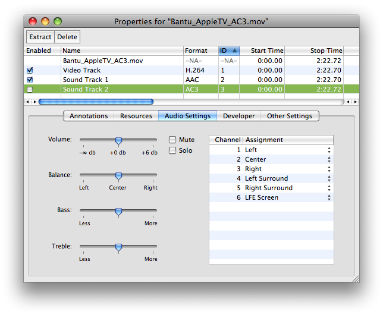

> 导航：[总目录](../../README.md) · [qa](../../_indexes/qa.md)


Technical Q&A QA1604

# Creating Apple TV Media Files Containing Dolby Digital Professional AC-3 Audio

## Q:  How can I create media files for Apple TV that contain a Dolby Digital Professional AC-3 audio track?

A: Apple TV supports playback of .mov and .m4v files containing Dolby Digital Professional AC-3 encoded audio.

Content developers can take advantage of Compressor 3 and its ability with Mac OS X 10.5 to automatically produce Apple TV AC-3 compatible .m4v files.

QuickTime application developers can use QTKit or QuickTime C APIs to assemble Apple TV compatible .mov files containing Dolby Digital Professional AC-3 audio.

Apple TV media files containing Dolby Digital Professional AC-3 must conform to a specific track layout. Two Sound Tracks are used and both must be provided:

- AAC Encoded Stereo - This is the standard Stereo audio track.
- AC-3 Encoded Surround - This is the Dolby Digital Professional AC-3 Surround audio track.

The AAC Stereo audio track __must appear first__ in the media file and __must be enabled__ by default. The Dolby Digital Professional AC-3 Surround track __must appear after__ the AAC Stereo track and __must be disabled__ by default. See Figure 1.

__Figure 1__  QuickTime Pro Movie Properties Window.

!

While this is not a strict requirement, be aware that if both audio tracks have different sample rates the Apple TV will default to the sample rate of the AC-3 surround audio track. If the AAC stereo audio track is being used for playback and has a different sample rate from the AC-3 surround audio track, for example the sample rate of the AAC track is 44.1kHz and the AC-3 track is 48kHz, the AAC track will be sample rate converted to 48kHz for output.

To avoid this sample rate conversion by the output device, content authors must encode both audio tracks at the same sample rate.

When Apple TV encounters a compatible .m4v or .mov file authored using the above track layout, the Dolby Digital Professional AC-3 audio track is used in a pass through mode. In other words, Apple TV will pass the Dolby Digital Professional AC-3 encoded audio data directly out to an external decoder. The AAC Stereo track is used where just stereo output is required from the device.

When using Compressor 3.0.3 or later on Mac OS X 10.5, the "H.264 for Apple Devices" encoder pane has a checkbox that allows you to include Dolby Digital Professional AC-3 tracks (with 5.1-channel surround sound) in media files intended for Apple TV playback. See Figure 4.

To include Dolby Digital Professional AC-3 audio in Apple TV output media files:

- Apply an "Apple Devices" setting to a job in the Batch window.
- Select the target in the Batch window.

__Figure 2__  Apple Devices Setting For Apple TV.

!

__Figure 3__  Batch Window.

!!

- In the Inspector, open the "H.264 for Apple Devices" encoder pane.
- In the Device pop-up menu, choose an Apple TV option. As long as your computer has Mac OS X v10.5 Leopard installed, a checkbox named "Include Dolby 5.1" will appear at the bottom of the pane.
- Select the "Include Dolby 5.1" checkbox.

__Figure 4__  Include Dolby 5.1 Checkbox.

!

The output media file will include a Dolby Digital Professional AC-3 track in addition to the default AAC audio track. The Dolby Digital Professional AC-3 audio track will have 5.1-channel surround sound (five discrete channels plus a sixth channel for low-frequency effects).

Developers can easily author Apple TV media containing Dolby Digital Professional AC-3 audio by assembling a QuickTime Movie (.mov) file from pre-encoded Apple TV compliant .m4v and Dolby Digital Professional .ac3 files.

Listing 1 demonstrates how to assemble an Apple TV compliant QuickTime Movie File (.mov).

The function assumes Apple TV compliant media has been created and saved to an .m4v file using the techniques outlined in _[Exporting Movies for iPod, Apple TV, iPad and iPhone](https://developer.apple.com/library/archive/technotes/tn2188/_index.html#//apple_ref/doc/uid/DTS10004236)_ or by using an application such as QuickTime Player Pro or Compressor, and a Dolby Digital Professional .ac3 audio file has been created using Compressor or a 3rd party product.

These two media files are then assembled into a movie file with the required track layout ready to sync with Apple TV.

__Listing 1__

```swift
// AssembleAndFlattenATVMovieFile
// Paramters:
//           inATVMovie - a QTMovie created by importing an Apple TV conforming .m4v
//                        media file created with Compressor, QuickTime Pro, QTKit and so on.
//           inAC3AudioMovie - a QTMovie created by importing a Dolby Digital .ac3 audio file
//                             created using Compressor or 3rd party encoder capable of creating .ac3 files.
//
// Discussion:
//          Simply assembles an output .mov from the two QTMovie objects provided
//
// This function adds the AC-3 encoded Audio Track to the passed in QTMovie containing
// Apple TV encoded media consisting of H.264 Video and AAC Audio.
// The resulting flattened .mov file will have the required Apple TV track layout:
//         Two tracks: AAC stereo (must be the first track) and be enabled
//                     AC-3 track for surround (must appear after the AAC track) and be disabled
void AssembleAndFlattenATVMovieFile(QTMovie *inATVMovie, QTMovie *inAC3AudioMovie)
{
    // add the AC-3 audio to the source movie which contains the ATV encoded video and AAC audio
    // QTMovie currently has no public method wrapping AddMovieSelection so we need to use the C API here
    AddMovieSelection([inATVMovie quickTimeMovie], [inAC3AudioMovie quickTimeMovie]);

    // just make sure the added 2nd audio track is the AC-3 track and if everything checks out
    // disable the track, then flatten the contents to an output .mov file
    NSArray *audioTracks = [inATVMovie tracksOfMediaType:QTMediaTypeSound];
    QTTrack *ac3AudioTrack = [audioTracks objectAtIndex:1];
    QTMedia *media = [ac3AudioTrack media];
    SampleDescriptionHandle desc = (SampleDescriptionHandle)NewHandle(0);

    GetMediaSampleDescription([media quickTimeMedia], 1, desc);

    if ((*desc)->dataFormat == 'ac-3') {
        // disable the AC-3 audio track
        [ac3AudioTrack setEnabled:NO];

        // create settings for movie flattening, we do not need or want to re-compress any of the media
        NSMutableDictionary *attributes = [NSMutableDictionary dictionaryWithCapacity:1];
        [attributes setObject:[NSNumber numberWithBool:YES] forKey:QTMovieFlatten];

        // write out the .mov file
        if (![inATVMovie writeToFile:@"/Users/Shared/ATV_Output.mov" withAttributes:attributes]) {
            NSRunAlertPanel(@"Error", @"Error exporting movie.", nil, nil, nil);
        }
    } else {
        NSRunAlertPanel(@"Error", @"Error during movie assembly.", nil, nil, nil);
    }

    DisposeHandle((Handle)desc);
}
```


As an example of how the above function may be used, we start with a QuickTime movie file containing 4 channels of audio. Each Sound Track is labeled appropriately; Left, Right, Left Surround and Right Surround respectively.

__Figure 5__  Source Movie Properties.

!!

From this original source file we need to create an Apple TV compliant movie file containing H.264 encoded video for Apple TV, a Stereo AAC audio track and a Dolby Digital Professional AC-3 encoded audio track.

As mentioned in the previous section, assembling the final output movie file requires two source files:

- Apple TV compliant .m4v file.
- Dolby Digital Professional .ac3 audio file.

We'll use Compressor to create these files since it offers a very easy way to produce both of the required source files concurrently.

Developers may use the code presented in _[Exporting Movies for iPod, Apple TV, iPad and iPhone](https://developer.apple.com/library/archive/technotes/tn2188/_index.html#//apple_ref/doc/uid/DTS10004236)_, QuickTime Player Pro or any other 3rd party application to produce the .m4v file containing the Apple TV compliant H.264 video and AAC stereo audio track. If you have already produced Apple TV compliant .m4v files using other tools, Compressor can still be used to produce the Dolby Digital Professional .ac3 file from the original source material.

__Figure 6__  Compressor Job Configuration.

!!

Compressor will create two files using the above job configurationl, shown in Figure 7.

__Figure 7__  Files Created By Compressor.

!

These two files can be assembled using the code from Listing 1 producing the final movie file. This movie file will contain the video and both the AAC and Dolby Digital Professional AC-3 audio ready for Apple TV.

The Movie Properties of the final assembled and flattened QuickTime movie file are shown in Figure 8. This file is ready to sync with Apple TV.

__Figure 8__



- _[Exporting Movies for iPod, Apple TV, iPad and iPhone](https://developer.apple.com/library/archive/technotes/tn2188/_index.html#//apple_ref/doc/uid/DTS10004236)_
- [Compressor](http://www.apple.com/finalcutstudio/compressor/)

---

#### Document Revision History

| __Date__ | __Notes__ |
| 2008-05-19 | Editorial |
| 2008-05-14 | New document that discusses how to create media files containing AC-3 audio for Apple TV using Compressor and QTKit. |

