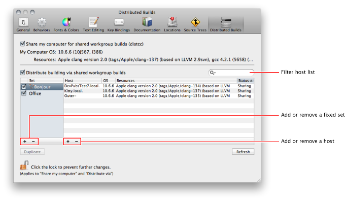

> 导航：[总目录](../../README.md) · [recipes](../../_indexes/recipes.md) · [Distributed Builds Preferences Help](Distributed%20Builds%20Preferences%20Help%20%28Legacy%29.md)

# Setting Up Distributed Builds

### Related

- Viewing a Task Log

Use Distributed Builds preferences to set up workgroup builds, and to make your computer available to teammates for their workgroup builds.

If you work in a team and your teammates are connected through a local network, you can speed up your builds by converting them from local builds to workgroup builds. _Workgroup builds_ are network-based builds that can use more than one computer to build a product. Use Distributed Builds preferences to set up workgroup builds and to make your computer available to teammates for their workgroup builds.

Workgroup builds involve a build client and one or more build servers. The build client is the computer that initiates the build and uses a set of build servers to complete it. _Build servers_ are computers (also known as hosts) that have been made available to assist build clients in completing their builds. One computer can be both a client and a server.

In Distributed Builds preferences you:

- Share your computer for workgroup builds
- Distribute your builds to build servers
- Add or remove a fixed host set
- Add or remove a host to or from a fixed host set
- Duplicate a fixed host set
- Filter the host list
- Refresh the status of the hosts in the host list

__Sharing Your Computer for Workgroup Builds__

To make your computer available for workgroup builds (that is, to volunteer it as a build server), select the option “Share my computer for shared workgroup builds.”

When a build client starts a workgroup build, your computer assists the build client in that build until the build is complete.

__Distributing Your Builds to a Set of Build Servers__

To distribute your builds to a set of build servers, select the option “Distribute building via shared workgroup builds,” and identify the build servers to which you want to distribute your build tasks.

Use the Bonjour build set to simplify the identification of potential build servers. Bonjour is a networking protocol that allows a computer to advertise itself on a local network and find other computers on the network with little or no configuration by a network administrator. The hosts in this set are dynamically added or removed as they become available or unavailable in your network. The Bonjour build set is useful when most team members use laptops, and your workgroups are dynamic and transient. You cannot modify the Bonjour build set.

Use fixed host sets in a desktop-computer–based environment or when the build servers to which you want to distribute your build tasks don’t reside in the same subnet as your computer.

You can confirm that your builds are distributed in the build task logs. Distributed compilation operations have the prefix “Distribute compilation” in their titles.

__Adding a Fixed Host Set__

To add a new fixed host set, click Add button under the fixed host set list, and enter a name for the new set.

If you want to create a host set based on another set, select the set on which you want to base new set, and Click Duplicate.

__Adding a Host to a Fixed Host Set__

To add a computer to a fixed host set:

1. In the host set list, select the set to which you want to add the host. (You cannot add hosts to the Bonjour set.)
2. Click the Add button below the host list.
3. In the Host column, enter the server’s address in your network (for example, `buildserver.company.com`, or `17.149.160.49`), and press Return.

If “Sharing” appears in the Status column for the host you just added, that computer is a build server available for your workgroup builds.
