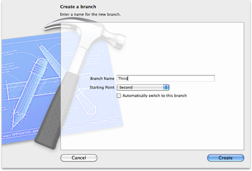

> 导航：[总目录](../../README.md) · [recipes](../../_indexes/recipes.md) · [Repositories Organizer Help](Repositories%20Organizer%20Help%20%28Legacy%29.md)

# Creating a Branch in a Git Repository

Create a branch in a repository to isolate specific aspects of your software development efforts and to work in parallel with other developers.

To create a branch in a Git repository

1. In the repositories organizer, select the appropriate Branches directory in the navigator pane and click the Add Branch button.
2. Enter a name for the new branch.
3. From the pop-up menu, choose an existing branch to serve as the starting point for this new branch.
4. If appropriate, select the option to automatically switch to the new branch.
5. Click Create.

   

   The illustration shows adding a branch named _Third_, using the branch named _Second_ as a starting point.

Git creates the new branch in your local repository. To make the branch available to others on a remote Git repository, you need to use the Push command.

### Related Articles

- [Switching Branches](Switching%20Branches.md#apple-f4xwc4dqnrsv64tfmyxwi33df52wszbpkridimbqgeydgnjqfvbuqnrnknltc)
- [Creating a Branch in a Subversion Repository](Creating%20a%20Branch%20in%20a%20Subversion%20Repository.md#apple-f4xwc4dqnrsv64tfmyxwi33df52wszbpkridimbqgeydgnjqfvbuqnbnknltc)
