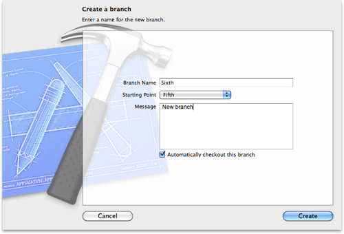

> 导航：[总目录](../../README.md) · [recipes](../../_indexes/recipes.md) · [Repositories Organizer Help](Repositories%20Organizer%20Help%20%28Legacy%29.md)

# Creating a Branch in a Subversion Repository

Create a branch in a repository to isolate specific aspects of your software development efforts and to work in parallel with other developers.

To create a branch in a Subversion repository

1. In the repositories organizer, select the appropriate Branches directory in the navigator pane and click the Add Branch button.
2. Enter a name for the new branch.
3. From the pop-up menu, choose an existing branch to serve as the starting point for this new branch.
4. Enter a log message if you wish.
5. If appropriate, select the option to automatically check out the new branch.
6. Click Create.

   

   The illustration shows adding a branch named _Sixth_, using the branch named _Fifth_ as a starting point.

Subversion creates the new branch in the remote repository; to work on it locally, you must first check it out. Selecting the “Automatically checkout this branch” option causes Xcode to check it out for you. If you select this option, Xcode opens a Save As dialog so you can specify the name and location for the working copy of the new branch. If you do not select this option, you have to check out the branch before you can work with it.

### Related Articles

- [Switching Branches](Switching%20Branches.md#apple-f4xwc4dqnrsv64tfmyxwi33df52wszbpkridimbqgeydgnjqfvbuqnrnknltc)
- [Creating a Branch in a Git Repository](Creating%20a%20Branch%20in%20a%20Git%20Repository.md#apple-f4xwc4dqnrsv64tfmyxwi33df52wszbpkridimbqgeydgnjqfvbuqnjnknltc)
