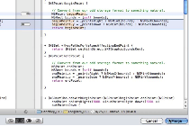

> 导航：[总目录](../../README.md) · [recipes](../../_indexes/recipes.md) · [Repositories Organizer Help](Repositories%20Organizer%20Help%20%28Legacy%29.md)

# Merging Two Branches

Merge two branches to combine the code in them and reconcile differences between them.

To merge two branches

1. With the workspace window active, choose File > Source Control > Merge.
2. From the pop-up menu, choose the branch to merge into the current branch and click Choose.
3. Select a difference or conflict.
4. Use the left and right buttons to specify which file’s contents should be used.
5. After resolving all differences and conflicts, click Merge.

   

Before merging, save and commit any unsaved changes in both branches. The Merge command merges a branch that you choose into the current branch, so you may also need to switch the current branch before the merge operation.

The left pane of the merge dialog shows what the merged file will look like. The right pane shows the file with the changes to be merged in. For each difference between the files, an indicator in the center points to the file taking precedence. To select a difference, click its indicator. You use the buttons at the bottom to set the direction of the merge.

For example, if the difference is a line of code on the right that’s missing from the file on the left (your working copy) click the Right button (which sets the indicator to the right) to specify that the line of code be included in the working copy when the merge is complete. Note that because the left pane shows what the merged file will look like, you then see this line of code in both panes.

If a line of code has been changed in both versions of the file being merged, the differences are considered a conflict and are shown in red. There are two additional buttons for reconciling conflicts by taking the code lines from both files, either listing the ones in the left file first and those in the right file second, or vice versa.

To reconcile any differences not handled by the four button choices, you can edit the file in the working copy.

### Related Articles

- [Creating a Branch in a Git Repository](Creating%20a%20Branch%20in%20a%20Git%20Repository.md#apple-f4xwc4dqnrsv64tfmyxwi33df52wszbpkridimbqgeydgnjqfvbuqnjnknltc)
- [Creating a Branch in a Subversion Repository](Creating%20a%20Branch%20in%20a%20Subversion%20Repository.md#apple-f4xwc4dqnrsv64tfmyxwi33df52wszbpkridimbqgeydgnjqfvbuqnbnknltc)
- [Switching Branches](Switching%20Branches.md#apple-f4xwc4dqnrsv64tfmyxwi33df52wszbpkridimbqgeydgnjqfvbuqnrnknltc)
