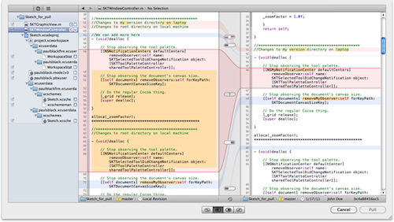

> 导航：[总目录](../../README.md) · [recipes](../../_indexes/recipes.md) · [Repositories Organizer Help](Repositories%20Organizer%20Help%20%28Legacy%29.md)

# Updating Changes from a Remote Subversion Repository

Update your local working copy with changes from a shared or remote Subversion repository to ensure that your local copy is up to date.

To update changes from a remote Subversion repository

1. Choose File > Source Control > Update.
2. In the Update dialog, select a difference to reconcile.
3. Use the left and right buttons to specify which file’s contents should be used.
4. After reconciling all differences, click Update to complete the operation.

   The illustration shows the dialog for reconciling differences, with a conflict selected.

   

With a shared repository, there is a potential for one developer’s changes to undo or overwrite those of another developer. To prevent this problem, Subversion requires that you update your local copy with the changes already submitted to the shared repository.

You need to save changes you’ve made and commit them to your local repository before updating files with changes from the shared repository.

In the update dialog, you select a difference by clicking the indicator between the two files. You then click one of the four buttons at the bottom to choose how that difference is to be reconciled. The indicator updates to reflect your choice.

A difference in which a line of code has been changed in both versions of the file is considered a conflict, and its indicator is a question mark. You can’t complete the update operation until you specify how to resolve all conflicts.

If you wish, you can edit the local revision of the file in the update dialog to reconcile any differences not handled by the four button choices.

In busy times, multiple developers may attempt to submit changes to the shared repository at the same time. If another developer’s submission completes before yours, Xcode informs you that you must first perform a new update operation. In larger organizations, particularly just prior to a product release, you may find that you have to update more than once.

After the update, you have to commit the changes files in your local repository that are updated by the update.

### Related Articles

- [Merging Two Branches](Merging%20Two%20Branches.md#apple-f4xwc4dqnrsv64tfmyxwi33df52wszbpkridimbqgeydgnjqfvbuqmjqfvjvomi)
