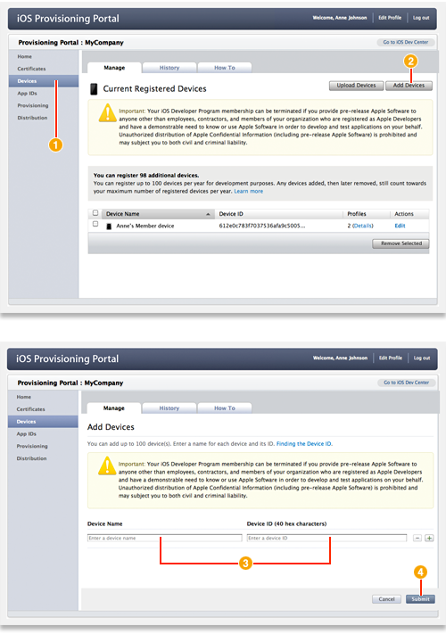

> 导航：[总目录](../../README.md) · [recipes](../../_indexes/recipes.md) · [iOS Provisioning Portal Help](iOS%20Provisioning%20Portal%20Help%20%28Legacy%29.md)

# Adding a Device ID to Your Development Team

- After logging in to the iOS Provisioning Portal, click Devices in the sidebar.
- Click Add Devices.
- Enter a device name and the device ID.
- Click Submit.

### Related

- Locating a Device’s Identifier
- [Creating a Development Provisioning Profile](Creating%20a%20Development%20Provisioning%20Profile.md#apple-f4xwc4dqnrsv64tfmyxwi33df52wszbpkridimbqgeytemjrfvbuqmrnknltc)

### Definitive Discussion

[Designating iOS Devices for Development and User Testing](https://developer.apple.com/library/archive/documentation/ToolsLanguages/Conceptual/DevPortalGuide/DesignatingiOSDevicesforDevelopmentandUserTesting/DesignatingiOSDevicesforDevelopmentandUserTesting.html#//apple_ref/doc/uid/TP40011159-CH30)

Make an iOS device available to your team for development and testing by adding it in the [iOS Provisioning Portal](https://developer.apple.com/ios/manage/overview/index.action).

Only team admins can add devices. A member who wants to add a device needs to send the device ID (UDID) for that device to a team admin.

A development team can add up to 100 devices to the team each membership year. Once a device is added, your team cannot regain that slot even if the admin removes the device. Removing a device does not alter the remaining number of devices your team can add.

After a device is added, the device ID must be added to a development provisioning profile before you can run an app on that device.
