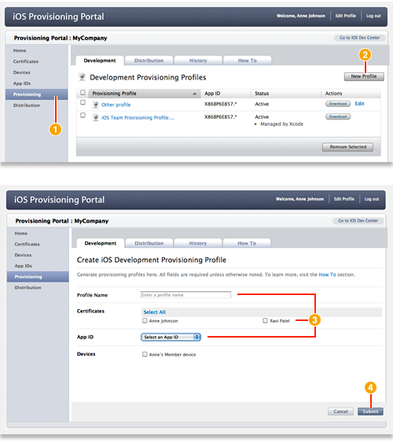

> 导航：[总目录](../../README.md) · [recipes](../../_indexes/recipes.md) · [iOS Provisioning Portal Help](iOS%20Provisioning%20Portal%20Help%20%28Legacy%29.md)

# Creating a Development Provisioning Profile

- After logging in to the iOS Provisioning Portal, click Provisioning in the sidebar.
- Click New Profile.
- Specify the profile name, select the certificates and devices you want to associate with this profile, and choose an app ID.
- Click Submit to generate your profile.

### Prerequisite

- [Adding a Device ID to Your Development Team](Adding%20a%20Device%20ID%20to%20Your%20Development%20Team.md#apple-f4xwc4dqnrsv64tfmyxwi33df52wszbpkridimbqgeytemjrfvbuqmjnknltc)

### Related

- [Creating a Distribution Provisioning Profile](Creating%20a%20Distribution%20Provisioning%20Profile.md#apple-f4xwc4dqnrsv64tfmyxwi33df52wszbpkridimbqgeytemjrfvbuqmznknltc)
- [App ID](https://developer.apple.com/library/archive/documentation/General/Conceptual/DevPedia-CocoaCore/AppID.html#//apple_ref/doc/uid/TP40008195-CH64)

### Definitive Discussion

[Creating and Downloading Development Provisioning Profiles](https://developer.apple.com/library/archive/documentation/ToolsLanguages/Conceptual/DevPortalGuide/CreatingandDownloadingDevelopmentProvisioningProfiles/CreatingandDownloadingDevelopmentProvisioningProfiles.html#//apple_ref/doc/uid/TP40011159-CH23)

Using [iOS Provisioning Portal](https://developer.apple.com/ios/manage/overview/index.action), create a development provisioning profile to specify which developers on your team can sign an app, or suite of apps, and specify a set of devices to run and test those apps.

Only team agents and admins can create development provisioning profiles. This profile contains a name, a set of development certificates, a set of device IDs, and an app ID. A development provisioning profile ties developers and devices to a development team. A profile is valid for one year.

When choosing devices and certificates, select all devices your team will use for testing and all certificates for developers working on the app.

If you, the team admin, recently enabled an app ID for Apple Push Notification Service, create a new provisioning profile containing that app ID. Provisioning profiles created before an app ID was enabled for APNS do not work for testing APNS.

After the team admin creates this profile, you will be able to download and install it on your device and test your app.
