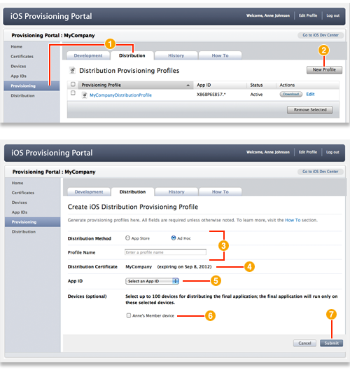

> 导航：[总目录](../../README.md) · [recipes](../../_indexes/recipes.md) · [iOS Provisioning Portal Help](iOS%20Provisioning%20Portal%20Help%20%28Legacy%29.md)

# Creating a Distribution Provisioning Profile

- After logging in to the iOS Provisioning Portal, click Provisioning in the sidebar and click the Distribution tab.
- Click New Profile.
- Select the distribution method and enter a profile name.
- Confirm that your team’s distribution certificate is displayed.
- Choose the app ID for the app you want to distribute.
- For ad hoc distribution only, select up to 100 devices you want to be able to run the app.
- Click Submit.

### Related

- [Creating a Development Provisioning Profile](Creating%20a%20Development%20Provisioning%20Profile.md#apple-f4xwc4dqnrsv64tfmyxwi33df52wszbpkridimbqgeytemjrfvbuqmrnknltc)

### Definitive Discussion

[Creating and Downloading a Distribution Provisioning Profile](https://developer.apple.com/library/archive/documentation/ToolsLanguages/Conceptual/DevPortalGuide/CreatingandDownloadingaDistributionProvisioningProfile/CreatingandDownloadingaDistributionProvisioningProfile.html#//apple_ref/doc/uid/TP40011159-CH27)

To distribute an app, your team must have a distribution provisioning profile you create using the [iOS Provisioning Portal](https://developer.apple.com/ios/manage/overview/index.action).

Only team agents and admins can create a distribution provisioning profile (this is different from a development provisioning profile). The distribution provisioning profile consists of a name, a distribution certificate, and an app ID. A profile is valid for one year.

Apps can be distributed either through the App Store, ad hoc distribution, or in-house distribution. For ad hoc distribution, the distribution provisioning profile also includes a list of devices that can run the app.

If you, the team admin, recently enabled an app ID for Apple Push Notification Service, create a new provisioning profile containing that app ID. Provisioning profiles created before an app ID was enabled for APNS do not work for testing APNS.
