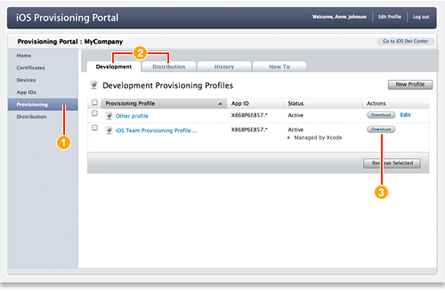

> 导航：[总目录](../../README.md) · [recipes](../../_indexes/recipes.md) · [iOS Provisioning Portal Help](iOS%20Provisioning%20Portal%20Help%20%28Legacy%29.md)

# Downloading a Provisioning Profile

- After logging in to the iOS Provisioning Portal, click Provisioning in the sidebar.
- Click either the Development or Distribution tab to display the appropriate profiles.
- Click the Download button, in the Actions column, for the profile you want to download.

### Prerequisite

- [Creating a Development Provisioning Profile](Creating%20a%20Development%20Provisioning%20Profile.md#apple-f4xwc4dqnrsv64tfmyxwi33df52wszbpkridimbqgeytemjrfvbuqmrnknltc)
- [Creating a Distribution Provisioning Profile](Creating%20a%20Distribution%20Provisioning%20Profile.md#apple-f4xwc4dqnrsv64tfmyxwi33df52wszbpkridimbqgeytemjrfvbuqmznknltc)

To run an app on a device, you need the accompanying provisioning profile you download from the [iOS Provisioning Portal](https://developer.apple.com/ios/manage/overview/index.action).

There are two types of provisioning profiles, one for development and one for distribution. Both profiles are `.mobileprovision` files.

All team members can download a development provisioning profile from the Provisioning section of iOS Provisioning Portal. When downloading a development provisioning profile, remember that you can install and test apps on a device only if that device ID, app ID, and your development certificate are included in the profile.

Only team admins can download the distribution provisioning profile. In fact, the Distribution tab is not visible to team members. To test an application that has been built for distribution, you need the distribution provisioning profile and the `.app` file.

After you obtain the provisioning profile file, you can install it on your device.
