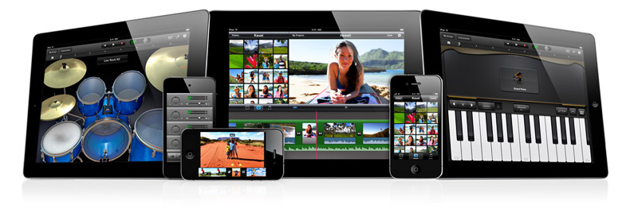

> 导航：[总目录](../../../README.md) · [referencelibrary](../../../_indexes/referencelibrary.md)

# Audio & Video Starting Point

> [!IMPORTANT]
> 

Multimedia technologies in iOS let you access the sophisticated audio and video capabilities of iPhone, iPad, and iPod touch. Specialized classes let you easily add basic features such as iPod library playback and movie capture, while rich multimedia APIs support advanced solutions.

Choose the right technology for your needs:

- To play the audio items in a user’s iPod library, or to play local or streamed movies, use the Media Player framework. Classes in this framework automatically support sending audio and video to AirPlay devices such as Apple TV.
- To easily add picture or movie capture to your app, employ dedicated classes and functions from the UIKit framework.
- For basic audio recording and playback, including stereo panning, synchronization, and metering, use the audio classes from the AV Foundation framework.
- To add high-performance positional audio playback to your OpenGL-based game or other app, take advantage of the open-source OpenAL (Open Audio Library) API.
- To work directly with audio and video data—for high performance or advanced solutions such as VoIP, streaming, virtual music instruments, or MIDI (Musical Instrument Digital Interface)—use the AV Foundation framework, the Assets Library framework, the various Core Audio frameworks (including the Core Audio, Audio Toolbox, and Audio Unit frameworks), and the Core MIDI framework.

#### Contents:

- [Get Up and Running](#apple-f4xwc4dqnrsv64tfmyxwi33df52wszbpkridimbqga3teojyfvbuqmjnknlte)
- [Become Proficient in Audio Development](#apple-f4xwc4dqnrsv64tfmyxwi33df52wszbpkridimbqga3teojyfvbuqmjnknltg)
- [Become Proficient in Video Development](#apple-f4xwc4dqnrsv64tfmyxwi33df52wszbpkridimbqga3teojyfvbuqmjnknlti)

### Get Up and Running

Familiarize yourself with iOS audio development by checking out these resources:

- Read [Using Audio](https://developer.apple.com/library/archive/documentation/AudioVideo/Conceptual/MultimediaPG/UsingAudio/UsingAudio.html#//apple_ref/doc/uid/TP40009767-CH2) in _[Multimedia Programming Guide](../../../documentation/Audio%20Video/Multimedia%20Programming%20Guide/About%20Audio%20and%20Video.md#apple-f4xwc4dqnrsv64tfmyxwi33df52wszbpkridimbqga4tonrx)_ to learn about audio development for iOS devices. Make sure to understand the importance of audio session objects as introduced in [The Basics: Audio Codecs, Supported Audio Formats, and Audio Sessions](../../../documentation/Audio%20Video/Multimedia%20Programming%20Guide/Using%20Audio.md#apple-f4xwc4dqnrsv64tfmyxwi33df52wszbpkridimbqga4tonrxfvbuqmrnknlts).
- View the _[avTouch](../../../samplecode/avTouch/avTouch.md#apple-f4xwc4dqnrsv64tfmyxwi33df52wszbpirkfgnbqgaydqnrtgy)_ sample code project, which shows how to play sounds with the [AVAudioPlayer](https://developer.apple.com/documentation/avfoundation/avaudioplayer) class; the _SpeakHere_ project, which demonstrates basic recording and playback; and the _Audio UI Sounds (SysSound)_ project, which demonstrates how to invoke vibration and play alerts and user-interface sound effects.
- Download and explore the _[AddMusic](../../../samplecode/AddMusic/AddMusic.md#apple-f4xwc4dqnrsv64tfmyxwi33df52wszbpirkfgnbqgaydqobugu)_ sample code project to see a simple demonstration of how to add iPod library playback to your app.
- Read _[MPVolumeView Class Reference](https://developer.apple.com/documentation/mediaplayer/mpvolumeview)_ to learn how to quickly add AirPlay capability to your app.

Get up and running with iOS video development with these resources:

- Read [Using Video](https://developer.apple.com/library/archive/documentation/AudioVideo/Conceptual/MultimediaPG/UsingVideo/UsingVideo.html#//apple_ref/doc/uid/TP40009767-CH3) in _[Multimedia Programming Guide](../../../documentation/Audio%20Video/Multimedia%20Programming%20Guide/About%20Audio%20and%20Video.md#apple-f4xwc4dqnrsv64tfmyxwi33df52wszbpkridimbqga4tonrx)_ for an overview of video recording and playback on iOS devices.
- View the _[MoviePlayer](../../../samplecode/MoviePlayer/MoviePlayer.md#apple-f4xwc4dqnrsv64tfmyxwi33df52wszbpirkfgnbqgaydonzzha)_ sample code project, which demonstrates the powerful [MPMoviePlayerController](https://developer.apple.com/documentation/mediaplayer/mpmovieplayercontroller) class for playing local or streamed video content; and the _[PhotoPicker: Using UIImagePickerController to Select Pictures and Take Photos](../../../samplecode/PhotoPicker-%20Using%20UIImagePickerController%20to%20Select%20Pictures%20and%20Take%20Photos/PhotoPicker-%20Using%20UIImagePickerController%20to%20Select%20Pictures%20and%20Take%20Photos.md#apple-f4xwc4dqnrsv64tfmyxwi33df52wszbpirkfgnbqgaytamjzgy)_ project, which demonstrates simple movie and picture capture using the UIKit framework.
- Continue by reading _[Camera Programming Topics for iOS](../../../documentation/Audio%20Video/Camera%20Programming%20Topics%20for%20iOS/About%20the%20Camera%20and%20Photo%20Library.md#apple-f4xwc4dqnrsv64tfmyxwi33df52wszbpkridimbqgeydimbq)_ to learn how take pictures and movies, and to browse the photo library, using the [UIImagePickerController](https://developer.apple.com/documentation/uikit/uiimagepickercontroller) class.

### Become Proficient in Audio Development

Gain a complete understanding of audio session objects, and how they determine your app’s audio behavior, by reading _[Audio Session Programming Guide](../../../documentation/Audio/Audio%20Session%20Programming%20Guide/Introduction.md#apple-f4xwc4dqnrsv64tfmyxwi33df52wszbpkridimbqga3tqnzv)_. Also be sure to read Sound, which explains how your app should handle sound to meet user expectations.

No matter which iOS audio technologies you employ, users expect to be able to play and pause your app’s audio using the system transport controls in the multitasking UI. To learn how to support this feature, read Remote Control of Multimedia in _Event Handling Guide for iOS_.

Take full advantage of the iPod library by reading _[iPod Library Access Programming Guide](../../../documentation/Audio/iPod%20Library%20Access%20Programming%20Guide/Introduction.md#apple-f4xwc4dqnrsv64tfmyxwi33df52wszbpkridimbqga4donrv)_ along with _[Media Player Framework Reference](https://developer.apple.com/documentation/mediaplayer)_.

To learn how to play audio using OpenAL, view the _oalTouch_ project.

To play streamed audio content, such as from a network connection, use an [AVPlayer](https://developer.apple.com/documentation/avfoundation/avplayer) object as described in [Playback](../../../documentation/Audio%20Video/AVFoundation%20Programming%20Guide/About%20AVFoundation.md#apple-f4xwc4dqnrsv64tfmyxwi33df52wszbpkridimbqgeydcobyfvbuqmjnknlts). You can also play certain Internet audio files by using the [MPMoviePlayerController](https://developer.apple.com/documentation/mediaplayer/mpmovieplayercontroller) class; for sample code that shows how, see _[MoviePlayer](../../../samplecode/MoviePlayer/MoviePlayer.md#apple-f4xwc4dqnrsv64tfmyxwi33df52wszbpirkfgnbqgaydonzzha)_.

To play audio files with stereo panning, synchronization, and metering, use the [AVAudioPlayer](https://developer.apple.com/documentation/avfoundation/avaudioplayer) class. To record audio, use the [AVAudioRecorder](https://developer.apple.com/documentation/avfoundation/avaudiorecorder) class. Apple recommends these classes for audio playback and recording when you do not need direct access to audio data.

To get started with handling audio data directly, read [Core Audio Essentials](https://developer.apple.com/library/archive/documentation/MusicAudio/Conceptual/CoreAudioOverview/CoreAudioEssentials/CoreAudioEssentials.html#//apple_ref/doc/uid/TP40003577-CH10) in _[Core Audio Overview](../../../documentation/Music%20Audio/Core%20Audio%20Overview/Introduction.md#apple-f4xwc4dqnrsv64tfmyxwi33df52wszbpkridimbqgaztknzx)_ to learn about the architecture, programming conventions, and use of Core Audio.

If you are creating a VoIP (voice over Internet protocol) app or a virtual music instrument, you need the highest audio performance available in iOS. The solution to use is _audio units_, the iOS audio plug-in technology. Audio units also provide advanced capabilities including mixing and equalization. Read _[Audio Unit Hosting Guide for iOS](../../../documentation/Music%20Audio/Audio%20Unit%20Hosting%20Guide%20for%20iOS/About%20Audio%20Unit%20Hosting.md#apple-f4xwc4dqnrsv64tfmyxwi33df52wszbpkridimbqga4tiojs)_ to learn how to use audio units. View the _Audio Mixer (MixerHost)_ and _[Mixer iPodEQ AUGraph Test](../../../samplecode/Mixer%20iPodEQ%20AUGraph%20Test/Mixer%20iPodEQ%20AUGraph%20Test.md#apple-f4xwc4dqnrsv64tfmyxwi33df52wszbpirkfgnbqgaydsnjvgu)_ sample code projects.

To create a MIDI app for connecting hardware keyboards or synthesizers to an iOS device, refer to _[Core MIDI Framework Reference](https://developer.apple.com/documentation/coremidi)_ and look at the [MFi program](https://developer.apple.com/programs/mfi/).

### Become Proficient in Video Development

To progress beyond the capabilities of the Media Player framework and the [UIImagePickerController](https://developer.apple.com/documentation/uikit/uiimagepickercontroller) class, read _[AVFoundation Programming Guide](../../../documentation/Audio%20Video/AVFoundation%20Programming%20Guide/About%20AVFoundation.md#apple-f4xwc4dqnrsv64tfmyxwi33df52wszbpkridimbqgeydcoby)_. AV Foundation, with support from the Assets Library and Core Media frameworks, provides tools for advanced video solutions including track-based editing, transcoding, and direct access to data from the camera and microphone.

View the _[AVCam-iOS: Using AVFoundation to Capture Images and Movies](https://developer.apple.com/library/archive/samplecode/AVCam/Introduction/Intro.html#//apple_ref/doc/uid/DTS40010112)_ sample code project to see how to capture still images and movies using the AV Foundation framework. _AVCam_ demonstrates the use of several important AV Foundation classes. View the _[AVPlayerDemo](../../../samplecode/AVPlayerDemo/AVPlayerDemo.md#apple-f4xwc4dqnrsv64tfmyxwi33df52wszbpirkfgnbqgaytamjqge)_ project to see how to play movies from the iPod library.
